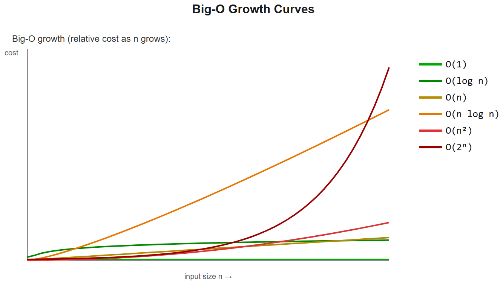
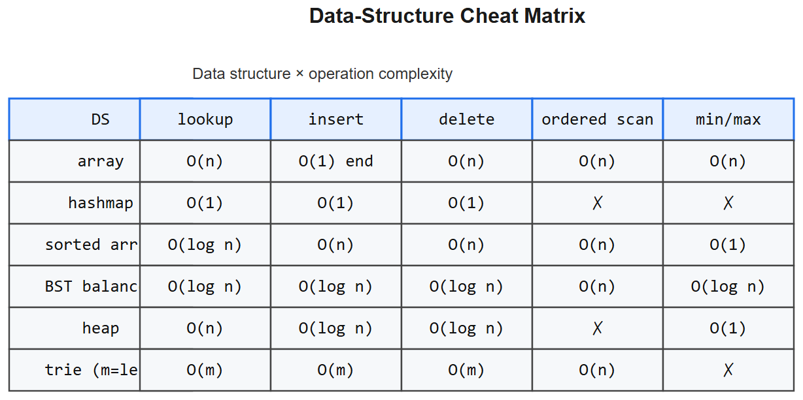

# DSA -- Interview Cheatsheet

> Pair with daily LeetCode practice -- you've done 500+, so this is revision-focused.

## Complexity reference

| Big-O | Name | Example |
|-------|------|---------|
| O(1) | constant | dict lookup, array index |
| O(log n) | logarithmic | binary search, balanced tree ops |
| O(n) | linear | scan |
| O(n log n) | linearithmic | merge sort, heap sort, sort + scan |
| O(n^2) | quadratic | nested loops, bubble/insertion sort |
| O(2ⁿ) | exponential | subset enumeration, naive recursion |
| O(n!) | factorial | permutations |

## Data structures -- when to reach for which

| Need | Use | Big-O |
|------|-----|-------|
| Fast lookup by key | **hashmap (dict)** | avg O(1) |
| Ordered key range queries | **sorted map / TreeMap** | O(log n) |
| Min/max access + push | **heap (priority queue)** | O(log n) push/pop |
| LIFO | **stack** | O(1) |
| FIFO | **queue (deque)** | O(1) both ends |
| Set membership | **set** | avg O(1) |
| Prefix searches | **trie** | O(m) for word len m |
| Union/find groups | **DSU (union-find)** | ~O(alpha(n)) ~= O(1) |
| Range queries on arrays | **segment tree / Fenwick** | O(log n) |
| Dedup with order | **OrderedDict / LinkedHashMap** | O(1) |

## Top 12 patterns (the ones interviewers love)

### 1. Two pointers
Sorted array problems, in-place removal, pair-sum.
```python
l, r = 0, len(arr) - 1
while l < r:
    if arr[l] + arr[r] == target: return True
    elif arr[l] + arr[r] < target: l += 1
    else: r -= 1
```

### 2. Sliding window
Subarray / substring with property.
```python
left = 0; best = 0; count = Counter()
for right, ch in enumerate(s):
    count[ch] += 1
    while violates(count):
        count[s[left]] -= 1
        left += 1
    best = max(best, right - left + 1)
```

### 3. Binary search
Sorted array OR search-space-on-answer.
```python
l, r = 0, n - 1
while l <= r:
    m = (l + r) // 2
    if arr[m] == target: return m
    if arr[m] < target: l = m + 1
    else: r = m - 1
return -1
```
**Search-on-answer**: "minimum X such that feasible(X)" -> binary search the answer.

### 4. BFS -- level-order, shortest path in unweighted graph
```python
from collections import deque
q = deque([start])
seen = {start}
dist = {start: 0}
while q:
    node = q.popleft()
    for nb in graph[node]:
        if nb not in seen:
            seen.add(nb); dist[nb] = dist[node] + 1; q.append(nb)
```

### 5. DFS -- recursion or explicit stack
```python
def dfs(u, visited):
    visited.add(u)
    for v in graph[u]:
        if v not in visited:
            dfs(v, visited)
```

### 6. Backtracking -- permutations, combinations, N-queens
```python
def backtrack(path, choices):
    if done(path): result.append(path[:]); return
    for c in choices:
        if not valid(c, path): continue
        path.append(c)
        backtrack(path, next_choices(c, choices))
        path.pop()
```

### 7. Dynamic programming
- **Top-down (memo)**: recursion + cache
- **Bottom-up (tabulation)**: build up `dp[i]` iteratively
- Classics: 0/1 knapsack, LIS, LCS, edit distance, coin change, house robber, climbing stairs

```python
# longest increasing subsequence O(n^2)
dp = [1] * n
for i in range(n):
    for j in range(i):
        if arr[j] < arr[i]:
            dp[i] = max(dp[i], dp[j] + 1)
return max(dp)
```

### 8. Heap / top-K
"K largest/smallest", "median in stream", "merge K sorted lists".
```python
import heapq
heapq.heappush(h, x); heapq.heappop(h)
heapq.nlargest(k, iterable)
# heapq is min-heap; for max-heap negate values
```

### 9. Prefix sum
Range sum / count queries.
```python
prefix = [0]
for x in arr: prefix.append(prefix[-1] + x)
# sum(arr[l..r]) = prefix[r+1] - prefix[l]
```

### 10. Topological sort
DAG with dependencies (course schedule, build order).
```python
indeg = [0]*n
for u, v in edges: indeg[v] += 1
q = deque([i for i in range(n) if indeg[i] == 0])
order = []
while q:
    u = q.popleft(); order.append(u)
    for v in adj[u]:
        indeg[v] -= 1
        if indeg[v] == 0: q.append(v)
# if len(order) < n -> cycle exists
```
**This is what AIAAS's DAG validator does.**

### 11. Union-Find (DSU)
Connected components, Kruskal's MST, cycle detection in undirected.
```python
parent = list(range(n))
def find(x):
    while parent[x] != x:
        parent[x] = parent[parent[x]]   # path compression
        x = parent[x]
    return x
def union(a, b):
    ra, rb = find(a), find(b)
    if ra != rb: parent[ra] = rb
```

### 12. Trie
Prefix search, autocomplete, word dictionaries.
```python
class Trie:
    def __init__(self): self.root = {}
    def insert(self, w):
        node = self.root
        for c in w: node = node.setdefault(c, {})
        node["$"] = True
    def search(self, w):
        node = self.root
        for c in w:
            if c not in node: return False
            node = node[c]
        return "$" in node
```

## Sorting
- **Python `sorted()` / `list.sort()`** = Timsort, O(n log n), stable
- **Quick sort** O(n log n) avg, O(n^2) worst, in-place
- **Merge sort** O(n log n), stable, O(n) extra space
- **Heap sort** O(n log n), in-place, not stable
- **Counting / radix** O(n) for small-range integers

## Graph algos to know
| Algorithm | Time | Use |
|-----------|------|-----|
| BFS | O(V+E) | Unweighted shortest path |
| DFS | O(V+E) | Topo sort, components, cycle detect |
| Dijkstra | O((V+E) log V) | Single-source shortest path, non-negative weights |
| Bellman-Ford | O(VE) | Handles negative weights, detects neg cycles |
| Floyd-Warshall | O(V^3) | All-pairs shortest |
| Kruskal | O(E log E) | MST via DSU |
| Prim | O(E log V) | MST via heap |
| Tarjan / Kosaraju | O(V+E) | Strongly connected components |

## Bit manipulation tricks
- `x & (x-1)` -> drops lowest set bit
- `x & -x` -> isolates lowest set bit
- `x ^ y` -> bits that differ
- `bin(x).count("1")` -> population count
- `x & (1 << i)` -> test bit i
- XOR all elements where exactly one is unique -> answer is the unique

## Common gotchas
- **Off-by-one** in two-pointer / sliding window bounds
- **Recursion depth limit** in Python (~1000) -- convert to iterative with stack
- **`a += b` vs `a = a + b`** for lists differs from immutable types
- **Modifying dict while iterating** -> RuntimeError
- **`sorted()` returns new list; `list.sort()` mutates** in place

## Interview tactics
1. **Clarify** -- sizes, constraints, edge cases, return type
2. **Examples** -- walk through 1 example out loud before coding
3. **Brute force first** -- state the O(...) and say "let's optimize"
4. **Code clean** -- meaningful names, small helpers, no premature optimization
5. **Test** -- empty input, single, duplicates, sorted, reverse, max/min boundaries
6. **Complexity** -- state time + space at the end

## Recommended LeetCode list (you've done 500+, but if revising)
- NeetCode 150 -- curated by pattern
- Top Interview 150 -- LeetCode's own list
- Sean Prashad's Leetcode Patterns

## AIAAS interview anchor
> "AIAAS's compiler is essentially a graph problem set. DAG validation = topological sort + cycle detection. Reachability = DFS from START. Type-checking edges = constraint propagation. We compile JSON -> adjacency list -> run those classic algorithms. Same DSA, real-world purpose -- easy to talk about in interviews."


---

# Visual appendix

## Big-O growth curves


For n = 105 on a 108-op/s machine: O(n^2) ~= 1010 ops ~= 100s . O(n log n) ~= 1.6*106 ops ~= 16 ms . Memorise the table.

## Data structure choice matrix


## Pattern -> which file to study
| Problem keyword | Pattern | File |
|-----------------|---------|------|
| "pair sums to target", "complement", "anagram" | Arrays & Hashing | dsa-patterns/01 |
| "sorted array", "two pointers", "in-place dedup" | Two Pointers | 02 |
| "longest/shortest subarray/substring with property" | Sliding Window | 03 |
| "sorted", "find min in rotated", "min capacity such that ..." | Binary Search | 04 |
| "balanced parens", "next greater", "histogram rectangle" | Stack | 05 |
| "reverse list", "cycle", "kth from end" | Linked List | 06 |
| "tree traversal", "LCA", "validate BST" | Trees | 07 |
| "autocomplete", "shared prefix" | Tries | 08 |
| "kth largest", "merge K", "running median" | Heap | 09 |
| "all subsets/permutations", "N-queens", "sudoku" | Backtracking | 10 |
| "shortest path on grid/graph", "topo sort", "MST" | Graphs | 11 |
| "fibonacci-like", "house robber", "coin change" | 1-D DP | 12 |
| "LCS", "edit distance", "unique paths" | 2-D DP | 13 |
| "earliest finishing", "jump game", "gas station" | Greedy | 14 |
| "overlap", "merge intervals", "meeting rooms" | Intervals | 15 |
| "XOR", "single number", "bits" | Bit Manipulation | 16 |
| "rotate matrix", "spiral", "pow(x,n)" | Math & Geometry | 17 |

---

# 30-second decision tree

```
                    Is input SORTED or can you SORT?
                    ┌─────── yes ───────┐         ┌────── no ──────┐
                    ▼                                 ▼
            two-pointer / binary search          hash map / heap
                    │
        ┌── monotone predicate? ──┐
        yes                       no
        ▼                         ▼
    binary search on answer    two-pointer scan

                Need ALL subsets / permutations / paths?  -> Backtracking
                Optimal substructure + overlap?           -> DP
                Graph / grid traversal?                   -> BFS/DFS
                Streaming / "top K" / "k-th"?             -> Heap
```

---

# Master complexity reference (with derivation)

| Operation | Vec/Array | Linked list | Hashmap | BST balanced | Heap | Trie (len m) |
|-----------|-----------|-------------|---------|--------------|------|--------------|
| Index | O(1) | O(n) | -- | -- | -- | -- |
| Search by key | O(n) | O(n) | **O(1) avg** | O(log n) | O(n) | O(m) |
| Insert at end | O(1)* | O(1) | O(1) | O(log n) | O(log n) | O(m) |
| Insert at front | O(n) | O(1) | -- | -- | -- | -- |
| Delete | O(n) | O(1) given node | O(1) | O(log n) | O(log n) | O(m) |
| Min / Max | O(n) | O(n) | O(n) | O(log n) | **O(1)** | -- |
| Range / sorted scan | O(n log n) | O(n) (after sort) | O(n) | **O(n)** | O(n log n) | -- |
| Membership | O(n) | O(n) | **O(1)** | O(log n) | O(n) | O(m) |

*amortised; resize doubles capacity.

---

# 30 high-frequency micro-snippets

```python
# 1. Reverse string
s[::-1]

# 2. Reverse in place
a[i], a[j] = a[j], a[i]   # while i<j

# 3. Defaultdict counter
from collections import defaultdict
d = defaultdict(int); d['x'] += 1

# 4. Sorted with key
sorted(items, key=lambda x: (-x.priority, x.name))

# 5. Bisect insert
from bisect import insort
insort(arr, x)

# 6. Cyclic next index
nxt = (i + 1) % n

# 7. Build adjacency list
g = [[] for _ in range(n)]
for u,v in edges: g[u].append(v); g[v].append(u)

# 8. BFS template
from collections import deque
q = deque([start]); seen={start}
while q:
    u = q.popleft()
    for v in g[u]:
        if v not in seen:
            seen.add(v); q.append(v)

# 9. DFS recursive
def dfs(u):
    if u in seen: return
    seen.add(u)
    for v in g[u]: dfs(v)

# 10. DFS iterative
stk = [start]; seen=set()
while stk:
    u = stk.pop()
    if u in seen: continue
    seen.add(u)
    stk.extend(g[u])

# 11. Topo sort (Kahn)
indeg = [0]*n
for u in range(n):
    for v in g[u]: indeg[v]+=1
q = deque(i for i in range(n) if indeg[i]==0)
order=[]
while q:
    u = q.popleft(); order.append(u)
    for v in g[u]:
        indeg[v]-=1
        if indeg[v]==0: q.append(v)

# 12. Dijkstra
import heapq
def dijkstra(g, src):
    dist=[float('inf')]*len(g); dist[src]=0
    h=[(0,src)]
    while h:
        d,u = heapq.heappop(h)
        if d>dist[u]: continue
        for v,w in g[u]:
            if d+w < dist[v]:
                dist[v]=d+w; heapq.heappush(h,(dist[v],v))
    return dist

# 13. Union-Find
class DSU:
    def __init__(self,n): self.p=list(range(n)); self.r=[0]*n
    def find(self,x):
        while self.p[x]!=x: self.p[x]=self.p[self.p[x]]; x=self.p[x]
        return x
    def union(self,a,b):
        ra,rb=self.find(a),self.find(b)
        if ra==rb: return False
        if self.r[ra]<self.r[rb]: ra,rb=rb,ra
        self.p[rb]=ra
        if self.r[ra]==self.r[rb]: self.r[ra]+=1
        return True

# 14. Heap pattern (top-K)
import heapq
heap=[]
for x in stream:
    heapq.heappush(heap,x)
    if len(heap)>k: heapq.heappop(heap)
# heap[0] = K-th largest

# 15. Binary search "first true"
def first_true(lo, hi, P):
    while lo<hi:
        m=(lo+hi)//2
        if P(m): hi=m
        else: lo=m+1
    return lo

# 16. Sliding window template (longest with predicate)
l=best=0
for r,c in enumerate(s):
    add(c)
    while violates(): drop(s[l]); l+=1
    best=max(best, r-l+1)

# 17. Two-pointer (sorted)
l,r=0,len(a)-1
while l<r:
    if cond(a[l],a[r]): ...
    elif less(): l+=1
    else: r-=1

# 18. Subsets via bit mask
for mask in range(1<<n):
    sub=[a[i] for i in range(n) if mask>>i & 1]

# 19. Memoised recursion
from functools import cache
@cache
def f(i,j): ...

# 20. Iterate two arrays in sync (merge)
i=j=0
while i<len(A) and j<len(B):
    if A[i]<B[j]: out.append(A[i]); i+=1
    else: out.append(B[j]); j+=1

# 21. Detect cycle in list (Floyd)
slow=fast=head
while fast and fast.next:
    slow=slow.next; fast=fast.next.next
    if slow is fast: break

# 22. Reverse linked list
prev=None; cur=head
while cur:
    nxt=cur.next; cur.next=prev
    prev,cur=cur,nxt

# 23. Inorder iterative (BST sorted output)
stk=[]; cur=root
while stk or cur:
    while cur: stk.append(cur); cur=cur.left
    cur=stk.pop(); visit(cur)
    cur=cur.right

# 24. Trie node
class N: __slots__=('child','end'); ...
# or dict children

# 25. Counter sort by frequency
from collections import Counter
top = [k for k,_ in Counter(a).most_common(k)]

# 26. Matrix neighbours
for dr,dc in ((-1,0),(1,0),(0,-1),(0,1)):
    nr,nc = r+dr, c+dc
    if 0<=nr<R and 0<=nc<C: ...

# 27. Prefix sums
ps=[0]
for x in a: ps.append(ps[-1]+x)
# sum(a[l..r]) = ps[r+1]-ps[l]

# 28. Difference array (range update O(1))
d=[0]*(n+1)
def add(l,r,v): d[l]+=v; d[r+1]-=v
# then prefix-sum d to recover

# 29. Run-length encoding
out=[]
for k,grp in groupby(s): out.append((k, sum(1 for _ in grp)))

# 30. Quickselect (k-th smallest, avg O(n))
import random
def qs(a,k):
    p=random.choice(a)
    lt=[x for x in a if x<p]; eq=[x for x in a if x==p]; gt=[x for x in a if x>p]
    if k<len(lt): return qs(lt,k)
    if k<len(lt)+len(eq): return p
    return qs(gt,k-len(lt)-len(eq))
```

---

# 50-question interview drill list (organised by pattern)

| # | Pattern | Problem | LC |
|---|---------|---------|----|
| 1 | Hash | Two Sum | 1 |
| 2 | Hash | Group Anagrams | 49 |
| 3 | Hash | Top K Frequent | 347 |
| 4 | Hash | Longest Consecutive | 128 |
| 5 | Two-pt | 3Sum | 15 |
| 6 | Two-pt | Container w/ Water | 11 |
| 7 | Two-pt | Trapping Rain Water | 42 |
| 8 | Window | Longest Substring w/o repeat | 3 |
| 9 | Window | Min Window Substring | 76 |
| 10 | Window | Sliding Window Maximum | 239 |
| 11 | BSearch | Find Min in Rotated | 153 |
| 12 | BSearch | Koko Eating Bananas | 875 |
| 13 | BSearch | Median of Two Sorted | 4 |
| 14 | Stack | Valid Parens | 20 |
| 15 | Stack | Daily Temperatures | 739 |
| 16 | Stack | Largest Rect in Histogram | 84 |
| 17 | List | Reverse Linked List | 206 |
| 18 | List | LL Cycle II | 142 |
| 19 | List | Merge K Sorted Lists | 23 |
| 20 | Tree | Max Depth | 104 |
| 21 | Tree | Validate BST | 98 |
| 22 | Tree | LCA Binary Tree | 236 |
| 23 | Tree | Serialize/Deserialize | 297 |
| 24 | Trie | Implement Trie | 208 |
| 25 | Trie | Word Search II | 212 |
| 26 | Heap | Kth Largest | 215 |
| 27 | Heap | Find Median Stream | 295 |
| 28 | Backtrack | Subsets | 78 |
| 29 | Backtrack | Permutations | 46 |
| 30 | Backtrack | Word Search | 79 |
| 31 | Backtrack | N-Queens | 51 |
| 32 | Graph | Number of Islands | 200 |
| 33 | Graph | Course Schedule | 207 |
| 34 | Graph | Network Delay | 743 |
| 35 | Graph | Word Ladder | 127 |
| 36 | DP1D | Climbing Stairs | 70 |
| 37 | DP1D | House Robber | 198 |
| 38 | DP1D | Coin Change | 322 |
| 39 | DP1D | LIS | 300 |
| 40 | DP1D | Word Break | 139 |
| 41 | DP2D | LCS | 1143 |
| 42 | DP2D | Edit Distance | 72 |
| 43 | DP2D | Unique Paths | 62 |
| 44 | Greedy | Jump Game | 55 |
| 45 | Greedy | Gas Station | 134 |
| 46 | Intervals | Merge Intervals | 56 |
| 47 | Intervals | Meeting Rooms II | 253 |
| 48 | Bits | Single Number | 136 |
| 49 | Math | Pow(x,n) | 50 |
| 50 | Math | Rotate Image | 48 |

---

# Mock interview rubric (what they grade)

| Dimension | Weak (1) | OK (3) | Strong (5) |
|-----------|----------|--------|------------|
| Clarifying questions | none | a few | edge cases, types, scale all surfaced |
| Brute force first | jumps to optimal | mentions vaguely | states and analyses O(...) |
| Approach communication | silent | thinking out loud | structured: state -> idea -> algo -> trace |
| Code quality | spaghetti | passes | clean names, small helpers, no dead code |
| Test cases | skipped | one happy path | empty, single, dup, max, adversarial |
| Complexity analysis | guesses | states big-O | derives, mentions amortised, space |
| Debugging | random changes | prints | hypothesis-driven |
| Bonus | -- | -- | proposes follow-up improvements |

---

# Cross-references
- Deep dives per pattern: see `dsa-patterns/01-...` through `17-...`
- Worked problem walk-throughs: `dsa-examples.md`
- SQL DB algorithms: `sql-cheatsheet.md`
- OO design (LRU cache, observer, etc.): `oop-cheatsheet.md`
