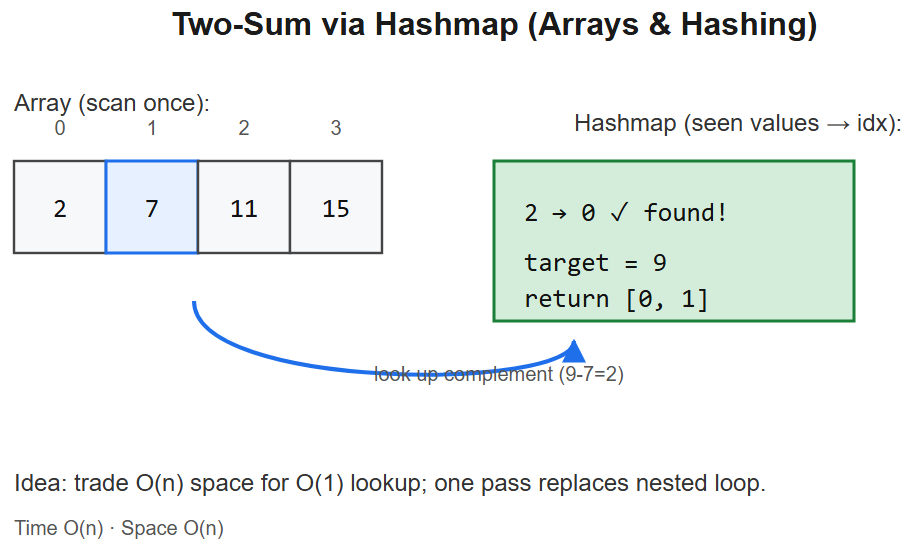

# 01 -- Arrays & Hashing



## Pattern: Hash map / set for O(1) lookup
When you need to **check "does X exist?"** or **count frequency** while scanning an array -- use a hash map / set. Converts many O(n^2) brute forces into O(n).

### Master template
```python
def has_pair_sum(arr, target):
    seen = set()
    for x in arr:
        if target - x in seen:        # complement exists
            return True
        seen.add(x)
    return False
```
- **Time** O(n), **Space** O(n)
- **Key insight**: scan once, store what you've seen, query in O(1)

### Mental model
```
arr:  [2, 7, 11, 15]   target = 9
       │
       ▼
seen = {} -> looking for 9-2=7? no -> seen = {2}
seen = {2} -> looking for 9-7=2? YES -> return True
```

---

## Variation 1.1 -- Two Sum (return indices) -- LC 1
**Change**: store `value -> index`, return indices when complement found.
```python
def twoSum(nums, target):
    seen = {}                          # val -> idx
    for i, x in enumerate(nums):
        if target - x in seen:
            return [seen[target - x], i]
        seen[x] = i
    return []
```
**Logic**: same scan-and-store pattern; key change is storing *index* alongside value.

## Variation 1.2 -- Contains Duplicate -- LC 217
**Change**: just check membership, no complement.
```python
def containsDuplicate(nums):
    seen = set()
    for x in nums:
        if x in seen: return True
        seen.add(x)
    return False
# OR one-liner: return len(set(nums)) != len(nums)
```

## Variation 1.3 -- Valid Anagram -- LC 242
**Change**: hash map as **frequency counter** of one string, decrement on the other.
```python
from collections import Counter
def isAnagram(s, t):
    return Counter(s) == Counter(t)

# OR manual:
def isAnagram2(s, t):
    if len(s) != len(t): return False
    cnt = {}
    for c in s: cnt[c] = cnt.get(c, 0) + 1
    for c in t:
        if cnt.get(c, 0) == 0: return False
        cnt[c] -= 1
    return True
```
**Logic**: anagrams have identical character frequencies.

## Variation 1.4 -- Group Anagrams -- LC 49
**Change**: key the hash map by a **canonical signature** (sorted string or 26-letter tuple).
```python
from collections import defaultdict
def groupAnagrams(strs):
    groups = defaultdict(list)
    for s in strs:
        key = tuple(sorted(s))         # or count tuple for O(n) per string
        groups[key].append(s)
    return list(groups.values())
```
**Diagram**:
```
"eat" -> sorted="aet" ─┐
"tea" -> sorted="aet" ─┼-> ["eat","tea","ate"]
"ate" -> sorted="aet" ─┘
"tan" -> sorted="ant" ─┐
"nat" -> sorted="ant" ─┴-> ["tan","nat"]
```

## Variation 1.5 -- Top K Frequent Elements -- LC 347
**Change**: count frequencies, then **bucket sort by frequency** (O(n)) or heap (O(n log k)).
```python
from collections import Counter
def topKFrequent(nums, k):
    return [x for x, _ in Counter(nums).most_common(k)]

# Bucket sort O(n):
def topKFrequent2(nums, k):
    freq = Counter(nums)
    buckets = [[] for _ in range(len(nums) + 1)]
    for x, f in freq.items():
        buckets[f].append(x)
    result = []
    for f in range(len(buckets) - 1, 0, -1):
        result.extend(buckets[f])
        if len(result) >= k:
            return result[:k]
    return result
```
**Logic**: bucket index = frequency. Walk buckets from highest down. Since max freq <= n, sized n+1.

## Variation 1.6 -- Product of Array Except Self -- LC 238
**Change**: no division allowed -> use **prefix and suffix products** (two passes).
```python
def productExceptSelf(nums):
    n = len(nums)
    res = [1] * n
    # prefix pass
    p = 1
    for i in range(n):
        res[i] = p
        p *= nums[i]
    # suffix pass
    s = 1
    for i in range(n - 1, -1, -1):
        res[i] *= s
        s *= nums[i]
    return res
```
**Diagram**:
```
nums:    [1,  2,  3,  4]
prefix:  [1,  1,  2,  6]      (product of everything LEFT of i)
suffix:  [24, 12, 4,  1]      (product of everything RIGHT of i)
result:  [24, 12, 8,  6]
```

## Variation 1.7 -- Longest Consecutive Sequence -- LC 128
**Change**: put nums in set; **only start counting at sequence starts** (where x-1 not in set).
```python
def longestConsecutive(nums):
    nums_set = set(nums)
    best = 0
    for x in nums_set:
        if x - 1 in nums_set:            # not a sequence start
            continue
        length = 1
        while x + length in nums_set:
            length += 1
        best = max(best, length)
    return best
```
**Logic**: O(n) because each element is the "next" in only one streak.

## Variation 1.8 -- Valid Sudoku -- LC 36
**Change**: three hash sets per dimension (rows, cols, 3x3 boxes).
```python
def isValidSudoku(board):
    rows = [set() for _ in range(9)]
    cols = [set() for _ in range(9)]
    boxes = [set() for _ in range(9)]
    for r in range(9):
        for c in range(9):
            v = board[r][c]
            if v == '.': continue
            b = (r // 3) * 3 + c // 3
            if v in rows[r] or v in cols[c] or v in boxes[b]:
                return False
            rows[r].add(v); cols[c].add(v); boxes[b].add(v)
    return True
```
**Diagram** (box index):
```
[0][1][2]
[3][4][5]   b = (r//3)*3 + c//3
[6][7][8]
```

---

## Summary -- what changes in each variation
| Problem | What changes from the master template |
|---------|----------------------------------------|
| Two Sum | Store `value -> index` |
| Contains Duplicate | Skip complement check; just membership |
| Valid Anagram | Map as frequency counter |
| Group Anagrams | Key by canonical signature (sorted) |
| Top K Frequent | Count + bucket sort by frequency |
| Product Except Self | Two-pass prefix/suffix instead of hash |
| Longest Consecutive | Set + start-of-sequence detection |
| Valid Sudoku | 3 sets per dimension simultaneously |

## Interview tells
- "Pairs summing to target" / "complement" -> hash map
- "Group by some property" -> hash map with computed key
- "Top K most frequent" -> Counter + bucket sort or heap
- "Detect duplicates / uniques" -> set
- "Anagram / permutation of" -> frequency Counter equality


---

## Deep dive -- why hashing works

A hash map stores keys in *buckets* indexed by `hash(key) % capacity`. With a good hash function and load factor <0.75, collisions are rare and amortised cost is **O(1)** for insert/lookup/delete. The cost we pay:
- **Worst case O(n)** if everything collides (adversarial hashing). Python `dict` uses randomised hashing to defend against this.
- **Space O(n)** -- we trade memory to flatten the time curve.
- **No order** unless we use `OrderedDict` / `dict` (Python 3.7+ preserves insertion order).

> Mental model: "I'll remember every value I've seen so I can answer membership and complement queries instantly."

##  Common pitfalls

| Pitfall | Fix |
|--------|-----|
| Checking `if key in dict.keys()` (Python) | Just `if key in dict` -- O(1) instead of O(n) |
| Using a list when you need O(1) membership | Convert to `set` first |
| Forgetting hashing breaks on unhashable types | Use `tuple` not `list` as map key |
| Mutating a key after insertion | Hash becomes stale -- value lost |
| Iterating + mutating the same dict | `RuntimeError`; iterate over a snapshot |
| Counting then over-writing in one loop | Use `defaultdict(int)` or `Counter` |

## More worked problems

### Subarray Sum Equals K -- LC 560
Prefix sum + hashmap. Count how many earlier prefixes equal `prefix - k`.
```python
def subarraySum(nums, k):
    cnt = {0: 1}                    # empty prefix
    psum = ans = 0
    for x in nums:
        psum += x
        ans += cnt.get(psum - k, 0) # answers ending here
        cnt[psum] = cnt.get(psum, 0) + 1
    return ans
```
**Why initial `{0:1}`?** A subarray starting at index 0 has prefix-before equal to 0.

### Encode / Decode Strings -- LC 271
Length-prefix each token to handle delimiters inside the data.
```python
def encode(strs):  return "".join(f"{len(s)}#{s}" for s in strs)
def decode(s):
    res = []; i = 0
    while i < len(s):
        j = s.find("#", i)
        ln = int(s[i:j]); i = j + 1
        res.append(s[i:i+ln]); i += ln
    return res
```

### Happy Number -- LC 202
Detect cycle in `n -> sum(digit^2)` chain using a set (or Floyd's tortoise/hare).

## Interview-style questions

1. **Why O(1) average for dict lookup, and when does it degrade?**
   Hash distributes keys uniformly -> constant probes per lookup. Degrades to O(n) under adversarial hashing or once load factor exceeds threshold and rehashing hasn't run.
2. **Group Anagrams: which key -- sorted string or 26-letter count tuple?**
   Sorted string is O(k log k) per word; count tuple is O(k). For long words count wins; for short ones sorted is fine and simpler.
3. **Longest Consecutive -- why O(n) and not O(n log n)?**
   We only *start* counting from sequence heads (`x-1` absent). Each element is visited once as part of exactly one streak.
4. **When would you prefer a sorted structure over a hashmap?**
   When you need ordered traversal, range queries, or "smallest key >= x". Hashmaps don't support these.
5. **Top-K frequent -- bucket sort vs heap?**
   Bucket sort O(n) when freq <= n. Heap O(n log k) is better for streaming (don't need all data up front).

## References
- *Introduction to Algorithms* (CLRS), Ch. 11 -- Hash Tables
- LeetCode Explore card: Hash Table
- Python docs: `collections.Counter`, `defaultdict`
