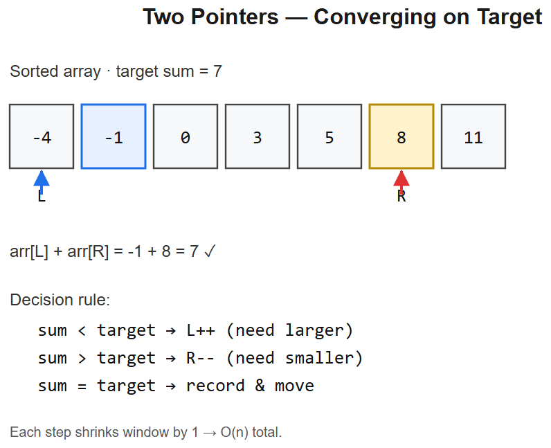

# 02 -- Two Pointers



## Pattern: Two indices walking the array with deterministic moves
Works when input is **sorted** (or you sort it first), or when you can decide which pointer to move based on a comparison.

### Master template -- opposite ends
```python
def two_sum_sorted(arr, target):
    l, r = 0, len(arr) - 1
    while l < r:
        s = arr[l] + arr[r]
        if s == target: return [l, r]
        elif s < target: l += 1            # need bigger
        else: r -= 1                       # need smaller
    return []
```
- **Time** O(n), **Space** O(1)
- **Why it works**: array sorted -> moving one pointer monotonically changes the sum, so we can prune one half each step

### Mental model
```
arr: [1, 3, 4, 6, 8]   target = 10
      L              R   sum = 1+8 = 9 < 10 -> L++
         L           R   sum = 3+8 = 11 > 10 -> R--
         L        R      sum = 3+6 = 9 < 10 -> L++
            L     R      sum = 4+6 = 10 
```

---

## Variation 2.1 -- Valid Palindrome -- LC 125
**Change**: pointers compare characters from ends inward, skipping non-alphanumeric.
```python
def isPalindrome(s):
    l, r = 0, len(s) - 1
    while l < r:
        while l < r and not s[l].isalnum(): l += 1
        while l < r and not s[r].isalnum(): r -= 1
        if s[l].lower() != s[r].lower(): return False
        l += 1; r -= 1
    return True
```
**Logic**: comparison instead of arithmetic; nested skip loops for filtering.

## Variation 2.2 -- 3Sum -- LC 15
**Change**: fix one element, two-pointer on the rest. Sort first; skip duplicates.
```python
def threeSum(nums):
    nums.sort()
    res = []
    for i in range(len(nums) - 2):
        if i > 0 and nums[i] == nums[i-1]: continue   # skip duplicate i
        l, r = i + 1, len(nums) - 1
        while l < r:
            s = nums[i] + nums[l] + nums[r]
            if s == 0:
                res.append([nums[i], nums[l], nums[r]])
                l += 1; r -= 1
                while l < r and nums[l] == nums[l-1]: l += 1   # skip dup l
                while l < r and nums[r] == nums[r+1]: r -= 1   # skip dup r
            elif s < 0: l += 1
            else: r -= 1
    return res
```
**Logic**: outer loop O(n) x two-pointer O(n) = O(n^2). Skipping dupes prevents repeated triplets.

**Diagram**:
```
For each i (fixed):
  i   l ───-> <-─── r
[-4, -1, -1, 0, 1, 2]
       ^       ^
   move based on (a[i] + a[l] + a[r]) vs 0
```

## Variation 2.3 -- Container With Most Water -- LC 11
**Change**: same opposite-ends sweep, but **always move the shorter pointer** (taller one can't improve area).
```python
def maxArea(h):
    l, r = 0, len(h) - 1
    best = 0
    while l < r:
        best = max(best, min(h[l], h[r]) * (r - l))
        if h[l] < h[r]: l += 1
        else: r -= 1
    return best
```
**Logic**: area = `min(h[l], h[r]) x width`. Moving the taller pointer only shrinks width without raising min -> useless.

## Variation 2.4 -- Trapping Rain Water -- LC 42
**Change**: two pointers + track max-left / max-right seen so far. Water above each bar = `min(maxL, maxR) - h[i]`.
```python
def trap(h):
    l, r = 0, len(h) - 1
    maxL = maxR = 0
    water = 0
    while l < r:
        if h[l] < h[r]:                # left side is the bottleneck
            maxL = max(maxL, h[l])
            water += maxL - h[l]
            l += 1
        else:
            maxR = max(maxR, h[r])
            water += maxR - h[r]
            r -= 1
    return water
```
**Diagram**:
```
heights: [0,1,0,2,1,0,1,3,2,1,2,1]
           ^                       ^
          maxL=0                  maxR=1
At each step, water above shorter side = min(maxL,maxR) - h[i]
```

## Variation 2.5 -- Remove Duplicates from Sorted Array -- LC 26
**Change**: **same-direction** two pointers -- read & write. Write only advances on accept.
```python
def removeDuplicates(nums):
    if not nums: return 0
    write = 1
    for read in range(1, len(nums)):
        if nums[read] != nums[read - 1]:
            nums[write] = nums[read]
            write += 1
    return write
```
**Logic**: fast-slow pointer trick -- `read` scans every element, `write` only moves on accepts. In-place O(1) extra space.

## Variation 2.6 -- Move Zeroes -- LC 283
**Change**: same fast-slow, but skip zeroes (write position stays on the zero until a non-zero arrives).
```python
def moveZeroes(nums):
    write = 0
    for read in range(len(nums)):
        if nums[read] != 0:
            nums[write], nums[read] = nums[read], nums[write]
            write += 1
```
**Logic**: every non-zero gets shifted to the front; the swap puts a zero into the back tail naturally.

---

## Summary -- variations of the two-pointer template
| Problem | Pointer style | What changes |
|---------|---------------|--------------|
| Two Sum II | Opposite ends | Sum-comparison move |
| Valid Palindrome | Opposite ends | Char compare + skip non-alnum |
| 3Sum | Fixed `i` + opposite ends | O(n) outer x two-pointer |
| Container | Opposite ends | Move *shorter* pointer |
| Trapping Rain | Opposite ends + max tracking | Track maxL, maxR |
| Remove Duplicates | Same direction (fast-slow) | Write only on accept |
| Move Zeroes | Same direction (fast-slow) | Swap non-zeros forward |

## Interview tells
- "Sorted array, find pair / triplet / sum to X" -> two pointers from ends
- "In-place remove / move / partition" -> fast-slow pointers
- "Palindrome / reverse" -> opposite ends comparison
- "Max area / max product / pruning sweep" -> opposite ends, move based on which side is the bottleneck


---

## Deep dive -- why two pointers is O(n)

In a converging two-pointer scan, each iteration advances `L` or `R` by exactly 1, so the loop runs at most `n` times. Compare to the brute force `for i: for j>i:` which is O(n^2). The trick: the **sorted order** lets you discard half the search space at each step using a monotone decision rule.

For the "fast/slow" variant (cycle detection, find middle, kth-from-end), the two pointers move at different speeds along the same axis; the **gap** between them encodes the invariant.

##  Common pitfalls

| Pitfall | Fix |
|--------|-----|
| Forgetting to sort first | Convergent two-pointer needs monotonicity |
| Off-by-one on `while l < r` vs `l <= r` | `<` for pairs, `<=` when single element is valid |
| Duplicates yielding repeated answers | Skip equal neighbours after recording a hit |
| Mutating in place corrupts the index | Use a write pointer (`k`) distinct from the scan |
| Cycle detection without termination check | If list is finite-non-cyclic, fast hits None |

## More problems

### 3Sum -- LC 15
Fix `i`, two-pointer the rest. Skip duplicates at all three levels.
```python
def threeSum(nums):
    nums.sort(); res = []
    for i in range(len(nums) - 2):
        if i and nums[i] == nums[i-1]: continue
        l, r = i+1, len(nums)-1
        while l < r:
            s = nums[i] + nums[l] + nums[r]
            if   s < 0: l += 1
            elif s > 0: r -= 1
            else:
                res.append([nums[i], nums[l], nums[r]])
                l += 1; r -= 1
                while l < r and nums[l] == nums[l-1]: l += 1
                while l < r and nums[r] == nums[r+1]: r -= 1
    return res
```

### Container With Most Water -- LC 11
Move the *shorter* wall inward; area can only stay or grow.
```python
def maxArea(h):
    l, r, best = 0, len(h)-1, 0
    while l < r:
        best = max(best, (r-l) * min(h[l], h[r]))
        if h[l] < h[r]: l += 1
        else:           r -= 1
    return best
```
**Proof of correctness**: discarding the shorter wall is safe because any pair using it with a closer opposite wall would have <= current area.

### Trapping Rain Water -- LC 42
Two-pointer with running maxes.
```python
def trap(h):
    l, r, lmax, rmax, ans = 0, len(h)-1, 0, 0, 0
    while l < r:
        if h[l] < h[r]:
            lmax = max(lmax, h[l])
            ans += lmax - h[l]; l += 1
        else:
            rmax = max(rmax, h[r])
            ans += rmax - h[r]; r -= 1
    return ans
```

### Linked-list cycle -- LC 141
Floyd's tortoise & hare:
```python
slow = fast = head
while fast and fast.next:
    slow = slow.next; fast = fast.next.next
    if slow is fast: return True
return False
```

## Interview questions

1. **Why sort before two-pointer?** Monotone decision rule needs order.
2. **3Sum: why O(n^2) and not O(n^3)?** Outer loop n, inner two-pointer n -> n*n.
3. **Trap rain water -- why does the "lower side" rule work?** Water trapped at `i` is bounded by `min(leftmax, rightmax)`; once we *know* one side's running max is lower than the opposite raw height, the lower side determines the trapped amount unambiguously.
4. **Fast/slow why does the hare meet the tortoise inside a cycle?** Relative speed is 1; within the cycle of length C the distance closes by 1 per step.
5. **When two-pointer fails:** array is unsorted AND you can't sort (e.g., need original indices and many duplicates) -- fall back to hash or DP.

## References
- LeetCode Explore: Two Pointers
- *Competitive Programming Handbook* (Laaksonen) -- Two-pointer section
