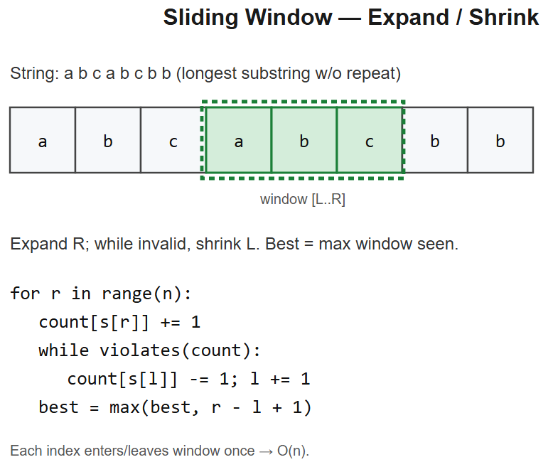

# 03 -- Sliding Window



## Pattern: Two pointers maintaining a "window" + cheap window-update math
When you need to find/optimize over **contiguous subarrays / substrings**. Expand right, shrink left while violating, track best.

### Master template -- variable window
```python
def longest_window_with_property(arr):
    left = 0
    best = 0
    state = {}                            # whatever you track (count, sum, etc.)

    for right, x in enumerate(arr):
        # 1. expand: add arr[right] to state
        state[x] = state.get(x, 0) + 1

        # 2. shrink while window is invalid
        while violates(state):
            state[arr[left]] -= 1
            if state[arr[left]] == 0:
                del state[arr[left]]
            left += 1

        # 3. record answer (window arr[left..right] is now valid)
        best = max(best, right - left + 1)

    return best
```
- **Time** O(n) -- each element enters and leaves the window at most once
- **Space** O(k) -- k = state size (alphabet / unique elements)

### Mental model
```
Array: [a b c a b c b b]
        L                 <- expand right
        L R               window = "a"
        L   R             window = "ab"
        ...
            L     R       shrink left when duplicate found
```

---

## Variation 3.1 -- Longest Substring Without Repeating Characters -- LC 3
**Change**: violation = duplicate character in window.
```python
def lengthOfLongestSubstring(s):
    seen = {}                  # char -> last index
    left = best = 0
    for right, ch in enumerate(s):
        if ch in seen and seen[ch] >= left:
            left = seen[ch] + 1
        seen[ch] = right
        best = max(best, right - left + 1)
    return best
```
**Optimization**: instead of shrinking one-by-one, *jump* `left` past the prior occurrence.

## Variation 3.2 -- Longest Repeating Character Replacement -- LC 424
**Change**: window valid if `(window_size - max_freq) <= k` (i.e. <= k replacements turn the window into one repeating char).
```python
from collections import Counter
def characterReplacement(s, k):
    count = Counter()
    left = best = max_freq = 0
    for right, ch in enumerate(s):
        count[ch] += 1
        max_freq = max(max_freq, count[ch])
        # shrink while too many chars to replace
        if (right - left + 1) - max_freq > k:
            count[s[left]] -= 1
            left += 1
        best = max(best, right - left + 1)
    return best
```
**Logic**: max_freq is the count of the dominant character. Replace everything else.

## Variation 3.3 -- Permutation in String -- LC 567
**Change**: **fixed-size window** equal to `len(s1)`. Check if window's frequency map == s1's frequency map.
```python
from collections import Counter
def checkInclusion(s1, s2):
    if len(s1) > len(s2): return False
    need = Counter(s1)
    window = Counter(s2[:len(s1)])
    if window == need: return True
    for i in range(len(s1), len(s2)):
        window[s2[i]] += 1
        window[s2[i - len(s1)]] -= 1
        if window[s2[i - len(s1)]] == 0:
            del window[s2[i - len(s1)]]
        if window == need: return True
    return False
```
**Diagram** (fixed window slides):
```
s2: [e i d b a o o o]    s1 = "ab" (len=2)
    [e i]                   window = {e:1, i:1}    need = {a:1,b:1}  
      [i d]                 window slides: drop e, add d              
        [d b]               
          [b a]             window = {b:1, a:1} == need  
```

## Variation 3.4 -- Minimum Window Substring -- LC 76
**Change**: **min** window covering `t`. Track how many *required* chars are still missing.
```python
from collections import Counter
def minWindow(s, t):
    need = Counter(t)
    missing = len(t)
    l = start = end = 0
    best_len = float('inf')
    for r, ch in enumerate(s):
        if need[ch] > 0: missing -= 1
        need[ch] -= 1
        while missing == 0:                      # valid window
            if r - l + 1 < best_len:
                best_len = r - l + 1
                start, end = l, r
            need[s[l]] += 1
            if need[s[l]] > 0: missing += 1
            l += 1
    return s[start:end+1] if best_len != float('inf') else ""
```
**Key trick**: `missing` is a single counter -- only changes when crossing 0 -- avoids re-comparing whole maps.

## Variation 3.5 -- Sliding Window Maximum -- LC 239
**Change**: fixed-size window, need **max** at every position -> monotonic deque.
```python
from collections import deque
def maxSlidingWindow(nums, k):
    dq = deque()                       # stores indices, values decreasing
    out = []
    for i, x in enumerate(nums):
        # drop indices outside window
        while dq and dq[0] <= i - k:
            dq.popleft()
        # maintain decreasing order from front
        while dq and nums[dq[-1]] < x:
            dq.pop()
        dq.append(i)
        if i >= k - 1:
            out.append(nums[dq[0]])
    return out
```
**Diagram** (monotonic decreasing deque):
```
nums = [1, 3, -1, -3, 5, 3, 6, 7]   k = 3
i=0: dq=[0]               (val=1)
i=1: drop 0 (1<3), dq=[1] (val=3)
i=2: dq=[1,2]             (vals 3,-1)  -> window max = 3
i=3: dq=[1,2,3]                         -> max = 3
i=4: drop 1 (out of win), drop 2,3 (smaller), dq=[4] -> max = 5
...
```

## Variation 3.6 -- Subarrays with K Different Integers -- LC 992
**Change**: "exactly K" = "at most K" - "at most K-1". Two sliding windows.
```python
def subarraysWithKDistinct(nums, k):
    def at_most(K):
        count = {}
        left = ans = 0
        for right, x in enumerate(nums):
            count[x] = count.get(x, 0) + 1
            while len(count) > K:
                count[nums[left]] -= 1
                if count[nums[left]] == 0:
                    del count[nums[left]]
                left += 1
            ans += right - left + 1     # all subarrays ending at right
        return ans
    return at_most(k) - at_most(k - 1)
```
**Logic**: counting "exactly K" is hard; "at most K" is the standard sliding-window. Subtract.

## Variation 3.7 -- Find All Anagrams in a String -- LC 438
**Change**: same as Variation 3.3 (Permutation in String) but return all start positions.
```python
from collections import Counter
def findAnagrams(s, p):
    need = Counter(p)
    window = Counter()
    res = []
    for i, ch in enumerate(s):
        window[ch] += 1
        if i >= len(p):
            window[s[i - len(p)]] -= 1
            if window[s[i - len(p)]] == 0:
                del window[s[i - len(p)]]
        if window == need:
            res.append(i - len(p) + 1)
    return res
```

---

## Summary
| Problem | Window type | What changes |
|---------|-------------|--------------|
| Longest no-repeat | Variable | Jump `left` past prior dup |
| Char replacement | Variable | Validity = `size - max_freq <= k` |
| Permutation in string | Fixed (len(s1)) | Compare freq maps |
| Min window substring | Variable | Track `missing` counter |
| Sliding max | Fixed k | Monotonic decreasing deque |
| K distinct | Variable | at_most(K) - at_most(K-1) |
| All anagrams | Fixed | Same as permutation, collect positions |

## Universal sliding-window decision tree
```
Need property over a contiguous subarray?
├── Fixed length k?
│   ├── Need max/min? -> monotonic deque
│   └── Need sum/freq match? -> maintain count, slide one step
└── Variable length?
    ├── Find LONGEST valid? -> expand right, shrink while invalid
    ├── Find SHORTEST valid? -> expand right, shrink WHILE STILL VALID
    └── Count subarrays with EXACTLY k? -> at_most(k) - at_most(k-1)
```

## Interview tells
- "Contiguous subarray / substring with property X" -> sliding window
- "Longest / shortest substring such that..." -> variable window
- "Subarray of size k..." -> fixed window
- "Max/min in every window of size k" -> monotonic deque
- "Exactly K of something" -> at_most(K) - at_most(K-1)


---

## Deep dive -- fixed vs. variable windows

**Fixed window (size k):** slide one step at a time, add new element, drop old. O(n).

**Variable window (longest/shortest satisfying P):** expand R while OK, shrink L while NOT OK. Each index enters and leaves window at most once -> **amortised O(n)** even though the inner `while` looks nested.

**Monotonic-deque variant (max in window):** keep indices in a deque whose values are decreasing. Front is the current max. Pop back smaller values before pushing.

##  Pitfalls

| Pitfall | Fix |
|--------|-----|
| Using `if violates` instead of `while` | One shrink may not be enough |
| Forgetting to update `best` after every R | Move "update best" to a fixed place per iteration |
| Mixing "longest" and "shortest" templates | Longest: update best AFTER shrink stops. Shortest: update while shrinking |
| Counting characters wrong on Unicode | Operate on bytes vs code points consistently |
| Off-by-one on window length `r - l + 1` | Draw it out -- closed interval |

## More problems

### Longest substring without repeating chars -- LC 3
```python
def lengthOfLongestSubstring(s):
    last = {}; l = best = 0
    for r, c in enumerate(s):
        if c in last and last[c] >= l:
            l = last[c] + 1
        last[c] = r
        best = max(best, r - l + 1)
    return best
```

### Minimum window substring -- LC 76 (Hard)
```python
from collections import Counter
def minWindow(s, t):
    need = Counter(t); missing = len(t)
    l = start = 0; best = (float('inf'), 0, 0)
    for r, c in enumerate(s):
        if need[c] > 0: missing -= 1
        need[c] -= 1
        if missing == 0:
            while need[s[l]] < 0:
                need[s[l]] += 1; l += 1
            if r - l + 1 < best[0]:
                best = (r - l + 1, l, r)
            need[s[l]] += 1; missing += 1; l += 1
    return "" if best[0] == float('inf') else s[best[1]:best[2]+1]
```

### Sliding window maximum -- LC 239 (monotonic deque)
```python
from collections import deque
def maxSlidingWindow(nums, k):
    dq = deque(); out = []
    for i, x in enumerate(nums):
        while dq and nums[dq[-1]] <= x: dq.pop()
        dq.append(i)
        if dq[0] <= i - k: dq.popleft()
        if i >= k - 1: out.append(nums[dq[0]])
    return out
```

### Permutation in string -- LC 567
Fixed window of length |s1|, compare counter arrays.

## Interview questions

1. **Why amortised O(n) for variable window?** Each index moves through L exactly once -> at most n shrink steps total.
2. **When fixed vs variable?** Fixed if window size is given. Variable if optimising window size to satisfy a predicate.
3. **Minimum window substring -- why use `missing` counter?** Avoids re-scanning entire `need` map each step; O(1) check per move.
4. **Monotonic deque why correct for max?** Smaller older elements can never be max while a larger newer element is in range.
5. **Substring with at most K distinct chars vs exactly K?** Exactly K = atMost(K) - atMost(K-1).

## References
- NeetCode 150 -- Sliding window category
- Codeforces blog: monotonic deque tutorial
