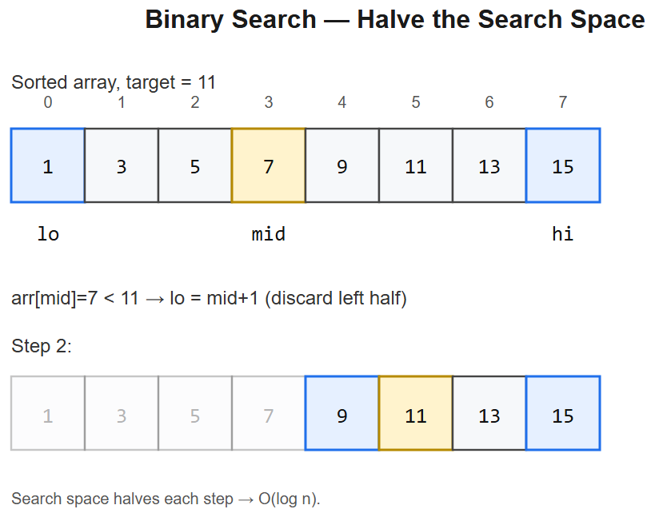

# 04 -- Binary Search



## Pattern: Halve the search space using a monotonic predicate
Two flavors:
1. **Search a sorted array** -- classic O(log n)
2. **Binary search on the answer** -- given a feasibility check `f(x)` that's monotonic, find the smallest/largest `x` satisfying `f(x)`

### Master template -- search a value
```python
def binary_search(arr, target):
    l, r = 0, len(arr) - 1
    while l <= r:
        m = l + (r - l) // 2            # avoid overflow
        if arr[m] == target: return m
        if arr[m] < target: l = m + 1
        else:               r = m - 1
    return -1
```

### Master template -- binary search on answer
```python
def smallest_x_satisfying(feasible, lo, hi):
    # invariant: f(hi) is True; we shrink toward the smallest such x
    while lo < hi:
        m = (lo + hi) // 2
        if feasible(m):
            hi = m
        else:
            lo = m + 1
    return lo
```
- **Time** O(log range x cost(feasible))
- **Critical**: predicate must be **monotonic** -- once true, stays true (or once false, stays false)

### Mental model
```
[F F F F F | T T T T T T T]
            ^
       answer = smallest x with f(x)=True
binary search the boundary
```

---

## Variation 4.1 -- Classic Binary Search -- LC 704
Already shown above. Always practice writing this **without off-by-ones**:
- `l <= r` with `r = m-1, l = m+1` -> returns -1 cleanly if not found
- `l < r` with `r = m, l = m+1` -> returns a position (use when you want "first/last")

## Variation 4.2 -- Search in Rotated Sorted Array -- LC 33
**Change**: array is rotated, but **one half is always sorted** at every step.
```python
def search(nums, target):
    l, r = 0, len(nums) - 1
    while l <= r:
        m = (l + r) // 2
        if nums[m] == target: return m
        if nums[l] <= nums[m]:                          # left half sorted
            if nums[l] <= target < nums[m]: r = m - 1
            else:                            l = m + 1
        else:                                           # right half sorted
            if nums[m] < target <= nums[r]: l = m + 1
            else:                            r = m - 1
    return -1
```
**Diagram**:
```
Rotated:  [4, 5, 6, 7, 0, 1, 2]
          <-sorted->         <-sorted->
              m
Check which half is sorted (nums[l] <= nums[m]?), then check if target is in that range.
```

## Variation 4.3 -- Find Minimum in Rotated Sorted Array -- LC 153
**Change**: search for the **pivot** (rotation point); compare `nums[m]` to `nums[r]`.
```python
def findMin(nums):
    l, r = 0, len(nums) - 1
    while l < r:
        m = (l + r) // 2
        if nums[m] > nums[r]: l = m + 1     # min is in right half
        else:                  r = m         # min is in left half (including m)
    return nums[l]
```
**Logic**: if `nums[m] > nums[r]`, the rotation point is past `m`. Else, it's <= m.

## Variation 4.4 -- First & Last Position -- LC 34
**Change**: do **two** binary searches -- one for leftmost, one for rightmost.
```python
def searchRange(nums, target):
    def first(target):
        l, r = 0, len(nums)
        while l < r:
            m = (l + r) // 2
            if nums[m] < target: l = m + 1
            else:                 r = m
        return l                                  # first index where nums[i] >= target

    lo = first(target)
    if lo == len(nums) or nums[lo] != target: return [-1, -1]
    hi = first(target + 1) - 1                    # one past the last
    return [lo, hi]
```
**Pattern**: `lower_bound` = first index `i` with `arr[i] >= target`. **Memorize this idiom** -- appears in many problems.

## Variation 4.5 -- Search 2D Matrix -- LC 74
**Change**: treat the 2D matrix as a flattened sorted array.
```python
def searchMatrix(matrix, target):
    if not matrix: return False
    rows, cols = len(matrix), len(matrix[0])
    l, r = 0, rows * cols - 1
    while l <= r:
        m = (l + r) // 2
        v = matrix[m // cols][m % cols]
        if v == target: return True
        if v < target: l = m + 1
        else:           r = m - 1
    return False
```

## Variation 4.6 -- Koko Eating Bananas -- LC 875 (binary search on answer)
**Change**: predicate = "can finish in `h` hours at speed `k`?". Monotonic in k.
```python
def minEatingSpeed(piles, h):
    def can(k):
        return sum((p + k - 1) // k for p in piles) <= h
    lo, hi = 1, max(piles)
    while lo < hi:
        m = (lo + hi) // 2
        if can(m): hi = m
        else:       lo = m + 1
    return lo
```

## Variation 4.7 -- Capacity to Ship Packages in D Days -- LC 1011
**Change**: same template; predicate = "can ship within D days with capacity `cap`?".
```python
def shipWithinDays(weights, days):
    def can(cap):
        d, cur = 1, 0
        for w in weights:
            if cur + w > cap:
                d += 1
                cur = 0
            cur += w
        return d <= days
    lo, hi = max(weights), sum(weights)
    while lo < hi:
        m = (lo + hi) // 2
        if can(m): hi = m
        else:       lo = m + 1
    return lo
```
**Logic**: lower bound = heaviest package (must fit alone); upper bound = ship all in one day.

## Variation 4.8 -- Median of Two Sorted Arrays -- LC 4 (hard)
**Change**: binary search the **partition point** in the smaller array such that left halves of both have correct median property.
```python
def findMedianSortedArrays(A, B):
    if len(A) > len(B): A, B = B, A         # ensure A is smaller
    m, n = len(A), len(B)
    total = m + n
    half = (total + 1) // 2
    lo, hi = 0, m
    while lo <= hi:
        i = (lo + hi) // 2                  # cut in A
        j = half - i                        # corresponding cut in B
        Aleft  = A[i-1] if i > 0 else float('-inf')
        Aright = A[i]   if i < m else float('inf')
        Bleft  = B[j-1] if j > 0 else float('-inf')
        Bright = B[j]   if j < n else float('inf')
        if Aleft <= Bright and Bleft <= Aright:
            if total % 2:
                return max(Aleft, Bleft)
            return (max(Aleft, Bleft) + min(Aright, Bright)) / 2
        elif Aleft > Bright:
            hi = i - 1
        else:
            lo = i + 1
```
**Logic**: O(log(min(m,n))). Hardest one of this set -- interviewers love it; few candidates nail it.

---

## Summary
| Problem | What changes |
|---------|--------------|
| Classic search | Direct value match |
| Rotated array | One half is always sorted; check which |
| Min in rotated | Compare `nums[m]` vs `nums[r]` |
| First/Last position | Two `lower_bound` searches |
| 2D matrix | Flatten via `m//cols, m%cols` |
| Koko bananas | BS on answer with feasibility predicate |
| Ship packages | Same template; predicate counts days |
| Median 2 arrays | BS the partition in smaller array |

## When to recognize "binary search on answer"
Three signs:
1. "**Minimum X such that ...**" or "**Maximum X such that ...**"
2. **Monotonic predicate** -- if X works, all bigger (or smaller) X also works
3. **Range of X is bounded** -- usually `[min(arr), max(arr)]` or `[1, sum(arr)]`

When you see "minimize the maximum..." or "maximize the minimum...", it's almost always BS on answer.

## Interview tells
- Sorted / partially sorted input -> classic BS
- "Min/max value such that feasible" + monotonic check -> BS on answer
- "Find smallest index where ..." -> lower_bound idiom
- "log n required" in constraints -> BS likely


---

## Deep dive -- binary search on the answer

Beyond "find x in sorted array", binary search is really about searching a **monotone predicate**: find smallest/largest `m` for which `P(m)` is true. The array view is one special case.

Generic template ("first true"):
```python
lo, hi = lo0, hi0
while lo < hi:
    m = (lo + hi) // 2
    if P(m): hi = m
    else:    lo = m + 1
return lo
```

This invariant -- `P(hi)` is always true (or hi is past end) -- avoids most off-by-ones.

**Common monotone domains:**
- Sorted array: classic.
- Answer space: "min capacity to ship in D days", "min eating speed".
- Real numbers: bisect with epsilon tolerance.
- 2D matrix: treat row-major or binary search rows.

##  Pitfalls

| Pitfall | Fix |
|--------|-----|
| `(lo+hi)//2` overflow in other languages | In Python ints are unbounded; in Java use `lo + (hi-lo)//2` |
| Wrong half discarded on duplicates | Decide explicitly: leftmost vs rightmost occurrence |
| `lo<=hi` with `lo=m+1, hi=m-1` -> off-by-one | Pick one template and stick with it |
| Infinite loop with `lo=m` (no shrink) | Use `(lo+hi+1)//2` when assigning lo=m |
| Forgetting predicate monotonicity | Verify P(lo..hi) is sorted False...True |

## More problems

### Find Minimum in Rotated Sorted Array -- LC 153
Compare `nums[m]` to `nums[hi]`.
```python
def findMin(nums):
    lo, hi = 0, len(nums) - 1
    while lo < hi:
        m = (lo + hi) // 2
        if nums[m] > nums[hi]: lo = m + 1
        else:                  hi = m
    return nums[lo]
```

### Koko Eating Bananas -- LC 875
Binary search over eating-speed K.
```python
import math
def minEatingSpeed(piles, h):
    lo, hi = 1, max(piles)
    while lo < hi:
        m = (lo + hi) // 2
        if sum(math.ceil(p / m) for p in piles) <= h:
            hi = m
        else:
            lo = m + 1
    return lo
```

### Median of Two Sorted Arrays -- LC 4 (Hard)
Binary search the partition position of the shorter array.

### Search a 2D Matrix -- LC 74
Treat as 1D of length m*n.

## Interview questions

1. **Why must the predicate be monotone?** Bisecting depends on "one side always satisfies, other never does".
2. **Leftmost vs rightmost binary search difference?** Tie-break: leftmost shrinks `hi` on equality; rightmost shrinks `lo`.
3. **Binary-search on real-valued answer -- when to stop?** `hi - lo < eps` (e.g. 1e-9) or fixed 100 iterations.
4. **Rotated array -- why compare to `nums[hi]` not `nums[lo]`?** Rotation cuts the sorted run; `hi` side is the "lower half" after rotation, which is monotone w.r.t. the answer.
5. **What if you can't find a monotone P?** Try parametric search or switch to BFS/DP.

## References
- "Powerful Ultimate Binary Search Template" -- zhijun_liao on LeetCode
- *Beautiful Code*, Ch. 4 -- On binary-search variants
