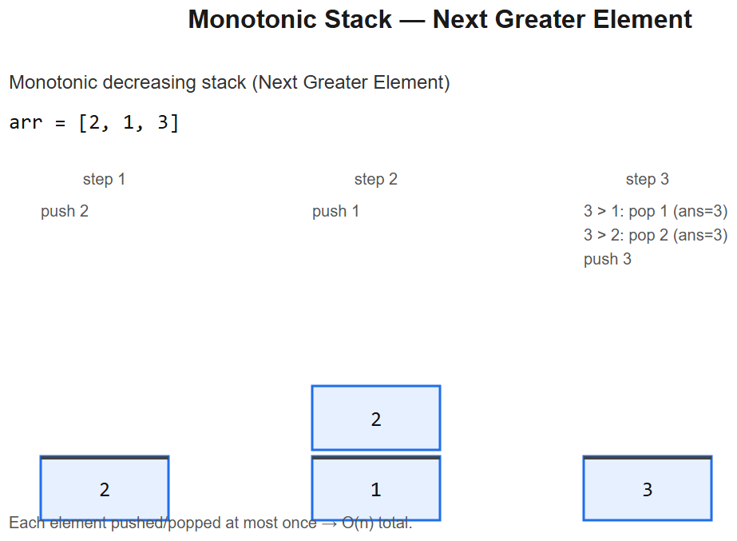

# 05 -- Stack & Monotonic Stack



## Pattern A: Stack for matching / nesting
LIFO is natural for **balanced brackets, expression evaluation, undo, recursion-to-iteration**.

### Master template
```python
def is_valid(s):
    stack = []
    pairs = {')':'(', ']':'[', '}':'{'}
    for ch in s:
        if ch in '([{':
            stack.append(ch)
        else:
            if not stack or stack[-1] != pairs[ch]:
                return False
            stack.pop()
    return not stack
```

## Pattern B: Monotonic stack
A stack maintained in **monotonic order** (strictly increasing or decreasing). Lets you find **next greater / smaller element** for every position in **O(n)** total.

### Master template -- next greater element to the right
```python
def next_greater(nums):
    n = len(nums)
    out = [-1] * n
    stack = []                             # holds indices, values DECREASING
    for i, x in enumerate(nums):
        while stack and nums[stack[-1]] < x:
            out[stack.pop()] = x           # x is the next greater for popped index
        stack.append(i)
    return out
```
- **Time** O(n) -- each index pushed and popped at most once
- **Space** O(n)

### Mental model
```
nums: [2, 1, 2, 4, 3]
i=0: push 0    stack=[0]
i=1: nums[0]=2 >= 1, don't pop, push 1   stack=[0,1]
i=2: nums[1]=1 < 2 -> out[1]=2 pop. nums[0]=2 >= 2 -> don't pop. push 2  stack=[0,2]
i=3: pop while smaller: out[2]=4, out[0]=4. push 3  stack=[3]
i=4: nums[3]=4 >= 3, push 4   stack=[3,4]
Final out: [4, 2, 4, -1, -1]
```

---

## Variation 5.1 -- Valid Parentheses -- LC 20
Covered as the master template (Pattern A).

## Variation 5.2 -- Min Stack -- LC 155
**Change**: track minimum at each level by storing **(value, current_min)**.
```python
class MinStack:
    def __init__(self):
        self.stk = []                                # list of (val, min_so_far)
    def push(self, x):
        m = x if not self.stk else min(x, self.stk[-1][1])
        self.stk.append((x, m))
    def pop(self):  self.stk.pop()
    def top(self):  return self.stk[-1][0]
    def getMin(self): return self.stk[-1][1]
```
**Logic**: each element knows the min at the time it was pushed -> popping restores prior min.

## Variation 5.3 -- Evaluate Reverse Polish Notation -- LC 150
**Change**: stack of values; operator pops two, pushes result.
```python
def evalRPN(tokens):
    stack = []
    ops = {'+': lambda a,b: a+b, '-': lambda a,b: a-b,
           '*': lambda a,b: a*b, '/': lambda a,b: int(a/b)}    # int() truncates toward 0
    for t in tokens:
        if t in ops:
            b = stack.pop(); a = stack.pop()
            stack.append(ops[t](a, b))
        else:
            stack.append(int(t))
    return stack[0]
```

## Variation 5.4 -- Generate Parentheses -- LC 22 (stack-shaped recursion)
**Change**: implicit stack via backtracking. Track open/close counts.
```python
def generateParenthesis(n):
    res = []
    def bt(s, opened, closed):
        if len(s) == 2 * n:
            res.append(s); return
        if opened < n:    bt(s + "(", opened + 1, closed)
        if closed < opened: bt(s + ")", opened, closed + 1)
    bt("", 0, 0)
    return res
```

## Variation 5.5 -- Daily Temperatures -- LC 739 (MONOTONIC STACK CLASSIC)
**Change**: store **gaps** instead of values. Pure application of Pattern B.
```python
def dailyTemperatures(temps):
    n = len(temps)
    out = [0] * n
    stack = []                            # indices, decreasing temps
    for i, t in enumerate(temps):
        while stack and temps[stack[-1]] < t:
            j = stack.pop()
            out[j] = i - j                # days until warmer
        stack.append(i)
    return out
```
**Diagram**:
```
temps: [73, 74, 75, 71, 69, 72, 76, 73]
              ^     ^       ^
       stack tracks indices whose answer we haven't found
       on a higher temp, pop and record gap
```

## Variation 5.6 -- Largest Rectangle in Histogram -- LC 84 (HARD)
**Change**: monotonic *increasing* stack of bar indices; when popping, the popped bar's width is bounded by current i and previous stack top.
```python
def largestRectangleArea(heights):
    stack = []                            # indices, increasing heights
    best = 0
    heights = heights + [0]               # sentinel forces final flush
    for i, h in enumerate(heights):
        while stack and heights[stack[-1]] > h:
            j = stack.pop()
            width = i if not stack else i - stack[-1] - 1
            best = max(best, heights[j] * width)
        stack.append(i)
    return best
```
**Logic**: when bar `j` is popped at index `i`, its rectangle extends from `stack[-1]+1` to `i-1`. Sentinel 0 at end empties the stack.

**Diagram**:
```
heights: [2, 1, 5, 6, 2, 3]
              ^  ^
          when "2" arrives at idx=4, pop 6->area=6x1, pop 5->area=5x2=10
```

## Variation 5.7 -- Car Fleet -- LC 853 (sorting + stack)
**Change**: sort by position descending; stack tracks fleet ETAs.
```python
def carFleet(target, position, speed):
    cars = sorted(zip(position, speed), reverse=True)   # closest to target first
    stack = []
    for p, s in cars:
        eta = (target - p) / s
        if not stack or eta > stack[-1]:
            stack.append(eta)                            # new fleet
        # else: catches up to fleet ahead -> joins it (no push)
    return len(stack)
```
**Logic**: a car catches the fleet ahead if its ETA <= the fleet ahead's ETA -- they merge. Stack counts independent fleets.

---

## Summary
| Problem | Pattern | What changes |
|---------|---------|--------------|
| Valid Parens | A (matching) | Map close->open |
| Min Stack | A | Pair (val, running_min) |
| Eval RPN | A (operator) | Pop 2, push result |
| Gen Parens | A (recursion) | Track open/close counts |
| Daily Temps | B (mono stack) | Store gap = i - j |
| Histogram | B (mono stack) | Width from prev stack top |
| Car Fleet | B (sorted + stack) | Sort by position, ETA-stack |

## Monotonic stack cheat-table
| Want for each i | Maintain | Pop when |
|------------------|----------|----------|
| Next greater (right) | Decreasing | new > top |
| Next smaller (right) | Increasing | new < top |
| Previous greater (left) | Decreasing | (push during scan, top of stack = prev greater for current) |
| Previous smaller (left) | Increasing | same as above |

## Interview tells
- "Balanced brackets / nested" -> stack (Pattern A)
- "Operator / expression eval" -> stack
- "Next greater / smaller in O(n)" -> monotonic stack
- "Max rectangle / area / histogram-shaped" -> monotonic stack
- "Stock span / temperature wait" -> monotonic stack


---

## Deep dive -- what stacks really compute

Three flavours interviewers love:
1. **Parentheses / bracket matching** -- push opens, pop and check on close.
2. **Monotonic stack** -- maintain increasing/decreasing run; pop while invariant violated. Each element pushed/popped at most once -> O(n).
3. **Expression / parsing** -- operands on a stack, evaluate on operator.

**Why monotonic stacks unlock "next greater" problems:** when we see a value greater than the top, we've found the answer for everything below it; pop and record. Anything still on the stack hasn't seen a greater value yet.

##  Pitfalls

| Pitfall | Fix |
|--------|-----|
| Forgetting to drain remaining stack at end | Loop after main scan to handle leftovers |
| Storing values instead of indices | Many problems need *positions* (distance, width) |
| `<` vs `<=` flips inclusive/exclusive | Pick one based on "strictly greater" vs >= semantics |
| Using list and `.pop(0)` for queue | That's O(n) -- use `collections.deque` |
| Recursion blowing stack on deep input | Convert to iterative with explicit stack |

## More problems

### Valid Parentheses -- LC 20
```python
def isValid(s):
    pair = {")":"(", "]":"[", "}":"{"}
    st = []
    for c in s:
        if c in "([{": st.append(c)
        elif not st or st.pop() != pair[c]: return False
    return not st
```

### Daily Temperatures -- LC 739
```python
def dailyTemperatures(t):
    res = [0]*len(t); st = []   # indices, decreasing temps
    for i, x in enumerate(t):
        while st and t[st[-1]] < x:
            j = st.pop(); res[j] = i - j
        st.append(i)
    return res
```

### Largest Rectangle in Histogram -- LC 84 (Hard)
```python
def largestRectangleArea(h):
    h = h + [0]; st = []; best = 0
    for i, x in enumerate(h):
        while st and h[st[-1]] > x:
            top = st.pop()
            width = i if not st else i - st[-1] - 1
            best = max(best, h[top] * width)
        st.append(i)
    return best
```

### Min Stack -- LC 155
Maintain a second stack of running minimums (or pair value+min).

### Evaluate RPN -- LC 150
```python
def evalRPN(tokens):
    st = []
    for t in tokens:
        if t in "+-*/":
            b, a = st.pop(), st.pop()
            st.append(int(a/b) if t == "/" else eval(f"{a}{t}{b}"))
        else: st.append(int(t))
    return st[0]
```

## Interview questions

1. **Why O(n) for monotonic stack despite the inner while?** Amortised: each index pushed once, popped once.
2. **Largest rectangle -- why the sentinel `0`?** Forces flush of any remaining increasing run at the end.
3. **Min stack -- why pair instead of separate min stack?** Pair is O(1) per op; separate stack can also work but uses more memory if minimum rarely changes.
4. **Implement queue with two stacks** -- push on `in`, pop after transferring `in->out` lazily.
5. **Reverse Polish vs infix** -- RPN needs only a stack; infix needs Shunting-yard or precedence climbing.

## References
- Dijkstra's Shunting-yard algorithm (1961)
- *Algorithms* by Sedgewick -- Stacks & Queues
