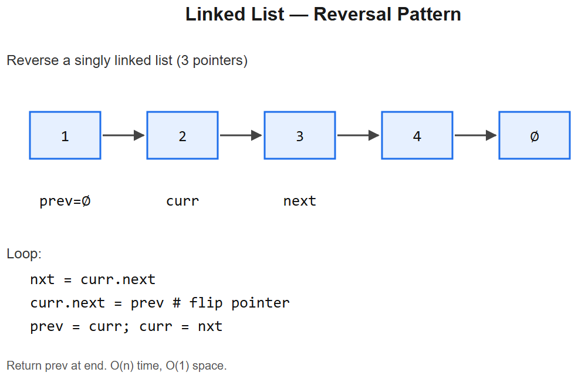

# 06 -- Linked List



## Pattern: Three-pointer iteration + dummy head
Almost every LL problem uses one or both of:
1. **Three-pointer reversal** (prev, cur, next)
2. **Fast & slow pointers** (Floyd's tortoise/hare) for cycle/middle/Nth-from-end
3. **Dummy head node** to simplify head edits

### Master template -- reverse a linked list (LC 206)
```python
class ListNode:
    def __init__(self, val=0, next=None):
        self.val = val; self.next = next

def reverseList(head):
    prev, cur = None, head
    while cur:
        nxt = cur.next                    # save pointer
        cur.next = prev                   # flip
        prev = cur                        # advance prev
        cur = nxt                         # advance cur
    return prev                           # new head
```
- **Time** O(n), **Space** O(1)

### Mental model
```
None <- 1 <- 2 <- 3 -> 4 -> 5
              ^   ^
             prev cur
```
Repeat: save next, flip cur->prev, advance.

---

## Variation 6.1 -- Merge Two Sorted Lists -- LC 21
**Change**: dummy head + tail pointer; pick smaller and advance.
```python
def mergeTwoLists(a, b):
    dummy = tail = ListNode()
    while a and b:
        if a.val <= b.val:
            tail.next = a; a = a.next
        else:
            tail.next = b; b = b.next
        tail = tail.next
    tail.next = a or b                    # attach the leftover (already sorted)
    return dummy.next
```
**Why dummy head**: don't have to special-case "is this the first node?". Universal LL trick.

## Variation 6.2 -- Linked List Cycle -- LC 141 (FAST/SLOW)
**Change**: two pointers at different speeds; meet inside any cycle.
```python
def hasCycle(head):
    slow = fast = head
    while fast and fast.next:
        slow = slow.next
        fast = fast.next.next
        if slow == fast: return True
    return False
```
**Why O(1) space**: if there's a cycle, fast laps slow within one cycle length.

## Variation 6.3 -- Find Cycle Start -- LC 142
**Change**: after fast & slow meet, move one pointer to head; both advance one step at a time -> meet at cycle start.
```python
def detectCycle(head):
    slow = fast = head
    while fast and fast.next:
        slow = slow.next; fast = fast.next.next
        if slow == fast:
            p = head
            while p != slow:
                p = p.next; slow = slow.next
            return p
    return None
```
**Math** (memorize one-line proof): if `L` = distance from head to cycle start, `c` = cycle length, then when they meet, slow has walked `L + x` where `x` is distance from start within cycle. Then `L = (c - x)` mod c -> starting fresh pointer from head meets `slow` exactly at cycle start.

## Variation 6.4 -- Remove Nth Node from End -- LC 19
**Change**: gap-N two pointers, both advance together.
```python
def removeNthFromEnd(head, n):
    dummy = ListNode(0, head)
    fast = slow = dummy
    for _ in range(n + 1):                # create N+1 gap
        fast = fast.next
    while fast:
        fast = fast.next; slow = slow.next
    slow.next = slow.next.next            # skip the Nth from end
    return dummy.next
```
**Diagram**:
```
dummy -> 1 -> 2 -> 3 -> 4 -> 5,   n=2
slow                fast        <- gap of 3 = n+1
        slow                fast (None)
        slow's next is the node to remove
```

## Variation 6.5 -- Middle of Linked List -- LC 876
**Change**: same fast/slow; when fast reaches end, slow is at middle.
```python
def middleNode(head):
    slow = fast = head
    while fast and fast.next:
        slow = slow.next; fast = fast.next.next
    return slow
```
For even length, returns the **second** middle. To return first, use `while fast.next and fast.next.next` instead.

## Variation 6.6 -- Palindrome Linked List -- LC 234
**Change**: find middle (fast/slow), reverse second half, compare.
```python
def isPalindrome(head):
    slow = fast = head
    while fast and fast.next:
        slow = slow.next; fast = fast.next.next
    # reverse second half
    prev = None
    while slow:
        nxt = slow.next; slow.next = prev; prev = slow; slow = nxt
    # compare
    p1, p2 = head, prev
    while p2:
        if p1.val != p2.val: return False
        p1 = p1.next; p2 = p2.next
    return True
```
**Combines two templates**: fast/slow + reversal. Common LL interview combo.

## Variation 6.7 -- Reverse Nodes in K-Group -- LC 25 (HARD)
**Change**: reverse one window of K at a time, link windows.
```python
def reverseKGroup(head, k):
    # check k nodes exist
    cur = head
    for _ in range(k):
        if not cur: return head
        cur = cur.next
    # reverse first k
    prev, cur = None, head
    for _ in range(k):
        nxt = cur.next; cur.next = prev; prev = cur; cur = nxt
    # recurse for the rest
    head.next = reverseKGroup(cur, k)
    return prev
```
**Logic**: reverse window of size k -> recursively reverse the rest -> connect.

## Variation 6.8 -- Merge K Sorted Lists -- LC 23 (HARD)
**Change**: heap of (val, list_id, node) -- pop smallest, push its next.
```python
import heapq
def mergeKLists(lists):
    h = []
    for i, lst in enumerate(lists):
        if lst: heapq.heappush(h, (lst.val, i, lst))
    dummy = tail = ListNode()
    while h:
        v, i, node = heapq.heappop(h)
        tail.next = node; tail = node
        if node.next:
            heapq.heappush(h, (node.next.val, i, node.next))
    return dummy.next
```
**Time** O(N log k) where N = total nodes, k = number of lists.

---

## Summary
| Problem | Template used | Trick |
|---------|---------------|-------|
| Reverse list | 3-pointer | The canonical reversal |
| Merge sorted | Dummy + tail | Eliminates head case |
| Has cycle | Fast/slow | Detects via meeting |
| Cycle start | Fast/slow + reset | Distance math |
| Nth from end | Fast/slow + gap N | Single pass |
| Middle | Fast/slow | Half-speed slow |
| Palindrome | Reverse + compare | Combine 2 patterns |
| Reverse k-group | Recursion + reversal | Window-by-window |
| Merge K | Heap | Multi-list min-heap |

## LL interview checklist
- [ ] Can you write `reverseList` in 30 seconds without bugs? **Drill it.**
- [ ] Do you reach for **dummy head** when modifying the head is possible?
- [ ] Fast/slow -> 4 use cases: detect cycle, cycle start, middle, Nth from end
- [ ] Always check `cur` and `cur.next` before `cur.next.next`

## Interview tells
- "Reverse", "swap pairs", "rotate" -> 3-pointer + recursion
- "Cycle / loop / Floyd's" -> fast/slow
- "Middle / find Nth from end" -> fast/slow (variant)
- "Merge / interleave sorted" -> dummy head + tail
- "K-th" or "K-group" -> fixed-size window reversal
- "Multiple sorted lists" -> heap


---

## Deep dive -- pointer manipulation principles

Three patterns cover most linked-list problems:
1. **Dummy head** -- create a sentinel so you don't special-case head insertions/deletions.
2. **Two pointers (fast/slow or runner)** -- middle, cycle, kth-from-end, palindrome.
3. **In-place reversal** -- using three pointers `prev / curr / next` to flip links.

When recursion is easier, recall that depth = list length; for very long lists prefer iteration to avoid stack overflow.

##  Pitfalls

| Pitfall | Fix |
|--------|-----|
| Losing the tail / forgetting to null it | Always set `tail.next = None` after detach |
| Off-by-one on "find middle" -- slow at ⌊n/2⌋ vs ⌈n/2⌉ | Adjust loop condition `fast.next` vs `fast.next and fast.next.next` |
| Modifying head without dummy | Use dummy = ListNode(0, head); return dummy.next |
| Cycle in input crashes plain traversal | Detect first (slow/fast) or use a seen set |
| Using `==` vs `is` for node equality | `is` for identity (cycle), `==` only if `__eq__` defined |

## More problems

### Reverse Linked List -- LC 206
```python
def reverseList(head):
    prev, curr = None, head
    while curr:
        nxt = curr.next
        curr.next = prev
        prev, curr = curr, nxt
    return prev
```

### Merge Two Sorted Lists -- LC 21
```python
def mergeTwoLists(a, b):
    dummy = tail = ListNode()
    while a and b:
        if a.val <= b.val: tail.next, a = a, a.next
        else:              tail.next, b = b, b.next
        tail = tail.next
    tail.next = a or b
    return dummy.next
```

### Remove Nth From End -- LC 19
Gap of n between fast and slow.
```python
def removeNthFromEnd(head, n):
    dummy = ListNode(0, head)
    fast = slow = dummy
    for _ in range(n+1): fast = fast.next
    while fast: fast = fast.next; slow = slow.next
    slow.next = slow.next.next
    return dummy.next
```

### Linked List Cycle II (start of cycle) -- LC 142
Floyd's: after meeting, reset one pointer to head, move both 1 step; meeting point = cycle start.

### Copy List with Random Pointer -- LC 138
Interleave clones, fix random pointers, split.

### Reverse Nodes in K-Group -- LC 25 (Hard)
Use dummy + count; reverse each block, splice back.

## Interview questions

1. **Why does Floyd's cycle-start work mathematically?** Distance from head to start = distance from meeting point to start (mod cycle length); the maths cancels out.
2. **When to use dummy head?** Whenever head can change (insertion/deletion at position 0).
3. **Reverse k-group -- iterative complexity?** O(n) time, O(1) space; recursion is O(n) extra stack.
4. **Compare merging k sorted lists with merging pairwise.** Heap is O(N log k); pairwise is O(N log k) too via tournament -- but heap is simpler online.
5. **Why prefer iteration over recursion for linked-list problems?** Stack overflow on long lists.

## References
- *Cracking the Coding Interview*, Ch. 2
- LeetCode Top Interview 150 -- Linked List
