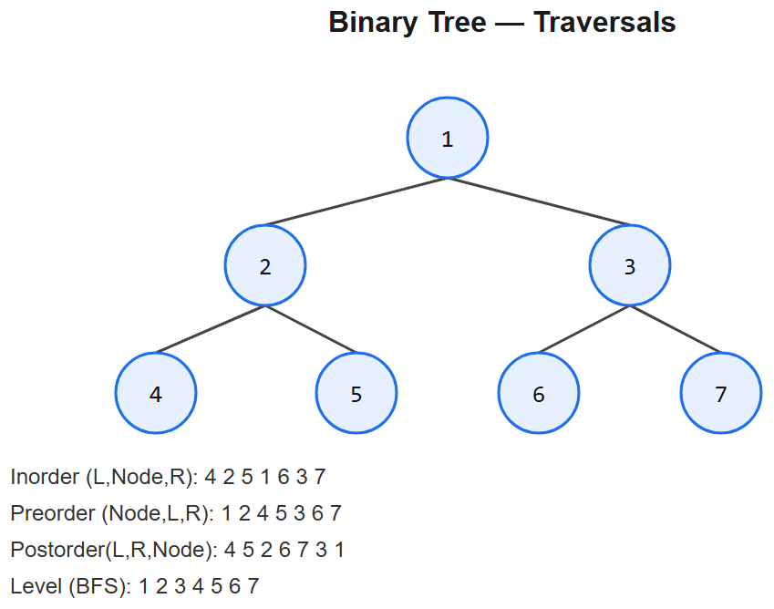

# 07 -- Trees



## Pattern A: Recursive traversal (DFS) -- the universal template
Every tree problem is some flavor of "at each node, combine the answers from its children".

### Master template
```python
class TreeNode:
    def __init__(self, val=0, left=None, right=None):
        self.val = val; self.left = left; self.right = right

def dfs(node):
    if not node: return base_value
    left  = dfs(node.left)
    right = dfs(node.right)
    return combine(left, right, node.val)
```

Three traversal orders matter:
- **Preorder** (root -> L -> R): copy tree, expression tree
- **Inorder** (L -> root -> R): BST sorted order
- **Postorder** (L -> R -> root): delete tree, compute subtree result

## Pattern B: BFS for level-order
```python
from collections import deque
def bfs(root):
    if not root: return []
    q, levels = deque([root]), []
    while q:
        level = []
        for _ in range(len(q)):                # snapshot count = current level size
            node = q.popleft()
            level.append(node.val)
            if node.left:  q.append(node.left)
            if node.right: q.append(node.right)
        levels.append(level)
    return levels
```

---

## Variation 7.1 -- Max Depth -- LC 104
```python
def maxDepth(root):
    if not root: return 0
    return 1 + max(maxDepth(root.left), maxDepth(root.right))
```
Pure post-order combine.

## Variation 7.2 -- Diameter of Binary Tree -- LC 543
**Change**: at each node, **diameter passing through it** = `left_depth + right_depth`. Track global max while computing depths.
```python
def diameterOfBinaryTree(root):
    best = [0]
    def depth(node):
        if not node: return 0
        l, r = depth(node.left), depth(node.right)
        best[0] = max(best[0], l + r)
        return 1 + max(l, r)
    depth(root)
    return best[0]
```
**Pattern**: "compute depth, side-effect record global answer" -- appears in many tree problems.

## Variation 7.3 -- Balanced Binary Tree -- LC 110
**Change**: return -1 sentinel when unbalanced; propagates up.
```python
def isBalanced(root):
    def depth(n):
        if not n: return 0
        l = depth(n.left)
        if l == -1: return -1
        r = depth(n.right)
        if r == -1 or abs(l - r) > 1: return -1
        return 1 + max(l, r)
    return depth(root) != -1
```

## Variation 7.4 -- Same Tree -- LC 100
**Change**: two-tree recursion.
```python
def isSameTree(p, q):
    if not p and not q: return True
    if not p or not q:  return False
    return p.val == q.val and isSameTree(p.left, q.left) and isSameTree(p.right, q.right)
```

## Variation 7.5 -- Invert Binary Tree -- LC 226
**Change**: swap children, recurse.
```python
def invertTree(root):
    if not root: return None
    root.left, root.right = invertTree(root.right), invertTree(root.left)
    return root
```

## Variation 7.6 -- Binary Tree Level Order Traversal -- LC 102
Pure Pattern B (BFS). See template above.

## Variation 7.7 -- Right Side View -- LC 199
**Change**: BFS with last-node-per-level.
```python
def rightSideView(root):
    if not root: return []
    q, view = deque([root]), []
    while q:
        for i in range(len(q)):
            node = q.popleft()
            if i == len(q):                   # last node of level (after popleft, last index now == len(q))
                view.append(node.val)
            if node.left:  q.append(node.left)
            if node.right: q.append(node.right)
    return view
```
Alternative: DFS right-first, record at depth.

## Variation 7.8 -- Validate BST -- LC 98
**Change**: pass down `(low, high)` bounds.
```python
def isValidBST(root):
    def valid(node, lo, hi):
        if not node: return True
        if not (lo < node.val < hi): return False
        return valid(node.left, lo, node.val) and valid(node.right, node.val, hi)
    return valid(root, float('-inf'), float('inf'))
```
**Key trick**: bounds tighten as you descend. The naive "node.val > left.val AND < right.val" is wrong (it doesn't catch deeper violations).

## Variation 7.9 -- Kth Smallest in BST -- LC 230
**Change**: inorder traversal yields sorted order. Stop at kth.
```python
def kthSmallest(root, k):
    stack = []
    while True:
        while root:
            stack.append(root); root = root.left
        root = stack.pop()
        k -= 1
        if k == 0: return root.val
        root = root.right
```
Iterative inorder -- also the template for any "produce sorted output from BST" task.

## Variation 7.10 -- Lowest Common Ancestor -- LC 235 (BST) / 236 (Binary Tree)

### BST version (use ordering)
```python
def lowestCommonAncestor_BST(root, p, q):
    while root:
        if p.val < root.val and q.val < root.val:    root = root.left
        elif p.val > root.val and q.val > root.val:  root = root.right
        else: return root                             # split point
```

### General binary tree (recursive)
```python
def lowestCommonAncestor(root, p, q):
    if not root or root == p or root == q: return root
    l = lowestCommonAncestor(root.left, p, q)
    r = lowestCommonAncestor(root.right, p, q)
    if l and r: return root                          # p, q in different subtrees -> root is LCA
    return l or r                                     # both in one subtree
```

## Variation 7.11 -- Serialize / Deserialize -- LC 297
**Change**: preorder with null markers.
```python
def serialize(root):
    out = []
    def dfs(n):
        if not n: out.append('#'); return
        out.append(str(n.val))
        dfs(n.left); dfs(n.right)
    dfs(root)
    return ','.join(out)

def deserialize(data):
    it = iter(data.split(','))
    def build():
        v = next(it)
        if v == '#': return None
        node = TreeNode(int(v))
        node.left = build(); node.right = build()
        return node
    return build()
```

## Variation 7.12 -- Maximum Path Sum -- LC 124 (HARD)
**Change**: like diameter, but with values + clamp negative contributions to 0.
```python
def maxPathSum(root):
    best = [float('-inf')]
    def gain(n):
        if not n: return 0
        l = max(0, gain(n.left))
        r = max(0, gain(n.right))
        best[0] = max(best[0], n.val + l + r)         # path through n
        return n.val + max(l, r)                       # path extends upward
    gain(root)
    return best[0]
```
**Logic**: returning "extends upward" = pick one side; "through n" = both sides + n.val.

---

## Summary
| Problem | Traversal | What changes |
|---------|-----------|--------------|
| Max Depth | Postorder | `1 + max(L, R)` |
| Diameter | Postorder + global | Track `L + R` while returning `1 + max(L,R)` |
| Balanced | Postorder + sentinel | Return -1 on imbalance |
| Same Tree | Dual recursion | Compare values + recurse children |
| Invert | Pre/postorder swap | Swap children before/after recurse |
| Level Order | BFS | Snapshot queue length per level |
| Right View | BFS / DFS-right | Record last/first per level |
| Validate BST | DFS with bounds | Pass (lo, hi) down |
| Kth Smallest | Iterative inorder | Count while popping |
| LCA (BST) | Iterative descent | Use ordering |
| LCA (general) | DFS | Combine `l, r` at each node |
| Serialize | Preorder + markers | `#` for nulls |
| Max Path Sum | Postorder + clamp | `max(0, gain(child))` |

## Tree problem recipe (5 steps)
1. **Define `dfs(node)`** -- what does it return?
2. **Base case** -- `if not node: return ???`
3. **Recurse** -- `l, r = dfs(L), dfs(R)`
4. **Combine** at current node
5. **Side-effect** if tracking a global (diameter, max path sum)

## BST invariant -- memorize
**Every node's left subtree contains values < node.val < right subtree** -- recursively.

## Interview tells
- "Depth / height / diameter" -> postorder DFS
- "Compare two trees" -> dual recursion
- "Level / row / cousin" -> BFS
- "Smallest / largest / sorted" + BST -> inorder
- "Path from root to leaf" -> preorder + path accumulator
- "Path through any node" -> postorder + global max
- "LCA" -> recursive split detection


---

## Deep dive -- three traversal orders

```
       1
      / \
     2   3
    / \   \
   4   5   6

preorder  (Node,L,R) : 1 2 4 5 3 6     <- "copy a tree"
inorder   (L,Node,R) : 4 2 5 1 3 6     <- BST sorted output
postorder (L,R,Node) : 4 5 2 6 3 1     <- "delete a tree", evaluate expression
level    (BFS)       : 1 2 3 4 5 6     <- shortest path / serialization
```

DFS naturally fits recursion; BFS naturally fits a queue. Both are O(n) time, O(h) and O(w) space respectively (h = height, w = max width).

**BST property:** for every node, all left descendants < node < all right descendants. Inorder traversal of a BST yields sorted values.

##  Pitfalls

| Pitfall | Fix |
|--------|-----|
| Recursing on `None` without guard | `if not node: return` at top |
| Mutable default args in helpers | Use `None` sentinel, init inside |
| Comparing to parent only for BST validity | Pass running (min, max) bounds down |
| Mixing global and returned values | Pick one, document it |
| Iterative DFS forgetting to mark visited | For graphs yes; for trees not needed if true tree |

## More problems

### Maximum Depth -- LC 104
```python
def maxDepth(root):
    return 0 if not root else 1 + max(maxDepth(root.left), maxDepth(root.right))
```

### Validate BST -- LC 98 (with bounds)
```python
def isValidBST(root, lo=float("-inf"), hi=float("inf")):
    if not root: return True
    if not (lo < root.val < hi): return False
    return isValidBST(root.left, lo, root.val) and isValidBST(root.right, root.val, hi)
```

### LCA of BST -- LC 235
Walk down: if both targets < node go left; both > node go right; else node is LCA.

### LCA of Binary Tree -- LC 236
```python
def lowestCommonAncestor(root, p, q):
    if not root or root is p or root is q: return root
    l = lowestCommonAncestor(root.left,  p, q)
    r = lowestCommonAncestor(root.right, p, q)
    return root if l and r else (l or r)
```

### Serialize / Deserialize -- LC 297
Preorder with null markers.

### Diameter of Binary Tree -- LC 543
DFS returning depth, updating global best with `left + right`.

### Binary Tree Level Order -- LC 102
```python
from collections import deque
def levelOrder(root):
    if not root: return []
    q = deque([root]); res = []
    while q:
        level = []
        for _ in range(len(q)):
            n = q.popleft(); level.append(n.val)
            if n.left:  q.append(n.left)
            if n.right: q.append(n.right)
        res.append(level)
    return res
```

## Interview questions

1. **Why inorder of a BST is sorted?** L < Node < R applied recursively.
2. **Validate BST -- why bounds, not just left/right comparison?** A right grandchild could violate the ancestor's bound while satisfying its parent.
3. **LCA -- why does the bubble-up trick work?** Because the LCA is exactly where the left and right recursive results both come back non-null.
4. **Iterative inorder?** Stack: push lefts, pop, output, go right.
5. **Morris traversal?** Threaded pointers for O(1) space inorder.

## References
- CLRS Ch. 12 (BSTs), Ch. 22 (Tree traversals via DFS)
- "Tree problems are recursion problems" -- most LC editorial
