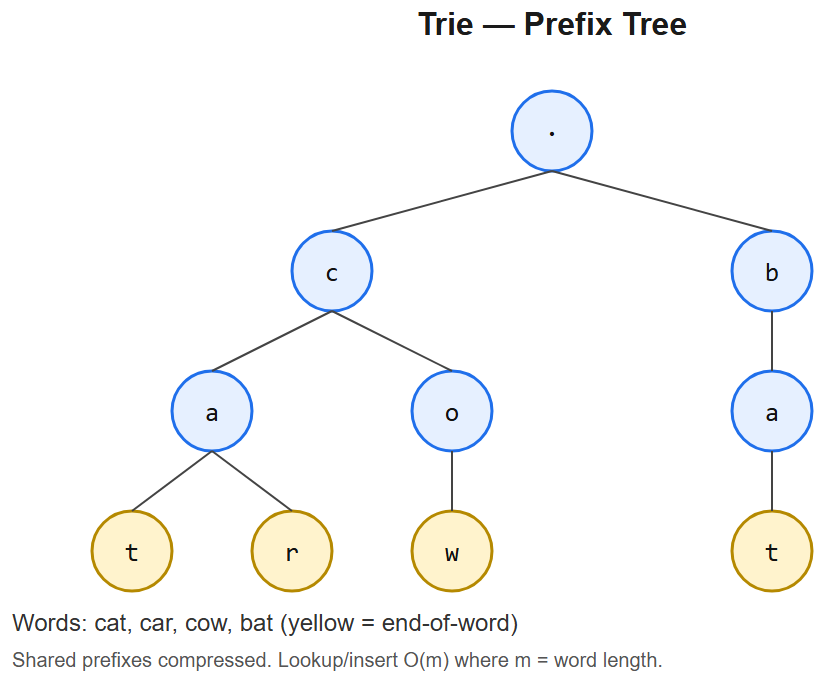

# 08 -- Tries (Prefix Trees)



## Pattern: Nested dict-of-dicts indexed by character
For **prefix queries**, **autocomplete**, **word dictionaries**, **bit-tries** (for XOR problems).

### Master template -- string trie
```python
class Trie:
    def __init__(self):
        self.root = {}

    def insert(self, word):
        node = self.root
        for c in word:
            node = node.setdefault(c, {})
        node['$'] = True                          # end marker

    def search(self, word):
        node = self._walk(word)
        return node is not None and '$' in node

    def startsWith(self, prefix):
        return self._walk(prefix) is not None

    def _walk(self, s):
        node = self.root
        for c in s:
            if c not in node: return None
            node = node[c]
        return node
```
- **Time per op** O(len(word))
- **Space** O(total chars in all words)

### Mental model
```
Insert "cat", "car", "cap":
root
└── c
    └── a
        ├── t [$]
        ├── r [$]
        └── p [$]
```

---

## Variation 8.1 -- Implement Trie -- LC 208
Covered by the template above.

## Variation 8.2 -- Design Add and Search Words (with `.` wildcard) -- LC 211
**Change**: wildcard `.` matches any char -> recursive search over all children when encountered.
```python
class WordDictionary:
    def __init__(self):
        self.root = {}

    def addWord(self, word):
        node = self.root
        for c in word:
            node = node.setdefault(c, {})
        node['$'] = True

    def search(self, word):
        def dfs(node, i):
            if i == len(word):
                return '$' in node
            c = word[i]
            if c == '.':
                return any(dfs(child, i+1) for k, child in node.items() if k != '$')
            return c in node and dfs(node[c], i+1)
        return dfs(self.root, 0)
```
**Logic**: deterministic walk becomes branching DFS at `.`.

## Variation 8.3 -- Word Search II -- LC 212 (HARD -- combines Trie + backtracking)
**Change**: build trie of all words; DFS the board, pruning branches not in trie.
```python
def findWords(board, words):
    # Build trie
    root = {}
    for w in words:
        node = root
        for c in w:
            node = node.setdefault(c, {})
        node['$'] = w                                  # store full word at end

    res = []
    rows, cols = len(board), len(board[0])

    def dfs(r, c, node):
        ch = board[r][c]
        if ch not in node: return
        nxt = node[ch]
        if '$' in nxt:
            res.append(nxt['$'])
            del nxt['$']                               # avoid duplicates
        board[r][c] = '#'                              # mark visited
        for dr, dc in [(-1,0),(1,0),(0,-1),(0,1)]:
            nr, nc = r + dr, c + dc
            if 0 <= nr < rows and 0 <= nc < cols and board[nr][nc] != '#':
                dfs(nr, nc, nxt)
        board[r][c] = ch                               # unmark

    for r in range(rows):
        for c in range(cols):
            dfs(r, c, root)
    return res
```
**Why trie**: searching each word independently would be O(W x R*C x 4^L) -- trie prunes shared prefixes, only descends paths that match *some* word.

## Variation 8.4 -- Maximum XOR of Two Numbers -- LC 421 (BIT TRIE)
**Change**: trie on **bits** (0/1) instead of characters. Insert each number; for each new number, walk the trie taking the opposite bit when possible to maximize XOR.
```python
def findMaximumXOR(nums):
    root = {}
    BITS = 31

    for x in nums:
        node = root
        for i in range(BITS, -1, -1):
            b = (x >> i) & 1
            node = node.setdefault(b, {})

    best = 0
    for x in nums:
        node = root
        cur = 0
        for i in range(BITS, -1, -1):
            b = (x >> i) & 1
            opp = 1 - b
            if opp in node:                           # take opposite bit if possible
                cur |= (1 << i)
                node = node[opp]
            else:
                node = node[b]
        best = max(best, cur)
    return best
```
**Logic**: XOR of two bits is 1 iff they differ -> greedily picking opposite bits maximizes XOR.

---

## Summary
| Problem | What changes |
|---------|--------------|
| Trie (basic) | The template itself |
| Add & Search w/ `.` | Walk becomes branching DFS on wildcard |
| Word Search II | Trie + grid backtracking; store full word at `$` |
| Max XOR | Bit trie + greedy opposite-bit walk |

## When trie wins over hash set
- **Prefix queries** -- hash sets don't support "startsWith"
- **Wildcards / pattern match** -- hash sets need iteration
- **Word search on grid** -- shared prefixes pruned automatically
- **Large vocabularies** -- memory wise, trie shares prefixes
- **Bit problems** (XOR maximization, longest XOR subsequence) -- bit trie is the canonical

## Interview tells
- "Insert / search / startsWith" -> trie
- "Autocomplete" -> trie
- "Wildcard match" -> trie + DFS
- "Many word lookups in grid / stream" -> trie
- "Max XOR" -> bit trie


---

## Deep dive -- trie vs hashmap

A trie shines when you need **prefix queries** or **iteration over keys with a shared prefix**. Hashmap is O(1) per key but doesn't expose prefix structure.

Trade-offs:
- Trie: O(m) per op (m = key length), O(N*m) space, optimal for autocomplete / streaming text.
- Hashmap: O(m) hash + O(1) bucket, slightly faster constants but no prefix iteration.
- Compressed trie (radix) saves nodes on sparse alphabets.

##  Pitfalls

| Pitfall | Fix |
|--------|-----|
| Storing 26 references in every node when alphabet is sparse | Use dict children |
| Forgetting end-of-word marker | Add `is_end` flag |
| Deletion that orphans subtree | Delete only when `is_end` and no children |
| Treating trie as memory-cheap | Each char usually = a node (+pointer overhead) |

## More problems

### Implement Trie -- LC 208
```python
class Trie:
    def __init__(self):
        self.root = {}
    def insert(self, word):
        node = self.root
        for c in word:
            node = node.setdefault(c, {})
        node["$"] = True
    def search(self, word):
        node = self._walk(word)
        return bool(node and node.get("$"))
    def startsWith(self, prefix):
        return self._walk(prefix) is not None
    def _walk(self, s):
        node = self.root
        for c in s:
            if c not in node: return None
            node = node[c]
        return node
```

### Word Search II -- LC 212 (Hard)
DFS on board, prune by trie node. Each DFS step checks whether the current cell's letter is a child of the current trie node; if not, prune.

### Replace Words -- LC 648
Build trie of roots; for each word, walk until first end-of-word.

### Design Add and Search Word -- LC 211
Trie + `.` wildcard means recurse over all children.

### Longest Common Prefix -- LC 14
Build trie, walk until branching.

## Interview questions

1. **Why trie for autocomplete?** Prefix walk is O(m); collecting completions is O(suggestions) using subtree DFS.
2. **Space optimisation?** Use dict (sparse), radix tree (path compression), or DAWG (shared suffixes too).
3. **When is hashmap better?** When you only do exact lookup and prefix isn't needed.
4. **How to support fuzzy / edit-distance search?** Trie + dynamic programming row over edit distance (Levenshtein automaton).
5. **Word Search II complexity?** O(R*C*4^L) bound; trie prunes massive subtrees so practical perf is far better.

## References
- Sedgewick R-way Tries; Ternary Search Tries
- "Levenshtein automata" -- Schulz & Mihov
