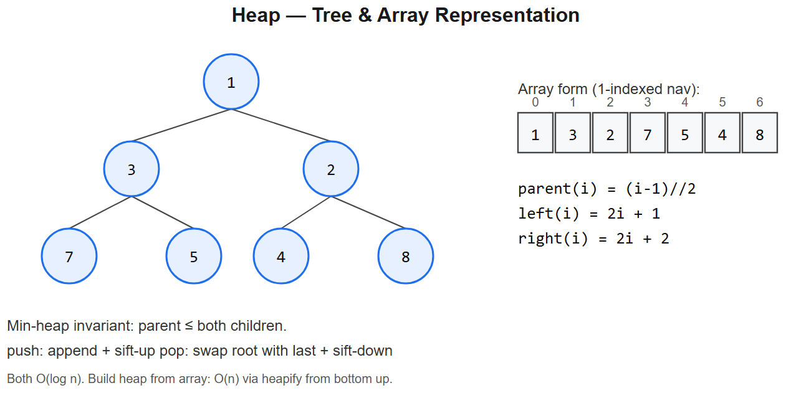

# 09 -- Heap / Priority Queue



## Pattern: Always-fast access to the smallest (or largest) element
Python's `heapq` is a **min-heap**. For max-heap, push negatives.

### Master templates
```python
import heapq

# Min-heap
h = []
heapq.heappush(h, x)
mn = heapq.heappop(h)         # smallest

# Max-heap (negate trick)
h = []
heapq.heappush(h, -x)
mx = -heapq.heappop(h)

# K largest / smallest one-shot
heapq.nlargest(k, iterable)
heapq.nsmallest(k, iterable)
```
**Complexity**: push / pop = O(log n), peek = O(1), heapify a list = O(n).

### Mental model
```
Min-heap (array form, 1-indexed for math):
[_, 2, 5, 4, 9, 10, 7, 8]    parent(i) = i//2, children = 2i, 2i+1

       2
     /   \
    5     4
   / \   / \
  9  10 7   8
```
Heap property: parent <= children (for min-heap). Push: append at end, "sift up". Pop: swap last to top, "sift down".

---

## Variation 9.1 -- Kth Largest Element -- LC 215
**Change**: maintain a min-heap of size k. Smallest in heap = kth largest seen.
```python
def findKthLargest(nums, k):
    h = []
    for x in nums:
        heapq.heappush(h, x)
        if len(h) > k:
            heapq.heappop(h)
    return h[0]
```
**Why O(n log k) not O(n log n)**: heap stays size k.

## Variation 9.2 -- Top K Frequent Elements -- LC 347
**Change**: count first, then heap by frequency.
```python
from collections import Counter
def topKFrequent(nums, k):
    return [x for x, _ in Counter(nums).most_common(k)]
# OR
def topKFrequent2(nums, k):
    freq = Counter(nums)
    return heapq.nlargest(k, freq.keys(), key=freq.get)
```

## Variation 9.3 -- K Closest Points to Origin -- LC 973
**Change**: heap key = distance.
```python
def kClosest(points, k):
    return heapq.nsmallest(k, points, key=lambda p: p[0]**2 + p[1]**2)
```
**Tie-breaking**: for stable ordering when distances are equal, push tuples `(dist, idx, point)`.

## Variation 9.4 -- Merge K Sorted Lists -- LC 23
**Change**: heap of one element per list.
```python
def mergeKLists(lists):
    h = []
    for i, lst in enumerate(lists):
        if lst:
            heapq.heappush(h, (lst.val, i, lst))      # (val, tie-breaker idx, node)
    dummy = tail = ListNode()
    while h:
        v, i, node = heapq.heappop(h)
        tail.next = node; tail = node
        if node.next:
            heapq.heappush(h, (node.next.val, i, node.next))
    return dummy.next
```
**Why the index `i`**: tie-breaker so the heap doesn't try comparing `ListNode` objects.

## Variation 9.5 -- Find Median from Data Stream -- LC 295 (TWO HEAPS)
**Change**: maintain max-heap of lower half and min-heap of upper half.
```python
class MedianFinder:
    def __init__(self):
        self.low = []                # max-heap (negate)
        self.high = []               # min-heap

    def addNum(self, num):
        heapq.heappush(self.low, -num)
        heapq.heappush(self.high, -heapq.heappop(self.low))  # bounce highest of low -> high
        if len(self.high) > len(self.low):                    # rebalance
            heapq.heappush(self.low, -heapq.heappop(self.high))

    def findMedian(self):
        if len(self.low) > len(self.high):
            return -self.low[0]
        return (-self.low[0] + self.high[0]) / 2
```
**Invariants**:
- `len(low)` either equals `len(high)` or is one bigger
- `max(low) <= min(high)`

**Diagram**:
```
Stream: 1, 2, 3
After 1: low=[1]                     median = 1
After 2: low=[1], high=[2]           median = 1.5
After 3: low=[2,1], high=[3]         median = 2
```

## Variation 9.6 -- Task Scheduler -- LC 621
**Change**: heap of counts (max-heap); after running, requeue with cooldown.
```python
def leastInterval(tasks, n):
    counts = Counter(tasks)
    h = [-c for c in counts.values()]
    heapq.heapify(h)
    time = 0
    while h:
        temp = []
        for _ in range(n + 1):                    # try to fill one cycle
            if h:
                c = heapq.heappop(h)
                if c < -1:                         # still has occurrences left
                    temp.append(c + 1)
            time += 1
            if not h and not temp:
                break
        for c in temp:
            heapq.heappush(h, c)
    return time
```
**Logic**: greedily pick the most-frequent task to run first; insert idle slots when needed.

---

## Summary
| Problem | Heap setup | Trick |
|---------|------------|-------|
| Kth Largest | Min-heap size k | Heap size bounds memory |
| Top K Frequent | Heap by frequency | `Counter.most_common` does it |
| K Closest | Heap by distance | `heapq.nsmallest` clean |
| Merge K Lists | Min-heap of list heads | Tie-breaker idx avoids node compare |
| Median Stream | Two heaps | Balance + invariant `max(low) <= min(high)` |
| Task Scheduler | Max-heap of counts | Cooldown via temp list |

## When to reach for a heap
- "Kth largest / smallest / closest" -> heap (or quickselect for O(n) average)
- "Stream of numbers, query median" -> two heaps
- "Merge N sorted streams" -> heap of heads
- "Scheduling with priority / deadlines" -> heap
- "Min-cost / Dijkstra" -> heap (covered in graphs)

## Quickselect alternative for Kth-element (worth knowing)
- **Average O(n), worst O(n^2)** -- partition-based, like quicksort
- Use when constants matter or interviewer asks "can you do better than n log k?"
- `heapq` is safer in interviews -- quickselect requires careful partition

## Interview tells
- "Top K" / "K smallest" / "K closest" -> heap
- "Streaming + queries" -> heap (often two)
- "Schedule with cooldown / priority" -> heap
- "Lazy deletion needed" -> heap with timestamp / tombstones


---

## Deep dive -- when heap beats sort

If you need ALL elements ordered -> sort, O(n log n).
If you need top-K / kth element from a stream -> heap, O(n log k).
If you need "next event" in simulation -> heap = priority queue.
If you need both ends -> two heaps (median maintenance) or balanced BST.

**heapify in O(n):** Bottom-up sift-down has cost ∑ h_i <= 2n by a tight telescoping argument; not O(n log n).

Python's `heapq` is a **min-heap**. For max-heap, negate values or use tuples `(-priority, item)`.

##  Pitfalls

| Pitfall | Fix |
|--------|-----|
| Using `heap[0]` after `heappush` without `heapify` | OK as long as you only used heappush/heappop |
| Storing un-comparable items | Add a tiebreaker `(priority, counter, item)` |
| Removing arbitrary element | heapq doesn't support; use lazy deletion (mark stale) |
| Forgetting Python is min-heap | Negate, or use SortedList |
| Updating priority in place | Heap invariant breaks; reinsert and lazy-delete old |

## More problems

### Kth Largest in Array -- LC 215
```python
import heapq
def findKthLargest(nums, k):
    h = []
    for x in nums:
        heapq.heappush(h, x)
        if len(h) > k: heapq.heappop(h)
    return h[0]
```

### Top K Frequent -- LC 347
Counter + heap of size k.

### Merge K Sorted Lists -- LC 23
```python
import heapq
def mergeKLists(lists):
    h = []
    for i, node in enumerate(lists):
        if node: heapq.heappush(h, (node.val, i, node))
    dummy = tail = ListNode()
    while h:
        v, i, n = heapq.heappop(h)
        tail.next = n; tail = n
        if n.next: heapq.heappush(h, (n.next.val, i, n.next))
    return dummy.next
```

### Find Median from Data Stream -- LC 295 (Hard)
Two heaps: max-heap for lower half, min-heap for upper. Rebalance after each insert.

### Task Scheduler -- LC 621
Greedy + heap by remaining counts.

### Reorganize String -- LC 767
Heap by frequency; always pick top two distinct.

## Interview questions

1. **Why is `heapify` O(n)?** Cost dominated by bottom levels which have many cheap operations.
2. **Median of stream -- why two heaps?** O(log n) insert, O(1) median. Self-balancing BST also works.
3. **Top K via heap vs quickselect?** Heap O(n log k), quickselect avg O(n) but worst O(n^2). Heap is online.
4. **Why include a counter in tuples pushed to heap?** Tiebreaker for unhashable / equal-priority items.
5. **When prefer sorted list over heap?** When you need k-th smallest at arbitrary k, or range queries.

## References
- CLRS Ch. 6 -- Heapsort
- Python docs: `heapq` priority-queue patterns
