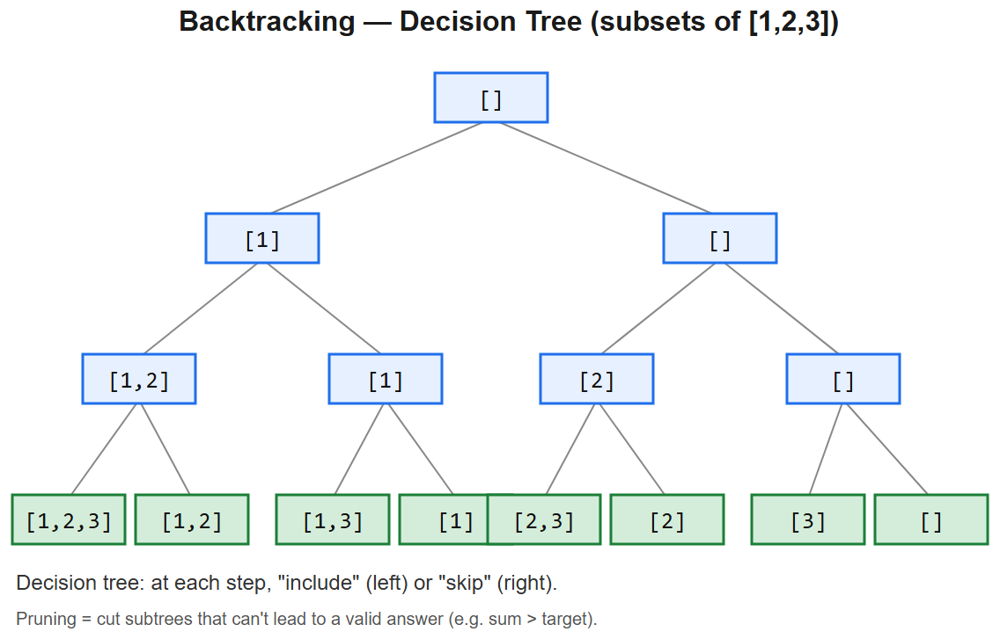

# 10 -- Backtracking & Recursion



## Pattern: Choose -> Recurse -> Un-choose
Walk the decision tree, prune dead branches, record completed paths.

### Master template
```python
def backtrack(path, choices, result):
    if is_complete(path):
        result.append(path[:])                # snapshot
        return
    for choice in choices:
        if not is_valid(choice, path): continue
        path.append(choice)                   # CHOOSE
        backtrack(path, next_choices(choice, choices), result)
        path.pop()                            # UN-CHOOSE (backtrack)
```
- **Time**: usually exponential -- `O(branching^depth)` -- must prune to be fast enough
- **Space**: O(depth) recursion + O(answers) output

### Mental model -- decision tree
```
                    []
            /        |        \
          [1]       [2]       [3]
         /  \      /  \         |
      [1,2][1,3] [2,3] ...    [3,?]
```
Backtracking = DFS over this tree, popping on the way back up.

---

## Variation 10.1 -- Subsets -- LC 78
**Change**: at every level, just *include or exclude*. No completion check (every node is a valid subset).
```python
def subsets(nums):
    result = []
    def bt(start, path):
        result.append(path[:])                # every state is a valid subset
        for i in range(start, len(nums)):
            path.append(nums[i])
            bt(i + 1, path)
            path.pop()
    bt(0, [])
    return result
```
**Logic**: `start` prevents revisiting earlier indices -> no duplicates.

## Variation 10.2 -- Subsets II (with duplicates) -- LC 90
**Change**: sort first, then skip duplicates at the same recursion depth.
```python
def subsetsWithDup(nums):
    nums.sort()
    result = []
    def bt(start, path):
        result.append(path[:])
        for i in range(start, len(nums)):
            if i > start and nums[i] == nums[i-1]: continue   # skip dup at this level
            path.append(nums[i])
            bt(i + 1, path)
            path.pop()
    bt(0, [])
    return result
```
**Why "at this level"**: deeper recursions can use the same value; only skip siblings.

## Variation 10.3 -- Permutations -- LC 46
**Change**: use a `used[]` array instead of `start`; every element can appear at any position.
```python
def permute(nums):
    result, used = [], [False] * len(nums)
    def bt(path):
        if len(path) == len(nums):
            result.append(path[:]); return
        for i in range(len(nums)):
            if used[i]: continue
            used[i] = True
            path.append(nums[i])
            bt(path)
            path.pop()
            used[i] = False
    bt([])
    return result
```

## Variation 10.4 -- Combination Sum -- LC 39
**Change**: same element can be reused -> pass `i`, not `i+1`, on recurse.
```python
def combinationSum(candidates, target):
    result = []
    def bt(start, remaining, path):
        if remaining == 0:
            result.append(path[:]); return
        if remaining < 0: return
        for i in range(start, len(candidates)):
            path.append(candidates[i])
            bt(i, remaining - candidates[i], path)        # i, not i+1
            path.pop()
    bt(0, target, [])
    return result
```
**Pruning**: sort + `if candidates[i] > remaining: break` for extra speed.

## Variation 10.5 -- Word Search -- LC 79
**Change**: DFS on grid + mark visited (in-place) + un-mark on return.
```python
def exist(board, word):
    rows, cols = len(board), len(board[0])
    def dfs(r, c, i):
        if i == len(word): return True
        if r < 0 or r >= rows or c < 0 or c >= cols or board[r][c] != word[i]:
            return False
        board[r][c] = '#'                                  # mark
        found = (dfs(r+1, c, i+1) or dfs(r-1, c, i+1) or
                 dfs(r, c+1, i+1) or dfs(r, c-1, i+1))
        board[r][c] = word[i]                              # un-mark
        return found
    for r in range(rows):
        for c in range(cols):
            if dfs(r, c, 0): return True
    return False
```

## Variation 10.6 -- N-Queens -- LC 51
**Change**: track conflicts via three sets (cols, diag1=r-c, diag2=r+c).
```python
def solveNQueens(n):
    result = []
    cols, d1, d2 = set(), set(), set()
    def bt(r, board):
        if r == n:
            result.append(["." * c + "Q" + "." * (n - c - 1) for c in board])
            return
        for c in range(n):
            if c in cols or (r-c) in d1 or (r+c) in d2: continue
            cols.add(c); d1.add(r-c); d2.add(r+c); board.append(c)
            bt(r+1, board)
            board.pop(); cols.remove(c); d1.remove(r-c); d2.remove(r+c)
    bt(0, [])
    return result
```
**Diagonal trick**: along `\` diag, `r - c` is constant; along `/` diag, `r + c` is constant.

## Variation 10.7 -- Palindrome Partitioning -- LC 131
**Change**: at each step, take a prefix if palindrome, recurse on remainder.
```python
def partition(s):
    result = []
    def is_pal(t): return t == t[::-1]
    def bt(start, path):
        if start == len(s):
            result.append(path[:]); return
        for end in range(start + 1, len(s) + 1):
            piece = s[start:end]
            if is_pal(piece):
                path.append(piece)
                bt(end, path)
                path.pop()
    bt(0, [])
    return result
```

## Variation 10.8 -- Letter Combinations of a Phone Number -- LC 17
**Change**: deterministic branching factor (one digit -> fixed letters).
```python
def letterCombinations(digits):
    if not digits: return []
    mapping = {'2':'abc','3':'def','4':'ghi','5':'jkl','6':'mno','7':'pqrs','8':'tuv','9':'wxyz'}
    result = []
    def bt(i, path):
        if i == len(digits):
            result.append(''.join(path)); return
        for ch in mapping[digits[i]]:
            path.append(ch)
            bt(i+1, path)
            path.pop()
    bt(0, [])
    return result
```

---

## Summary
| Problem | Choice space | Key trick |
|---------|--------------|-----------|
| Subsets | include / exclude | every node = valid subset |
| Subsets II | as above, sorted | skip dup at level (`i > start`) |
| Permutations | all unused | `used[]` array |
| Combination Sum | reusable | pass `i` not `i+1` |
| Word Search | 4 directions | in-place mark/un-mark |
| N-Queens | columns | 3 conflict sets |
| Palindrome Partition | prefix splits | check palindrome before recurse |
| Phone Letters | digit->letters | deterministic branching |

## Pruning strategies (what makes backtracking fast)
1. **Sort + early break** -- once a candidate is too big, all later ones are too
2. **Constraint sets** -- N-queens cols/diag sets are O(1) check
3. **Memoization** -- when subproblems repeat -> it's actually DP
4. **Bitmask state** -- for n <= ~20, encode "used" as a bitmask for O(1) check
5. **Bounded answer count** -- return immediately when k answers found

## Backtracking vs DP -- which to use?
- **Backtracking**: when you need *all answers*, or *count distinct paths*, or the state space doesn't repeat
- **DP**: when subproblems *overlap* and you only need an aggregate (count, max, min)

Many problems exist in both forms -- Coin Change can be DP (count) or backtrack (list combinations).

## Interview tells
- "All combinations / permutations / subsets" -> backtracking
- "N-th solution" or "valid arrangements" -> backtracking + count or break early
- "Place K things on N spots with constraints" -> backtracking
- "Word search / path on grid" -> DFS + mark/unmark
- "Generate all strings of length N satisfying X" -> recursive build


---

## Deep dive -- backtracking template

```python
def backtrack(state, choices):
    if is_solution(state):
        record(state); return
    for c in choices:
        if not valid(state, c): continue
        apply(state, c)
        backtrack(state, next_choices)
        undo(state, c)            # <- the "back" in backtracking
```

Three knobs:
- **Choices set** at each level (subset, permutation, branching factor)
- **Validity check** (pruning -- the difference between O(2ⁿ) brute force and a fast solver)
- **Solution test** (record full state, or count, or first found)

##  Pitfalls

| Pitfall | Fix |
|--------|-----|
| Mutating a list then appending to results | Append a *copy* (`state[:]`) |
| Skipping the "undo" step | State leaks across branches |
| Duplicates from sorted inputs | Skip equal siblings: `if i > start and a[i]==a[i-1]: continue` |
| Re-computing validity from scratch each call | Cache / track incremental state (sums, used set) |
| Recursion depth on N~=104 | Use iterative explicit stack |

## More problems

### Subsets -- LC 78
```python
def subsets(nums):
    res = []
    def bt(i, cur):
        if i == len(nums):
            res.append(cur[:]); return
        cur.append(nums[i]); bt(i+1, cur); cur.pop()  # include
        bt(i+1, cur)                                  # skip
    bt(0, [])
    return res
```

### Permutations -- LC 46
```python
def permute(nums):
    res = []; used = [False]*len(nums)
    def bt(cur):
        if len(cur) == len(nums):
            res.append(cur[:]); return
        for i in range(len(nums)):
            if used[i]: continue
            used[i] = True; cur.append(nums[i])
            bt(cur)
            cur.pop(); used[i] = False
    bt([])
    return res
```

### Combination Sum -- LC 39
Sorted; reuse same index for repetition.

### Word Search -- LC 79
DFS on grid, mark cell as `#` temporarily.

### N-Queens -- LC 51 (Hard)
Place row by row; check three sets (cols, diag1, diag2).

### Sudoku Solver -- LC 37 (Hard)
Find next empty, try 1-9, validate, recurse, undo.

### Palindrome Partitioning -- LC 131

## Interview questions

1. **Difference between DFS, recursion, and backtracking?** Backtracking = DFS over choice space + undo on return.
2. **Subset vs permutation branching factor?** Subset: include/exclude -> 2ⁿ leaves. Permutation: n! leaves.
3. **N-Queens -- why diag set indexed by `r-c` and `r+c`?** Same anti-diag has constant `r+c`; same diag has constant `r-c`.
4. **How do you prune?** Bound check (feasibility), order choices best-first, memoise (overlaps with DP).
5. **When does backtracking degenerate to brute force?** No pruning -- i.e. validity rarely fails. Then it really is exponential.

## References
- "Backtracking" entry, *Algorithm Design Manual* (Skiena)
- DonaldKnuth's Algorithm X (Dancing Links) for exact cover
