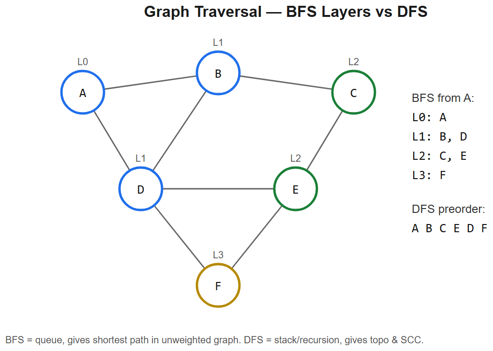

# 11 -- Graphs (BFS * DFS * Topological Sort * Union-Find * Shortest Path)



## The 4 fundamental graph algorithms
1. **BFS** -- shortest path in unweighted graph (level by level)
2. **DFS** -- connectivity, cycle detection, topological sort
3. **Union-Find (DSU)** -- incremental connectivity, MST (Kruskal)
4. **Dijkstra** -- shortest path with non-negative weights

### Master template -- BFS
```python
from collections import deque
def bfs(start, graph):
    seen = {start}
    dist = {start: 0}
    q = deque([start])
    while q:
        u = q.popleft()
        for v in graph[u]:
            if v not in seen:
                seen.add(v)
                dist[v] = dist[u] + 1
                q.append(v)
    return dist
```

### Master template -- DFS (iterative)
```python
def dfs(start, graph):
    stack, seen = [start], {start}
    while stack:
        u = stack.pop()
        for v in graph[u]:
            if v not in seen:
                seen.add(v); stack.append(v)
```

### Master template -- Topological sort (Kahn's, BFS-based)
```python
from collections import defaultdict, deque
def topo_sort(n, edges):
    g = defaultdict(list); indeg = [0]*n
    for u, v in edges:
        g[u].append(v); indeg[v] += 1
    q = deque([i for i in range(n) if indeg[i] == 0])
    order = []
    while q:
        u = q.popleft(); order.append(u)
        for v in g[u]:
            indeg[v] -= 1
            if indeg[v] == 0: q.append(v)
    return order if len(order) == n else []      # [] = cycle
```

### Master template -- Union-Find
```python
class DSU:
    def __init__(self, n):
        self.p = list(range(n)); self.r = [0]*n
    def find(self, x):
        while self.p[x] != x:
            self.p[x] = self.p[self.p[x]]        # path compression
            x = self.p[x]
        return x
    def union(self, a, b):
        ra, rb = self.find(a), self.find(b)
        if ra == rb: return False
        if self.r[ra] < self.r[rb]: ra, rb = rb, ra
        self.p[rb] = ra
        if self.r[ra] == self.r[rb]: self.r[ra] += 1
        return True
```
Time: nearly O(1) per op (inverse Ackermann).

### Master template -- Dijkstra
```python
import heapq
def dijkstra(start, graph):                      # graph[u] = list of (v, weight)
    dist = {start: 0}
    h = [(0, start)]
    while h:
        d, u = heapq.heappop(h)
        if d > dist[u]: continue                  # stale entry
        for v, w in graph[u]:
            nd = d + w
            if nd < dist.get(v, float('inf')):
                dist[v] = nd
                heapq.heappush(h, (nd, v))
    return dist
```
Time: O((V+E) log V). Doesn't work with negative weights (use Bellman-Ford for those).

---

## Variation 11.1 -- Number of Islands -- LC 200 (DFS on grid)
**Change**: grid as implicit graph; DFS marks visited.
```python
def numIslands(grid):
    if not grid: return 0
    rows, cols = len(grid), len(grid[0])
    count = 0
    def dfs(r, c):
        if r<0 or r>=rows or c<0 or c>=cols or grid[r][c] != '1': return
        grid[r][c] = '0'
        for dr, dc in [(-1,0),(1,0),(0,-1),(0,1)]:
            dfs(r+dr, c+dc)
    for r in range(rows):
        for c in range(cols):
            if grid[r][c] == '1':
                count += 1; dfs(r, c)
    return count
```

## Variation 11.2 -- Clone Graph -- LC 133
**Change**: DFS with `old -> new` map to handle cycles.
```python
def cloneGraph(node):
    if not node: return None
    mapping = {}
    def dfs(u):
        if u in mapping: return mapping[u]
        copy = Node(u.val)
        mapping[u] = copy
        for n in u.neighbors:
            copy.neighbors.append(dfs(n))
        return copy
    return dfs(node)
```

## Variation 11.3 -- Course Schedule (cycle detection) -- LC 207
**Change**: pure Kahn's topological sort; if not all nodes processed -> cycle.
```python
def canFinish(n, prereqs):
    g, indeg = defaultdict(list), [0]*n
    for a, b in prereqs:
        g[b].append(a); indeg[a] += 1
    q = deque([i for i in range(n) if indeg[i] == 0])
    done = 0
    while q:
        u = q.popleft(); done += 1
        for v in g[u]:
            indeg[v] -= 1
            if indeg[v] == 0: q.append(v)
    return done == n
```
**This is exactly AIAAS DAG validation.**

## Variation 11.4 -- Pacific Atlantic Water Flow -- LC 417
**Change**: **reverse BFS/DFS** from each ocean's borders, find intersection.
```python
def pacificAtlantic(heights):
    if not heights: return []
    m, n = len(heights), len(heights[0])
    pac, atl = set(), set()
    def dfs(r, c, seen):
        seen.add((r, c))
        for dr, dc in [(-1,0),(1,0),(0,-1),(0,1)]:
            nr, nc = r+dr, c+dc
            if 0<=nr<m and 0<=nc<n and (nr,nc) not in seen and heights[nr][nc] >= heights[r][c]:
                dfs(nr, nc, seen)
    for r in range(m):
        dfs(r, 0, pac); dfs(r, n-1, atl)
    for c in range(n):
        dfs(0, c, pac); dfs(m-1, c, atl)
    return [[r,c] for (r,c) in pac & atl]
```
**Logic**: instead of "does this cell reach both oceans?", ask "which cells does each ocean reach by going *upward* in elevation?" -- much cleaner.

## Variation 11.5 -- Number of Connected Components -- LC 323 (UNION-FIND)
**Change**: classic DSU usage.
```python
def countComponents(n, edges):
    dsu = DSU(n)
    components = n
    for a, b in edges:
        if dsu.union(a, b): components -= 1
    return components
```

## Variation 11.6 -- Redundant Connection -- LC 684 (UNION-FIND)
**Change**: process edges in order; first edge whose endpoints are already connected is the redundant one.
```python
def findRedundantConnection(edges):
    dsu = DSU(len(edges) + 1)
    for a, b in edges:
        if not dsu.union(a, b):
            return [a, b]
```

## Variation 11.7 -- Word Ladder -- LC 127 (BFS shortest path)
**Change**: BFS where neighbors = words differing by one char. Speedup: bucket by pattern `h*t`, `*ot`.
```python
def ladderLength(beginWord, endWord, wordList):
    wordSet = set(wordList)
    if endWord not in wordSet: return 0
    q = deque([(beginWord, 1)])
    while q:
        w, d = q.popleft()
        if w == endWord: return d
        for i in range(len(w)):
            for c in "abcdefghijklmnopqrstuvwxyz":
                nxt = w[:i] + c + w[i+1:]
                if nxt in wordSet:
                    wordSet.remove(nxt)              # mark visited
                    q.append((nxt, d + 1))
    return 0
```

## Variation 11.8 -- Network Delay Time -- LC 743 (DIJKSTRA)
**Change**: standard Dijkstra; answer = max over computed distances.
```python
def networkDelayTime(times, n, k):
    g = defaultdict(list)
    for u, v, w in times: g[u].append((v, w))
    dist = {}
    h = [(0, k)]
    while h:
        d, u = heapq.heappop(h)
        if u in dist: continue
        dist[u] = d
        for v, w in g[u]:
            if v not in dist:
                heapq.heappush(h, (d + w, v))
    return max(dist.values()) if len(dist) == n else -1
```

## Variation 11.9 -- Cheapest Flights Within K Stops -- LC 787 (BELLMAN-FORD)
**Change**: standard Dijkstra fails because we need stop limit. Use **Bellman-Ford** -- relax edges K+1 times.
```python
def findCheapestPrice(n, flights, src, dst, k):
    cost = [float('inf')] * n
    cost[src] = 0
    for _ in range(k + 1):
        snap = cost[:]
        for u, v, w in flights:
            if snap[u] + w < cost[v]:
                cost[v] = snap[u] + w
    return cost[dst] if cost[dst] != float('inf') else -1
```
**Why snapshot**: prevents using an edge multiple times in one round.

## Variation 11.10 -- Alien Dictionary -- LC 269 (HARD -- TOPO SORT FROM EQUALITIES)
**Change**: derive edges from comparing adjacent words; then standard topo sort.
```python
def alienOrder(words):
    g = defaultdict(set)
    indeg = {c: 0 for w in words for c in w}
    for w1, w2 in zip(words, words[1:]):
        for c1, c2 in zip(w1, w2):
            if c1 != c2:
                if c2 not in g[c1]:
                    g[c1].add(c2); indeg[c2] += 1
                break
        else:
            if len(w1) > len(w2): return ""        # invalid: prefix issue
    q = deque([c for c in indeg if indeg[c] == 0])
    order = []
    while q:
        c = q.popleft(); order.append(c)
        for n in g[c]:
            indeg[n] -= 1
            if indeg[n] == 0: q.append(n)
    return ''.join(order) if len(order) == len(indeg) else ""
```

---

## Summary
| Problem | Algorithm | What changes |
|---------|-----------|--------------|
| Num Islands | DFS on grid | 4-direction recursion |
| Clone Graph | DFS + map | old -> new dict |
| Course Schedule | Topo sort | Kahn's; check len == n |
| Pacific Atlantic | Reverse DFS from borders | Intersect two sets |
| Connected Components | Union-Find | union edges, count |
| Redundant Connection | Union-Find | First failing union |
| Word Ladder | BFS (unweighted) | Generate neighbors by char swap |
| Network Delay | Dijkstra | Max of dist values |
| Cheap Flights K stops | Bellman-Ford | K+1 relaxations, snapshot |
| Alien Dict | Topo sort | Derive edges from word pairs |

## Algorithm picker
```
Unweighted shortest path?       -> BFS
Weighted, non-negative?         -> Dijkstra
Weighted, can have negative?    -> Bellman-Ford
Order with prerequisites?       -> Topological sort (Kahn or DFS)
Dynamic connectivity?           -> Union-Find
MST?                             -> Kruskal (Union-Find) or Prim (heap)
All-pairs shortest?              -> Floyd-Warshall O(V^3)
Strongly connected components?  -> Tarjan / Kosaraju
```

## Common graph representations
| Representation | Space | Edge check | Iterate neighbors | Use |
|----------------|-------|------------|-------------------|-----|
| Adjacency list | O(V+E) | O(deg) | O(deg) | Default for sparse |
| Adjacency matrix | O(V^2) | O(1) | O(V) | Dense graphs / small V |
| Edge list | O(E) | O(E) | O(E) | Kruskal, Bellman-Ford |

## Interview tells
- "Shortest path" in unweighted -> BFS
- "Shortest / cheapest" with weights -> Dijkstra
- "Topological / order with deps" -> topo sort
- "Detect cycle" -> DFS coloring or Kahn's
- "Connected components" -> DFS / BFS / DSU
- "Add edges over time, query connectivity" -> DSU
- "Negative edges or limited steps" -> Bellman-Ford
- "Grid problem" -> BFS/DFS with 4-direction (or 8)


---

## Deep dive -- graph algorithm cheat matrix

| Task | Best fit | Complexity |
|------|----------|-----------|
| Shortest path, unweighted | BFS | O(V+E) |
| Shortest path, non-negative weights | Dijkstra (heap) | O((V+E) log V) |
| Shortest path, negative weights | Bellman-Ford | O(V*E) |
| All-pairs shortest path | Floyd-Warshall | O(V^3) |
| Topological order (DAG) | DFS post-order reverse / Kahn | O(V+E) |
| Strongly Connected Components | Kosaraju / Tarjan | O(V+E) |
| Minimum Spanning Tree | Kruskal (DSU) / Prim (heap) | O(E log E) |
| Connected components | Union-Find or BFS/DFS | ~O(V+E) |
| Cycle detection (undirected) | DFS + parent / Union-Find | O(V+E) |
| Cycle detection (directed)   | DFS w/ 3-colour | O(V+E) |
| Bipartite check | BFS 2-colour | O(V+E) |

**Representation:** adjacency list for sparse, matrix for dense (V <= ~500).

##  Pitfalls

| Pitfall | Fix |
|--------|-----|
| Forgetting visited set on cyclic graphs | Always track visited |
| BFS using list and pop(0) | Use `deque` |
| Dijkstra with negative weights | Switch to Bellman-Ford |
| Re-pushing stale entries to heap | Skip when popped with stale distance |
| Recursive DFS overflow on V=104 | Iterative stack |
| Topo sort returning fewer than V nodes | Cycle exists |

## More problems

### BFS -- Shortest path in grid (LC 1091)
```python
from collections import deque
def shortestPathBinaryMatrix(grid):
    n = len(grid)
    if grid[0][0] or grid[-1][-1]: return -1
    q = deque([(0,0,1)]); grid[0][0] = 1
    DIRS = [(-1,-1),(-1,0),(-1,1),(0,-1),(0,1),(1,-1),(1,0),(1,1)]
    while q:
        r,c,d = q.popleft()
        if (r,c)==(n-1,n-1): return d
        for dr,dc in DIRS:
            nr,nc = r+dr, c+dc
            if 0<=nr<n and 0<=nc<n and grid[nr][nc]==0:
                grid[nr][nc]=1; q.append((nr,nc,d+1))
    return -1
```

### Dijkstra -- Network Delay Time (LC 743)
```python
import heapq
def networkDelayTime(times, n, k):
    g = [[] for _ in range(n+1)]
    for u,v,w in times: g[u].append((v,w))
    dist = [float('inf')]*(n+1); dist[k] = 0
    h = [(0,k)]
    while h:
        d, u = heapq.heappop(h)
        if d > dist[u]: continue
        for v,w in g[u]:
            nd = d + w
            if nd < dist[v]:
                dist[v] = nd; heapq.heappush(h, (nd, v))
    ans = max(dist[1:])
    return -1 if ans == float('inf') else ans
```

### Topological sort -- Course Schedule II (LC 210)
Kahn's algorithm with in-degrees.

### Union-Find -- Number of Connected Components
```python
class DSU:
    def __init__(self, n):
        self.p = list(range(n)); self.r = [0]*n
    def find(self, x):
        while self.p[x] != x:
            self.p[x] = self.p[self.p[x]]; x = self.p[x]
        return x
    def union(self, a, b):
        ra, rb = self.find(a), self.find(b)
        if ra == rb: return False
        if self.r[ra] < self.r[rb]: ra, rb = rb, ra
        self.p[rb] = ra
        if self.r[ra] == self.r[rb]: self.r[ra] += 1
        return True
```

### Word Ladder -- LC 127 (BFS over implicit graph)
### Pacific Atlantic Water Flow -- LC 417 (multi-source BFS)
### Alien Dictionary -- LC 269 (topo on inferred edges)

## Interview questions

1. **Why does Dijkstra fail on negative edges?** A node popped with distance d may later be reachable via a lower-cost path through a negative edge.
2. **Topo sort on a cyclic graph?** No valid order; Kahn ends with fewer than V nodes, DFS detects via grey (in-progress) nodes.
3. **BFS vs Dijkstra on unit weights?** Same answer; BFS is simpler & faster (no heap).
4. **Union-Find amortised complexity?** ~O(alpha(n)) ~= O(1) with both path compression + union-by-rank.
5. **When matrix > list?** Dense graph, V small, O(1) edge query.
6. **A* vs Dijkstra?** A* is Dijkstra + heuristic; equally optimal when heuristic is admissible & consistent.

## References
- CLRS Ch. 22-26
- "Competitive Programmer's Handbook" -- Antti Laaksonen -- chapters 11-15
