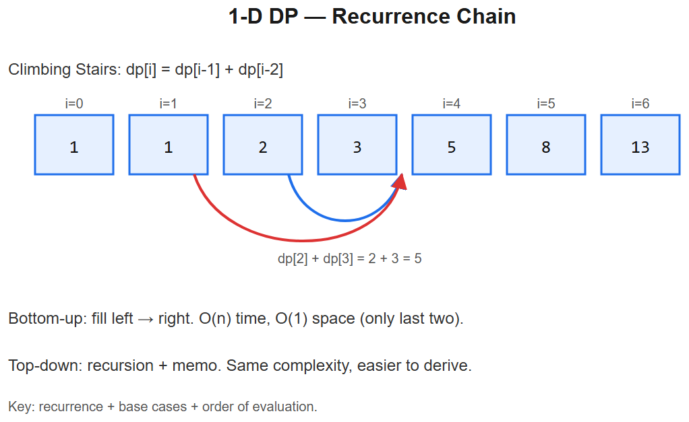

# 12 -- Dynamic Programming (1D)



## Pattern: Build `dp[i]` from already-computed `dp[j]` (j < i)
**Recipe**:
1. **Define state**: what does `dp[i]` represent?
2. **Recurrence**: `dp[i] = f(dp[i-1], dp[i-2], ...)`
3. **Base case**: `dp[0]`, maybe `dp[1]`
4. **Order**: bottom-up loop
5. **Space**: usually compressible to O(1) if you only use last 1-2 dp values

### Master template -- Fibonacci-style
```python
def fib(n):
    if n < 2: return n
    a, b = 0, 1
    for _ in range(n - 1):
        a, b = b, a + b
    return b
```
**Space optimization**: two rolling variables instead of full array. This pattern recurs everywhere.

---

## Variation 12.1 -- Climbing Stairs -- LC 70
**Change**: each step is 1 or 2 stairs.
```python
def climbStairs(n):
    if n <= 2: return n
    a, b = 1, 2
    for _ in range(n - 2):
        a, b = b, a + b
    return b
```
**Recurrence**: `dp[i] = dp[i-1] + dp[i-2]` -- exactly Fibonacci.

## Variation 12.2 -- House Robber -- LC 198
**Change**: choose rob or skip at each house; can't rob adjacent.
```python
def rob(nums):
    prev2, prev1 = 0, 0
    for x in nums:
        prev2, prev1 = prev1, max(prev1, prev2 + x)
    return prev1
```
**State**: `dp[i] = max loot using houses 0..i`.
**Recurrence**: `dp[i] = max(dp[i-1], dp[i-2] + nums[i])`.

## Variation 12.3 -- House Robber II (circular) -- LC 213
**Change**: houses in a circle -> can't rob both first and last. Run rob() twice, excluding one.
```python
def rob_circular(nums):
    if len(nums) == 1: return nums[0]
    def rob(arr):
        a = b = 0
        for x in arr:
            a, b = b, max(b, a + x)
        return b
    return max(rob(nums[:-1]), rob(nums[1:]))
```

## Variation 12.4 -- Coin Change -- LC 322
**Change**: 2 dimensions become 1 -- `dp[a] = min coins to make amount a`.
```python
def coinChange(coins, amount):
    dp = [float('inf')] * (amount + 1)
    dp[0] = 0
    for a in range(1, amount + 1):
        for c in coins:
            if c <= a:
                dp[a] = min(dp[a], dp[a - c] + 1)
    return dp[amount] if dp[amount] != float('inf') else -1
```
**Why O(amount x len(coins))**: for each amount, try each coin.

## Variation 12.5 -- Longest Increasing Subsequence -- LC 300
**Change**: `dp[i] = LIS ending at i`. O(n^2).
```python
def lengthOfLIS(nums):
    dp = [1] * len(nums)
    for i in range(len(nums)):
        for j in range(i):
            if nums[j] < nums[i]:
                dp[i] = max(dp[i], dp[j] + 1)
    return max(dp)
```

### O(n log n) optimization -- patience sorting
```python
import bisect
def lengthOfLIS_fast(nums):
    tails = []
    for x in nums:
        idx = bisect.bisect_left(tails, x)
        if idx == len(tails):
            tails.append(x)
        else:
            tails[idx] = x
    return len(tails)
```
`tails[i]` = smallest tail of any increasing subseq of length i+1. `bisect_left` finds where x fits.

## Variation 12.6 -- Word Break -- LC 139
**Change**: `dp[i] = True if s[:i] can be segmented`.
```python
def wordBreak(s, wordDict):
    words = set(wordDict)
    dp = [False] * (len(s) + 1)
    dp[0] = True
    for i in range(1, len(s) + 1):
        for j in range(i):
            if dp[j] and s[j:i] in words:
                dp[i] = True
                break
    return dp[len(s)]
```

## Variation 12.7 -- Maximum Subarray (Kadane's) -- LC 53
**Change**: `dp[i] = max subarray ending at i`. Either start fresh at i, or extend.
```python
def maxSubArray(nums):
    cur_max = best = nums[0]
    for x in nums[1:]:
        cur_max = max(x, cur_max + x)
        best = max(best, cur_max)
    return best
```
**Recurrence**: `dp[i] = max(nums[i], dp[i-1] + nums[i])` -- start fresh OR extend.

## Variation 12.8 -- Decode Ways -- LC 91
**Change**: state = number of decodings up to i. Two transitions: 1-digit and 2-digit.
```python
def numDecodings(s):
    if not s or s[0] == '0': return 0
    n = len(s)
    prev2, prev1 = 1, 1                       # dp[0]=1, dp[1]=1
    for i in range(2, n + 1):
        one = int(s[i-1])
        two = int(s[i-2:i])
        cur = 0
        if 1 <= one <= 9: cur += prev1
        if 10 <= two <= 26: cur += prev2
        prev2, prev1 = prev1, cur
    return prev1
```

---

## Summary
| Problem | State | Recurrence |
|---------|-------|------------|
| Fib / Climbing | `dp[i]` = ways to reach step i | `dp[i-1] + dp[i-2]` |
| House Robber | `dp[i]` = max loot using 0..i | `max(dp[i-1], dp[i-2]+v)` |
| Coin Change | `dp[a]` = min coins for amount a | `min(dp[a-c]+1)` over coins |
| LIS | `dp[i]` = LIS ending at i | `max(dp[j]+1) for j<i with arr[j]<arr[i]` |
| Word Break | `dp[i]` = can segment s[:i] | `any(dp[j] and s[j:i] in words)` |
| Kadane | `dp[i]` = max ending at i | `max(nums[i], dp[i-1]+nums[i])` |
| Decode Ways | `dp[i]` = ways to decode s[:i] | `dp[i-1] (if 1-digit) + dp[i-2] (if 2-digit)` |

## DP recipe -- what to do in interview
1. **Recognize**: "count ways", "min/max", "is reachable", "is feasible"
2. **Write recursion first** (with `@functools.cache`) -- it's brute force + memo
3. **Convert to iteration** if asked / for clarity
4. **Optimize space** to O(1) or O(k) if you only need last k values
5. **Trace one example** by hand to validate base case

```python
# Recursion + memo (often easier to derive)
from functools import cache
@cache
def solve(i):
    if i < 0: return base
    return f(solve(i-1), solve(i-2), ...)
```

## Decision tree: which 1D-DP pattern?
```
Just count ways / paths?           -> Fib-style (dp[i] = sum of previous states)
Min/max value to reach state?      -> take min/max of transitions + cost
Boolean reachability?              -> `any(prev states)` with valid transition
Need actual sequence (not just len)? -> Track parent pointers / reconstruct
```

## Common space optimization
- Only `dp[i-1]` used -> 1 variable
- `dp[i-1], dp[i-2]` -> 2 variables (Fib/Robber)
- Whole row needed -> keep last row only (becomes 2D-DP's optimization)

## Interview tells
- "How many ways..." -> DP (count)
- "Min/max cost / steps to reach..." -> DP
- "Can you partition / segment / make ..." -> DP boolean
- "Subarray / substring with property" + non-contiguous -> DP
- Repeated subproblems in your brute force -> DP


---

## Deep dive -- recognising DP

Three signs you're looking at DP:
1. Optimal substructure (answer to size n depends on answers to smaller sizes)
2. Overlapping subproblems (naive recursion recomputes)
3. Decision at each step (take / skip / pick best)

**Top-down (memoised recursion) vs bottom-up (table):**
- Top-down is closer to the recurrence; easier to derive.
- Bottom-up avoids recursion stack, allows space optimisation by dropping older rows.

Identify the *state*: what minimal info captures "where I am" so the optimal future is determined?

##  Pitfalls

| Pitfall | Fix |
|--------|-----|
| Wrong base case | Derive from "smallest meaningful subproblem" |
| Forgetting to clamp negative indices | Guard in recurrence or pad table with offset |
| Mutable default arg in memoised recursion | `@functools.cache` is cleaner |
| Wrong order of fills | Topological order on the dependency DAG |
| Counting paths vs values | Different recurrence; read problem carefully |
| Space O(n^2) when O(n) suffices | Rolling array |

## More problems

### Climbing Stairs -- LC 70
```python
def climbStairs(n):
    a, b = 1, 1
    for _ in range(n): a, b = b, a + b
    return a
```

### House Robber -- LC 198
```python
def rob(nums):
    take = skip = 0
    for x in nums:
        take, skip = skip + x, max(take, skip)
    return max(take, skip)
```

### House Robber II -- LC 213
Run rob on `nums[:-1]` and `nums[1:]`, return max -- first and last can't both be picked.

### Coin Change -- LC 322
```python
def coinChange(coins, amount):
    dp = [0] + [float('inf')]*amount
    for a in range(1, amount+1):
        for c in coins:
            if c <= a: dp[a] = min(dp[a], dp[a-c] + 1)
    return -1 if dp[amount] == float('inf') else dp[amount]
```

### Longest Increasing Subsequence -- LC 300
Patience-sorting O(n log n):
```python
from bisect import bisect_left
def lengthOfLIS(nums):
    tails = []
    for x in nums:
        i = bisect_left(tails, x)
        if i == len(tails): tails.append(x)
        else: tails[i] = x
    return len(tails)
```

### Word Break -- LC 139
```python
def wordBreak(s, wordDict):
    words = set(wordDict)
    dp = [True] + [False]*len(s)
    for i in range(1, len(s)+1):
        for j in range(i):
            if dp[j] and s[j:i] in words:
                dp[i] = True; break
    return dp[-1]
```

### Maximum Subarray (Kadane) -- LC 53
Running prefix; reset to current when prefix < 0.

## Interview questions

1. **Memoisation vs tabulation differences?** Same complexity; tab avoids recursion overhead but requires fill-order analysis.
2. **LIS -- why does the patience-sort tails array work?** `tails[i]` = smallest tail of any increasing subseq of length i+1; binary-search lets us extend or replace in O(log n).
3. **Coin change -- why bottom-up?** Smaller amounts are dependencies; build up.
4. **When DP doesn't apply?** No overlapping subproblems (-> divide & conquer) or no optimal substructure (-> search).
5. **State representation example?** Robber: `(i, last_taken_bool)`; with rolling vars we collapse to two scalars.

## References
- "DP for Dummies" -- Bill Cook, MIT 6.006
- *Algorithms* (Cormen et al.) Ch. 15
