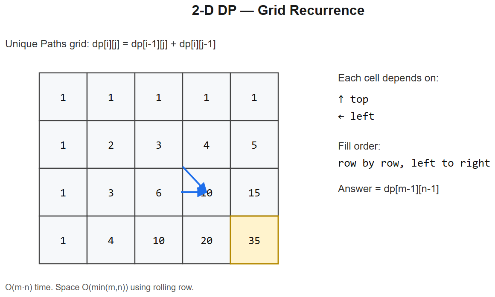

# 13 -- Dynamic Programming (2D)



## Pattern: `dp[i][j]` indexed by two dimensions
Common axes:
- Two strings -> indices into each
- Grid -> row, col
- One array + capacity / budget -> index, budget
- Two arrays / players -> index in each

### Master template -- grid path count
```python
def uniquePaths(m, n):
    dp = [[1] * n for _ in range(m)]
    for i in range(1, m):
        for j in range(1, n):
            dp[i][j] = dp[i-1][j] + dp[i][j-1]
    return dp[m-1][n-1]
```
**Recurrence**: `dp[i][j]` = paths from (0,0) to (i,j). Either came from above or from left.

### Mental model -- grid DP
```
1 1 1 1
1 2 3 4
1 3 6 10           # dp[i][j] = dp[i-1][j] + dp[i][j-1]
```

---

## Variation 13.1 -- Longest Common Subsequence -- LC 1143
**Change**: 2 strings; `dp[i][j]` = LCS of `s[:i]` and `t[:j]`.
```python
def longestCommonSubsequence(s, t):
    m, n = len(s), len(t)
    dp = [[0]*(n+1) for _ in range(m+1)]
    for i in range(1, m+1):
        for j in range(1, n+1):
            if s[i-1] == t[j-1]:
                dp[i][j] = dp[i-1][j-1] + 1            # match: extend diagonal
            else:
                dp[i][j] = max(dp[i-1][j], dp[i][j-1]) # mismatch: drop one side
    return dp[m][n]
```
**Diagram**:
```
      ''  a  c  e
  ''  0   0  0  0
  a   0   1  1  1
  b   0   1  1  1
  c   0   1  2  2
  d   0   1  2  2
  e   0   1  2  3      <- answer
```

## Variation 13.2 -- Edit Distance -- LC 72
**Change**: 3 transitions -- insert, delete, replace.
```python
def minDistance(s, t):
    m, n = len(s), len(t)
    dp = [[0]*(n+1) for _ in range(m+1)]
    for i in range(m+1): dp[i][0] = i
    for j in range(n+1): dp[0][j] = j
    for i in range(1, m+1):
        for j in range(1, n+1):
            if s[i-1] == t[j-1]:
                dp[i][j] = dp[i-1][j-1]
            else:
                dp[i][j] = 1 + min(
                    dp[i-1][j],       # delete from s
                    dp[i][j-1],       # insert into s
                    dp[i-1][j-1],     # replace
                )
    return dp[m][n]
```
**Logic**: each operation costs 1; on match, no cost.

## Variation 13.3 -- 0/1 Knapsack
**Change**: `dp[i][w]` = max value using first i items, capacity w.
```python
def knapsack(weights, values, W):
    n = len(weights)
    dp = [[0]*(W+1) for _ in range(n+1)]
    for i in range(1, n+1):
        for w in range(W+1):
            dp[i][w] = dp[i-1][w]                         # skip item i
            if weights[i-1] <= w:
                dp[i][w] = max(dp[i][w],
                               dp[i-1][w-weights[i-1]] + values[i-1])
    return dp[n][W]
```
**Space optimization**: only `dp[i-1]` row used -> 1D array, iterate `w` from high to low.

## Variation 13.4 -- Partition Equal Subset Sum -- LC 416
**Change**: 0/1 knapsack with target = sum/2. Boolean DP.
```python
def canPartition(nums):
    total = sum(nums)
    if total % 2: return False
    target = total // 2
    dp = [False] * (target + 1)
    dp[0] = True
    for x in nums:
        for w in range(target, x - 1, -1):                # reverse: 0/1 knapsack
            dp[w] = dp[w] or dp[w - x]
    return dp[target]
```

## Variation 13.5 -- Unique Paths II (obstacles) -- LC 63
**Change**: obstacles set their cell to 0.
```python
def uniquePathsWithObstacles(grid):
    m, n = len(grid), len(grid[0])
    if grid[0][0] == 1: return 0
    dp = [[0]*n for _ in range(m)]
    dp[0][0] = 1
    for i in range(m):
        for j in range(n):
            if grid[i][j] == 1:
                dp[i][j] = 0
            elif i > 0 or j > 0:
                dp[i][j] = (dp[i-1][j] if i > 0 else 0) + (dp[i][j-1] if j > 0 else 0)
    return dp[m-1][n-1]
```

## Variation 13.6 -- Longest Palindromic Substring -- LC 5 (2D-DP or expand-around-center)
**Change**: `dp[i][j]` = True if `s[i:j+1]` is a palindrome.
```python
def longestPalindrome(s):
    n = len(s)
    dp = [[False]*n for _ in range(n)]
    start, max_len = 0, 1
    for i in range(n): dp[i][i] = True
    for length in range(2, n+1):
        for i in range(n - length + 1):
            j = i + length - 1
            if s[i] == s[j] and (length == 2 or dp[i+1][j-1]):
                dp[i][j] = True
                if length > max_len:
                    start, max_len = i, length
    return s[start:start + max_len]
```
**Alt**: expand-around-center in O(n^2) without DP table; usually cleaner.

## Variation 13.7 -- Burst Balloons -- LC 312 (HARD -- interval DP)
**Change**: `dp[i][j]` = max coins from bursting balloons in interval `(i, j)` exclusive. Iterate by interval length.
```python
def maxCoins(nums):
    nums = [1] + nums + [1]
    n = len(nums)
    dp = [[0]*n for _ in range(n)]
    for length in range(2, n):                            # interval size
        for i in range(n - length):
            j = i + length
            for k in range(i+1, j):                       # k = last balloon to burst in (i, j)
                dp[i][j] = max(dp[i][j],
                               nums[i]*nums[k]*nums[j] + dp[i][k] + dp[k][j])
    return dp[0][n-1]
```
**Trick**: think about which balloon is burst *last* (not first) in each interval -- its neighbors are then fixed at `nums[i]` and `nums[j]`.

---

## Summary
| Problem | dp[i][j] meaning | Recurrence shape |
|---------|-------------------|-------------------|
| Unique Paths | paths to (i,j) | `dp[i-1][j] + dp[i][j-1]` |
| LCS | LCS of s[:i], t[:j] | diagonal+1 or max of two |
| Edit Distance | min ops s[:i]->t[:j] | min of 3 transitions |
| Knapsack | max value, i items, w cap | take or skip |
| Partition Equal Sum | bool: reachable sum w | or of take/skip |
| Unique Paths II | paths with obstacles | dp[i-1][j] + dp[i][j-1] or 0 |
| Longest Palindrome | s[i..j] palindrome? | s[i]==s[j] and dp[i+1][j-1] |
| Burst Balloons | max coins in (i,j) | iterate "last burst" k |

## Iteration order matters
- **Knapsack 1D space-optimized**: iterate `w` from high to low (otherwise you'd reuse the same item)
- **Interval DP** (Burst Balloons, Matrix Chain Mult): iterate by **length**, not by `i` directly
- **String DP**: usually iterate i 1->m, j 1->n

## Space optimization patterns
- `dp[i][j]` depends only on `dp[i-1][...]` -> keep two rows, swap
- 1D knapsack: reuse single row, iterate w backwards
- Some DPs need full table (e.g. LCS reconstruction) -- accept O(mn) space

## Interview tells
- "Two strings" -> 2D DP, indices into each
- "Grid with cost/obstacles" -> 2D DP on grid
- "Subset/take-skip with capacity" -> 0/1 knapsack
- "Substring properties" -> length-by-length 2D DP
- "Best way to combine / partition" -> interval DP (iterate by interval length)


---

## Deep dive -- when state is two-dimensional

Common signals: two interacting sequences (LCS, edit distance), two endpoints (palindrome ranges), two coordinates (grid path), or one sequence + an integer budget (knapsack).

**Standard recurrence shapes:**
- LCS: `dp[i][j] = dp[i-1][j-1] + 1` if match, else `max(dp[i-1][j], dp[i][j-1])`
- Edit distance: `min(insert, delete, replace)` + 1
- Knapsack: `dp[i][w] = max(dp[i-1][w], dp[i-1][w-wi] + vi)`
- Palindrome: `dp[i][j] = dp[i+1][j-1] if s[i]==s[j] else False`

**Space optimisation:** if `dp[i][.]` depends only on `dp[i-1][.]`, keep two rows (or one row + careful order).

##  Pitfalls

| Pitfall | Fix |
|--------|-----|
| Mixing up indices (i for s1 vs s2) | Comment dimensions explicitly |
| Filling in wrong order with rolling array | When updating dp[w] in-place for 0/1 knapsack, iterate w from high to low |
| Forgetting base row/column (empty string) | Initialise dp[0][.] and dp[.][0] |
| Confusing subseq vs substring | Substring must be contiguous; reset on mismatch |
| Edit-distance with extra ops (transpose) | Use Damerau-Levenshtein variant |

## More problems

### Longest Common Subsequence -- LC 1143
```python
def longestCommonSubsequence(a, b):
    m, n = len(a), len(b)
    dp = [[0]*(n+1) for _ in range(m+1)]
    for i in range(1, m+1):
        for j in range(1, n+1):
            dp[i][j] = dp[i-1][j-1]+1 if a[i-1]==b[j-1] else max(dp[i-1][j], dp[i][j-1])
    return dp[m][n]
```

### Edit Distance -- LC 72
```python
def minDistance(a, b):
    m, n = len(a), len(b)
    dp = [[0]*(n+1) for _ in range(m+1)]
    for i in range(m+1): dp[i][0] = i
    for j in range(n+1): dp[0][j] = j
    for i in range(1, m+1):
        for j in range(1, n+1):
            if a[i-1] == b[j-1]:
                dp[i][j] = dp[i-1][j-1]
            else:
                dp[i][j] = 1 + min(dp[i-1][j], dp[i][j-1], dp[i-1][j-1])
    return dp[m][n]
```

### Unique Paths -- LC 62
`dp[i][j] = dp[i-1][j] + dp[i][j-1]`; or closed form `C(m+n-2, m-1)`.

### 0/1 Knapsack
```python
def knapsack(values, weights, W):
    dp = [0]*(W+1)
    for v, w in zip(values, weights):
        for cap in range(W, w-1, -1):       # backward to enforce 0/1
            dp[cap] = max(dp[cap], dp[cap-w] + v)
    return dp[W]
```

### Longest Palindromic Substring -- LC 5
Expand around centers (O(n^2)) or DP on `dp[i][j]`.

### Distinct Subsequences -- LC 115 (Hard)

### Interleaving String -- LC 97

## Interview questions

1. **0/1 vs unbounded knapsack -- loop direction difference?** Backward for 0/1 (each item once), forward for unbounded.
2. **LCS vs Edit Distance -- relationship?** EditDistance = m + n - 2*LCS *only* when ops are (insert, delete); with replace it's a different recurrence.
3. **Why does palindrome DP go from inside out?** `dp[i][j]` depends on `dp[i+1][j-1]`, so fill by increasing length.
4. **Memory optimisation example?** LCS: keep two rows. Knapsack: one row, backward.
5. **Where does DP fail?** When state space is exponential (e.g., TSP for large n).

## References
- Erik Demaine MIT 6.046 -- DP lectures
- "Dynamic Programming Patterns" -- aatalyk on LeetCode
