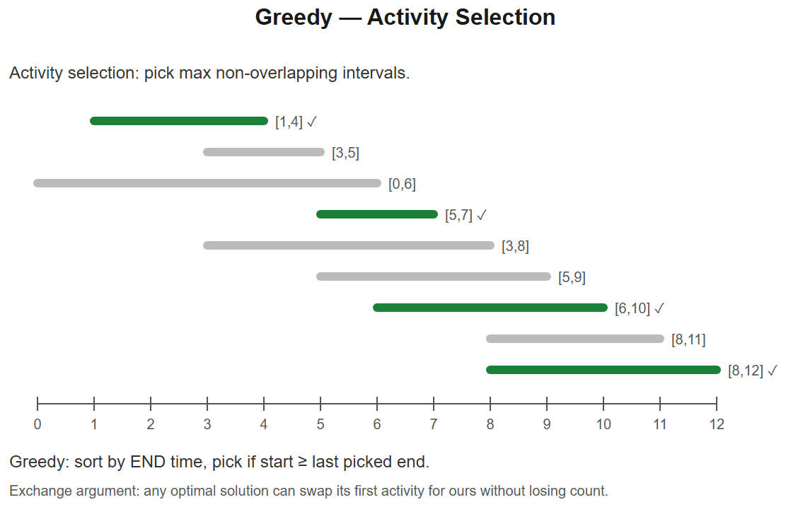

# 14 -- Greedy



## Pattern: Make the locally optimal choice each step
Works when **the local optimum is provably part of a global optimum**. Often the hardest part is proving (or recognizing) that greedy works.

### General template
```python
def greedy(items):
    items.sort(key=...)           # often sort first
    result = ...
    for item in items:
        if local_choice_good(item, state):
            commit(item, state)
    return result
```

---

## Variation 14.1 -- Jump Game -- LC 55
**Change**: track furthest reachable index.
```python
def canJump(nums):
    reach = 0
    for i, jump in enumerate(nums):
        if i > reach: return False
        reach = max(reach, i + jump)
    return True
```
**Why greedy works**: extending reach as we go can't hurt -- any reachable index is reachable from the furthest reach so far.

## Variation 14.2 -- Jump Game II (min jumps) -- LC 45
**Change**: count "explosions" -- when current reach is exhausted, take the best next reach as one more jump.
```python
def jump(nums):
    jumps = cur_end = farthest = 0
    for i in range(len(nums) - 1):
        farthest = max(farthest, i + nums[i])
        if i == cur_end:
            jumps += 1
            cur_end = farthest
    return jumps
```
**Diagram**:
```
nums:  [2, 3, 1, 1, 4]
        ^     ^     ^
       jumps=1   jumps=2 (reach end)
```

## Variation 14.3 -- Gas Station -- LC 134
**Change**: if total gas >= total cost, answer exists. Reset start whenever running deficit.
```python
def canCompleteCircuit(gas, cost):
    if sum(gas) < sum(cost): return -1
    tank = start = 0
    for i in range(len(gas)):
        tank += gas[i] - cost[i]
        if tank < 0:
            start = i + 1
            tank = 0
    return start
```
**Logic**: if you can't reach station `i+1` from `start`, you can't reach it from any earlier station either -> restart.

## Variation 14.4 -- Hand of Straights -- LC 846
**Change**: greedily form groups starting from the smallest available card.
```python
from collections import Counter
def isNStraightHand(hand, groupSize):
    if len(hand) % groupSize != 0: return False
    count = Counter(hand)
    for x in sorted(count):
        if count[x] > 0:
            need = count[x]
            for k in range(groupSize):
                if count[x + k] < need: return False
                count[x + k] -= need
    return True
```

## Variation 14.5 -- Maximum Subarray (Kadane) -- LC 53
**Change**: greedy decision at each index -- extend or restart.
```python
def maxSubArray(nums):
    cur = best = nums[0]
    for x in nums[1:]:
        cur = max(x, cur + x)
        best = max(best, cur)
    return best
```
Also fits DP framing -- many greedy algorithms are DPs with O(1) state.

## Variation 14.6 -- Partition Labels -- LC 763
**Change**: precompute last occurrence of each char; expand window until covers all chars seen.
```python
def partitionLabels(s):
    last = {c: i for i, c in enumerate(s)}
    result = []
    start = end = 0
    for i, c in enumerate(s):
        end = max(end, last[c])
        if i == end:                              # window closed
            result.append(end - start + 1)
            start = i + 1
    return result
```
**Diagram**:
```
s = "ababcbacadefegdehijhklij"
     [a----------a--a--a]            first partition (a's all in here)
                  [d----e--d--e]   next
                          [h--h]
                            [i--i]
                              [j--j]
```

---

## Summary
| Problem | Greedy choice | Why it works |
|---------|---------------|--------------|
| Jump Game | Max reach so far | Reachability is monotone |
| Jump Game II | Extend furthest, "jump" when reach exhausted | Each layer's best reach is unique |
| Gas Station | Reset start on deficit | Can't restart from any earlier station |
| Hand of Straights | Start group from smallest | The smallest must be a group start |
| Kadane | Extend or restart | dp[i] depends only on dp[i-1] |
| Partition Labels | Expand window to last-occurrence | Chars' boundaries are fixed |

## Greedy proof techniques (be ready to justify)
1. **Exchange argument**: assume an optimal solution differs from greedy -> swap -> contradiction
2. **Matroid theory**: when the problem has matroid structure, greedy is optimal (don't need to mention in interviews -- just be confident)
3. **Counterexample search**: if you can't find one, greedy is likely correct
4. **Intuition**: "any choice better than greedy here would worsen the rest"

## When greedy FAILS (be honest)
- Coin Change (general denominations) -- `[1, 3, 4]` for amount 6: greedy gives 4+1+1=3 coins, optimal is 3+3=2
- 0/1 Knapsack -- fractional knapsack is greedy, but the 0/1 version requires DP
- Longest Increasing Subsequence -- greedy gives wrong result, need DP or patience-sort

**If you're not sure greedy works**: write the DP first, get correct answer, then see if greedy gets the same -> only then propose greedy.

## Interview tells
- "Minimum / maximum cost" + obvious local-best heuristic -> try greedy first
- "Scheduling / intervals" -> sort by end time + greedy
- "Coin change" + standard denominations -> greedy
- "Partition into smallest k" -> sort + greedy
- "Furthest you can reach" -> maintain running max


---

## Deep dive -- when greedy is correct

Greedy is correct when:
- **Greedy choice property:** a locally optimal choice leads to a globally optimal solution.
- **Optimal substructure:** an optimal solution to the problem contains optimal solutions to its subproblems.

You prove correctness via:
1. **Exchange argument** -- show that any optimal solution can be transformed into the greedy one without worsening it.
2. **Matroid theory** -- when the problem fits a matroid, greedy by weight works (e.g., MST).
3. **Cut property** -- for MST, the lightest edge crossing any cut is in some MST.

If you can't construct an exchange argument, suspect DP.

##  Pitfalls

| Pitfall | Fix |
|--------|-----|
| Greedy on the wrong sort key | Try both: "by start", "by end", "by ratio" |
| Greedy works on examples but not in general | Look for a counterexample before coding |
| Ties not broken consistently | Add tiebreaker to sort |
| Greedy stuck because choice depended on future | Need DP / search |

## More problems

### Jump Game -- LC 55
```python
def canJump(nums):
    reach = 0
    for i, x in enumerate(nums):
        if i > reach: return False
        reach = max(reach, i + x)
    return True
```

### Jump Game II -- LC 45
BFS-like: track current furthest and steps.
```python
def jump(nums):
    jumps = end = farthest = 0
    for i in range(len(nums) - 1):
        farthest = max(farthest, i + nums[i])
        if i == end:
            jumps += 1; end = farthest
    return jumps
```

### Gas Station -- LC 134
```python
def canCompleteCircuit(gas, cost):
    if sum(gas) < sum(cost): return -1
    tank = start = 0
    for i in range(len(gas)):
        tank += gas[i] - cost[i]
        if tank < 0: start = i + 1; tank = 0
    return start
```

### Hand of Straights -- LC 846
Sort + Counter; for smallest available, greedily form a group.

### Task Scheduler -- LC 621 (heap-greedy)

### Partition Labels -- LC 763
Compute last index of each char; sweep, extend partition end.

### Minimum Number of Arrows -- LC 452
Sort by end; new arrow when start > current end.

## Interview questions

1. **Activity selection -- why sort by END and not start?** Earliest finishing leaves maximal room for the rest; exchange argument proves optimality.
2. **Greedy vs DP -- what's the difference?** Greedy commits a choice without revisiting; DP explores all relevant choices.
3. **Gas station -- why does the "reset to next" trick work?** If sum is non-negative, starting from the city right after the lowest cumulative deficit always works.
4. **Huffman coding -- why greedy?** Optimal prefix code has structure where two smallest weights are siblings (proved by swap argument).
5. **When greedy is approximate, not exact?** Set cover, TSP (greedy gives log n / 1.5 approximation).

## References
- CLRS Ch. 16 -- Greedy Algorithms
- Kleinberg & Tardos -- proofs via exchange arguments
