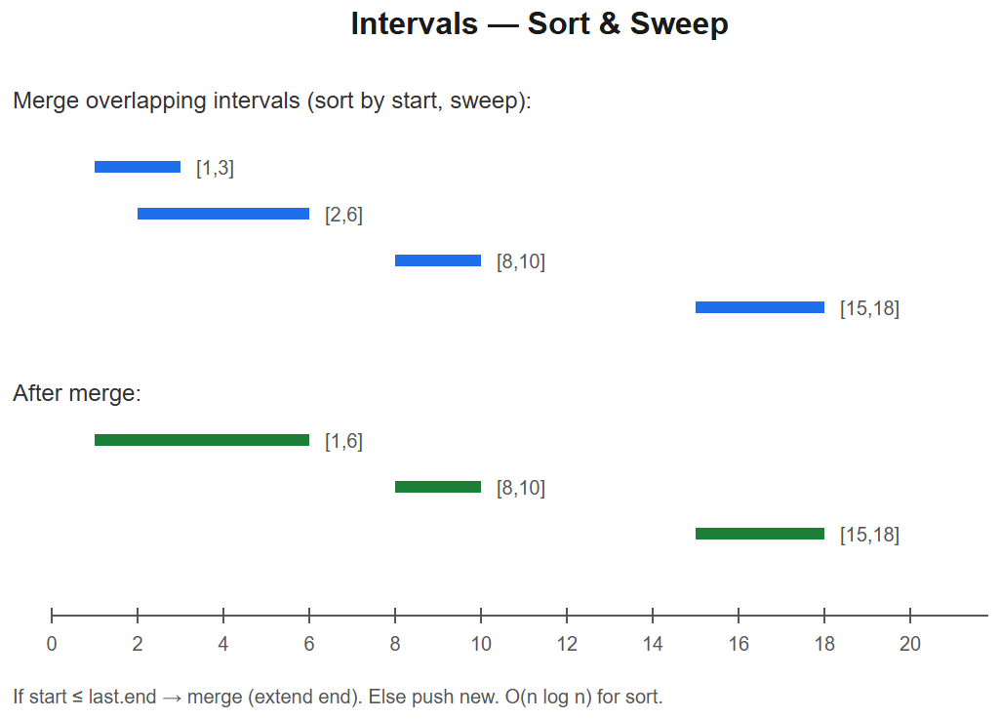

# 15 -- Intervals



## Pattern: Sort by start (or end), then sweep
Almost every interval problem reduces to:
1. **Sort** by start time (or end time, depending on the question)
2. **Sweep** through, maintaining state (current end, active count, etc.)
3. **Merge / count / track** as you go

### Master template -- merge overlapping intervals (LC 56)
```python
def merge(intervals):
    intervals.sort(key=lambda x: x[0])
    result = []
    for start, end in intervals:
        if result and start <= result[-1][1]:           # overlaps last
            result[-1][1] = max(result[-1][1], end)
        else:
            result.append([start, end])
    return result
```
**Time** O(n log n) dominated by sort.

### Mental model
```
Sorted by start:
[1,3]
  [2,6]      <- overlaps [1,3] -> merge to [1,6]
       [8,10]
              [15,18]
Result: [[1,6], [8,10], [15,18]]
```

---

## Variation 15.1 -- Insert Interval -- LC 57
**Change**: intervals already sorted; one new interval to insert + merge.
```python
def insert(intervals, new):
    result = []
    i = 0
    n = len(intervals)
    # 1. intervals entirely before new
    while i < n and intervals[i][1] < new[0]:
        result.append(intervals[i]); i += 1
    # 2. merge overlapping
    while i < n and intervals[i][0] <= new[1]:
        new[0] = min(new[0], intervals[i][0])
        new[1] = max(new[1], intervals[i][1])
        i += 1
    result.append(new)
    # 3. intervals entirely after new
    while i < n:
        result.append(intervals[i]); i += 1
    return result
```

## Variation 15.2 -- Non-Overlapping Intervals -- LC 435
**Change**: count min to remove. Sort by **end time**, greedily keep the one ending earliest.
```python
def eraseOverlapIntervals(intervals):
    intervals.sort(key=lambda x: x[1])             # sort by end
    end = float('-inf')
    keep = 0
    for s, e in intervals:
        if s >= end:
            keep += 1
            end = e
    return len(intervals) - keep
```
**Why end-sort + greedy**: earliest-ending leaves the most room for future intervals -- classic activity-selection.

## Variation 15.3 -- Meeting Rooms (can attend all?) -- LC 252
**Change**: just check no overlap after sorting.
```python
def canAttendMeetings(intervals):
    intervals.sort(key=lambda x: x[0])
    for i in range(1, len(intervals)):
        if intervals[i][0] < intervals[i-1][1]:
            return False
    return True
```

## Variation 15.4 -- Meeting Rooms II (min rooms) -- LC 253
**Change**: count max simultaneous meetings. Two approaches:
### a) Heap of end times
```python
import heapq
def minMeetingRooms(intervals):
    intervals.sort(key=lambda x: x[0])
    h = []
    for s, e in intervals:
        if h and h[0] <= s:
            heapq.heappop(h)
        heapq.heappush(h, e)
    return len(h)
```
### b) Sweep line (separate start and end arrays)
```python
def minMeetingRooms2(intervals):
    starts = sorted(i[0] for i in intervals)
    ends   = sorted(i[1] for i in intervals)
    rooms = max_rooms = 0
    j = 0
    for s in starts:
        if s < ends[j]:
            rooms += 1
            max_rooms = max(max_rooms, rooms)
        else:
            j += 1
    return max_rooms
```
**Sweep-line idea**: at each timestamp, ++ on start events, -- on end events; track max.

## Variation 15.5 -- Minimum Arrows to Burst Balloons -- LC 452
**Change**: like activity selection -- sort by end, shoot at the end.
```python
def findMinArrowShots(points):
    points.sort(key=lambda x: x[1])
    arrows = 0
    end = float('-inf')
    for s, e in points:
        if s > end:
            arrows += 1
            end = e
    return arrows
```

## Variation 15.6 -- Employee Free Time -- LC 759
**Change**: flatten all intervals, sort, find gaps.
```python
def employeeFreeTime(schedule):
    all_intervals = sorted([iv for emp in schedule for iv in emp], key=lambda x: x[0])
    free = []
    end = all_intervals[0][1]
    for s, e in all_intervals[1:]:
        if s > end:
            free.append([end, s])
        end = max(end, e)
    return free
```

---

## Summary
| Problem | Sort by | Trick |
|---------|---------|-------|
| Merge Intervals | start | Extend last if overlap |
| Insert Interval | (already sorted) | 3-phase sweep |
| Non-Overlap | end | Greedy keep earliest end |
| Meeting Rooms | start | Sequential overlap check |
| Meeting Rooms II | start | Heap of end times / sweep line |
| Min Arrows | end | Activity selection |
| Free Time | start | Gap detection |

## When to sort by START vs END
- **Merge / insert** -> start (so overlap-with-last is easy to spot)
- **Activity selection / non-overlap / min arrows** -> end (greedy: pick earliest end)
- **Min rooms / sweep line** -> either; sweep line uses both arrays

## Sweep line -- universal interval algorithm
For "how many things are active at time X" or "max simultaneous":
1. Create events: `(start_t, +1)`, `(end_t, -1)`
2. Sort by time (ties: end before start, or vice versa depending on inclusive/exclusive)
3. Sweep, accumulate signed sum, track max

```python
def max_simultaneous(intervals):
    events = []
    for s, e in intervals:
        events.append((s, +1))
        events.append((e, -1))           # use (e, -1) before (e, +1) at ties for closed intervals
    events.sort()
    active = max_active = 0
    for _, delta in events:
        active += delta
        max_active = max(max_active, active)
    return max_active
```

## Interview tells
- "Overlapping intervals / meetings / appointments" -> sort + sweep
- "Minimum rooms / resources" -> heap or sweep line
- "Min removals / arrows / partitions" -> greedy by end-time
- "Free time / gaps between" -> sort and look at consecutive differences
- "Insert into sorted intervals" -> 3-phase sweep


---

## Deep dive -- sort + sweep

Three skeletons:
1. **Merge:** sort by start, sweep, extend last if overlap.
2. **Insert / non-overlap count:** sort by end; pick if start >= last end.
3. **Min resources (rooms / arrows):** count concurrent intervals via sweep-line events `(time, +1/-1)` or two-heap.

A sweep-line replaces the interval with two events; processing events in time order solves many "max overlap" or "first conflict" problems.

##  Pitfalls

| Pitfall | Fix |
|--------|-----|
| Inclusive vs exclusive endpoints | Decide once; e.g., [start, end) avoids ties |
| Sorting by start when problem needs end | Pick by problem: count non-overlap -> end; merge -> start |
| Events processed in wrong tie order | End events before start events when intervals share a boundary (or vice versa per spec) |
| Forgetting to advance "last picked end" | Track explicitly |
| Off-by-one when comparing `a.start` vs `b.end` | Test boundary cases: `[1,2]` and `[2,3]` |

## More problems

### Merge Intervals -- LC 56
```python
def merge(intervals):
    intervals.sort()
    out = []
    for s, e in intervals:
        if out and s <= out[-1][1]:
            out[-1][1] = max(out[-1][1], e)
        else:
            out.append([s, e])
    return out
```

### Insert Interval -- LC 57
Three phases: before, overlap (merge), after.

### Non-overlapping Intervals -- LC 435
```python
def eraseOverlapIntervals(intervals):
    intervals.sort(key=lambda x: x[1])
    end = float('-inf'); removed = 0
    for s, e in intervals:
        if s >= end: end = e
        else: removed += 1
    return removed
```

### Meeting Rooms II -- LC 253
```python
import heapq
def minMeetingRooms(meetings):
    meetings.sort()
    heap = []  # earliest ending
    for s, e in meetings:
        if heap and heap[0] <= s:
            heapq.heappop(heap)
        heapq.heappush(heap, e)
    return len(heap)
```

Or sweep-line:
```python
def minMeetingRooms2(meetings):
    starts = sorted(m[0] for m in meetings)
    ends   = sorted(m[1] for m in meetings)
    rooms = i = 0
    for s in starts:
        if s >= ends[i]: i += 1
        else:            rooms += 1
    return rooms
```

### Car Pooling -- LC 1094 (event sweep)
### Minimum Number of Arrows -- LC 452

## Interview questions

1. **Why sort by end for non-overlap counting?** Picking earliest-ending leaves more room -- exchange argument.
2. **Sweep-line max concurrent -- why O(n log n)?** Dominated by sort; sweep is O(n).
3. **Closed vs open intervals -- when matters?** Tiebreaking events; e.g., a meeting ending at 10 and another starting at 10 may or may not need a new room.
4. **Insert interval complexity?** O(n) if list is already sorted; O(log n) to find boundary + O(n) to merge.
5. **Range-tree alternative?** Interval tree gives O(log n + k) queries; overkill for one-shot batch problems.

## References
- de Berg et al., *Computational Geometry* -- Ch. 2 sweep line
- LeetCode "Interval" tag
