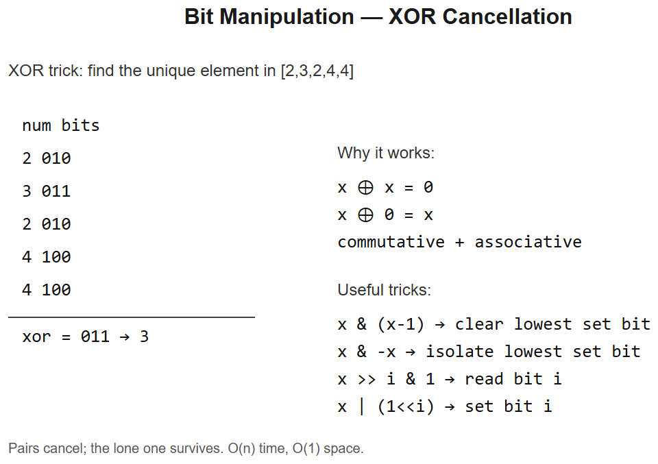

# 16 -- Bit Manipulation



## Core bit operations to memorize

| Op | Code | Effect |
|----|------|--------|
| AND | `a & b` | 1 iff both bits 1 |
| OR | `a \| b` | 1 iff either bit 1 |
| XOR | `a ^ b` | 1 iff bits differ |
| NOT | `~a` | flip all bits (2's complement so `~5 = -6`) |
| Left shift | `a << k` | multiply by 2^k |
| Right shift | `a >> k` | integer divide by 2^k |

## Useful idioms (memorize these)

```python
x & 1                   # last bit (parity)
x >> 1                  # drop last bit (integer halve)
x | (1 << i)            # set bit i
x & ~(1 << i)           # clear bit i
x ^ (1 << i)            # toggle bit i
(x >> i) & 1            # test bit i

x & (x - 1)             # drop lowest set bit   <- VERY USEFUL
x & -x                  # isolate lowest set bit (Fenwick tree foundation)
x & (x - 1) == 0        # is x a power of 2? (x must also be > 0)
bin(x).count("1")       # popcount

# Iterate subsets of a bitmask s:
sub = s
while sub > 0:
    # use sub
    sub = (sub - 1) & s
```

---

## Variation 16.1 -- Single Number -- LC 136
**Problem**: Every element appears twice except one. XOR all -> unique remains (a^a=0, a^0=a).
```python
def singleNumber(nums):
    x = 0
    for n in nums: x ^= n
    return x
```
**Why XOR**: commutative + `x^x = 0` -> all pairs cancel.

## Variation 16.2 -- Number of 1 Bits -- LC 191
**Change**: drop lowest set bit each iteration.
```python
def hammingWeight(n):
    count = 0
    while n:
        n &= n - 1                        # drops lowest set bit
        count += 1
    return count
```
**Logic**: O(popcount) instead of O(32).

## Variation 16.3 -- Counting Bits -- LC 338
**Change**: DP -- `dp[i] = dp[i >> 1] + (i & 1)`.
```python
def countBits(n):
    dp = [0] * (n + 1)
    for i in range(1, n + 1):
        dp[i] = dp[i >> 1] + (i & 1)
    return dp
```
**Logic**: i's bits = (i without last bit)'s bits + (last bit).

## Variation 16.4 -- Reverse Bits -- LC 190
```python
def reverseBits(n):
    result = 0
    for _ in range(32):
        result = (result << 1) | (n & 1)
        n >>= 1
    return result
```
**Walk**: shift result left to make room, OR-in n's last bit, then shift n right.

## Variation 16.5 -- Missing Number -- LC 268
**Approach a) XOR with indices**:
```python
def missingNumber(nums):
    x = len(nums)
    for i, v in enumerate(nums):
        x ^= i ^ v
    return x
```
**Approach b) sum formula**: `expected = n*(n+1)/2; return expected - sum(nums)`.

## Variation 16.6 -- Sum of Two Integers (no `+`) -- LC 371
**Change**: simulate binary adder. XOR = sum without carry; AND << 1 = carry.
```python
def getSum(a, b):
    MASK = 0xFFFFFFFF
    while b & MASK:
        carry = (a & b) << 1
        a = (a ^ b) & MASK
        b = carry & MASK
    return a if a <= 0x7FFFFFFF else ~(a ^ MASK)
```
**Note**: Python's unbounded ints need masking to simulate 32-bit overflow.

## Variation 16.7 -- Bitmask DP example -- Traveling Salesman skeleton
**State**: `dp[mask][i]` = min cost to visit cities in `mask`, ending at city `i`.
```python
def tsp(dist):
    n = len(dist)
    INF = float('inf')
    dp = [[INF] * n for _ in range(1 << n)]
    dp[1][0] = 0                                    # start at city 0
    for mask in range(1 << n):
        for u in range(n):
            if not (mask >> u) & 1: continue
            for v in range(n):
                if (mask >> v) & 1: continue
                new_mask = mask | (1 << v)
                dp[new_mask][v] = min(dp[new_mask][v], dp[mask][u] + dist[u][v])
    return min(dp[(1 << n) - 1][i] + dist[i][0] for i in range(1, n))
```
**Why bitmask**: `n <= 20` enables exponential state on a tiny set of "visited" booleans.

---

## Summary
| Problem | Trick |
|---------|-------|
| Single Number | XOR cancels pairs |
| Number of 1 Bits | `x & (x-1)` drops lowest set bit |
| Counting Bits | `dp[i] = dp[i>>1] + (i & 1)` |
| Reverse Bits | Bit-by-bit shift |
| Missing Number | XOR or sum formula |
| Sum No `+` | XOR (no-carry) + AND<<1 (carry) loop |
| Bitmask DP / TSP | `mask` over subset of items |

## When bit manipulation shines
- **Small constants**: subset enumeration up to ~20 elements (`2^20 = 10^6`)
- **State compression** in DP (TSP, Traveling Domino, Hamiltonian)
- **XOR tricks**: find single, double, missing
- **Power-of-2 checks**, byte-level packing
- **Hash/Bloom-filter primitives**

## Common gotchas
- Python ints are unbounded -> use masks for "fixed-width" simulations
- `<<` and `>>` are O(1) for ints up to machine word -- beyond, O(log) due to BigInt
- Watch operator precedence: `(a >> i) & 1` parens are necessary
- Negative numbers in two's complement: `~x = -x - 1`

## Interview tells
- "Find odd-occurrence number" -> XOR
- "Count set bits" -> `x & (x-1)` loop or popcount
- "Power of 2 / 4" -> bit tests
- "Subset enumeration with `n <= 20`" -> bitmask DP
- "Without using `+`" -> bit adder simulation
- "Constant extra space for missing element" -> XOR or sum formula


---

## Deep dive -- bit tricks worth memorising

| Trick | Effect |
|-------|-------|
| `x & 1` | parity (lowest bit) |
| `x >> 1` | divide by 2 (signed: rounds toward -inf in Python) |
| `x & (x - 1)` | clears lowest set bit |
| `x & -x` | isolates lowest set bit |
| `x | (1 << i)` | set bit i |
| `x & ~(1 << i)` | clear bit i |
| `x ^ (1 << i)` | flip bit i |
| `(x >> i) & 1` | read bit i |
| `bin(x).count('1')` / `x.bit_count()` | popcount |
| `x ^ y` | bits where x and y differ |

XOR is **abelian, self-inverse**: `a ^ a = 0`, `a ^ 0 = a`, `(a^b)^a = b`. That makes it the king of "find the odd one" and "swap without temp".

**Subset enumeration:**
```python
sub = mask
while sub:
    process(sub)
    sub = (sub - 1) & mask
```

##  Pitfalls

| Pitfall | Fix |
|--------|-----|
| Operator precedence (`&` < `==`) | Parenthesise: `(x & 1) == 0` |
| Negative numbers in two's-complement vs Python's unbounded ints | Mask with `& 0xFFFFFFFF` for 32-bit semantics |
| Signed shift in Python | `>>` arithmetic shift; not the same as JVM |
| Confusing XOR sum with arithmetic sum | "missing number 0..n" uses XOR or sum |

## More problems

### Single Number -- LC 136
```python
def singleNumber(nums):
    x = 0
    for v in nums: x ^= v
    return x
```

### Number of 1 Bits -- LC 191
```python
def hammingWeight(n):
    c = 0
    while n:
        n &= n - 1; c += 1
    return c
```

### Counting Bits -- LC 338
`dp[i] = dp[i >> 1] + (i & 1)`.

### Missing Number -- LC 268
XOR all with `0..n`.

### Sum of Two Integers (no `+`) -- LC 371
Loop with carry via XOR / AND-shift.

### Reverse Bits -- LC 190
Build result bit by bit.

### Single Number II (every num thrice except one) -- LC 137
Two-bit state machine: `ones, twos = (ones ^ x) & ~twos, (twos ^ x) & ~ones`.

## Interview questions

1. **Why XOR for "single number"?** Pairs cancel.
2. **`x & (x-1)` why does it clear lowest set bit?** `x-1` flips trailing zeros and the lowest 1; AND keeps higher bits unchanged.
3. **Popcount in O(1)?** Hardware instruction (`popcnt`); in Python `int.bit_count()`.
4. **How to detect overflow when adding without `+`?** Carry stays non-zero after the loop bounded by word width.
5. **Subset enumeration runtime?** Sigma over masks of size k = 2^k subsets -> total 3^n across all masks.

## References
- "Bit Twiddling Hacks" -- Sean Eron Anderson
- *Hacker's Delight* -- Henry S. Warren Jr.
