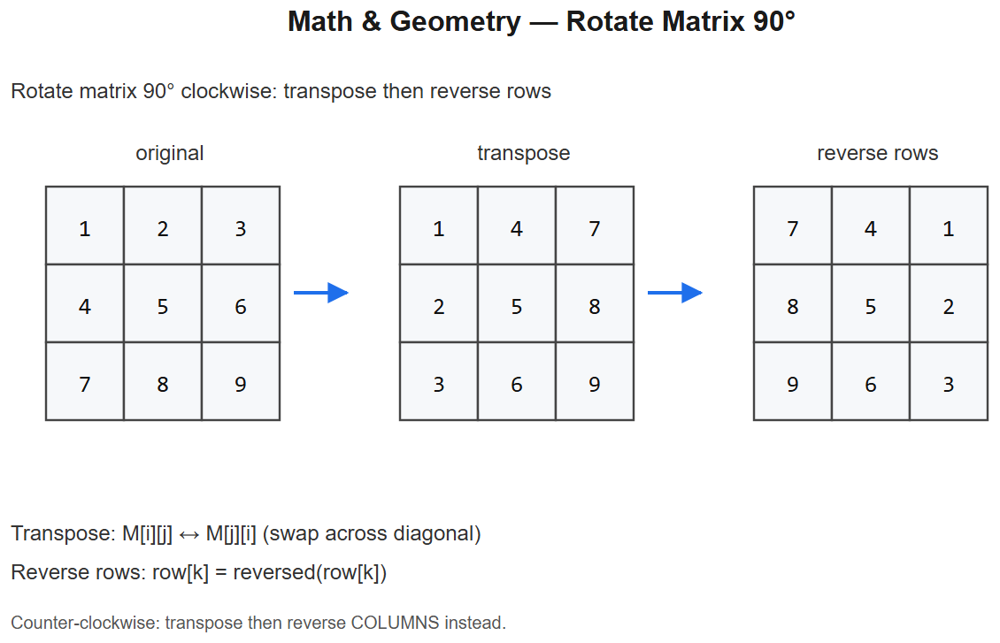

# 17 -- Math & Geometry



## Pattern: A small toolkit of math tricks + simulation
Less algorithmic, more "do you know the trick?" These come up especially at Google, Apple, and quant interviews.

## Essential idioms

| Idiom | Use |
|-------|-----|
| `pow(a, b, m)` | Fast modular exponentiation, Python built-in O(log b) |
| `math.gcd(a, b)` | Euclidean GCD |
| `lcm = a * b // gcd(a, b)` | LCM |
| `divmod(a, b)` | `(quotient, remainder)` together |
| Sieve of Eratosthenes | All primes up to N in O(N log log N) |
| Reservoir sampling | Sample k items from a stream of unknown size |

### Sieve of Eratosthenes
```python
def sieve(n):
    is_prime = [True] * (n + 1)
    is_prime[0] = is_prime[1] = False
    for i in range(2, int(n**0.5) + 1):
        if is_prime[i]:
            for j in range(i*i, n + 1, i):
                is_prime[j] = False
    return [i for i, p in enumerate(is_prime) if p]
```

---

## Variation 17.1 -- Rotate Image 90 deg  -- LC 48
**Change**: transpose + reverse each row (clever in-place trick).
```python
def rotate(matrix):
    n = len(matrix)
    # transpose
    for i in range(n):
        for j in range(i+1, n):
            matrix[i][j], matrix[j][i] = matrix[j][i], matrix[i][j]
    # reverse each row
    for row in matrix:
        row.reverse()
```
**Diagram**:
```
Original         Transpose         Reverse rows (90 deg  CW)
1 2 3            1 4 7             7 4 1
4 5 6     ->      2 5 8     ->       8 5 2
7 8 9            3 6 9             9 6 3
```

## Variation 17.2 -- Spiral Matrix -- LC 54
**Change**: 4 pointers (top, bottom, left, right), shrink inward.
```python
def spiralOrder(matrix):
    result = []
    top, bot = 0, len(matrix) - 1
    left, right = 0, len(matrix[0]) - 1
    while top <= bot and left <= right:
        for c in range(left, right + 1):  result.append(matrix[top][c])
        top += 1
        for r in range(top, bot + 1):     result.append(matrix[r][right])
        right -= 1
        if top <= bot:
            for c in range(right, left - 1, -1): result.append(matrix[bot][c])
            bot -= 1
        if left <= right:
            for r in range(bot, top - 1, -1):    result.append(matrix[r][left])
            left += 1
    return result
```

## Variation 17.3 -- Set Matrix Zeroes -- LC 73
**Change**: use the first row/col as **markers** for which rows/cols to zero. O(1) extra space.
```python
def setZeroes(matrix):
    m, n = len(matrix), len(matrix[0])
    first_row_zero = any(matrix[0][c] == 0 for c in range(n))
    first_col_zero = any(matrix[r][0] == 0 for r in range(m))

    for r in range(1, m):
        for c in range(1, n):
            if matrix[r][c] == 0:
                matrix[r][0] = 0
                matrix[0][c] = 0

    for r in range(1, m):
        for c in range(1, n):
            if matrix[r][0] == 0 or matrix[0][c] == 0:
                matrix[r][c] = 0

    if first_row_zero:
        for c in range(n): matrix[0][c] = 0
    if first_col_zero:
        for r in range(m): matrix[r][0] = 0
```

## Variation 17.4 -- Happy Number -- LC 202 (cycle detection on numbers)
**Change**: Floyd's tortoise/hare on the sequence-of-squared-digit-sums.
```python
def isHappy(n):
    def step(x):
        return sum(int(d)**2 for d in str(x))
    slow = n
    fast = step(n)
    while fast != 1 and slow != fast:
        slow = step(slow)
        fast = step(step(fast))
    return fast == 1
```
**Logic**: if not happy, the sequence cycles -> fast catches slow.

## Variation 17.5 -- Pow(x, n) -- LC 50 (fast exponentiation)
```python
def myPow(x, n):
    if n < 0: x, n = 1 / x, -n
    result = 1.0
    while n:
        if n & 1: result *= x
        x *= x
        n >>= 1
    return result
```
**O(log n)**: at each step, square the base, multiply into result if bit is set.

## Variation 17.6 -- Plus One -- LC 66
**Change**: carry propagation right-to-left.
```python
def plusOne(digits):
    for i in range(len(digits) - 1, -1, -1):
        if digits[i] < 9:
            digits[i] += 1
            return digits
        digits[i] = 0
    return [1] + digits          # all 9s case: 999 -> 1000
```

## Variation 17.7 -- Multiply Strings -- LC 43
**Change**: grade-school multiplication into a result array.
```python
def multiply(num1, num2):
    if num1 == "0" or num2 == "0": return "0"
    m, n = len(num1), len(num2)
    result = [0] * (m + n)
    for i in range(m - 1, -1, -1):
        for j in range(n - 1, -1, -1):
            prod = int(num1[i]) * int(num2[j])
            p1, p2 = i + j, i + j + 1
            total = prod + result[p2]
            result[p2] = total % 10
            result[p1] += total // 10
    s = ''.join(map(str, result)).lstrip('0')
    return s or "0"
```

---

## Summary
| Problem | Trick |
|---------|-------|
| Rotate Image | Transpose + reverse rows |
| Spiral Matrix | 4 pointers, shrink inward |
| Set Matrix Zeroes | First row/col as markers (O(1) space) |
| Happy Number | Floyd's cycle on sequence |
| Pow(x, n) | Binary exponentiation O(log n) |
| Plus One | Carry propagation |
| Multiply Strings | Grade-school multiplication into array |

## Math toolkit one-liners
- **Modular inverse** (p prime): `pow(a, p-2, p)` (Fermat's little theorem)
- **nCr % p**: precompute factorials + inverse factorials
- **GCD of array**: `from functools import reduce; reduce(gcd, arr)`
- **Random sampling**: `random.sample(seq, k)` for uniform without replacement
- **Reservoir sampling**: keep first k, then for i >= k, replace random one with prob k/i

## Interview tells
- "Rotate / spiral / transpose" -> matrix manipulation tricks
- "Cycle / repeat / sum of digits" -> sequence cycle detection
- "Fast power / modular" -> binary exponentiation
- "Detect / count factors / primes" -> sieve
- "Random sample without size known" -> reservoir sampling
- "Convert / arithmetic on string-numbers" -> grade-school carry handling


---

## Deep dive -- geometry essentials

- **Cross product** of 2D vectors (a, b): `a.x*b.y - a.y*b.x`. Sign tells orientation (CCW positive, CW negative, 0 collinear).
- **Distance squared** avoids `sqrt` when only comparing.
- **Polygon area** via shoelace: `½ |Sigma (x_i*y_{i+1} - x_{i+1}*y_i)|`.
- **Convex hull**: Andrew monotone chain, O(n log n).
- **Line-segment intersection**: orientation test on the four endpoints.
- **Inside polygon**: ray-casting (parity of crossings) or winding number.

For math:
- `gcd(a,b) = gcd(b, a % b)`; `lcm = a*b // gcd`.
- Modular exponent: fast power.
- Sieve of Eratosthenes: O(n log log n) primes up to n.

##  Pitfalls

| Pitfall | Fix |
|--------|-----|
| Floating-point comparison | Use epsilon, or work with integers when possible |
| Rotation off by 90 deg  | Verify direction: `(x,y) -> (y,-x)` is clockwise |
| Integer overflow on products | Python: fine; other languages: use 64-bit |
| Mixing radians and degrees | Be explicit; `math.radians/degrees` |
| Random `random.randint(a,b)` inclusivity | Inclusive on both ends in Python; `range` is exclusive |

## More problems

### Rotate Image -- LC 48
```python
def rotate(M):
    n = len(M)
    for i in range(n):
        for j in range(i+1, n):
            M[i][j], M[j][i] = M[j][i], M[i][j]      # transpose
    for row in M: row.reverse()                       # reverse each row
```

### Spiral Matrix -- LC 54
Maintain four boundaries top/bottom/left/right; peel layers.

### Set Matrix Zeroes -- LC 73
Use first row / first column as markers; O(1) extra space.

### Pow(x, n) -- LC 50 (fast exponent)
```python
def myPow(x, n):
    if n < 0: x, n = 1/x, -n
    res = 1
    while n:
        if n & 1: res *= x
        x *= x; n >>= 1
    return res
```

### Happy Number -- LC 202

### Plus One -- LC 66

### Multiply Strings -- LC 43

### Sqrt(x) -- LC 69 (binary search on int)

## Interview questions

1. **Rotate 90 deg  -- why transpose then reverse rows?** Transpose maps `(i,j) -> (j,i)`, then reversing each row maps `(j,i) -> (j, n-1-i)` = rotation.
2. **Convex hull complexity?** O(n log n) due to sorting.
3. **Why does fast exponentiation work?** `x^n = (x^(n/2))^2 * x^(n mod 2)`.
4. **Sieve memory optimisation?** Bitset; skip evens after marking 2.
5. **When use modular arithmetic?** Counting modulo a prime to avoid overflow.

## References
- "Computational Geometry" -- Mark de Berg et al.
- CP-Algorithms.com -- number-theory pages
