# Python — Basics to Pro & Tricky Interview Nuances

A single reference that climbs from fundamentals to the deep, easy-to-trip-over details
interviewers love. Sections marked **TRICKY** are the ones candidates most often get wrong.

---

# 1. The Object & Variable Model

## Everything is an object
- Every value (int, function, class, module) is an object with an **id**, a **type**, and a **value**.
- A *variable* is just a **name bound to an object** — not a box that holds it. Assignment binds; it never copies.
- `id(x)` = identity (address in CPython), `type(x)` = class, `x` = value.

## Names, binding, and aliasing — **TRICKY**
```python
a = [1, 2, 3]
b = a            # b and a are the SAME object (alias)
b.append(4)
print(a)         # [1, 2, 3, 4]  -- a changed too
```
- `b = a` copies the *reference*, not the list. Mutating through either name is visible through both.
- Rebinding (`b = [9]`) does **not** affect `a` — it points `b` at a new object.

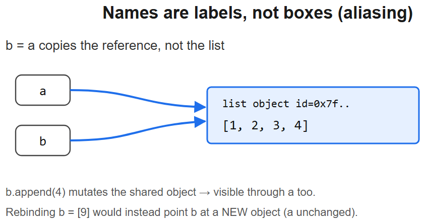

## Mutable vs immutable
| Immutable | Mutable |
|-----------|---------|
| `int`, `float`, `bool`, `str`, `tuple`, `frozenset`, `bytes` | `list`, `dict`, `set`, `bytearray`, most custom objects |

- Immutable objects can be **shared safely** and used as `dict` keys / `set` members (they're hashable).
- A `tuple` is immutable but can *contain* mutable items: `t = ([1],)` then `t[0].append(2)` works.

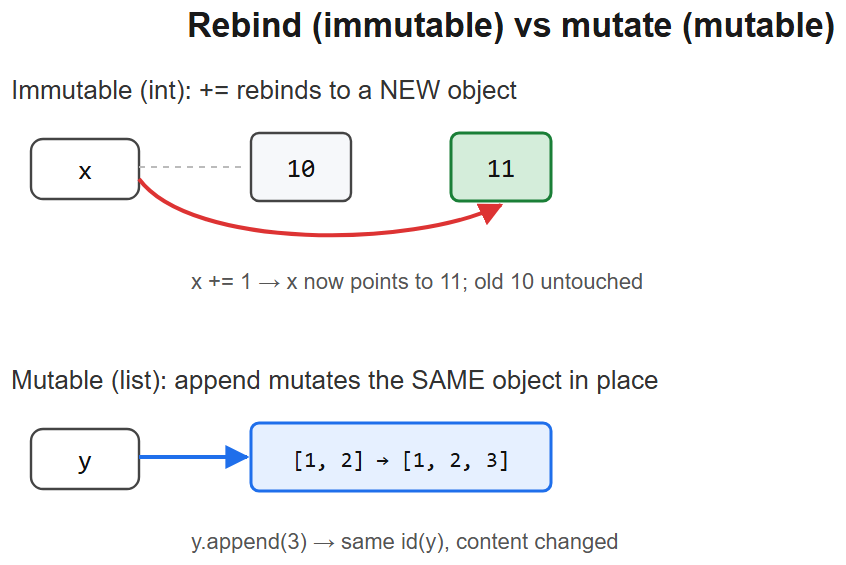

## `is` vs `==` — **TRICKY**
- `==` -> value equality (`__eq__`). `is` -> identity (same object).
- `a = 256; b = 256; a is b` -> `True` (small-int cache: −5..256).
- `a = 257; b = 257; a is b` -> `False` (outside the cache).
- String interning makes some literals share identity — never rely on it. Use `==` for value.
- **Always** use `is None` / `is not None` (None is a singleton).

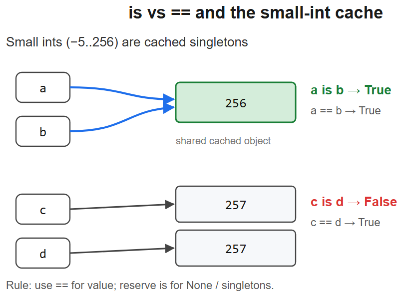

## Copying — **TRICKY**
```python
import copy
shallow = copy.copy(obj)       # new outer object, SHARED inner references
deep    = copy.deepcopy(obj)   # recursively copies everything
```
- `list(xs)`, `xs[:]`, `dict(d)` all make **shallow** copies.
- Nested mutables still alias after a shallow copy — a classic bug source.

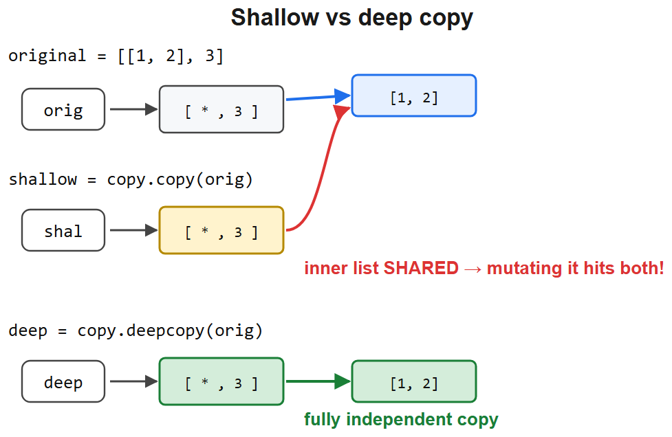

---

# 2. Numbers, Booleans & Precision

- `int` is arbitrary precision (no overflow). `float` is IEEE-754 double.
- **Float equality** is unsafe: `0.1 + 0.2 == 0.3` -> `False`. Use `math.isclose(a, b)`.
- `bool` is a subclass of `int`: `True == 1`, `False == 0`, and `True + True == 2`.
- `/` is true division (float), `//` is floor division, `%` is modulo (sign follows divisor).
- `-7 // 2 == -4` (floors toward −∞), `-7 % 2 == 1`. **TRICKY** in languages-comparison questions.
- `decimal.Decimal` / `fractions.Fraction` for exact money / ratios.

---

# 3. Strings, Bytes & Formatting

- `str` is immutable Unicode; `bytes` is immutable raw bytes. Convert with `.encode()` / `.decode()`.
- f-strings are fastest & clearest: `f"{value!r:>10.2f}"` (conversion + format spec).
- `"".join(parts)` to build strings — **never** `+=` in a loop (O(n²) churn).
- `str.format`, `%`-formatting still exist; f-strings (3.6+) preferred.
- `=` debugging specifier: `f"{x=}"` -> `x=42`.

```python
name = "Kaushal"
print(f"{name=}, {len(name)=}, {name.upper()!r}")
```

---

# 4. Collections

## Core types
| Type | Ordered | Mutable | Lookup | Notes |
|------|---------|---------|--------|-------|
| `list` | yes | yes | O(n) by value | dynamic array |
| `tuple` | yes | no | O(n) | hashable if items are |
| `dict` | yes (3.7+) | yes | O(1) avg | insertion-ordered |
| `set` | no | yes | O(1) avg | unique, unordered |
| `frozenset` | no | no | O(1) | hashable set |

## Slicing — **TRICKY**
- `s[start:stop:step]`, `stop` is exclusive. `s[::-1]` reverses.
- Slicing a list returns a **new** list (shallow copy); slice-assignment mutates in place: `xs[1:3] = [9]`.

## Comprehensions
```python
[x*x for x in range(10) if x % 2]          # list
{k: v for k, v in pairs}                    # dict
{x % 7 for x in nums}                        # set
(x*x for x in range(10))                     # generator (lazy, O(1) memory)
```
- Comprehension variables **don't leak** into enclosing scope (Py3) — unlike old Py2.
- Nested order reads left-to-right: `[c for row in grid for c in row]`.

## dict/set deep facts — **TRICKY**
- Keys must be **hashable** (immutable + consistent `__hash__`/`__eq__`).
- `dict` preserves insertion order since 3.7 (language guarantee); `OrderedDict` rarely needed now.
- `d.get(k, default)`, `d.setdefault(k, [])`, `collections.defaultdict(list)`, `collections.Counter`.
- `{**a, **b}` merges (b wins); 3.9+ `a | b`.

---

# 5. Functions & Scope

## Argument passing — "pass by object reference"
- Python passes the **reference by value**. Rebinding a parameter doesn't affect the caller; mutating a mutable argument does.

## Parameter forms
```python
def f(pos, /, both, *args, kw_only, **kwargs): ...
#        ^ positional-only (3.8+)   ^ keyword-only after *
```

## Mutable default argument trap — **TRICKY** (top interview favorite)
```python
def add(x, bucket=[]):    # default created ONCE at def time
    bucket.append(x); return bucket
add(1)  # [1]
add(2)  # [1, 2]  <- surprise, shared across calls
# Fix:
def add(x, bucket=None):
    if bucket is None: bucket = []
    ...
```

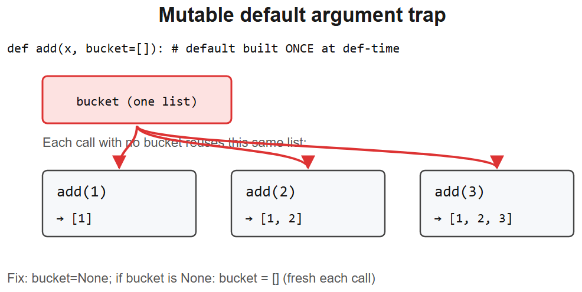

## Scope & LEGB
- **L**ocal -> **E**nclosing -> **G**lobal -> **B**uiltin lookup order.
- `global x` / `nonlocal x` to rebind outer names.

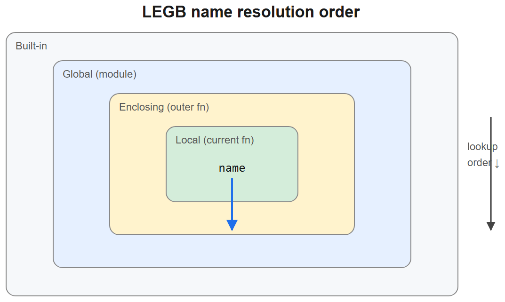

## Late-binding closures — **TRICKY**
```python
fns = [lambda: i for i in range(3)]
[f() for f in fns]          # [2, 2, 2]  -- all see final i
fns = [lambda i=i: i for i in range(3)]
[f() for f in fns]          # [0, 1, 2]  -- bind via default
```

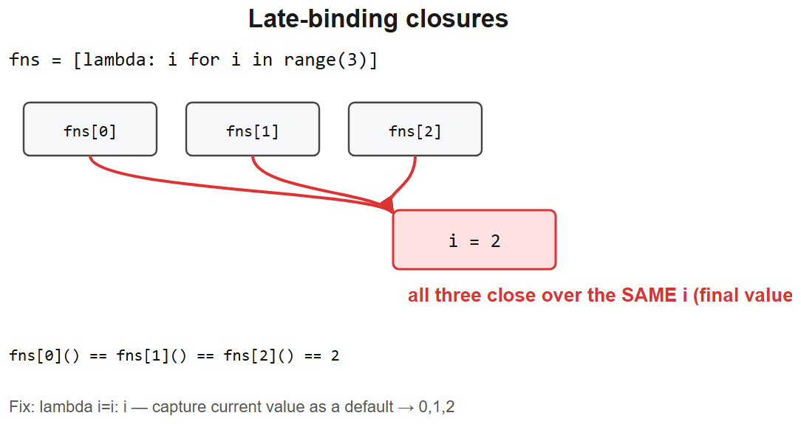

## First-class functions & closures
- Functions are objects: pass them, return them, store them.
- A closure captures **variables** (by reference), not values — hence the trap above.

---

# 6. Decorators

```python
import functools
def retry(n):
    def deco(fn):
        @functools.wraps(fn)            # preserves __name__/__doc__/signature
        def wrapper(*a, **k):
            for attempt in range(n):
                try: return fn(*a, **k)
                except Exception:
                    if attempt == n-1: raise
        return wrapper
    return deco

@retry(3)
def flaky(): ...
```
- Decorator = callable that takes a function and returns a (usually wrapping) function.
- `@deco` is sugar for `f = deco(f)`. Parameterized decorators are **3 nested** layers.
- Without `functools.wraps`, the wrapped function loses its metadata — **TRICKY** debugging.
- Class-based decorators implement `__call__`. `@property`, `@staticmethod`, `@classmethod` are built-in descriptors.

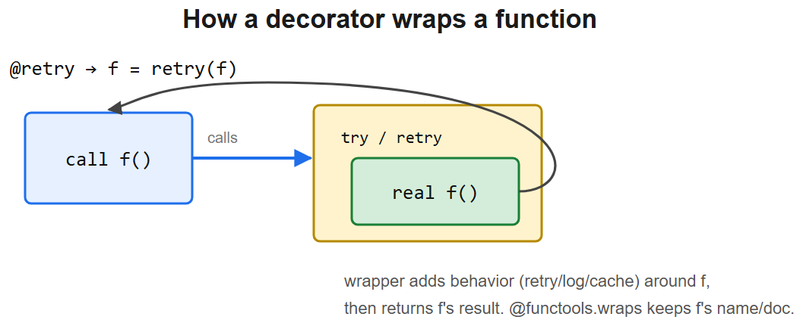

---

# 7. OOP & The Data Model

## Class vs instance attributes — **TRICKY**
```python
class Dog:
    tricks = []              # CLASS attribute, shared by ALL instances!
    def add(self, t): self.tricks.append(t)
a, b = Dog(), Dog()
a.add("sit"); print(b.tricks)   # ['sit']  <- shared mutable class attr
```
- Assigning `self.x = ...` creates an instance attr that *shadows* the class attr.

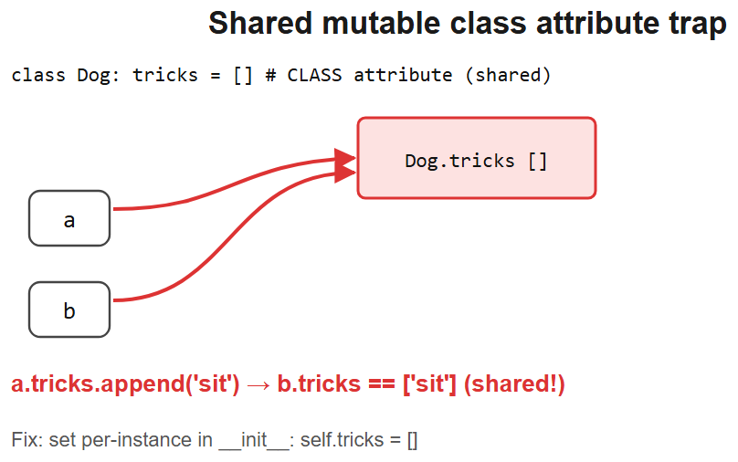

## Dunder methods (operator/protocol hooks)
| Method | Triggered by |
|--------|-------------|
| `__init__` / `__new__` | init vs *create* the instance |
| `__repr__` / `__str__` | `repr()` (unambiguous) / `str()` (readable) |
| `__eq__` + `__hash__` | `==` and hashing (define both, or set `__hash__=None`) |
| `__lt__`, … | ordering (`functools.total_ordering` fills the rest) |
| `__call__` | make instance callable `o()` |
| `__iter__` / `__next__` | iteration |
| `__getitem__` / `__setitem__` | `o[k]` |
| `__enter__` / `__exit__` | `with` blocks |
| `__getattr__` / `__getattribute__` | attribute access fallbacks |

## `__new__` vs `__init__`
- `__new__(cls, ...)` **creates** and returns the instance (used for singletons, immutable subclasses).
- `__init__(self, ...)` **initializes** the already-created instance. It must return `None`.

## MRO & `super()` — **TRICKY**
- Method Resolution Order uses **C3 linearization**; inspect via `Cls.__mro__`.
- `super()` follows the MRO, not the literal parent — crucial in diamond inheritance / cooperative multiple inheritance.

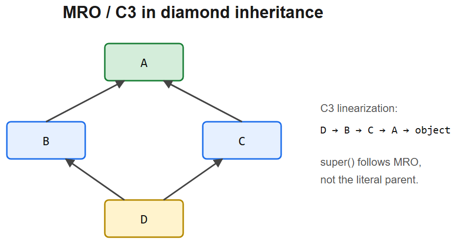

## `__slots__`
- `__slots__ = ("x", "y")` removes per-instance `__dict__` -> less memory, faster attribute access.
- Cost: no arbitrary new attributes, multiple-inheritance restrictions.

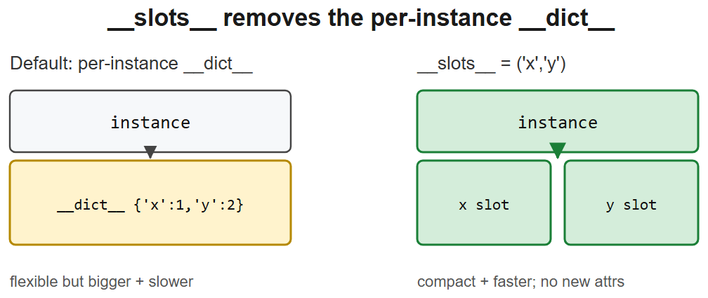

## Descriptors (the magic behind property/methods)
- An object defining `__get__`/`__set__`/`__delete__` controls attribute access on its owner class.
- `property` is a data descriptor; functions are non-data descriptors (that's how bound methods work).

## Dataclasses
```python
from dataclasses import dataclass, field
@dataclass(frozen=True, slots=True)
class Point:
    x: float
    y: float
    tags: list = field(default_factory=list)   # mutable default done right
```
- Auto `__init__`/`__repr__`/`__eq__`; `frozen=True` -> immutable & hashable; `order=True` -> comparisons.

---

# 8. Iterators, Generators & Lazy Evaluation

- **Iterable**: has `__iter__`. **Iterator**: has `__next__` and returns itself from `__iter__`.
- `for` calls `iter()` then `next()` until `StopIteration`.

```python
def fib():
    a, b = 0, 1
    while True:
        yield a
        a, b = b, a + b
```
- Generators are lazy (O(1) memory), resumable, and **single-pass** (exhausted after one iteration) — **TRICKY**.
- `yield from sub_gen` delegates. Generators can receive values via `.send()`.
- `itertools` (chain, islice, groupby, product, accumulate) is the pro toolkit.

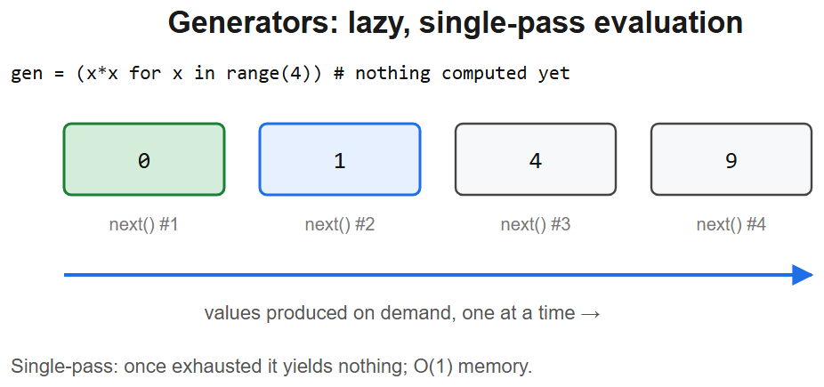

---

# 9. Exceptions & Control Flow

```python
try:
    risky()
except (ValueError, KeyError) as e:
    handle(e)
except Exception as e:
    raise RuntimeError("wrapped") from e   # exception chaining
else:
    # runs only if no exception
    ...
finally:
    cleanup()                              # always runs
```
- **EAFP** ("easier to ask forgiveness than permission") is idiomatic over LBYL.
- `finally` runs even on `return`/`break`; a `return` in `finally` **swallows** exceptions — **TRICKY**.
- Catch specific exceptions; bare `except:` also catches `KeyboardInterrupt`/`SystemExit` (avoid).
- 3.11+: exception groups (`except*`) and `add_note()`.

---

# 10. Memory Management & Garbage Collection

- CPython uses **reference counting** as primary GC: object freed when refcount hits 0.
- A **generational cyclic collector** (`gc` module) handles reference cycles refcounting can't.
- `__del__` finalizers are unpredictable — don't rely on them; use context managers for cleanup.
- `weakref` for caches/back-references that shouldn't keep objects alive.
- Interning & small-int cache reduce allocations for common immutables.

---

# 11. Concurrency & Parallelism — **TRICKY** (huge interview topic)

## The GIL
- **Global Interpreter Lock**: one thread executes Python bytecode at a time per process.
- CPU-bound pure-Python code gets **no speedup** from threads.
- I/O-bound code *does* benefit: the GIL is released during blocking I/O.

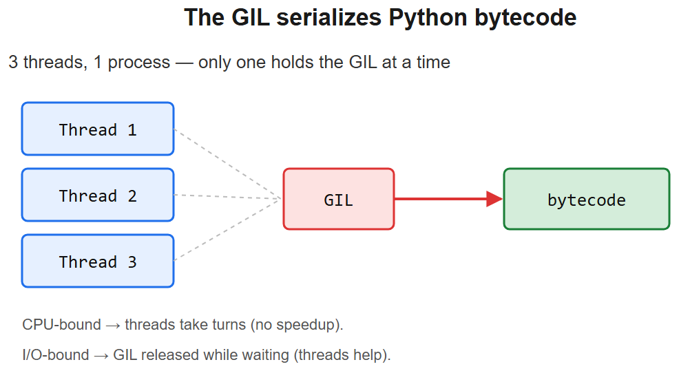

## Pick the right tool
| Workload | Use | Why |
|----------|-----|-----|
| I/O-bound, many tasks | `asyncio` | cooperative, single thread, cheap tasks |
| I/O-bound, blocking libs | `threading` / `ThreadPoolExecutor` | GIL released on I/O |
| CPU-bound | `multiprocessing` / `ProcessPoolExecutor` | separate processes, true parallelism |
| Numeric CPU-bound | NumPy / native ext | releases GIL in C |

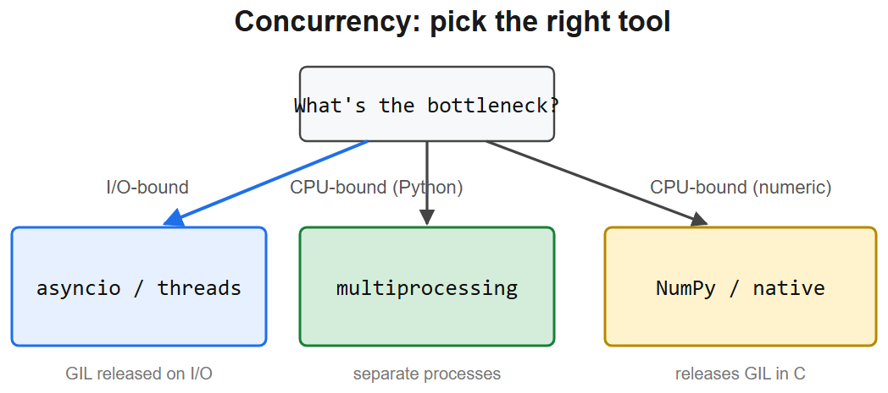

## asyncio
```python
import asyncio
async def fetch(c, u): return (await c.get(u)).json()
async def main():
    async with httpx.AsyncClient() as c:
        return await asyncio.gather(*(fetch(c, u) for u in urls))
asyncio.run(main())
```
- `async def` -> coroutine; `await` yields control; `gather` runs concurrently.
- **Never** call blocking sync code in an async function — it stalls the whole loop. Use `run_in_executor` / `asyncio.to_thread`.
- Python 3.13 ships an experimental **free-threaded (no-GIL)** build.

---

# 12. Imports, Modules & Packaging

- `import` runs the module **once**, caches it in `sys.modules`.
- `if __name__ == "__main__":` guards script-only code (so imports don't run it).
- Absolute imports preferred; relative imports (`from . import x`) inside packages.
- Circular imports break at module top-level — defer the import inside a function to fix.
- Virtual envs (`venv`), `pip`, `pyproject.toml` are the modern packaging baseline.

---

# 13. Performance & Pythonic Idioms

- Prefer built-ins / comprehensions / generator expressions — they run in C.
- `"".join(...)` over string `+=`; `collections.deque` for O(1) ends; `set`/`dict` for membership.
- `functools.lru_cache` / `cache` to memoize pure functions.
- Profile before optimizing: `timeit`, `cProfile`.
- `enumerate`, `zip`, `any`/`all`, unpacking (`a, *rest = xs`), `dict.get` over try/except for hot paths.

---

# 14. The Bit-Manipulation Gotchas — **TRICKY**

**`len(bin(i))` is not the bit length.** `bin()` prepends a `'0b'` prefix (2 chars).

| `i` | `bin(i)` | `len(bin(i))` | true bit length |
|-----|----------|---------------|-----------------|
| 2 | `'0b10'` | 4 | 2 |
| 3 | `'0b11'` | 4 | 2 |
| 5 | `'0b101'` | 5 | 3 |

- True count = `len(bin(i)) - 2` = `i.bit_length()`. Subtracting `1` is off-by-one (one too large).

**Shift binds looser than `+`/`-`.** Precedence high -> low: `* / // %`  >  `+ -`  >  `<< >>`  >  `&`  >  `^`  >  `|`.
- `ans + ans << k` parses as `(ans + ans) << k`, i.e. `(2*ans) << k` — **not** `ans + (ans << k)`. Parenthesize.

**Concatenating the binary of `i`** means shift to make room, then OR the value `i`:
```python
ans = (ans << i.bit_length()) | i      # append binary digits of i
```
Doubling `ans` (`ans + ans`) answers the wrong question — the appended value must be `i`, not `ans`.

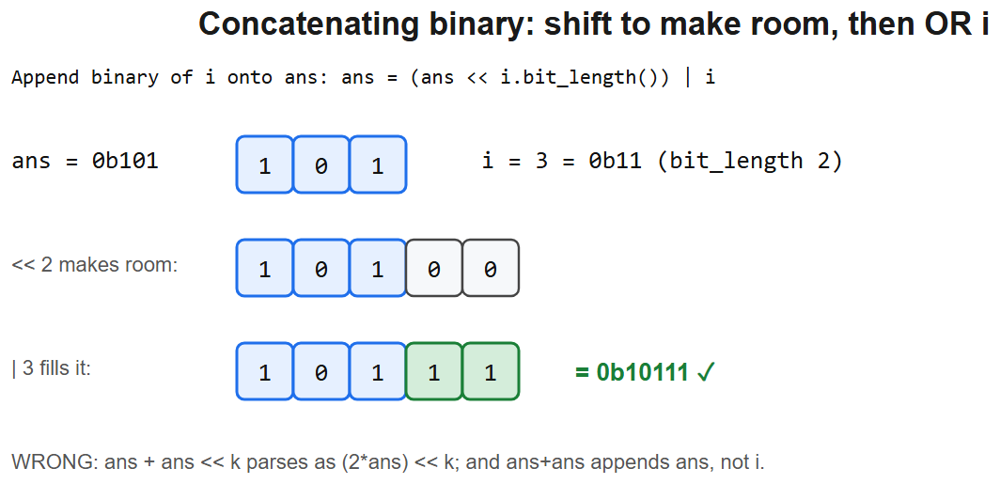

---

# 15. Grab-Bag of Classic Gotchas — **TRICKY**

- **Modifying a list while iterating** skips elements — iterate over a copy or build a new list.
- **Chained comparison**: `1 < x < 10` is real and evaluates `x` once.
- **Truthiness**: `[]`, `{}`, `0`, `""`, `None`, `0.0` are falsy. `if xs:` not `if len(xs) > 0:`.
- **`==` vs `is` on caches** (see §1) — interview bait.
- **Integer/None default confusion**: `x or default` fails when `x == 0`; use `x if x is not None else default`.
- **`*args` mutation / unpacking**: `a, *b = [1,2,3]` -> `a=1, b=[2,3]`.
- **`+=` on tuple attribute** inside a tuple raises *and* mutates — `t[0] += [1]` for `t=([],)` throws yet appends.
- **`sort` vs `sorted`**: `list.sort()` mutates in place returns `None`; `sorted(it)` returns a new list.
- **Default `print` flushing / `==` chaining / float keys** — small but quotable.

---

# 16. Rapid-Fire Interview One-Liners

- *What's the GIL?* A per-process lock serializing Python bytecode in CPython — no true thread parallelism for pure-Python CPU work; use multiprocessing/async.
- *List vs tuple?* List = mutable; tuple = immutable & hashable (usable as keys/elements).
- *`is` vs `==`?* Identity vs value equality. Always `is None`.
- *Why are mutable default args dangerous?* Default is evaluated once at def time and reused across calls.
- *Generator vs list?* Generator is lazy, single-pass, O(1) memory; list materializes everything.
- *Decorator?* A HOF wrapping another function — logging, caching, auth, retries.
- *`__new__` vs `__init__`?* `__new__` creates the instance; `__init__` initializes it.
- *Shallow vs deep copy?* Shallow shares inner references; deep recursively copies.
- *How does Python manage memory?* Reference counting + a generational cyclic GC.
- *EAFP vs LBYL?* Try-and-catch vs check-first; EAFP is idiomatic Python.
- *Why `__slots__`?* Drops per-instance `__dict__` -> less memory, faster attr access; loses dynamic attrs.
- *async vs threads vs processes?* async/threads for I/O-bound, processes for CPU-bound (GIL).

---

> **Project anchor (AIAAS):** "Node handlers are classes with `__call__` so the executor treats them uniformly; state goes through Pydantic models for validation; the executor is fully `asyncio` since node work is I/O-bound (LLM calls, MCP RPC, DB) — so we run hundreds of concurrent workflows on one process without the GIL biting. For CPU-bound steps we offload to a process pool."
