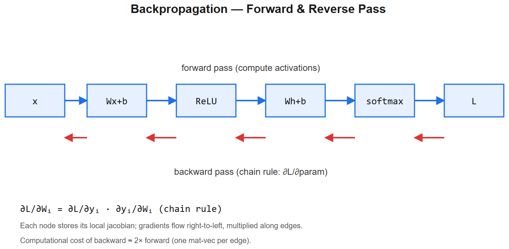

# Backprop & Gradient Descent -- Worked Examples



> Companion to [gradient-descent-cheatsheet.md](gradient-descent-cheatsheet.md) and [dl-basics-cheatsheet.md](dl-basics-cheatsheet.md). Concrete numbers so the math sticks.

## Example 1 -- Linear regression, gradient by hand

**Model**: `y_pred = w*x + b`. **Loss**: MSE = `(1/N) Sigma (y_pred - y)^2`.

### Gradients (memorize this derivation)
```
∂L/∂w = (2/N) Sigma x_i * (w*x_i + b - y_i)
∂L/∂b = (2/N) Sigma      (w*x_i + b - y_i)
```

### Numeric walk-through
Data: `(x, y) = (1, 2), (2, 5), (3, 7)`. Start `w=0, b=0`, lr `eta=0.1`.

**Step 1**:
- predictions: 0, 0, 0
- errors `(pred - y)`: -2, -5, -7
- `∂L/∂w = (2/3)*(1*-2 + 2*-5 + 3*-7) = (2/3)*(-33) = -22`
- `∂L/∂b = (2/3)*(-2-5-7) = (2/3)*(-14) = -9.33`
- Update: `w <- 0 - 0.1*(-22) = 2.2`, `b <- 0 - 0.1*(-9.33) = 0.933`

**Step 2** with `w=2.2, b=0.933`:
- predictions: 3.13, 5.33, 7.53
- errors: 1.13, 0.33, 0.53
- `∂L/∂w = (2/3)*(1*1.13 + 2*0.33 + 3*0.53) = 2.20`
- `∂L/∂b = (2/3)*(1.13+0.33+0.53) = 1.33`
- Update: `w <- 2.2 - 0.1*2.20 = 1.98`, `b <- 0.933 - 0.1*1.33 = 0.80`

Notice loss already moving toward optimum (`w~=2.5, b=0` would be perfect for `y~=2.5x`).

### Code
```python
import numpy as np
X = np.array([1,2,3]); Y = np.array([2,5,7])
w, b, lr = 0.0, 0.0, 0.1
for step in range(100):
    pred = w*X + b
    err = pred - Y
    dw = (2/len(X)) * (X * err).sum()
    db = (2/len(X)) * err.sum()
    w -= lr * dw
    b -= lr * db
print(w, b)   # ~2.5, ~0  (with noise: best fit)
```

---

## Example 2 -- Backprop in a 2-layer network (the canonical exam question)

Network: `x -> W1 -> ReLU -> W2 -> y_pred`. Loss = MSE.

### Forward
```
z1 = W1 * x        (shape h x 1, given x is d x 1)
a1 = ReLU(z1)
z2 = W2 * a1       (shape 1 x 1)
y_pred = z2
L = (y_pred - y)^2
```

### Backward -- chain rule, layer by layer
```
∂L/∂y_pred = 2(y_pred - y)            # scalar
∂L/∂W2     = ∂L/∂y_pred * a1ᵀ          # shape 1 x h
∂L/∂a1     = W2ᵀ * ∂L/∂y_pred          # shape h x 1
∂L/∂z1     = ∂L/∂a1 (.) (z1 > 0)         # ReLU derivative is 1 where z1>0, else 0
∂L/∂W1     = ∂L/∂z1 * xᵀ                # shape h x d
```

### Numeric example
`x = [1, 2]`, `y = 3`. `W1 = [[0.5, -1], [0.3, 0.2]]`, `W2 = [1, 1]`.

**Forward**:
- `z1 = [0.5*1 + (-1)*2, 0.3*1 + 0.2*2] = [-1.5, 0.7]`
- `a1 = ReLU(z1) = [0, 0.7]`
- `z2 = 1*0 + 1*0.7 = 0.7`
- `L = (0.7 - 3)^2 = 5.29`

**Backward**:
- `∂L/∂y_pred = 2*(0.7-3) = -4.6`
- `∂L/∂W2 = -4.6 * [0, 0.7] = [0, -3.22]`
- `∂L/∂a1 = W2ᵀ * (-4.6) = [-4.6, -4.6]`
- `∂L/∂z1 = [-4.6, -4.6] (.) [0, 1] = [0, -4.6]`  (ReLU killed the first)
- `∂L/∂W1 = [[0]*xᵀ, [-4.6]*xᵀ] = [[0, 0], [-4.6, -9.2]]`

**The neuron with `z1[0] = -1.5` had its gradient set to 0 -- the "dying ReLU" effect.** This is exactly why Leaky ReLU exists.

---

## Example 3 -- Adam vs SGD on the same toy problem

```python
import numpy as np
np.random.seed(0)

# Quadratic loss: L(w) = w^2 + noise
# True minimum: w = 0
def grad(w): return 2*w + np.random.randn() * 0.5

# --- SGD ---
w_sgd = 5.0; lr = 0.1
for _ in range(50):
    w_sgd -= lr * grad(w_sgd)

# --- Adam ---
w_adam = 5.0; lr = 0.1
m, v = 0, 0; beta1, beta2, eps = 0.9, 0.999, 1e-8
for t in range(1, 51):
    g = grad(w_adam)
    m = beta1*m + (1-beta1)*g
    v = beta2*v + (1-beta2)*g**2
    m_hat = m / (1 - beta1**t)
    v_hat = v / (1 - beta2**t)
    w_adam -= lr * m_hat / (np.sqrt(v_hat) + eps)

print(w_sgd, w_adam)
# SGD wanders noisily near 0; Adam settles closer because it adapts step size
```

**Talking point**: Adam's adaptive `v_hat` damps oscillation when noise is high (gradient variance large) and speeds up when gradients are consistent. That's why it tolerates higher initial LR.

---

## Example 4 -- Vanishing gradient demonstration

5-layer sigmoid network:
```python
x = 1.0
weights = [0.5, 0.5, 0.5, 0.5, 0.5]

# forward
def sigmoid(z): return 1 / (1 + np.exp(-z))
def d_sigmoid(z):
    s = sigmoid(z); return s * (1 - s)

zs, acts = [], [x]
for w in weights:
    z = w * acts[-1]
    zs.append(z)
    acts.append(sigmoid(z))

# backward -- assume loss gradient at output = 1
grad_out = 1.0
g = grad_out
for i in reversed(range(len(weights))):
    g *= d_sigmoid(zs[i]) * weights[i]
    print(f"grad at layer {i}: {g:.6f}")
```

You'll see something like:
```
grad at layer 4: 0.125
grad at layer 3: 0.015
grad at layer 2: 0.0019
grad at layer 1: 0.00023
grad at layer 0: 0.000029
```
**Multiplying small numbers shrinks gradients exponentially with depth.** Each `d_sigmoid` <= 0.25, and weights are small -> cascade.

**Fix**: ReLU (derivative is 1 in the active region), residual connections (`+1` term in chain rule), normalization.

---

## Example 5 -- Why sqrtd_k in attention (worked example)

Score = `q * k = Sigma q_i k_i`. If `q_i, k_i ∼ N(0, 1)` independent:
- `E[q_i k_i] = 0`
- `Var(q_i k_i) = 1`
- `Var(Sigma q_i k_i) = d_k` (sum of independent variances)
- `std = sqrtd_k`

With `d_k = 64`: scores have std `~= 8`. After softmax:
```
softmax([0, 8])  ~= [0.00033, 0.99966]   # nearly one-hot!
```
Gradient on the non-max entry: `~= 0`. Training stalls.

Divide by `sqrtd_k = 8`:
```
softmax([0, 1])  ~= [0.27, 0.73]   # healthy gradient on both
```

That's it -- that's why the `sqrtd_k` is there. It's the simplest variance-normalization trick.

---

## Example 6 -- Gradient clipping in practice

Without clipping, a single bad batch can spike gradients to `||g|| = 1000` and destroy weeks of training:
```python
torch.nn.utils.clip_grad_norm_(model.parameters(), max_norm=1.0)
```
If total gradient L2 norm > 1.0, scale all gradients down so the norm is exactly 1.0. Standard for LLM training.

**Why norm-clipping over value-clipping?** Norm preserves *direction* (just scales magnitude). Value clipping distorts the gradient direction and is rarely correct.

---

## Example 7 -- Learning rate warmup matters (Adam moments)

At step 1, Adam has `m=0, v=0`. Bias correction divides by `1 - beta1ᵗ`:
- `t=1, beta1=0.9`: divisor = `1 - 0.9 = 0.1` -> multiplies effective LR by 10x
- `t=2`: divisor = `1 - 0.81 = 0.19` -> multiplies by ~5x
- `t=100`: divisor ~= 1 -> no inflation

**Without warmup**, those early steps can blow up the model. Linear warmup over ~1-2% of total steps lets the moment estimates stabilize before allowing full step size.

```python
# warmup: 1000 steps, then cosine decay over remaining 49000
def lr_at(step, peak=3e-4, warmup=1000, total=50000):
    if step < warmup:
        return peak * step / warmup
    progress = (step - warmup) / (total - warmup)
    return peak * 0.5 * (1 + np.cos(np.pi * progress))
```

This is the standard LLM training schedule.

---

## Summary of "why" answers
| Trick | Why it works |
|-------|--------------|
| Normalization (BN/LN/RMSNorm) | Keeps activation scale constant -> stable gradients |
| Residual connections | Gradient has a `+1` path -> never vanishes |
| ReLU over sigmoid | Derivative is 1 (not <=0.25) in active region |
| Careful init (He/Xavier) | Variance preserved layer-to-layer at step 1 |
| Gradient clipping | Stops occasional spikes from destroying training |
| Warmup | Adam's bias correction is unstable at t=1 |
| LR decay (cosine) | Big steps early to explore, small steps later to refine |
| Mixed precision (bf16) | 2x throughput + 2x memory savings, same dynamic range as fp32 |

These are the **why** answers for almost every "how do you stabilize training" interview question.
