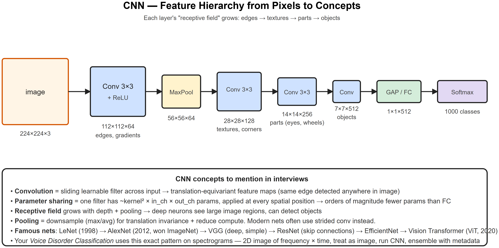
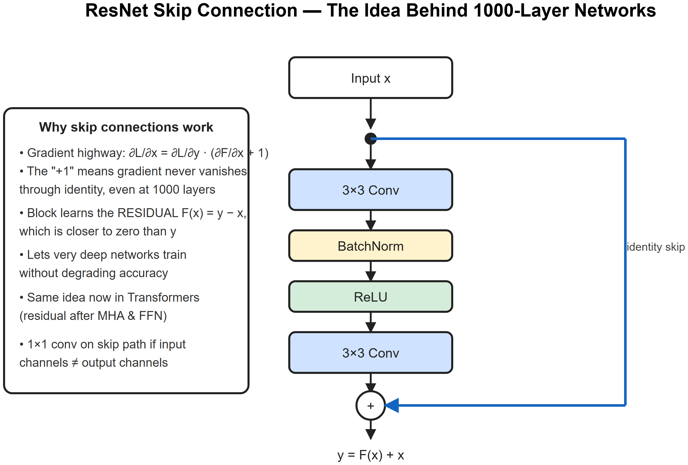
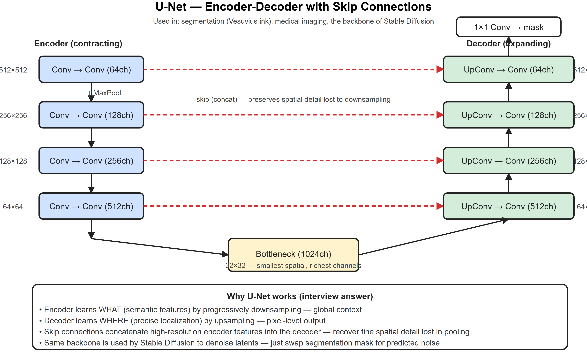

# CNN * ResNet * UNet -- Interview Cheatsheet







>  [CNN feature hierarchy](diagrams/04-cnn-feature-hierarchy.png) * [ResNet skip](diagrams/01-resnet-skip.png) * [U-Net](diagrams/02-unet.png)

## CNN essentials

### Convolution
```
Output(x,y,c_out) = Sigma Sigma Sigma  W[i,j,c_in,c_out] * Input(x+i, y+j, c_in)
                   i j c_in
```
- Kernel size `k` (3x3 standard), stride `s`, padding `p`
- **Output spatial size**: `(W - k + 2p) / s + 1`
- Params per conv layer: `k x k x C_in x C_out + C_out (bias)`

### Why CNN beats FC on images
- **Parameter sharing**: same filter slides across image -> ~1000x fewer params than FC
- **Translation equivariance**: feature detected anywhere
- **Local connectivity**: each output depends on a small patch of input
- **Hierarchical features**: depth -> bigger receptive field -> higher-level concepts

### Pooling
- **Max pool 2x2 stride 2**: takes max over 2x2 -> spatial /2 + translation invariance
- **Average pool**: takes mean
- **Global Average Pool**: HxW -> 1x1 per channel, replaces FC head in modern nets

### Famous CNNs (timeline)
| Year | Net | Innovation |
|------|-----|-----------|
| 1998 | LeNet-5 | First successful CNN |
| 2012 | **AlexNet** | Won ImageNet, GPUs, ReLU, dropout |
| 2014 | VGG-16/19 | Just 3x3 convs, very deep |
| 2014 | Inception | 1x1 + 3x3 + 5x5 parallel ("network in network") |
| 2015 | **ResNet** | Skip connections -> 152+ layers |
| 2017 | DenseNet | Concatenated features across all layers |
| 2019 | EfficientNet | Compound scaling (depth, width, resolution) |
| 2020 | **ViT** | Transformer beats CNN at scale (with enough data) |
| 2022+ | ConvNeXt | Modernized CNN matching ViT |

## ResNet -- the residual block

>  See [diagrams/01-resnet-skip.svg](diagrams/01-resnet-skip.png)

```
y = F(x) + x
F(x) = Conv -> BN -> ReLU -> Conv -> BN
```

### Why it works (interview answer)
- Gradient: `∂L/∂x = ∂L/∂y * (∂F/∂x + 1)` -- the "+1" gives a gradient highway
- Block learns the **residual** (delta from input), which is typically near zero -> easier optimization
- Allows 50, 101, 152 layer networks (and beyond) to train without degrading

### Bottleneck block (ResNet-50+)
```
1x1 conv (reduce ch) -> 3x3 conv -> 1x1 conv (restore ch) + residual
```
Cuts compute massively while preserving capacity.

## U-Net -- encoder-decoder with skips

>  See [diagrams/02-unet.svg](diagrams/02-unet.png)

- **Encoder**: progressive downsampling (Conv + Pool) -> small spatial, many channels -- captures *what*
- **Decoder**: progressive upsampling (UpConv) -> restores spatial -- captures *where*
- **Skip connections** (lateral): concat encoder features to decoder at same scale -> recover fine spatial detail lost in pooling

Used everywhere:
- Medical/biological segmentation (original use case)
- Vesuvius ink detection (your project)
- Background of Stable Diffusion (denoising in latent space)
- Depth estimation, instance segmentation, ControlNet

## Receptive field (the concept interviewers love)
- The region of the input image that affects one neuron in a deep layer
- Grows with depth (each conv) and pooling
- **Effective receptive field** is much smaller than theoretical -- most weight near center
- Diffusion / transformers solve this by global attention; CNNs solve by depth + dilation

## Augmentation (computer vision)
- Random crop, flip, rotate, color jitter
- Mixup (blend two images + labels), CutMix
- RandAugment, AutoAugment (learned policies)
- AlbumentationsLib is the go-to package

## Interview one-liners
- *Why CNN over FC for images?* Parameter sharing, translation equivariance, local connectivity -> far fewer params, much better generalization.
- *Receptive field?* Region of input each output neuron sees. Grows with depth and pooling.
- *Why ResNet skip connections?* Gradient highway (the +1 in the chain rule) + block learns residual close to zero -> trains very deep nets.
- *1x1 conv?* Linear mix across channels per spatial position. Used to change channel count cheaply (ResNet bottleneck, Inception).
- *Why pooling?* Translation invariance + downsampling for compute. Modern nets often replace with strided conv.
- *U-Net skip connections vs ResNet?* U-Net **concatenates** encoder features into decoder at matching resolution; ResNet **adds** residual to itself. Different goals: U-Net recovers spatial detail, ResNet enables depth.
- *Why ViT beats CNN at scale?* Global attention from layer 1 vs CNN needing depth to grow receptive field. But ViT needs much more data; below ~10M images CNN wins.

## Research interview anchors
- **Voice Disorder (FEMH)**: "Spectrogram = 2D timexfrequency image -> CNN works directly. I ensembled the CNN features with structured metadata via a small MLP head -- classical 'two-tower' setup."
- **Autism (fMRI)**: "fMRI is a 4D time-series of 3D brain volumes. I used a CNN encoder per timestep to get spatial features, then LSTM over time. Autoencoder pre-training on the high-dim volumes gave a useful low-dim space before classification."
- **Vesuvius**: "Pure U-Net segmentation on multi-channel inputs (each papyrus scan layer = one input channel). The skip connections are critical -- ink traces are tiny pixel-level features that pooling destroys."


---

## Deep dive -- what convolutions buy you

Three properties make CNNs efficient:
1. **Local receptive field** -- pixels far apart aren't directly connected -> fewer weights than an MLP.
2. **Weight sharing** -- same filter scans the whole image -> translation equivariance.
3. **Hierarchical features** -- stacking conv layers grows receptive field; deeper layers see more context.

For a conv layer with kernel `k`, stride `s`, padding `p` on input `nxn`:
`out = ⌊(n + 2p - k)/s⌋ + 1`. Memorise this; it shows up in every interview.

##  Pitfalls

| Pitfall | Fix |
|---------|-----|
| Spatial dims collapse to 0 | Track output shape per layer; add padding |
| BatchNorm before residual add | Wrong order -- see ResNet v2 |
| Overfitting on small data | Data augmentation, dropout, weight decay |
| Class imbalance in segmentation | Use Dice or focal loss |
| Forgetting to switch model.train()/eval() | BN/Dropout misbehave |

## Why ResNets work (skip connections)

Without skip:  `y = F(x)` => network must learn the identity mapping from scratch as it deepens, which is hard.
With skip:   `y = F(x) + x` => network only needs `F(x) = 0` to leave x unchanged. Gradients flow directly through the skip path -> vanishing-gradient relief.

ResNets enabled **150+ layer** networks for the first time (He et al., 2015).

## U-Net (segmentation)

- Encoder downsamples (capture context); decoder upsamples (precise localisation).
- **Skip connections** at each resolution paste high-resolution encoder features into the decoder -> sharp boundaries.
- Designed for biomedical images with tiny training sets (Ronneberger et al., 2015).

## Interview questions

1. **Receptive field of a stack of 3x3 convs?** After L layers it's `(2L+1)x(2L+1)` (with stride 1, no pooling).
2. **Why 3x3 convs and not 5x5?** Two 3x3s = same RF as one 5x5 but with fewer params and more nonlinearity.
3. **1x1 convolution use?** Channel-mixer; reduces channels (bottleneck) without touching spatial dims.
4. **Why pool? Alternatives?** Pool gives translation invariance + downsamples. Alternatives: strided conv (parametric), atrous/dilated conv (no resolution loss).
5. **GAP vs flatten before classifier?** GAP (global average pool) has 0 params, less overfit; flatten + FC has many params (e.g. AlexNet style).
6. **U-Net vs SegNet vs DeepLab?** U-Net concatenates skips; SegNet stores pool indices; DeepLab uses dilated convs + ASPP for multi-scale context.

## References
- "Deep Residual Learning for Image Recognition" (He et al., 2015)
- "U-Net: Convolutional Networks for Biomedical Image Segmentation" (Ronneberger et al., 2015)
- "Very Deep Convolutional Networks (VGG)" -- Simonyan & Zisserman, 2014
