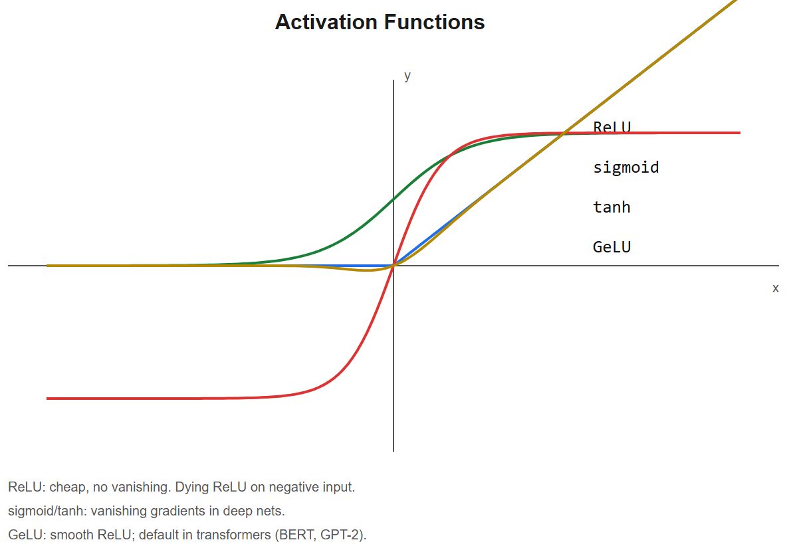
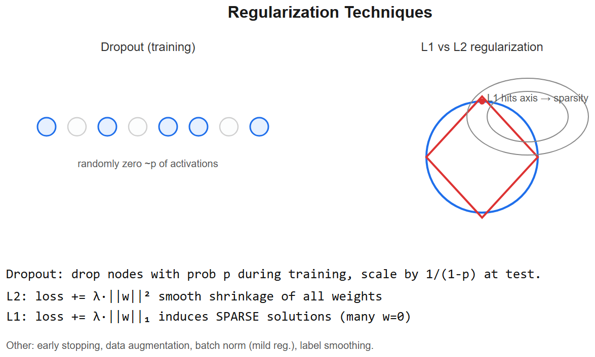

# Deep Learning Basics -- Interview Cheatsheet






## The neuron
```
z = Sigma wᵢxᵢ + b      (linear combination)
a = f(z)            (activation)
```

## Activations (when which)
| Activation | Range | Use |
|------------|-------|-----|
| **ReLU** `max(0,x)` | [0,inf) | Default hidden layer; dies if z<0 always |
| **Leaky ReLU** | (-inf,inf) | Fixes dying ReLU |
| **GeLU** | smooth | BERT/GPT-2 |
| **SwiGLU** | gated | Llama-family FFN |
| **Sigmoid** | (0,1) | Binary classification output |
| **Tanh** | (-1,1) | RNNs (less used now) |
| **Softmax** | sums to 1 | Multi-class output |

## Loss functions (paired with output)
| Task | Output activation | Loss |
|------|-------------------|------|
| Regression | none | MSE / Huber |
| Binary classification | sigmoid | BCE (binary cross-entropy) |
| Multi-class | softmax | Cross-entropy |
| Multi-label | sigmoid (per class) | BCE per class |
| Ranking | margin | Triplet / contrastive |

## Backpropagation in one sentence
Apply the chain rule layer-by-layer from output back to input, accumulating `∂L/∂w` for every weight.

## Vanishing / exploding gradients
- **Symptom**: gradients in early layers -> 0 (vanishing) or -> inf (exploding)
- **Causes**: deep nets, saturating activations, large weight init, bad learning rate
- **Fixes**: ReLU, BatchNorm/LayerNorm, residual connections (ResNet, transformers), gradient clipping, careful init (Xavier/He)

## Normalization techniques
| Norm | Computes mean/std over | Used in |
|------|-------------------------|---------|
| **BatchNorm** | Batch dim (per channel) | CNNs |
| **LayerNorm** | Feature dim (per sample) | Transformers, RNNs |
| **GroupNorm** | Channel groups | Small-batch CNN |
| **RMSNorm** | Feature dim, no mean | Llama-family LLMs |
| **InstanceNorm** | Per sample per channel | Style transfer |

## Initialization
- **Xavier (Glorot)**: `var(W) = 2/(fan_in+fan_out)` -- for tanh/sigmoid
- **He (Kaiming)**: `var(W) = 2/fan_in` -- for ReLU family
- Wrong init -> vanishing/exploding from step 1

## Optimizers
| Optimizer | Update | Notes |
|-----------|--------|-------|
| **SGD** | `w -= lr * g` | Simple, baseline |
| **SGD + Momentum** | adds running average of gradients | Faster convergence, escapes shallow minima |
| **Adam** | adaptive LR per param + momentum | Default for most things |
| **AdamW** | Adam with **decoupled weight decay** | LLM standard; better generalization |
| **RMSprop** | per-param adaptive | Older Adam-like |

LR schedule = linear warmup -> cosine decay is the LLM default.

## Regularization in DL
- **Dropout**: zero random activations during training (p=0.1-0.5); deactivated at inference
- **Weight decay (L2)**: penalize large weights via gradient
- **Data augmentation**: random crops, flips, mixup, cutmix
- **Label smoothing**: soft targets (1-epsilon for true, epsilon/(K-1) for others)
- **Early stopping**: monitor val loss, halt at min

## Training loop (skeleton you should write by heart)
```python
for epoch in range(N):
    model.train()
    for x, y in train_loader:
        x, y = x.to(device), y.to(device)
        opt.zero_grad()
        logits = model(x)
        loss = criterion(logits, y)
        loss.backward()
        torch.nn.utils.clip_grad_norm_(model.parameters(), 1.0)
        opt.step()
        scheduler.step()
    # eval
    model.eval()
    with torch.no_grad():
        for x, y in val_loader: ...
```

## Mixed precision (must mention for LLMs)
- **fp32**: full precision, default
- **fp16**: half, fast but unstable (overflow in attention)
- **bf16**: brain-float, same dynamic range as fp32 -> safe for transformers
- Train weights/activations in bf16, keep optimizer state in fp32

## Interview one-liners
- *Why ReLU over sigmoid?* Sigmoid saturates -> gradients vanish in deep nets; ReLU is unbounded above, sparse, cheap.
- *Why BatchNorm?* Stabilizes activation distributions across layers -> faster training, allows higher LR.
- *Why LayerNorm in transformers?* Variable batch sizes / sequence lengths break BatchNorm; LN normalizes per token.
- *Vanishing gradients?* Repeated multiplication of `|grad|<1` shrinks early-layer gradients to 0. Fix: ReLU, residuals, normalization, careful init.
- *Why AdamW over Adam?* Decouples weight decay from the adaptive LR -> cleaner regularization. Standard for transformers.
- *Why warmup?* Adam's running stats are noisy in step 1-N; linear warmup avoids destructive early updates.
- *Dropout at inference?* Off. PyTorch's `model.eval()` handles it.

## Research interview anchor
> "On the Vesuvius ink-detection project, I had only ~50 GB of papyrus scans with very few labeled fragments -- heavy augmentation (random crops, flips, brightness/contrast) was essential. BatchNorm helped on a CNN that big; I'd use GroupNorm if I were training with smaller batches today."


---

## Deep dive -- what "deep learning" really is

A deep neural net is a stack of differentiable linear maps + nonlinearities, trained by **gradient descent** on a loss surface. Three things make it work:
1. **Universal approximation** -- a single-hidden-layer net with enough units can approximate any continuous function. Depth just makes it efficient.
2. **Compositional features** -- early layers learn edges/textures; deeper layers compose them into objects, words, concepts.
3. **End-to-end optimisation** -- gradients flow from loss back to every parameter via autograd.

##  Common pitfalls

| Pitfall | Symptom | Fix |
|---------|---------|-----|
| Bad weight init | All units saturate or die | Use Xavier (tanh) / He (ReLU) init |
| LR too large | Loss diverges to NaN | Drop LR by 10x; gradient clip |
| LR too small | Loss decreases glacially | Warmup + cosine schedule |
| No normalisation of inputs | Loss zigzags | Standardise: (x - mu)/sigma |
| Imbalanced classes | High acc, low recall on minority | Re-weight loss, oversample, focal loss |
| Vanishing gradients in deep nets | Early layers don't update | Residuals, LayerNorm, GeLU/ReLU |
| Train/val gap growing | Overfitting | Dropout, L2, augment, early stop |

## Quick math: how a layer computes

Forward:  `y = phi(W*x + b)`  where phi is the activation.
Backward: `∂L/∂W = (∂L/∂y * phi'(z)) * xᵀ`  where `z = Wx + b`.

So each weight gradient is **upstream signal x local derivative x input**.

## Universal training recipe

```
1. normalise inputs (mean 0, std 1, or [0,1])
2. init weights (Xavier for tanh, He for ReLU)
3. choose loss (CE for classification, MSE for regression)
4. choose optimiser (Adam(3e-4) by default; SGD+momentum for image nets)
5. warmup few steps + cosine LR schedule
6. monitor train/val loss; stop on val plateau
7. regularise: dropout, weight decay 1e-4, label smoothing 0.1
8. log gradient norms; clip at e.g. 1.0 if RNN/transformer
```

## Interview questions

1. **Why is ReLU more popular than sigmoid?** No saturation in the positive region -> gradients don't vanish in deep nets. Cheap to compute.
2. **What's "dying ReLU" and how to mitigate?** Neuron stuck at 0 because its input is always negative. Mitigations: Leaky ReLU, lower LR, better init.
3. **Difference between batch norm and layer norm?** BN normalises across the batch dimension per channel -- great for CNNs, breaks for batch=1 / RNNs. LN normalises across features per sample -- used in transformers.
4. **What does dropout do at inference?** Nothing -- it's identity. We compensate by scaling activations by `1/(1-p)` during training (inverted dropout).
5. **When does deeper hurt?** Overfitting on small data, vanishing gradients without residuals, optimisation difficulties.
6. **Why use cross-entropy and not MSE for classification?** Cross-entropy's gradient is `p̂ - y` (no sigma' factor) -> faster learning; MSE x sigma' suffers vanishing gradient near saturation.

## References
- *Deep Learning* (Goodfellow, Bengio, Courville) -- Ch 6-8
- "He et al., Deep Residual Learning for Image Recognition" (2015)
- "Ioffe & Szegedy, Batch Normalization" (2015)
