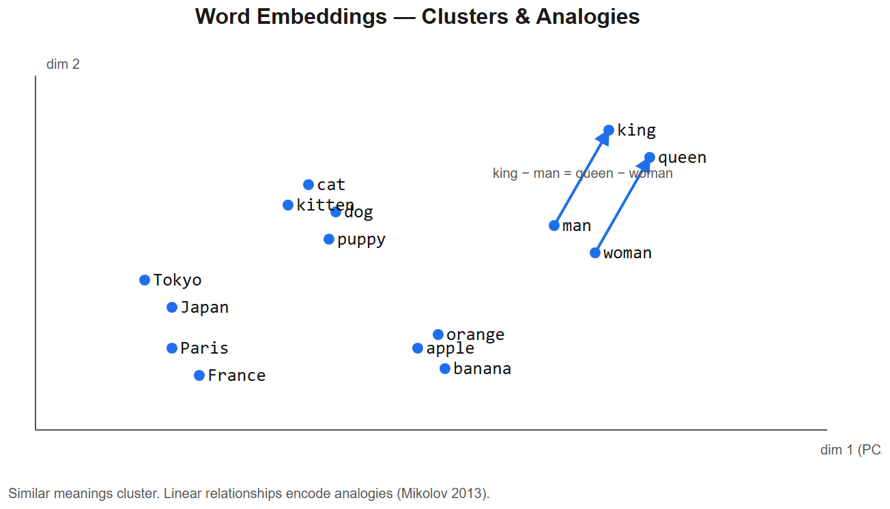

# Embeddings -- Worked Examples



> Companion to [embeddings-nlp-cheatsheet.md](embeddings-nlp-cheatsheet.md). Hands-on code + numbers.

## 1. Compute and compare sentence embeddings

```python
from sentence_transformers import SentenceTransformer
import numpy as np

m = SentenceTransformer("BAAI/bge-large-en-v1.5")

sentences = [
    "Turmeric is a yellow spice from India.",
    "Haldi is a golden Indian spice.",
    "Football is a popular sport.",
    "Soccer is played around the world.",
]

emb = m.encode(sentences, normalize_embeddings=True)
print(emb.shape)        # (4, 1024)

def cos(a, b): return float(np.dot(a, b))   # already normalized

print("turmeric vs haldi:", cos(emb[0], emb[1]))   # ~0.78  (high)
print("turmeric vs football:", cos(emb[0], emb[2]))  # ~0.05  (low)
print("football vs soccer:", cos(emb[2], emb[3]))   # ~0.72  (high)
```

**This is exactly the NGU AI-search effect**: "turmeric" and "haldi" cluster close in vector space, so an embedding-based search returns one when the user types the other.

## 2. Build a tiny RAG index by hand (no library magic)

```python
import numpy as np
from sentence_transformers import SentenceTransformer

m = SentenceTransformer("BAAI/bge-small-en-v1.5")

docs = [
    "Kashmiri lal mirch is a mild red chilli.",
    "Garam masala is a blend of ground spices.",
    "Haldi (turmeric) contains curcumin.",
    "Bay leaves come from the bay laurel tree.",
    "Cumin seeds are warming and earthy.",
]

doc_vecs = m.encode(docs, normalize_embeddings=True)

def search(query, k=3):
    q = m.encode([query], normalize_embeddings=True)[0]
    scores = doc_vecs @ q                            # cosine since normalized
    top = scores.argsort()[::-1][:k]
    return [(docs[i], float(scores[i])) for i in top]

for q in ["what gives curry its yellow color?",
          "spice mix used in north indian cooking",
          "red dried pepper for color"]:
    print(f"\n{q}")
    for doc, score in search(q):
        print(f"  {score:.3f}  {doc}")
```

Sample output:
```
what gives curry its yellow color?
  0.589  Haldi (turmeric) contains curcumin.
  0.298  Garam masala is a blend of ground spices.
  0.234  Kashmiri lal mirch is a mild red chilli.

red dried pepper for color
  0.612  Kashmiri lal mirch is a mild red chilli.
  0.301  Cumin seeds are warming and earthy.
  ...
```

That's 30 lines of code for the core RAG retrieval -- everything else (FAISS/HNSW/Qdrant) is just optimizing this for scale.

## 3. word2vec arithmetic (the classic demo)

The famous example -- analogies work because semantic relations are roughly linear in the embedding space:
```python
import gensim.downloader as api
w2v = api.load("glove-wiki-gigaword-300")

result = w2v.most_similar(positive=["king", "woman"], negative=["man"], topn=3)
# [('queen', 0.71), ('monarch', 0.62), ...]

# India : Delhi :: France : ?
print(w2v.most_similar(positive=["france", "delhi"], negative=["india"], topn=3))
# [('paris', 0.68), ('marseille', 0.51), ('lyon', 0.49)]
```

This is **static embeddings** -- same vector for "bank" whether river or financial. Modern BERT-style embeddings handle context but don't show such clean arithmetic.

## 4. Distance metrics -- why cosine for text

```python
import numpy as np

a = np.array([1, 2, 3])         # short vector
b = np.array([10, 20, 30])      # same direction, 10x magnitude

cosine = (a @ b) / (np.linalg.norm(a) * np.linalg.norm(b))   # 1.0 (identical direction)
l2     = np.linalg.norm(a - b)                                # 33.4 (very different)
```

Text embeddings live in a high-dim space where **direction encodes meaning** and magnitude is noise. Cosine ignores magnitude -> robust.

**Production tip**: L2-normalize your embeddings at index time. Then dot product == cosine, but faster (no division needed at query time).

## 5. Why mean-pooling > [CLS] without fine-tuning

```python
from transformers import AutoTokenizer, AutoModel
import torch

tok = AutoTokenizer.from_pretrained("bert-base-uncased")
m = AutoModel.from_pretrained("bert-base-uncased")

text = "Turmeric is a yellow spice."
inputs = tok(text, return_tensors="pt")
out = m(**inputs)

# Option A: [CLS] token -- first token
cls_vec = out.last_hidden_state[0, 0]            # shape (768,)

# Option B: mean of all token embeddings (with mask)
mask = inputs["attention_mask"][0].unsqueeze(-1)
mean_vec = (out.last_hidden_state[0] * mask).sum(0) / mask.sum()
```

For a base BERT (not Sentence-BERT-finetuned), `mean_vec` gives much better retrieval quality than `cls_vec`. BERT's `[CLS]` was trained for NSP, not similarity. **Sentence-BERT and BGE family** fine-tune so `[CLS]` (or mean-pool, depending on model) becomes a good sentence vector.

## 6. Hybrid search -- dense + BM25 with RRF

```python
def rrf(rankings, k=60):
    """Reciprocal Rank Fusion."""
    scores = {}
    for ranking in rankings:           # each ranking = list of doc ids in order
        for rank, doc_id in enumerate(ranking, start=1):
            scores[doc_id] = scores.get(doc_id, 0) + 1 / (k + rank)
    return sorted(scores.items(), key=lambda kv: -kv[1])

dense_top = ["doc3", "doc1", "doc5", "doc2"]      # from embedding ANN
bm25_top  = ["doc2", "doc1", "doc7", "doc3"]      # from BM25

merged = rrf([dense_top, bm25_top])
# [('doc1', 0.0322), ('doc3', 0.0317), ('doc2', 0.0314), ...]
```

Pure dense misses exact-token matches (SKUs, product codes). Pure sparse misses semantic matches. RRF blends them in a parameter-light way. **NGU's search would benefit from this** if you handle queries like "haldi 100g HALD-100" (mix of phonetic + SKU).

## 7. Matryoshka embeddings -- Russian-doll dimensions

OpenAI's `text-embedding-3-large` and some open models are trained so the first `k` dimensions are themselves a good embedding. You can truncate for cheaper storage:

```python
full = np.array([0.12, -0.08, 0.05, ...])      # shape (3072,)
truncated_512 = full[:512]                       # still a usable embedding
truncated_512 /= np.linalg.norm(truncated_512)   # re-normalize

# Recall@10 typically:
# 3072 dim -> 100% (baseline)
# 1024 dim -> ~99%
# 512 dim -> ~96%
# 256 dim -> ~92%
```

When storing 100M+ vectors, dimension matters a lot for cost.

## 8. Embedding migration -- the unsexy reality

If you change embedding model, you **must re-embed every document**. There's no "convert" function -- a BGE-large vector and an OpenAI-3 vector live in different spaces with no meaning across them.

Plan for this in production:
```
1. Index doc -> (doc_id, text, embedding_v1, embedding_v2)
2. Dual-write during migration: embed with both models
3. Compare retrieval metrics on golden set
4. Cutover queries to v2 once metrics improve
5. Drop embedding_v1 column
```

## 9. Visualize embeddings with t-SNE / UMAP

```python
import umap, matplotlib.pyplot as plt

reducer = umap.UMAP(n_components=2, metric="cosine", random_state=42)
xy = reducer.fit_transform(doc_vecs)

plt.scatter(xy[:, 0], xy[:, 1])
for i, txt in enumerate(docs):
    plt.annotate(txt[:30], xy[i])
plt.show()
```

Useful for sanity-checking that semantically-related docs cluster.

## 10. Cost & latency math (back-of-envelope)

| Provider | Model | Cost / 1M tokens | Latency |
|----------|-------|-------------------|---------|
| OpenAI | text-embedding-3-large | $0.13 | ~50ms |
| OpenAI | text-embedding-3-small | $0.02 | ~30ms |
| Voyage | voyage-3 | $0.06 | ~40ms |
| Self-hosted | BGE-large on A10 GPU | ~$0 + GPU rental | ~10ms (batch) |
| Self-hosted | BGE-small CPU | $0 | ~5ms |

For NGU at 1M product searches/day:
- Each search -> ~10 tokens query embedding ~= $0.13 / 1M tokens x 10M tokens/day = **$1.3/day** with OpenAI 3-large
- Self-hosted BGE-small on CPU is essentially free
- Document embedding is one-time (only on add/edit)

**Self-host the small model** for hot paths, **call the API** for one-off / batch reindex jobs.

## Interview one-liners (with numbers)
- *Why normalize embeddings?* So dot product = cosine, and storage / search is faster + comparable across models.
- *Cosine ranges?* [-1, 1] in theory, [0, 1] for normalized text embeddings in practice (negative correlations rare in good models).
- *Why mean-pool over [CLS]?* Mean of all token embeddings aggregates more signal; [CLS] without fine-tuning is biased toward NSP-style features.
- *Static vs contextual?* word2vec/GloVe = one vector per word. BERT/etc = context-dependent. RAG uses sentence-level contextual.
- *MTEB?* HuggingFace's Massive Text Embedding Benchmark leaderboard -- primary reference for picking models.
- *Embedding cost in production?* Tiny per request (~$0.00002 with OpenAI-3-small); ingest is one-time per doc.
