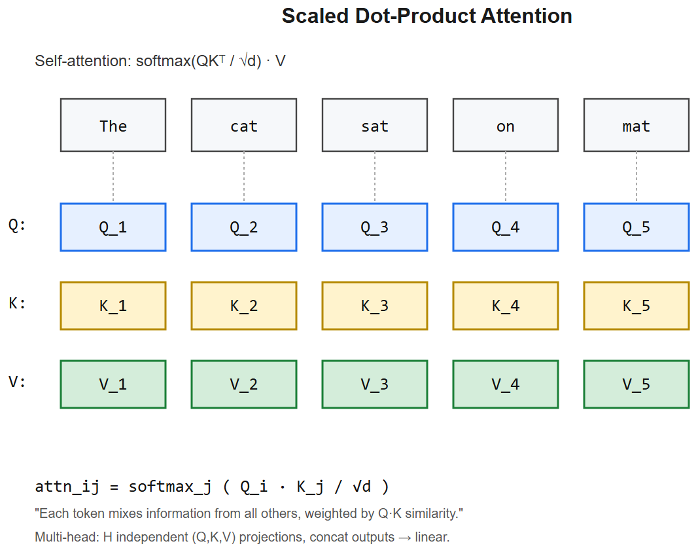

# Embeddings & NLP Basics -- Interview Cheatsheet




## What is an embedding?
A **dense vector** representation of a discrete object (word, sentence, image, user, product) such that **semantic similarity** corresponds to **vector closeness** (cosine / dot product).

## Pre-LLM word embeddings (history)
| Era | Method | Idea |
|-----|--------|------|
| 1990s | **TF-IDF** | Sparse word-frequency vectors weighted by rarity |
| 2003 | LSA | SVD on co-occurrence matrix |
| 2013 | **word2vec** | Predict word from context (CBOW) or context from word (Skip-gram) -- shallow NN |
| 2014 | **GloVe** | Factorize global co-occurrence matrix |
| 2016 | **FastText** | word2vec + subword n-grams -> handles OOV |
| 2018 | **ELMo** | Contextual embeddings from biLSTM |
| 2018+ | **BERT, GPT** | Contextual embeddings from transformer |
| 2022+ | **bge / e5 / OpenAI** | Specialized for retrieval, contrastive training |

## Static vs contextual
- **Static** (word2vec/GloVe): `bank` has ONE vector -- ambiguous (river bank vs financial bank).
- **Contextual** (BERT+): `bank` vector depends on sentence -- disambiguated.
- Modern embedding models for RAG produce **sentence/paragraph embeddings**, not per-word.

## Sentence embedding methods
- **`[CLS]` pooling** -- take BERT's `[CLS]` token vector (works poorly without fine-tuning)
- **Mean pooling** -- average all token embeddings (often better)
- **Sentence-BERT (SBERT)** -- fine-tune with contrastive loss on sentence pairs
- **BGE, E5, GTE** -- modern open-source, trained with InfoNCE on (query, positive, negatives)
- **OpenAI `text-embedding-3-large`** -- 3072 dim, Matryoshka-trained

## Distance / similarity
- **Cosine**: `(a * b) / (||a|| ||b||)` -- angle only, magnitude-invariant
- **Dot product**: equivalent to cosine if vectors are L2-normalized + faster
- **Euclidean**: rarely used for text embeddings
- Always L2-normalize sentence embeddings before search

## Training objectives (what makes embeddings good)
- **Contrastive (InfoNCE)**: pull (query, positive) close, push (query, negatives) far. Modern default.
- **Triplet loss**: anchor, positive, negative -- margin-based
- **Cosine-similarity head**: regress to known similarity scores (STS-B)

## Why dimension size matters
- Higher dim -> more capacity, more storage, slower ANN
- Matryoshka models let you truncate without retraining
- 1024 is typical for retrieval; 768 for smaller open models

## NLP fundamentals (interview classics)

### Tokenization
See [tokenizers-cheatsheet](../03-Transformers-LLMs/tokenizers-cheatsheet.md). BPE / WordPiece / SentencePiece.

### N-grams
Sequences of N consecutive tokens. Bigram = 2 tokens. Used in old language models, BM25 scoring, plagiarism detection. Sparse compared to embeddings.

### TF-IDF
```
tf(t, d) = count(t in d) / |d|
idf(t) = log(N / |{d : t in d}|)
tfidf(t, d) = tf * idf
```
Each doc -> sparse vector over vocab. Cosine for similarity. Still a strong baseline + complements dense in hybrid search.

### BM25 (modern sparse)
TF-IDF refinement with length normalization and TF saturation. Standard sparse retrieval. Implemented in Elasticsearch, Lucene, Tantivy.

### NER (Named Entity Recognition)
Tag tokens as PERSON / ORG / LOC / DATE / MONEY. Old: BiLSTM-CRF. New: fine-tuned BERT or LLM with structured output.

### POS tagging
Mark each word's part of speech (NN, VB, JJ, ...). Now mostly subsumed into LLMs.

### Perplexity
`exp(avg cross-entropy)`. Lower = better language model. Used to compare LMs on held-out text.

### Beam search vs greedy vs sampling
- **Greedy**: pick highest-prob token. Deterministic, often boring.
- **Beam search**: keep K candidates at each step. Better quality, less diverse.
- **Top-K sampling**: sample from top K tokens
- **Top-p (nucleus) sampling**: sample from smallest set with cumulative prob >= p
- **Temperature**: scales logits; lower = more peaked, higher = more uniform

## Common interview Qs

1. *What's an embedding?* A learned dense vector where semantic similarity ~= vector closeness.
2. *Word2vec vs BERT embeddings?* Word2vec = static (one vector per word). BERT = contextual (depends on sentence).
3. *Cosine vs Euclidean?* Cosine ignores magnitude -- good for normalized embeddings. Euclidean cares about magnitude.
4. *Why contrastive loss for retrieval embeddings?* Directly optimizes the property you want -- relevant pairs close, others far.
5. *TF-IDF dead?* No -- strong baseline, and BM25 (its successor) is the sparse half of hybrid RAG.
6. *Why combine dense + sparse?* Dense catches semantics; sparse catches rare exact tokens (IDs, codes, acronyms).
7. *Why does mean pooling beat `[CLS]` without fine-tuning?* BERT's `[CLS]` was trained for NSP, not retrieval -- it's not a great sentence vector out of the box. Mean pooling aggregates information from all tokens.
8. *How do you handle multilingual embeddings?* Use a multilingual model (BGE-M3, multilingual-e5, OpenAI 3-large) -- query and docs go through the **same** model.

## NGU interview anchor
> "NGU's product search uses sentence embeddings to handle phonetic synonyms -- 'haldi', 'manjal', 'turmeric' all map close in vector space if the embedding model is multilingual. We pre-compute product embeddings offline (BGE-M3), store in pgvector, and at query time embed the user query the same way. For exact SKU/brand match we fall through to BM25 -- classic hybrid retrieval. The LLM only generates the *synonym list* offline; the hot path is just vector + sparse search."


---

## Deep dive -- embeddings as geometry

An embedding is a learned map from discrete tokens to ℝᵈ such that **semantic similarity ~= vector similarity** (cosine or dot product).
- **Word2Vec (skip-gram)**: predict surrounding words from centre -- captures syntagmatic regularities, supports analogies via vector arithmetic.
- **GloVe**: factorise word-word co-occurrence matrix -> similar quality with explicit optimisation target.
- **FastText**: subword n-grams -> handles OOV and morphology.
- **Contextual (BERT, GPT)**: same word -> different vector per context (polysemy resolved).
- **Sentence embeddings** (Sentence-BERT, OpenAI text-embedding-3): pool token embeddings or use a [CLS]-style aggregator + contrastive fine-tune.

##  Pitfalls

| Pitfall | Fix |
|---------|-----|
| Cosine vs dot -- different rankings | Normalise vectors before cosine; pick one and stick with it |
| Comparing across models | Embeddings live in different spaces; no direct comparison |
| Stale embeddings on changing vocabulary | Periodic re-embedding |
| Bias in word2vec ("doctor" -> male) | Debiasing (Bolukbasi et al.) or use larger contextual model |
| Tokeniser mismatch in retrieval | Same tokeniser for query and corpus |

## Useful math

- **Cosine similarity**: `cos(u,v) = (u*v)/(||u||*||v||)`.
- **Analogy by arithmetic**: `king - man + woman ~= queen`. Often the closest vector in the corpus is *king* or *queen* -- small details matter.
- **Contrastive loss (InfoNCE)**: pull positives close, push hard negatives apart in batch.

## Interview questions

1. **Why log-bilinear (GloVe) instead of pure skip-gram?** Direct factorisation of the global co-occurrence statistics -- more efficient batch training.
2. **Why contextual embeddings beat static ones?** Words with multiple senses (bank, lead) need different vectors per usage.
3. **How would you evaluate an embedding model?** Intrinsic: word similarity datasets, analogy tests. Extrinsic: downstream task accuracy.
4. **What's the curse of dimensionality for embeddings?** Distances concentrate; cosine becomes less discriminative beyond ~1000d unless training penalises it.
5. **Pooling strategy for sentence embeddings?** Mean-pool > [CLS] for BERT (Reimers & Gurevych 2019); attention pooling for some tasks.

## References
- "Efficient Estimation of Word Representations" (Mikolov et al., 2013)
- "GloVe" (Pennington, Socher, Manning, 2014)
- "Sentence-BERT" (Reimers & Gurevych, 2019)
- "MTEB" leaderboard -- benchmark for embedding models
