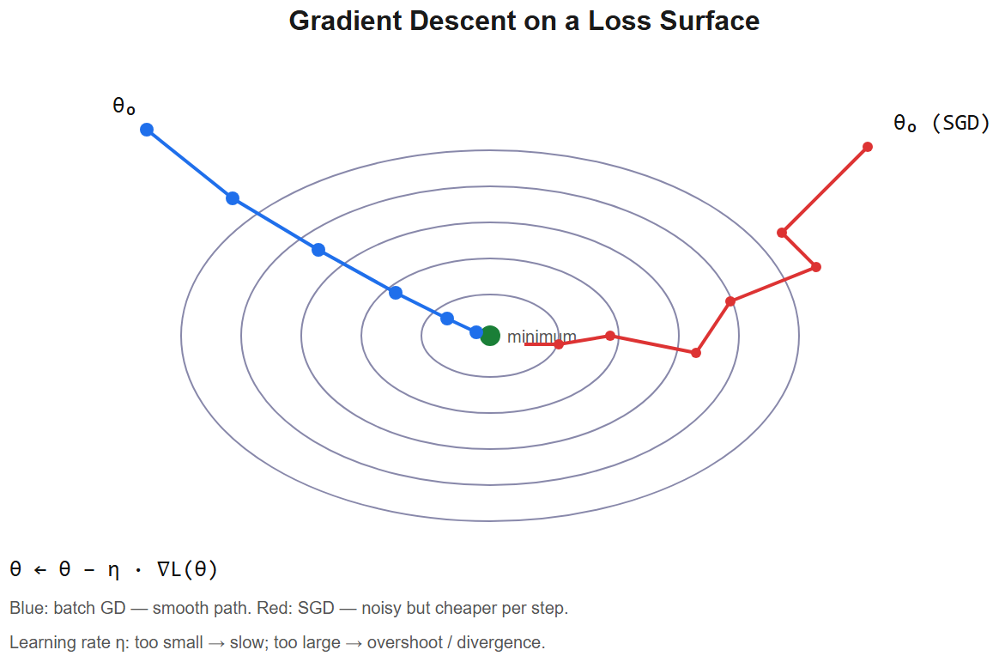
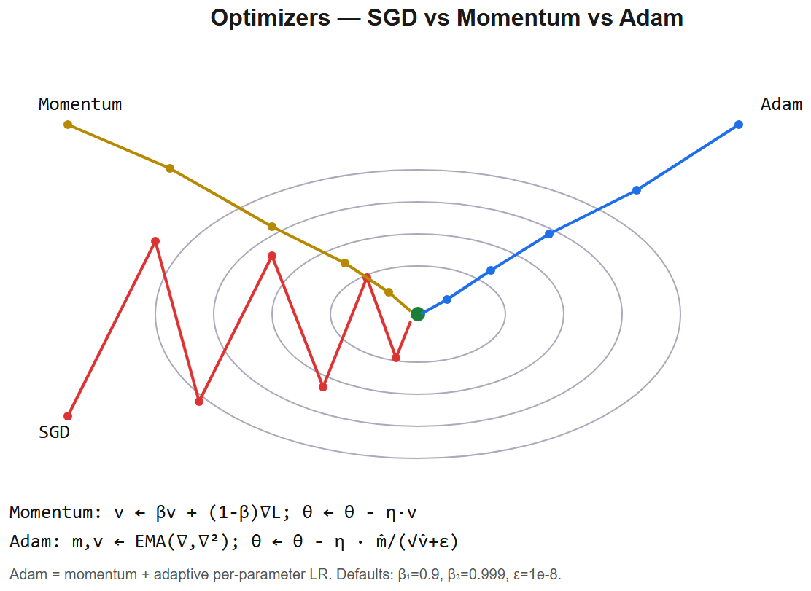

# Gradient Descent & Optimizers -- Interview Cheatsheet





## The core update
```
w <- w - eta * ∇L(w)
```
- `eta` = learning rate
- `∇L` = gradient of loss w.r.t. weights

## Three flavors of GD
| Flavor | Batch size | Pros | Cons |
|--------|-----------|------|------|
| **Batch GD** | full dataset | Smooth gradient | Slow, doesn't fit big data |
| **Stochastic GD (SGD)** | 1 sample | Fast, escapes local mins via noise | Very noisy convergence |
| **Mini-batch SGD** | 32-1024 | **Default** -- vectorized + noisy enough | Need to pick batch size |

## Modern optimizers

### SGD + Momentum
```
v <- beta*v + ∇L           (running gradient avg)
w <- w - eta*v
```
- `beta = 0.9` typical -> "polyak heavy ball"
- Accelerates along consistent gradient directions, damps oscillation
- **Nesterov momentum**: lookahead -- compute gradient at the *anticipated* future point

### Adam (Kingma & Ba, 2014)
Adaptive learning rate per parameter:
```
m <- beta1*m + (1-beta1)*g          (1st moment -- momentum)
v <- beta2*v + (1-beta2)*g^2         (2nd moment -- squared grad)
m̂ = m / (1 - beta1ᵗ)            (bias correction)
v̂ = v / (1 - beta2ᵗ)
w <- w - eta * m̂ / (sqrtv̂ + epsilon)
```
- Defaults: `beta1=0.9, beta2=0.999, epsilon=1e-8`
- Adapts step size -- params with consistently big gradients step less, small grads step more
- **Default for most NN work**

### AdamW (Loshchilov 2017)
Adam with **decoupled weight decay**: instead of adding `lambdaw` to gradient, subtract `lambdaw` directly from `w`:
```
w <- w - eta * (m̂/sqrtv̂ + lambdaw)
```
- Cleaner regularization -- weight decay isn't entangled with the adaptive scaling
- **LLM standard**

### Other notable
- **RMSprop**: precursor to Adam (just the second moment)
- **AdaGrad**: accumulates squared gradients forever -> LR shrinks to 0; rarely used now
- **Lion** (2023): sign of momentum, simpler than Adam, ~50% less memory

## Learning rate schedules
```
        ┌─────────── peak ──────────┐
   warmup                            cosine decay
       /                              \___
      /                                    
     /                                      
    /
   linear warmup -> flat or cosine decay -> optional restart
```
- **Linear warmup**: 0 -> peak over ~1-2% of total steps. Stops Adam from making destructive early updates.
- **Cosine decay**: smooth from peak to ~10% of peak. LLM default.
- **Step decay**: drop by 10x at fixed epochs. Old CV practice.
- **OneCycleLR**: warmup + cosine decay all-in-one. Used in fast.ai.
- **Warmup -> cosine with restarts**: SGDR -- periodic re-heating to escape basins.

## Common loss surfaces issues

### Vanishing gradients
- Symptom: early-layer gradients -> 0
- Causes: saturating activations, deep nets, bad init
- Fix: ReLU/GeLU, normalization, residual connections, careful init

### Exploding gradients
- Symptom: NaN losses or wildly increasing
- Causes: high LR, very deep nets, recurrence
- Fix: **gradient clipping** (`clip_grad_norm_(params, 1.0)`), lower LR

### Saddle points
High-dim loss surfaces have many saddles (vs few local minima). SGD noise + momentum help escape them.

### Sharp vs flat minima
Flat minima generalize better. SGD's noise biases toward flat minima vs full-batch GD.

## Batch size effects
- **Bigger batch** -> less noisy gradient, can use higher LR (linear scaling rule), faster wall-clock
- But: too big -> bad generalization (gets stuck in sharp minima)
- LLM training: bigger is fine because of the LR warmup + cosine + careful tuning

## Mixed-precision training
- Forward + backward in bf16 / fp16
- Optimizer state in fp32 (m, v need precision)
- **Gradient scaling** for fp16 to prevent underflow; bf16 doesn't need it
- Saves ~50% memory + faster GPU ops

## Practical knobs to try when training won't converge
1. Lower LR (10x)
2. Add warmup
3. Clip gradients to 1.0
4. Check init -- bad init kills step 1
5. Reduce batch size + add LR warmup
6. Inspect loss curve: spikes -> bad data or numerical issue
7. Try a smaller model first -- if that won't train, your data/pipeline is wrong

## Interview one-liners
- *Why SGD over batch GD?* Mini-batches give noisy gradients -> escape saddles + faster wall-clock + fits big data.
- *Adam vs SGD?* Adam adapts per-parameter LR via running 2nd moment of gradients. Tends to converge faster but sometimes generalizes worse than SGD+momentum on CV. Standard for NLP/LLMs.
- *Why AdamW over Adam?* Decouples weight decay from the adaptive LR scaling -> cleaner regularization, better generalization.
- *Why warmup?* Adam's moment estimates are noisy at step 1; warmup avoids destructive early updates.
- *Cosine decay?* Smooth LR decay from peak to ~10% -- empirically beats step decay for transformers.
- *Gradient clipping?* Cap `||grad|| <= tau` to prevent exploding gradients. Standard at norm 1.0 in LLM training.
- *Why mini-batch noise helps generalization?* Acts like implicit regularization, biases toward flat minima.

## Statcon interview anchor
> "When training the RUL prediction model on battery cycle data, I had a small dataset and used SGD with momentum + early stopping rather than Adam -- same finding as the Wilson 2017 paper, that SGD+momentum sometimes generalizes better than Adam on small data. For deep learning experiments I always start with AdamW + linear warmup + cosine decay -- the LLM-standard recipe."


---

## Deep dive -- why SGD generalises

Counterintuitively, the *noise* in SGD is a feature, not a bug. It biases optimisation toward **flat minima** which empirically generalise better than the sharp minima that exact GD finds. Recent theory (Smith & Le, Wu et al.) treats SGD as a stochastic differential equation; its stationary distribution favours wide basins.

##  Common pitfalls

| Pitfall | Fix |
|---------|-----|
| Same LR for all params | Use Adam/Adagrad/RMSprop |
| LR untuned | LR finder (Smith 2017): sweep, plot loss vs LR |
| No warmup -> unstable early steps | Linear warmup over first few % of steps |
| Adam diverges on small/sparse data | Try AdamW or SGD+momentum |
| Gradient explosion (RNNs, transformers) | Clip global gradient norm to 1.0 |
| Adam + L2 vs weight decay | They differ! Use AdamW for correct decoupled weight decay |

## Optimiser equations

| Optimiser | Update rule |
|-----------|-------------|
| SGD | `theta <- theta - eta*g` |
| Momentum | `v <- betav + g;  theta <- theta - eta*v` |
| Nesterov | look-ahead: gradient at `theta - betav` |
| Adagrad | `theta <- theta - eta*g/sqrt(Sigmag^2+epsilon)` |
| RMSprop | `s <- betas + (1-beta)g^2;  theta <- theta - eta*g/(sqrts+epsilon)` |
| Adam | `m <- beta1m + (1-beta1)g;  v <- beta2v + (1-beta2)g^2;  theta <- theta - eta*m̂/(sqrtv̂+epsilon)` |
| AdamW | Adam + decoupled L2: `theta <- theta - eta*(m̂/(sqrtv̂+epsilon) + lambdatheta)` |
| Lion (2023) | Sign of momentum direction; 2x memory cheaper than Adam |

## Interview questions

1. **Why divide by sqrtv in Adam?** Per-parameter step size adaptation -- small for high-variance grads, large for stable ones.
2. **Why bias correction (`m̂ = m / (1-beta1ᵗ)`)?** Early in training m and v are biased toward zero; the correction undoes it.
3. **Batch size vs LR coupling?** Bigger batches usually need bigger LR (linear scaling rule, Goyal et al. 2017).
4. **What's a good LR schedule for transformers?** Linear warmup -> cosine decay; warmup over ~1-10% of total steps.
5. **When is SGD+momentum preferred to Adam?** Vision (ConvNets), where it often generalises better; finetuning where small steps matter.

## References
- "Adam: A Method for Stochastic Optimization" (Kingma & Ba, 2014)
- "Decoupled Weight Decay Regularization" (Loshchilov & Hutter, 2017)
- "Super-Convergence" (Smith, 2018) -- LR finder, 1-cycle policy
