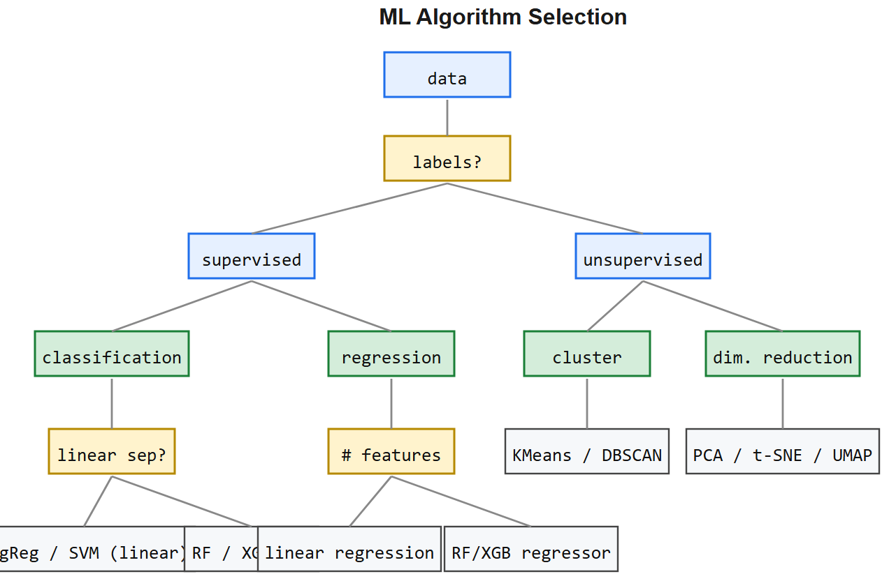
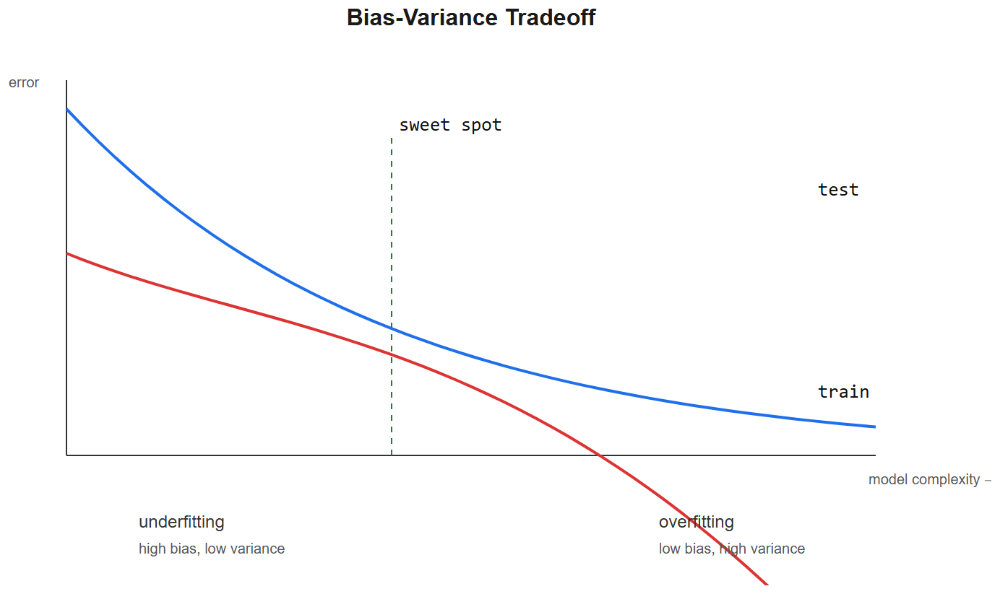
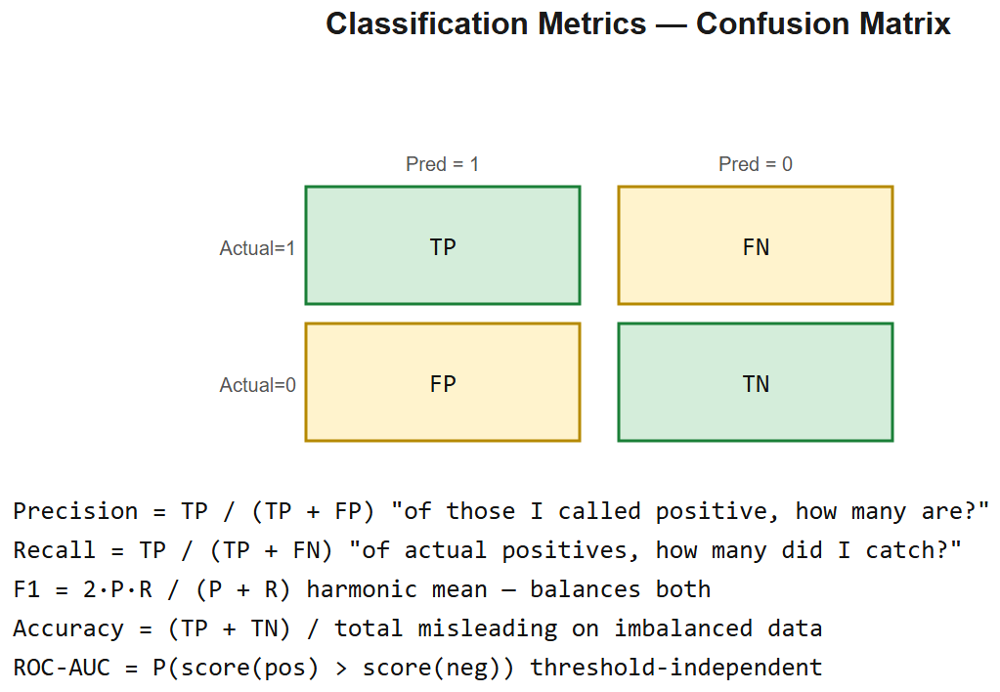

# Classical ML Algorithms -- Interview Cheatsheet

## Algorithm quick-reference

| Algorithm | Type | Loss / Objective | When |
|-----------|------|------------------|------|
| **Linear regression** | Regression | MSE | Continuous output, linear relationship |
| **Logistic regression** | Classification | Cross-entropy | Binary class, interpretable, linear boundary |
| **Decision tree** | Both | Gini / entropy | Interpretable, non-linear, small data |
| **Random forest** | Both | Bagged trees | Tabular, robust baseline |
| **XGBoost / LightGBM** | Both | Boosted trees + reg | **Tabular SOTA**, Kaggle default |
| **SVM** | Classification | Hinge + margin | Small data, kernel trick for non-linear |
| **K-means** | Clustering | Within-cluster SS | Unsupervised grouping |
| **KNN** | Both | Distance | Lazy learning, low-dim, small data |
| **Naive Bayes** | Classification | MLE | Text baseline, very fast |
| **PCA** | Dim reduction | Variance maximization | Feature compression, visualization |

## Bias-variance tradeoff
- **High bias** = underfit (model too simple) -- both train and val loss high
- **High variance** = overfit (memorizes train) -- train low, val high
- **Total error** = bias^2 + variance + irreducible noise
- Lever: model complexity, regularization (L1/L2), data size

## Regularization
- **L1 (Lasso)**: `lambda*Sigma|w|` -> drives weights to zero -> feature selection
- **L2 (Ridge)**: `lambda*Sigmaw^2` -> shrinks weights smoothly
- **Elastic Net**: weighted combo
- **Dropout** (NN): randomly zero activations during training
- **Early stopping**: halt when val loss climbs
- **Data augmentation**: cheapest regularizer

## Tree-based learning (memorize for tabular interviews)
- **Decision tree**: greedy splits maximizing info gain / Gini reduction
- **Bagging (Random Forest)**: train N trees on bootstrap samples + random feature subsets -> average
- **Boosting (XGBoost/LightGBM/CatBoost)**: train trees sequentially, each correcting previous errors via gradient on residuals
- **Why GBMs beat NNs on tabular**: tabular features are heterogeneous and non-smooth; trees handle that natively, NNs need careful normalization + lots of data

## Evaluation metrics (know which when)

### Classification
| Metric | Formula | When |
|--------|---------|------|
| **Accuracy** | (TP+TN)/all | Balanced classes only |
| **Precision** | TP/(TP+FP) | False positives expensive (spam) |
| **Recall** | TP/(TP+FN) | False negatives expensive (cancer screen) |
| **F1** | 2PR/(P+R) | Single number, balanced |
| **AUC-ROC** | Area under TPR-FPR curve | Ranking quality, threshold-independent |
| **AUC-PR** | Area under P-R curve | Imbalanced datasets (better than ROC) |

### Regression
- **MSE** / RMSE -- penalizes large errors more (sensitive to outliers)
- **MAE** -- robust to outliers
- **R^2** -- variance explained (0=no better than mean, 1=perfect)

### Imbalanced classes (always asked)
- Don't trust accuracy -- predict majority class beats it
- Use precision/recall/F1 + class weights or oversampling (SMOTE)
- PR-AUC > ROC-AUC for severe imbalance

## Feature engineering essentials
- **Numerical**: scaling (StandardScaler / MinMax), log transform for skewed, binning for non-linear
- **Categorical**: one-hot (small cardinality), target encoding (high cardinality), embeddings (DL)
- **Time-series**: lag features, rolling mean/std, datetime parts, exponential moving averages
- **Text**: TF-IDF, embeddings
- **Interactions**: explicit `a x b`, `a / b`, polynomial features

## Train/val/test discipline
- **Hold-out test set never touched** until final eval
- **K-fold CV** for small datasets
- **Time-series**: respect time order -- no leakage from future
- **Stratified split** for imbalanced classes
- **Group split** if you have related samples (same user / patient / batch)

## Interview one-liners
- *Why XGBoost beats deep nets on tabular?* Tabular features are heterogeneous; trees handle non-smooth feature spaces natively without normalization.
- *Bias-variance?* High bias = underfit, high variance = overfit. Total error = bias^2 + var + noise.
- *L1 vs L2?* L1 -> sparse weights (feature selection). L2 -> small but non-zero weights (smooth shrinkage).
- *When precision over recall?* When false positives are expensive (spam filter, fraud accusation).
- *Why AUC-PR for imbalance?* ROC AUC stays high with majority-class predictions; PR-AUC reflects how well positives are ranked.
- *K-means assumptions?* Clusters are convex, equal variance, similar size -- fails on rings, varying density. Use DBSCAN or GMM instead.

## Statcon interview anchor (RUL prediction)
> "On the NASA Battery Dataset, I framed RUL as a regression problem. Tried gradient-boosted trees on hand-engineered time-series features (rolling mean of voltage, capacity decay rate, cycle-since-last-discharge) vs LSTM on raw discharge curves. GBM won on small dataset + interpretability -- feature importance directly told me capacity decay was the dominant signal. Classic case where tabular features + XGBoost beat a deep model."

---

## Deep dive -- picking the right model

### Linear / Logistic Regression
- Pros: interpretable, fast, calibrated probabilities.
- Cons: assumes linearity; underfits complex data.
- Key knob: regularisation `C = 1/lambda`.
- Use when: features are well-engineered, you need explainability.

### Decision Trees
- Pros: handle mixed types, no scaling, interpretable splits.
- Cons: high variance -- small data change => different tree.
- Key knob: max_depth, min_samples_leaf.

### Random Forest (bagging)
- Pros: low-variance via averaging many decorrelated trees.
- Cons: less interpretable than a single tree; can be memory heavy.
- Key knob: n_estimators, max_features (sqrtp for classification, p/3 for regression).

### Gradient Boosting (XGBoost / LightGBM / CatBoost)
- Pros: state-of-the-art on tabular data; handles missing values; built-in regularisation.
- Cons: tuning is non-trivial; can overfit on small data.
- Key knobs: learning_rate, n_estimators, max_depth, min_child_weight, subsample, colsample_bytree.

### SVM
- Pros: works in high dimensions; kernel trick for nonlinear boundaries.
- Cons: doesn't scale beyond ~50k samples; no native probabilities.
- Key knob: C (regularisation), kernel (rbf, poly, linear), gamma.

### KNN
- Pros: zero training cost; intuitive.
- Cons: slow at inference; curse of dimensionality.
- Use when: small dataset, low dimension, locally smooth target.

### Naive Bayes
- Pros: fast, good for text; works on tiny data.
- Cons: assumes feature independence (often false).

### K-Means / DBSCAN
- K-Means: k known, spherical clusters, sensitive to init.
- DBSCAN: density-based, finds arbitrary shapes, identifies noise.

##  Common pitfalls

| Pitfall | Fix |
|---------|-----|
| Class imbalance | `class_weight='balanced'`, oversample (SMOTE), focal loss |
| Data leakage | Fit scaler/encoder ONLY on train; pipeline.pipeline_ |
| Train/test split with time-series | Use TimeSeriesSplit, NOT random |
| Tuning on test set | Use train / val / test; cross-validate on train |
| Calibration ignored | Platt scaling / isotonic for prob-sensitive apps |
| Trusting accuracy on imbalanced data | Use PR-AUC, F1, recall |

## Bias-variance and the U-curve

`E[(y - ŷ)^2] = Bias^2 + Variance + IrreducibleError`

- High bias -> underfit -> simpler model or more features.
- High variance -> overfit -> more data, regularise, simpler model, ensemble.

## Interview questions

1. **Why does bagging reduce variance and not bias?** Averaging i.i.d. estimators cuts variance by 1/n; bias is unchanged.
2. **Boosting vs bagging -- different bias-variance behaviour?** Boosting reduces bias by sequentially fitting residuals; can overfit.
3. **When trees, when neural nets on tabular data?** Trees usually win on small/medium tabular (<=100k rows). Nets shine when there's structure (images, text, sequences).
4. **Why do RF feature importances mislead?** Biased toward high-cardinality features; use permutation importance for fairness.
5. **L1 vs L2 -- when to use which?** L1 for sparsity / feature selection; L2 for stability / small weights.
6. **What's PR-AUC and when is it better than ROC-AUC?** Precision-Recall AUC is more informative when positives are rare.

## References
- *The Elements of Statistical Learning* (Hastie, Tibshirani, Friedman)
- "XGBoost: A Scalable Tree Boosting System" (Chen & Guestrin, 2016)
- *Hands-On ML* (Aurélien Géron) -- practical comparisons
