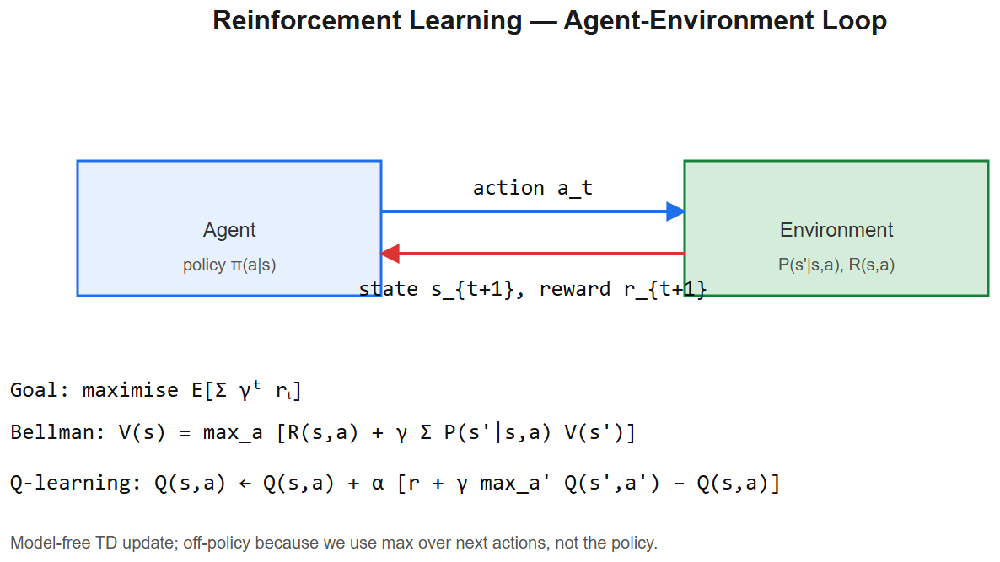

# Reinforcement Learning -- Interview Cheatsheet



> RL became LLM-critical via RLHF (ChatGPT, Claude). Even if you don't ship RL, **expect questions** because of the alignment context.

## The framework -- Markov Decision Process (MDP)
```
state s -> agent picks action a -> environment returns (reward r, next state s')
```
- **State** `s` -- observation of the world
- **Action** `a` -- what the agent does
- **Reward** `r` -- scalar feedback signal
- **Policy** `pi(a|s)` -- agent's action-choosing rule (the thing we train)
- **Discount factor** `gamma in [0,1)` -- how much future reward matters
- **Return** `G_t = r_t + gammar_{t+1} + gamma^2r_{t+2} + ...` -- cumulative discounted reward

**Goal**: find `pi` that maximizes expected return.

## Value functions
- **State value**: `V^pi(s) = E_pi[G_t | s_t=s]` -- expected return from `s` under `pi`
- **Action value**: `Q^pi(s, a) = E_pi[G_t | s_t=s, a_t=a]` -- expected return after taking `a` in `s`
- **Bellman equation** (recursive definition):
  ```
  Q^pi(s, a) = E[r + gamma * Q^pi(s', a')]
  ```

## Algorithm families

### Value-based
Learn `Q(s, a)`; act greedily.
- **Q-learning**: tabular, off-policy. `Q(s,a) <- Q(s,a) + alpha(r + gamma max_a' Q(s',a') - Q(s,a))`
- **DQN** (Mnih 2013): Q-learning with neural network + replay buffer + target network -> played Atari from pixels

### Policy-based
Directly learn `pi_theta(a|s)`; update via policy gradient.
- **REINFORCE**: `∇_theta J = E[∇_theta log pi_theta(a|s) * G_t]`
- High variance; baseline subtraction reduces it

### Actor-critic (hybrid)
- **Actor** = policy `pi_theta`
- **Critic** = value estimator `V_phi` or `Q_phi`
- Use critic to reduce policy-gradient variance via advantage `A(s,a) = Q(s,a) - V(s)`
- Algorithms: A2C, A3C, DDPG, SAC, **PPO**, TRPO

### PPO (Proximal Policy Optimization, Schulman 2017)
The workhorse. Clipped objective:
```
L = E[min( r(theta)*A, clip(r(theta), 1-epsilon, 1+epsilon)*A )]
where r(theta) = pi_theta(a|s) / pi_old(a|s)
```
- Stops policy from changing too much per update -> stable
- Used in **RLHF** for ChatGPT, Llama, etc.

## Exploration vs exploitation
- **epsilon-greedy**: with prob epsilon pick random action; else greedy
- **Boltzmann**: sample proportional to `exp(Q(s,a)/T)`
- **Entropy bonus**: add `+betaH(pi)` to encourage diverse actions
- **Curiosity / intrinsic reward**: bonus for visiting novel states (sparse-reward problems)

## On-policy vs off-policy
- **On-policy** (PPO, A2C): learn from data generated by current policy. Sample-inefficient, stable.
- **Off-policy** (Q-learning, DQN, DDPG, SAC): can use any past data via replay buffer. Sample-efficient, can diverge.

## RLHF -- RL meets LLMs

> See [fine-tuning cheatsheet](../03-Transformers-LLMs/fine-tuning-cheatsheet.md) for full detail

Three stages:
1. **SFT** -- supervised fine-tune on instruction-response demonstrations
2. **Reward model** -- train scalar reward from `(prompt, response_A, response_B, preferred)` human-labeled pairs
3. **PPO** -- RL the SFT model to maximize reward + KL penalty back to SFT (stops mode collapse)

State = prompt + tokens-so-far. Action = next token. Reward = scalar from RM at end of response.

## DPO (Direct Preference Optimization)
Skip the explicit reward model. Optimize SFT model directly on preference pairs with a closed-form supervised loss. **Default in 2024-26** because it's stable and single-stage.

## Common pitfalls / interview material
- **Reward hacking** -- agent gains reward via shortcuts not aligned with intent. LLM example: model learns to repeat flattering phrases the reward model likes.
- **Catastrophic forgetting** -- finetuning erases base capabilities. KL penalty in RLHF protects against this.
- **Sparse rewards** -- gradient signal weak; use shaping or intrinsic motivation.
- **Sample inefficiency** -- RL takes orders of magnitude more data than supervised learning.
- **Reproducibility** -- RL is famously unstable; seed sensitivity high; report mean +/- std over many seeds.

## Where RL is actually used today
1. **RLHF / DPO** for LLM alignment (every chat model)
2. **Recommender ranking** (Netflix, YouTube -- contextual bandits)
3. **Robotics** (some)
4. **Games / AlphaGo / AlphaZero**
5. **Trading** (some, limited)

Most "AI" production systems don't use RL because supervised + classical optimization works better and is more predictable.

## Interview one-liners
- *MDP?* State, action, reward, transition. Goal: maximize expected discounted return.
- *Q-learning?* Learn `Q(s,a)`, act greedily. Off-policy temporal-difference learning.
- *Why PPO?* Clipped objective limits per-step policy change -> stable. Sample-efficient enough + simple. Used in RLHF.
- *On vs off policy?* On-policy uses only current-policy data (PPO); off-policy can reuse old data (DQN, SAC).
- *Bellman equation?* `Q(s,a) = E[r + gamma * max_a' Q(s', a')]` -- basis of all value-based methods.
- *What's the reward in RLHF?* Scalar score from a reward model trained on human preferences (A > B comparisons).
- *Why KL penalty in RLHF?* Keeps the policy close to the SFT model so it doesn't collapse into a degenerate mode that maxes reward but loses fluency.
- *DPO vs RLHF?* DPO directly optimizes preferences via a supervised loss -- no reward model, no PPO. Default choice in 2026.
- *Reward hacking example?* Cleaning-robot reward = no visible dust -> robot turns off the lights. RLHF version: model learns to write longer answers because long was correlated with quality in labels.

## Why interviewers ask about RL
- Tests whether you understand *why* RLHF / DPO are training tricks for LLMs, not magical alignment
- Probes if you can spot reward-hacking risks in any feedback-driven system (rec sys, agents)
- AIAAS's HITL approval gates are a form of human reward signal -- connect the dots in interviews


---

## Deep dive -- RL formalism

An MDP is a tuple `(S, A, P, R, gamma)`:
- **S** states, **A** actions
- **P(s'|s,a)** transition, **R(s,a)** reward
- **gamma in [0,1)** discount factor

Goal: find policy pi that maximises `V^pi(s) = E[Sigma_{t>=0} gammaᵗ R(sₜ,aₜ)]`.

Two value functions:
- **State value** `V(s)` -- expected return starting from s.
- **Action value** `Q(s,a)` -- expected return after taking a in s.

**Bellman optimality:**
```
V*(s) = max_a [R(s,a) + gamma Sigma P(s'|s,a) V*(s')]
Q*(s,a) = R(s,a) + gamma Sigma P(s'|s,a) max_a' Q*(s',a')
```

## Method matrix

| Method | Type | Update | Notes |
|--------|------|--------|-------|
| Dynamic Programming | Model-based | full sweep | Requires P,R known |
| Monte Carlo | Model-free | episode-end | Unbiased; high variance |
| TD(0) | Model-free | per step | Biased; low variance |
| Q-learning | Off-policy TD | `Q <- Q + alpha[r + gamma max Q'-Q]` | Learns greedy policy |
| SARSA | On-policy TD | `Q <- Q + alpha[r + gamma Q(s',a')-Q]` | Learns epsilon-greedy |
| Policy gradient (REINFORCE) | Model-free | `∇theta J = E[∇log pi * G]` | High variance |
| Actor-Critic (A2C, A3C) | Hybrid | actor=policy, critic=value | Lower variance |
| PPO | Policy gradient | clipped surrogate | Stable, default for LLM RLHF |
| DQN | Off-policy + NN | experience replay, target net | Atari breakthrough |

##  Pitfalls

| Pitfall | Fix |
|---------|-----|
| Sparse rewards | Reward shaping, curriculum, intrinsic motivation |
| Bootstrap divergence (deadly triad) | Target network + experience replay |
| Policy collapse | Entropy bonus in objective |
| Stale critic | Slow-tracking target network (tau=0.005) |
| Reward hacking | Constrain or use RLHF preferences |

## Interview questions

1. **On-policy vs off-policy?** On-policy (SARSA, PPO) updates the policy that's generating the data. Off-policy (Q-learning, DQN) can learn from any past data.
2. **Why a target network in DQN?** Stabilises bootstrapping -- without it, Q chases a moving target.
3. **What is the policy gradient theorem?** `∇theta J(theta) = E_tau[Sigma ∇theta log pi(a|s) * R(tau)]` -- gradient of expected return w.r.t. policy params equals expectation of log-prob-grad weighted by return.
4. **What's PPO's "clip" about?** Penalises updates that move the policy more than epsilon from the previous one -- improves stability vs. vanilla policy gradient.
5. **RLHF in LLMs -- pipeline?** SFT on demonstrations -> reward model from human pairwise prefs -> PPO against reward model with KL penalty to base.

## References
- *Reinforcement Learning: An Introduction* (Sutton & Barto, 2nd ed.)
- "Playing Atari with Deep RL" (DQN, Mnih et al. 2013)
- "Proximal Policy Optimization" (Schulman et al., 2017)
