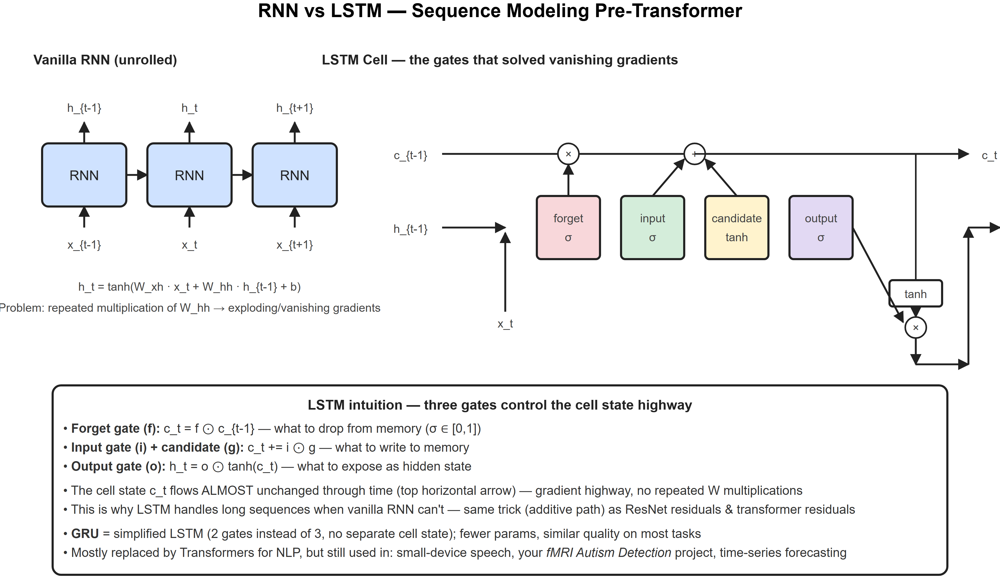
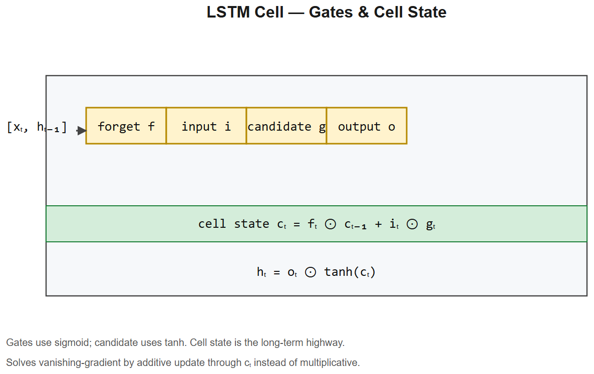

# RNN * LSTM * GRU -- Interview Cheatsheet





>  [RNN unrolled + LSTM gates diagram](diagrams/03-rnn-lstm.png)

## Vanilla RNN
```
h_t = tanh(W_xh * x_t + W_hh * h_{t-1} + b)
y_t = W_hy * h_t
```
- Processes sequence one step at a time
- Hidden state `h_t` carries context forward
- **Cannot be parallelized along time** -> slow training (why transformers replaced them)
- **Vanishing/exploding gradients** through repeated W_hh multiplications -> can't learn long dependencies

## LSTM -- gated memory

>  See [diagrams/03-rnn-lstm.svg](diagrams/03-rnn-lstm.png) for the cell diagram

**Three gates** + a cell state `c_t` that flows almost unchanged:

```
f_t = sigma(W_f * [h_{t-1}, x_t])      forget gate  (what to drop from memory)
i_t = sigma(W_i * [h_{t-1}, x_t])      input gate   (how much to write)
g_t = tanh(W_g * [h_{t-1}, x_t])   candidate    (what to write)
o_t = sigma(W_o * [h_{t-1}, x_t])      output gate  (what to expose)

c_t = f_t (.) c_{t-1} + i_t (.) g_t    cell state update
h_t = o_t (.) tanh(c_t)              hidden state output
```

### Why LSTM solves vanishing gradients
The cell-state update is **additive**, not multiplicative -- gradients flow through `+` without shrinking. Same trick as ResNet residuals and transformer residual streams.

## GRU -- simplified LSTM
- 2 gates instead of 3 (reset + update)
- No separate cell state -- `h_t` carries both memory and output
- Fewer params, similar quality on most tasks

```
r_t = sigma(W_r * [h_{t-1}, x_t])      reset gate
z_t = sigma(W_z * [h_{t-1}, x_t])      update gate
h̃_t = tanh(W * [r_t (.) h_{t-1}, x_t])
h_t = (1 - z_t) (.) h_{t-1} + z_t (.) h̃_t
```

## Bidirectional RNN
- Run one RNN forward, one backward, concat outputs
- Used in NER, POS tagging -- when you can see the whole sequence at once
- Not for streaming / generation

## seq2seq + attention (the bridge to transformers)
- Encoder LSTM compresses input into a context vector
- Decoder LSTM generates output from context
- **Bottleneck**: single vector for entire input -> fails on long sequences
- **Bahdanau attention (2015)**: decoder attends to encoder hidden states at each step -> fixed the bottleneck
- This attention mechanism, scaled up and made self-attention, became the Transformer

## When still use RNN/LSTM today
- **Streaming inference** (audio, real-time sensors) -- process one timestep at a time
- **Small models on edge devices** (tinyML)
- **Speech recognition** (some pipelines still use RNN-T)
- **Time-series forecasting** (alongside Prophet, transformers, GBM)
- Your fMRI autism project -- small data, sequence over time, LSTM was sensible

## Interview one-liners
- *Why vanishing gradients in RNN?* Repeated multiplication by W_hh; if eigenvalues <1, gradient -> 0 over time steps.
- *How does LSTM fix it?* Additive cell-state update + multiplicative gates only on inputs/outputs. Gradient flows through `+` unchanged.
- *LSTM vs GRU?* GRU = 2 gates, no separate cell state, fewer params, similar quality. Try GRU first for smaller data.
- *Why did transformers replace RNNs?* RNN is inherently sequential -> can't parallelize across time. Transformer self-attention processes all positions simultaneously -> 100x faster training.
- *Bidirectional vs unidirectional?* Bi sees full sequence at once (encoding tasks); uni is causal (generation tasks).
- *Truncated BPTT?* Backprop only over last K timesteps to bound memory; loses very-long dependencies.

## fMRI / time-series interview anchor
> "On the Autism fMRI project, I used an autoencoder to compress each 3D brain volume into a low-dim latent, then ran an LSTM over the sequence of latents per subject. Two-stage approach -- CNN/autoencoder for spatial features, LSTM for temporal -- was the standard pattern before video transformers. If I redid it today I'd try a small 3D ViT or temporal transformer over the same latents."


---

## Deep dive -- why RNNs vanish

In a vanilla RNN, `h_t = tanh(W h_{t-1} + U x_t)`. Unrolling, the gradient w.r.t. an early hidden state involves the product `∏ Wᵀ * diag(tanh')` over many time steps. If the spectral radius of W is < 1, the product shrinks exponentially -> **vanishing**. If > 1 -> **exploding** (mitigated by gradient clipping).

**LSTM fix:** the cell state `c_t = f_t (.) c_{t-1} + i_t (.) g_t` is **additive**. Gradients flow through the cell state with multiplicative weights only when gates close -- far gentler than the dense matrix product.

**GRU** simplifies LSTM to two gates (reset, update); often comparable performance with 25% fewer parameters.

##  Pitfalls

| Pitfall | Fix |
|---------|-----|
| Sequence too long | Truncated BPTT (typical window 100-500) |
| Padding messes up loss | Mask padding tokens explicitly |
| Bidirectional in decoders | Don't -- can't see future at inference |
| Sequence length affects batching | Bucket by length or use pad+pack |
| Vanishing on tasks > 1000 steps | Replace with transformer / state-space model |

## LSTM equations (memorise!)

```
f_t = sigma(W_f * [x_t, h_{t-1}] + b_f)            forget
i_t = sigma(W_i * [x_t, h_{t-1}] + b_i)            input
g_t = tanh(W_g * [x_t, h_{t-1}] + b_g)         candidate
o_t = sigma(W_o * [x_t, h_{t-1}] + b_o)            output
c_t = f_t (.) c_{t-1} + i_t (.) g_t                cell update
h_t = o_t (.) tanh(c_t)                          hidden
```

## Interview questions

1. **Why does LSTM solve vanishing gradients?** Additive cell-state path bypasses the multiplicative chain.
2. **GRU vs LSTM?** GRU merges cell and hidden state, no output gate -- fewer params, comparable performance on most tasks.
3. **What does sequence-to-sequence with attention do that vanilla seq2seq doesn't?** Lets decoder look back at *all* encoder states, not just the final hidden.
4. **When use RNNs in 2026?** Streaming low-latency contexts where small models matter; mostly transformers dominate.
5. **Teacher forcing -- pros/cons?** Faster convergence; train-test mismatch; mitigations: scheduled sampling.

## References
- Colah's blog: "Understanding LSTMs" (must-read)
- "Empirical Evaluation of Gated Recurrent Neural Networks" (Chung et al., 2014)
