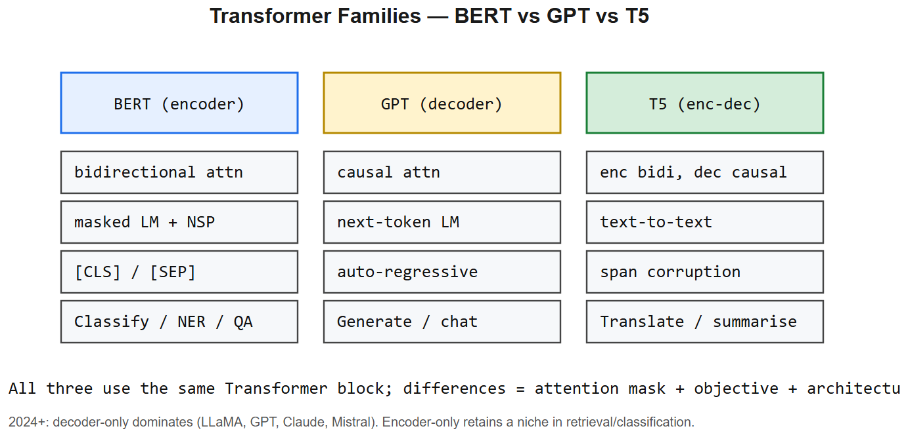

# BERT vs GPT -- Interview Cheatsheet

## Side-by-side
| Aspect | **BERT** (encoder-only) | **GPT** (decoder-only) |
|--------|-------------------------|-------------------------|
| Attention | Bidirectional (sees all tokens) | Causal (left-to-right only) |
| Pre-training objective | Masked LM (15% of tokens masked) + Next Sentence Prediction (NSP) | Next-token prediction |
| Best at | Classification, NER, embeddings, semantic search | Generation, chat, code, in-context learning |
| Output | Per-token vectors, `[CLS]` for whole-sequence | Next-token logits autoregressively |
| Scale today | 110M-340M params (still standard for embeddings) | Frontier 100B-2T+ params |
| Key examples | RoBERTa, DistilBERT, DeBERTa, MiniLM, BGE | GPT-3/4/5, Claude, Llama, Mistral, Qwen |

## BERT essentials
- **Input**: `[CLS] seg_A [SEP] seg_B [SEP]` -- `[CLS]` token used for classification
- **MLM**: replace 15% of tokens with `[MASK]` (80%), random (10%), unchanged (10%); predict originals
- **NSP**: predict whether seg_B follows seg_A (RoBERTa removes this -- it didn't help)
- **Tokenizer**: WordPiece, vocab ~= 30k
- **Pos embed**: learned absolute, max_len = 512 (the famous limit)
- **Fine-tuning**: add a small classification head on `[CLS]`, train on labeled data

## GPT essentials
- **Decoder-only stack**, no encoder, no cross-attention
- **Causal mask** -- token `i` cannot see `j > i`
- **Next-token prediction** loss over the entire sequence
- **Tokenizer**: BPE (GPT-2/3/4 use BPE variants)
- **Pos embed**: learned absolute in GPT-2/3; **RoPE** in Llama / Mistral / Qwen
- **No NSP**, no MLM -- single objective that scales beautifully

## Why decoder-only won the LLM era
1. **Single training objective** (next-token) scales cleanly with data + params (Chinchilla)
2. **In-context learning** emerges -- few-shot prompting just works
3. **Unified interface**: classification, QA, summarization all become generation
4. **Chat is naturally generation** -- long prompt + autoregressive reply

## When to still use BERT-family (encoder)
- **Embedding models** for RAG (BGE, e5, gte) -- all encoder-derived
- **Classification with tiny latency budget** (DistilBERT/MiniLM at 50ms CPU)
- **NER, token tagging** -- bidirectional context helps
- **Cross-encoder rerankers** (bge-reranker, ms-marco-MiniLM)

## Interview one-liners
- *Difference?* Encoder bidirectional, MLM; decoder causal, next-token. BERT for understanding, GPT for generation.
- *Why does BERT need both `[CLS]` and `[SEP]`?* `[SEP]` separates segments; `[CLS]` aggregates the whole sequence into a single vector via the final layer.
- *Why does GPT not have `[CLS]`?* Sequence-level signal lives in the last token's hidden state.
- *Why MLM and not next-token for BERT?* Because BERT is bidirectional; next-token would be trivial (it can already see the answer).
- *T5/BART are encoder-decoder -- when do you use them?* Translation, summarization where input and output structure differ. Mostly replaced by big decoder-only models, but still SOTA per parameter on translation.

## NGU interview anchor
> "For the NGU Spices AI-search feature, I'd use a BERT-family embedding model (BGE or multilingual-e5) to embed product names and queries -- fast inference, bidirectional context catches phonetic synonyms like 'haldi' ↔ 'turmeric', and the index is built once. The generative LLM only comes in for synonym expansion offline, not the hot path."

---

## Deep dive -- the three transformer families

| Model | Direction | Objective | Output use |
|-------|-----------|-----------|------------|
| **BERT** | bidirectional | MLM (mask 15% of tokens) + NSP | classification, NER, QA via fine-tune |
| **GPT** | causal (left-to-right) | next-token prediction | generation (zero/few-shot, chat) |
| **T5** | enc-dec | span-corruption to text | translation, summarisation, anything text-to-text |

GPT's autoregressive objective is the simplest and scales beautifully -- that's why decoder-only dominates 2023+.

## Pretraining objectives

- **MLM (BERT)**: mask 15% of tokens; predict them from bidirectional context.
- **CLM (GPT)**: predict next token given previous.
- **Span corruption (T5)**: replace spans with sentinel tokens, predict span contents.
- **Permutation LM (XLNet)**: bidirectional context but autoregressive prediction.
- **ELECTRA**: replaced-token detection -- small generator corrupts, discriminator classifies real/fake. ~4x sample-efficient.

##  Pitfalls

| Pitfall | Fix |
|---------|-----|
| Using BERT for generation | It's not generative -- use GPT/T5 |
| Comparing perplexity across tokeniser vocabs | Convert to bits-per-byte |
| Fine-tuning entire BERT for a tiny dataset | Freeze low layers; or use adapters / LoRA |
| Forgetting [CLS] / [SEP] in BERT inputs | Add them per task format |

## Interview questions

1. **Why is BERT bidirectional but GPT isn't?** Different objectives -- MLM allows seeing both sides of mask; CLM cannot peek ahead during training.
2. **Why does GPT generalise to many tasks via prompting?** Next-token prediction is a universal task; large-enough models memorise patterns of how problems map to solutions.
3. **What's wrong with NSP, and why did RoBERTa drop it?** NSP was too easy; dropping it + longer training + bigger batches -> better embeddings.
4. **Encoder vs decoder for retrieval embeddings?** Encoder (BERT-style) usually better -- bidirectional context yields richer representations for similarity.
5. **Why does T5 cast everything as text-to-text?** Unification simplifies the toolkit; one model, one loss, many tasks.

## References
- "BERT: Pre-training of Deep Bidirectional Transformers" (Devlin et al., 2018)
- "Improving Language Understanding by Generative Pre-Training" (Radford et al., 2018) -- original GPT
- "Exploring the Limits of Transfer Learning with T5" (Raffel et al., 2020)
