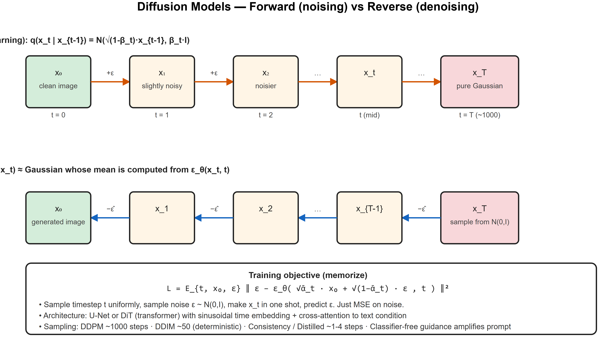

# Diffusion Models -- Interview Cheatsheet



## One-liner
Diffusion models learn to **reverse a fixed noising process**: progressively add Gaussian noise to data, train a neural net to denoise step-by-step. Sample by starting from pure noise and iteratively denoising.

## The two processes
### Forward (fixed, no learning)
At each step `t = 1...T`, add Gaussian noise to `x_{t-1}`:
```
q(x_t | x_{t-1}) = N(x_t; sqrt(1-beta_t) * x_{t-1}, beta_t * I)
```
With reparameterization:
```
x_t = sqrt(ᾱ_t) * x_0 + sqrt(1 - ᾱ_t) * epsilon        where epsilon ~ N(0, I)
```
- `beta_t`: small variance schedule (linear, cosine)
- `ᾱ_t = Pi (1 - beta_s)`: cumulative product
- After T=1000 steps, `x_T` ~= pure noise

### Reverse (learned)
Train a network `epsilon_theta(x_t, t)` to predict the noise added. Loss:
```
L = E_{t, x_0, epsilon} || epsilon - epsilon_theta(x_t, t) ||^2
```
That's it. Just MSE on the noise.

## Sampling
```
for t in [T, T-1, ..., 1]:
    epsilon_pred = epsilon_theta(x_t, t)
    x_{t-1} = (1/sqrtalpha_t) * (x_t - (1-alpha_t)/sqrt(1-ᾱ_t) * epsilon_pred) + sigma_t * z      z ~ N(0,I)
return x_0
```
DDPM uses ~1000 steps. **DDIM** is a deterministic variant that gets you there in 20-50 steps. **Distillation / consistency models** -> 1-4 steps.

## Architectures
- **U-Net** with attention layers + time-step embedding (sinusoidal `t` -> MLP -> injected at each block)
- **Latent Diffusion (Stable Diffusion)**: do diffusion in a **VAE-compressed latent space** (e.g. 64x64x4 instead of 512x512x3) -> 50x cheaper
- **DiT (Diffusion Transformer)** (Sora, SD3, Flux): replace U-Net with a transformer over patches -> scales better

## Classifier-free guidance (CFG)
Train with random dropout of the conditioning. At inference, blend:
```
epsilon_pred = epsilon_theta(x_t, ∅) + w * (epsilon_theta(x_t, c) - epsilon_theta(x_t, ∅))
```
- `w > 1` -> push harder toward the prompt. Typical: `w in [5, 12]`.
- Higher `w` -> sharper alignment with prompt but less diversity, more artifacts.

## Text-to-image stack (Stable Diffusion family)
1. **Text encoder** (CLIP / T5) -> text embedding `c`
2. **Latent encoder** (VAE) compresses image to latent
3. **U-Net / DiT** denoises latent conditioned on `c` via cross-attention
4. **Latent decoder** (VAE) decodes back to pixel image

## Comparison: GAN vs VAE vs Diffusion
| Aspect | GAN | VAE | Diffusion |
|--------|-----|-----|-----------|
| Quality | Sharp | Blurry | Sharpest |
| Diversity | Mode collapse risk | Good | Excellent |
| Training | Unstable (minimax) | Stable | Very stable |
| Sampling speed | 1 step | 1 step | 1000 -> 20 -> 4 steps |
| Likelihood | Implicit | Explicit (ELBO) | Variational lower bound |

## Why diffusion won
- Stable training (just MSE on noise)
- High quality + diversity
- Easy conditioning (text, image, depth, masks -> ControlNet)
- Scales smoothly with compute

## Interview one-liners
- *What does the model predict?* The noise `epsilon` added to `x_0` to get `x_t`.
- *Why predict noise and not `x_0` directly?* Easier optimization; gives same gradient up to scaling and trains more stably.
- *Why does it take so many steps?* Each step is a small denoise; modeling the full distribution `p(x_0 | x_t=noise)` directly is the hard part -- chaining easy steps factorizes it.
- *DDPM vs DDIM?* DDPM is stochastic (variance per step). DDIM defines a deterministic non-Markovian process with the same training, sampleable in 20-50 steps.
- *What's classifier-free guidance?* Trick to amplify conditioning at inference by blending conditional and unconditional predictions. `w` is the guidance scale.
- *Why latent diffusion?* Image-space diffusion is ~512x512x3=786k dims. Latent space ~64x64x4=16k dims -> 50x cheaper.
- *DiT vs U-Net?* Transformer over patches; scales better with compute (same scaling-law story as text), used in SD3, Sora.

## Research interview anchor
> "My Vesuvius Challenge ink-detection work used CNN segmentation -- the U-Net family. Diffusion's U-Net architecture comes from exactly that segmentation lineage, just repurposed for noise prediction. ControlNet conditioning (depth/edges -> image) directly parallels what we did with multi-layer papyrus scans as input channels."


---

## Deep dive -- forward & reverse diffusion

**Forward (q):** add Gaussian noise gradually over T steps.
```
q(x_t | x_{t-1}) = N(x_t; sqrt(1-beta_t)*x_{t-1}, beta_t*I)
```
After T steps -> pure noise.

**Reverse (p_theta):** model learns to denoise step by step.
```
p_theta(x_{t-1} | x_t) = N(x_{t-1}; mu_theta(x_t, t), Sigma_theta(x_t, t))
```
Typically parameterised to predict the **noise epsilon** that was added; sample by removing predicted noise.

## Loss

Simplified (DDPM):
```
L = E_{t, x_0, epsilon} ||epsilon - epsilon_theta(sqrtalpha̅_t * x_0 + sqrt(1-alpha̅_t)*epsilon, t)||^2
```
A simple MSE loss -- predict noise from noisy input. Surprisingly powerful.

## Sampling variants

| Sampler | Steps needed | Notes |
|---------|-------------|-------|
| DDPM | 1000 | original, slow |
| DDIM | 20-50 | deterministic, much faster |
| DPM-Solver / Solver++ | 10-25 | high-order ODE solvers |
| Consistency Models | 1-4 | distilled for one/few-step sampling |
| Flow Matching / Rectified Flow | 1-50 | straight ODE paths; SD3, Flux |

## Modern conditioning

- **Classifier-free guidance**: sample with both conditional and unconditional model; extrapolate `epsilon = (1+w)epsilon_c - w*epsilon_u` for sharper conditioning.
- **Latent diffusion (Stable Diffusion)**: diffuse in compressed latent space (e.g., 64x64x4 instead of 512x512x3) -- 50x faster.
- **ControlNet / IP-Adapter**: extra inputs (sketches, depth, pose, reference image) guide generation.

##  Pitfalls

| Pitfall | Fix |
|---------|-----|
| Cherry-picked seeds in demos | Always show fixed-seed grid |
| Confusing schedules (linear vs cosine) | Cosine schedules are smoother -> better quality |
| FID misuse | Compute on the same reference distribution |
| Mode collapse from over-guidance | Lower CFG scale (5-7 typical, 12+ is too much) |

## Interview questions

1. **Why predict noise instead of x_0?** Empirically smoother loss; equivalent up to reparameterisation.
2. **DDPM vs DDIM -- practical?** DDIM is a deterministic accelerator on top of a DDPM model -- same training, faster sampling.
3. **Why does CFG work?** It extrapolates in the direction of "more conditional", at the cost of diversity.
4. **Latent diffusion intuition?** Most pixel structure is redundant; a VAE compresses to a perceptually-equivalent latent where diffusion is much cheaper.
5. **Flow Matching vs diffusion?** Trains a velocity field on straight-line paths between noise and data -- fewer sampling steps, simpler theory.

## References
- "Denoising Diffusion Probabilistic Models" (Ho et al., 2020)
- "High-Resolution Image Synthesis with Latent Diffusion" (Rombach et al., 2022) -- Stable Diffusion
- "Flow Matching for Generative Modeling" (Lipman et al., 2023)
