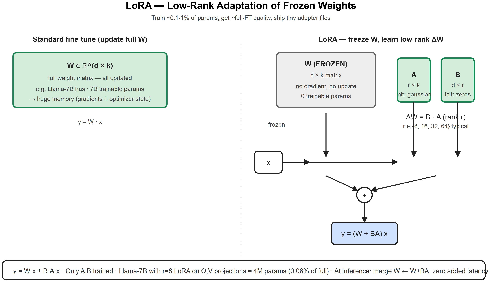
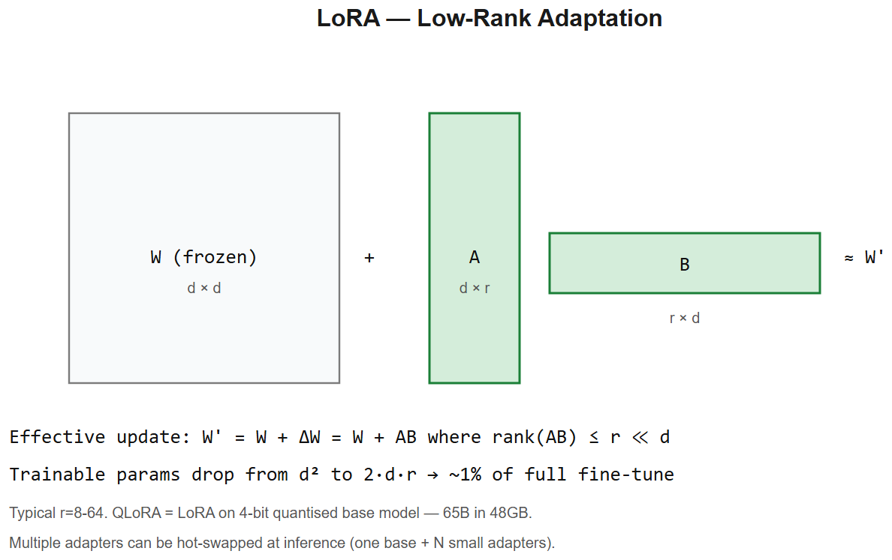

# Fine-Tuning -- Interview Cheatsheet (LoRA / QLoRA / RLHF / DPO)





## Decision tree (what to use when)
```
Need to change WHAT the model knows? -> RAG (cheap, instant, attributable)
Need to change HOW the model talks / outputs? -> Fine-tune
Have <1k examples? -> Prompt engineering / few-shot
Have 1k-100k examples? -> LoRA / QLoRA  (PEFT)
Have GPUs + budget + 100k+ examples? -> Full fine-tune
Need to align to preferences (helpfulness, safety)? -> RLHF or DPO
```

## The fine-tuning landscape
| Method | Params trained | GPU need | When |
|--------|---------------|----------|------|
| Full FT | 100% | 8x A100/H100 for 7B | Max quality, deep behavior change |
| **LoRA** | ~0.1-1% | 1x 40GB GPU for 7B | Standard PEFT, fast, mergeable |
| **QLoRA** | ~0.1-1% | 1x 24GB GPU for 7B | Same as LoRA but 4-bit base |
| Prompt tuning | ~0.01% | Tiny | Lightweight, lower ceiling |
| Adapter layers | ~1-5% | Small | Older, mostly replaced by LoRA |

## LoRA -- the workhorse
**Idea**: freeze the base model. For each weight matrix `W in ℝ^{d x k}` you want to adapt, learn a low-rank update `DeltaW = B * A` where `B in ℝ^{d x r}`, `A in ℝ^{r x k}`, with `r << d`. Forward pass: `y = (W + B*A) x`.

- Typical `r in {8, 16, 32, 64}`. Higher = more capacity, more params.
- Apply to attention weights (Q, V, sometimes K and O); FFN matrices help for big behavior changes.
- `alpha` scales update: `effective_lr = alpha / r`. Common: `alpha = 2 x r`.
- **At inference**, merge `W <- W + B*A` -> zero added latency.
- Adapter file is tiny (~10-100 MB) -- easy to ship and stack.

## QLoRA -- fit a 65B model on one consumer GPU
1. Load base in **4-bit NF4 quantization** (NormalFloat4)
2. Add LoRA adapters in bf16 (only adapters are trained)
3. **Double quantization** of the quantization constants -> more memory savings
4. **Paged optimizers** (NVIDIA UM) handle activation memory spikes

Quality vs full FT is within 1-2% on most benchmarks.

## RLHF (Reinforcement Learning from Human Feedback)
Three stages (the InstructGPT / ChatGPT recipe):
1. **SFT** -- supervised fine-tune on instruction-response pairs
2. **Reward model** -- train a model to score `(prompt, response)` from human preference data (`A > B`)
3. **PPO** -- RL the SFT model to maximize reward, with a KL penalty back to SFT to avoid mode collapse

Pros: works, gold-standard. Cons: complex, unstable, expensive, four models in memory.

## DPO -- Direct Preference Optimization
Skip the reward model and PPO. Directly optimize the SFT model on preference pairs with a closed-form objective:
```
L_DPO = -log sigma( beta*log[pi_theta(y_w|x)/pi_ref(y_w|x)] - beta*log[pi_theta(y_l|x)/pi_ref(y_l|x)] )
```
- `y_w` chosen, `y_l` rejected, `pi_ref` = frozen SFT model, `beta ~= 0.1`
- Just a supervised loss -> stable, no reward model, single training loop
- **Default choice in 2024-26** for most alignment work. Variants: IPO, KTO, ORPO.

## Instruction tuning vs alignment
- **Instruction tuning (SFT)**: teach format / domain. "When asked a question, answer it."
- **Alignment (RLHF/DPO)**: teach preferences. "Prefer helpful, harmless, honest responses."
- Most open chat models = base -> SFT -> DPO

## Data is everything
- **SFT**: 1k high-quality examples > 100k mediocre ones (LIMA paper). Curate aggressively.
- **Preferences**: 5-50k pairs typical. Source: human labelers, model-vs-model judging, AB feedback from users.
- **Format consistency** matters more than people expect -- same chat template everywhere.

## Common pitfalls
- **Catastrophic forgetting** on full FT -- base capabilities degrade. LoRA mostly avoids this.
- **Overfitting on small data** -- high `r` or too many epochs. Watch eval loss.
- **Tokenizer mismatch** -- using a different chat template than the base model expects -> broken outputs.
- **Train vs eval format drift** -- model trained with `\n\n` separator, eval uses `\n` -> garbage.
- **Reward hacking** in RLHF -- model learns to game the reward model (e.g. repetitive flattery).

## Interview one-liners
- *RAG vs FT?* RAG changes what it *knows*, FT changes how it *behaves*. Often combine.
- *Why LoRA?* Low-rank update on top of frozen weights -> train 0.1% of params, swap adapters cheaply.
- *Why QLoRA?* LoRA + 4-bit base = fit 65B on one 48GB GPU.
- *Why DPO over RLHF?* Same goal, single loss, no reward model, much more stable. Lost a tiny bit of theoretical generality, gained massive engineering wins.
- *What is the KL penalty for in PPO?* Keeps the policy close to the reference SFT model so it doesn't collapse into a degenerate mode that maxes reward but ignores fluency.
- *Catastrophic forgetting?* When fine-tuning erases base capabilities (e.g. math, code). LoRA largely sidesteps it because base weights are frozen.

## Statcon / research interview anchor
> "When evaluating RUL models at Statcon on the NASA Battery Dataset, the analogy I'd draw is: fine-tuning is exactly that -- taking pretrained time-series feature extractors and adapting them with a small head for our specific cell chemistry, rather than training from scratch. Same intuition as LoRA: cheap adaptation on top of frozen capability."


---

## Deep dive -- full fine-tune vs PEFT

| Method | Trainable params | Memory | When |
|--------|------------------|--------|------|
| Full FT | 100% | full model + optimizer states (3-4x model) | enough data + compute; need fundamental behaviour change |
| LoRA | 0.1-1% | base + small adapter | most cases; cheap, swappable, composable |
| QLoRA | 0.1-1% | 4-bit base + adapter | huge models on small GPUs (65B on 48GB) |
| Prefix / Prompt tuning | 0.01% | tiny | task-specific prompts; rarely best quality |
| Adapter layers (Houlsby) | 0.5-3% | small | precursor to LoRA, still used in research |
| BitFit | only biases | tiny | very small adaptations |
| RLHF (PPO) | full model | 6-8x model (policy + value + ref + reward) | alignment after SFT |
| DPO | full model | 2x model | preference learning without RL machinery |
| ORPO / SimPO | full model | 1x | newer one-stage variants of preference tuning |

## LoRA math

A LoRA adapter replaces `y = W*x` with:
```
y = W*x + alpha/r * (A * B) * x        with A: dxr, B: rxd, r ≪ d
```
- Only A and B are trained; W is frozen.
- Trainable params ~= 2*d*r (e.g. d=4096, r=8 -> 64k params instead of 16M).
- At inference, optionally merge: `W' = W + alpha/r * A*B` -> no extra latency.

##  Pitfalls

| Pitfall | Fix |
|---------|-----|
| Catastrophic forgetting | Lower LR; mix in some pretraining data; use PEFT |
| Overfitting on small data | Early stop on val; regularise; smaller model |
| Wrong LR for fine-tune | Start at 1e-5 to 5e-5 (full FT), 1e-4 to 3e-4 (LoRA) |
| Forgetting to mask labels on prompt | Loss should only count completion tokens for instruction tuning |
| QLoRA + bfloat16 mixed wrongly | Use 4-bit base, bf16 adapters, paged optimisers |
| LoRA r too small | Try 8 -> 16 -> 32; depends on dataset complexity |

## Recipe -- instruction fine-tune a 7B model

```
1. Tokenize prompt+completion; mask prompt tokens in loss
2. Base = LLaMA-2-7B (or Mistral, Qwen)
3. LoRA: r=16, alpha=32, target_modules=[q_proj, k_proj, v_proj, o_proj]
4. LR=2e-4, cosine schedule, warmup 3%, weight decay 0.0
5. Batch size = 128 (use gradient accumulation if needed)
6. Train 1-3 epochs; watch val loss
7. Eval on held-out prompts; sample qualitatively
8. Merge or keep as adapter
```

## Interview questions

1. **Why LoRA works (rank-r adaptation theory)?** Empirically, the *update* during fine-tuning lives in a low-rank subspace; we don't need full-rank updates to specialise.
2. **DPO vs RLHF -- what's the actual difference?** DPO derives a closed-form loss from the RLHF objective -- no separate reward model, no PPO, just a binary cross-entropy. Easier and often as good.
3. **What's catastrophic forgetting and when do you see it?** Model loses pretrained capabilities after fine-tuning on narrow data. Mitigations: replay, PEFT, lower LR.
4. **When to use SFT vs RLHF?** SFT teaches the model *how* to respond; RLHF/DPO teaches it *which* responses are preferred (style, safety, helpfulness).
5. **What does the alpha scale in LoRA control?** Effective learning rate of the adapter; alpha/r is the scaling factor. Common: alpha=2r.

## References
- "LoRA: Low-Rank Adaptation of Large Language Models" (Hu et al., 2021)
- "QLoRA: Efficient Finetuning of Quantized LLMs" (Dettmers et al., 2023)
- "Direct Preference Optimization" (Rafailov et al., 2023)
