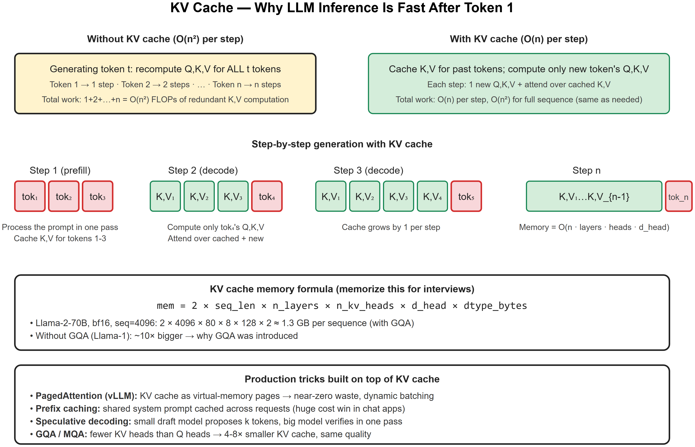
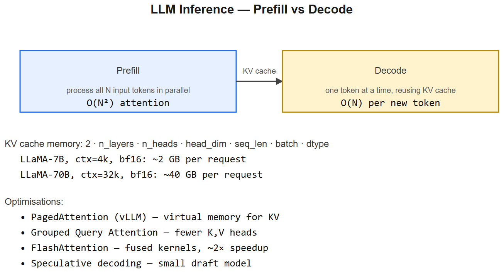

# KV-Cache -- Interview Cheatsheet





>  See: [diagrams/05-kv-cache.svg](diagrams/05-kv-cache.png)

## One-liner
At generation time, K and V for past tokens are **cached** so each new token only computes its own Q, K, V and a single attention step over the cache. Without it generation would be **O(n^2) per step**; with it, **O(n) per step**.

## Memory formula (memorize)
```
mem = 2 x seq_len x n_layers x n_kv_heads x d_head x dtype_bytes
```
- `2` = one for K, one for V
- Per sequence, per concurrent user
- **Llama-2-70B, bf16, seq=4096, GQA (8 KV heads), d_head=128, 80 layers** -> ~1.3 GB
- Without GQA -> ~10x larger; this is *why* GQA exists.

## Two phases of inference
| Phase | What runs | KV cache | Bound |
|-------|-----------|----------|-------|
| **Prefill** (process prompt) | All prompt tokens in parallel | Populated | Compute-bound |
| **Decode** (generate output) | One token at a time | Read + 1 new entry per step | Memory-bandwidth-bound |

## Production tricks built on KV cache
- **PagedAttention (vLLM)** -- KV cache as virtual-memory pages, near-zero fragmentation, dynamic batching
- **Prefix caching** -- shared system prompts cached across requests (huge cost win in chat)
- **GQA / MQA** -- fewer KV heads than Q heads -> 4-8x smaller cache
- **Speculative decoding** -- small draft model proposes k tokens, big model verifies in one pass
- **Continuous batching** -- different requests at different positions in the same batch

## Interview one-liners
- *"What's KV cache?"* -- Cache of K and V tensors for all previously-seen tokens during generation, so each new token only computes one new (Q, K, V) and attends over the cache.
- *"Why isn't it Q cache too?"* -- Q is only needed for the current token's attention computation, not for future ones.
- *"What's the memory cost?"* -- `2 x seq x layers x kv_heads x d_head x bytes`. For 70B at 4k context bf16 with GQA: ~1.3 GB/seq.
- *"What does PagedAttention solve?"* -- Memory fragmentation in KV cache when serving variable-length requests. Splits cache into pages like OS virtual memory.
- *"Why is decode bandwidth-bound?"* -- You load all KV cache from HBM each step but only do O(n) FLOPs -> arithmetic intensity is too low to saturate compute.

## AIAAS interview anchor
> "In AIAAS, the workflow executor calls the LLM iteratively for tool decisions. To keep latency tolerable for long workflows, we lean on the provider's prefix caching by stabilizing the system prompt + tool schema prefix -- only the changing workflow context varies."


---

## Deep dive -- why KV cache exists

During autoregressive generation, the attention K and V for past tokens are **identical at every decoding step** -- recomputing them each time is wasteful. The KV cache stores them across calls.

**Without cache**: step t recomputes K,V for all t tokens -> O(t*d) per step -> O(T^2) total to generate T tokens.
**With cache**: step t computes K,V only for the new token -> O(d) per step -> O(T*d) total. Quadratic -> linear.

## Memory math

```
KV bytes per request = 2 * n_layers * n_heads * head_dim * seq_len * dtype_bytes
```

LLaMA-7B example:
- n_layers=32, n_heads=32, head_dim=128, dtype=bf16 (2 bytes)
- 4k context: 2*32*32*128*4096*2 ~= **2.1 GB**
- 32k context: ~17 GB

Per-request! Batch by 8 -> 16 GB at 4k context.

##  Pitfalls

| Pitfall | Fix |
|---------|-----|
| Cache grows linearly with concurrent users | Use PagedAttention / vLLM |
| Long-context blows GPU memory | Quantise KV (int8), or use sliding-window |
| Cache invalidation when context branches | Each branch needs its own cache copy |
| Mixed-precision bugs in cached K | Keep cache in same dtype as model |

## Optimisations

1. **PagedAttention (vLLM)** -- virtual memory paging for KV -> near-zero waste, 2-4x throughput.
2. **GQA / MQA** -- fewer K,V heads than Q heads -> smaller cache. LLaMA-2 70B uses GQA-8.
3. **Quantise KV** -- int8 cuts memory in half with tiny quality loss.
4. **Sliding window attention** -- Mistral keeps only last W tokens (W=4096); long context via attention sinks.
5. **Speculative decoding** -- small draft model proposes K tokens, big model verifies in parallel.

## Interview questions

1. **Why does the KV cache not store Q?** Q is needed only for the current step; never reused.
2. **GQA vs MQA?** Multi-Query = 1 K,V head shared by all Q heads (extreme); GQA = groups of Q heads share K,V (LLaMA-2 70B uses 8 groups).
3. **Trade-off of int8 KV cache?** ~50% memory; small perplexity bump (usually <1%); compute may be slightly slower due to dequant.
4. **What's a "KV cache hit" in serving?** Reusing cache across requests sharing a prefix (e.g., system prompt) -- huge speedup.
5. **Why is decode "memory-bandwidth-bound"?** Each step reads the full cache once -> memory > compute is the bottleneck.

## References
- "Efficient Memory Management for LLM Serving with PagedAttention" (Kwon et al., vLLM 2023)
- "Fast Transformer Decoding: One Write-Head is All You Need" (MQA, Shazeer 2019)
