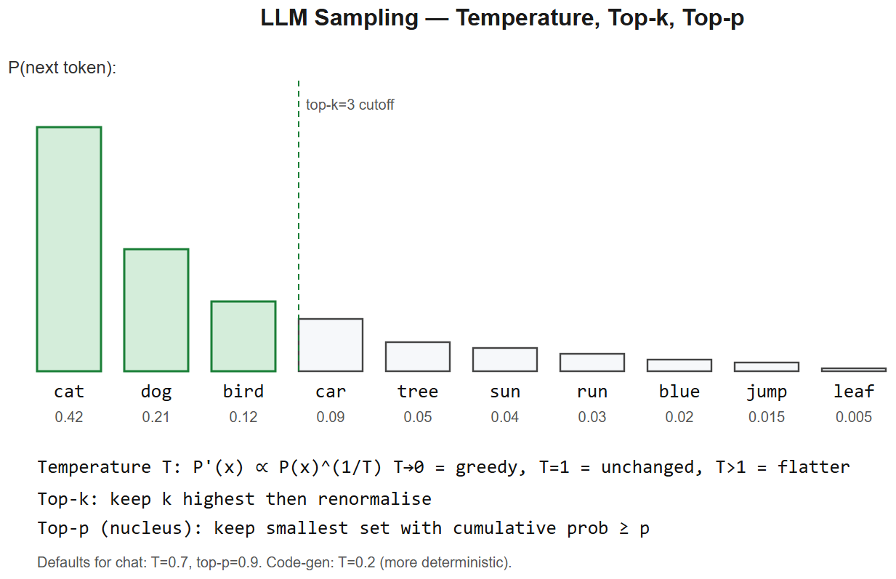
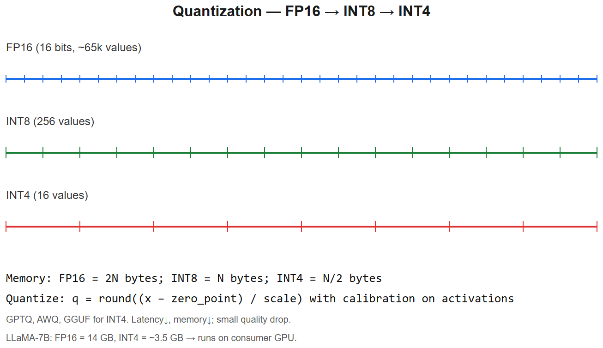

# Latest AI Models (2026) -- Interview Cheatsheet





> Use this to sound current. Update every few months -- model landscape moves fast.

## Frontier model families (as of mid-2026)

### Anthropic -- Claude
- **Claude Opus 4.7** -- frontier, best at coding/agents/reasoning. ID: `claude-opus-4-7`.
- **Claude Sonnet 4.6** -- balanced, default workhorse. ID: `claude-sonnet-4-6`.
- **Claude Haiku 4.5** -- small, fast, cheap. ID: `claude-haiku-4-5-20251001`.
- Differentiators: extended thinking ("reasoning mode"), tool-use polish, large context (200k+), strong agentic loops, Computer Use, MCP-native.

### OpenAI -- GPT
- **GPT-5** family (Pro, Standard, Mini, Nano)
- **o-series reasoning models** (o1 -> o3 lineage) -- chain-of-thought as a first-class capability
- Differentiators: ecosystem (function calling, Assistants, Files, Code Interpreter), real-time voice

### Google -- Gemini
- **Gemini 2.5 Pro / Flash** -- strong multimodal, 1M+ token context
- Differentiators: Workspace integration, native video understanding, long-context

### Meta -- Llama (open weights)
- **Llama 3 / 4** family at 8B, 70B, 405B+; MoE variants
- Differentiators: open weights, permissive license, can fine-tune & self-host

### Mistral -- open + commercial
- **Mistral Large 2**, **Codestral**, **Mixtral** MoE
- Differentiators: strong open weights, European data sovereignty story

### DeepSeek -- open MoE
- **DeepSeek-V3** (671B MoE, ~37B active), **DeepSeek-R1** (reasoning)
- Differentiators: open weights at frontier quality, very cheap inference

### Qwen (Alibaba) -- open
- **Qwen3** dense + MoE; Qwen-VL multimodal; Qwen-Coder
- Differentiators: strong multilingual (esp. Chinese, Indic), open weights

### xAI -- Grok
- **Grok 4** -- frontier, integrated with X
- Differentiators: real-time data, less filtered

## Trend taxonomy (talk about these in interviews)
1. **Reasoning models** -- extended thinking / chain-of-thought as a native capability (o1, R1, Claude extended thinking). Spend inference compute for better answers on math/code/logic.
2. **Long context** -- 200k -> 1M -> 10M tokens. RAG isn't dead but the boundary shifts.
3. **Multimodal native** -- text + image + audio + video in the same model (Gemini 2, GPT-5, Claude vision)
4. **MoE at scale** -- DeepSeek-V3, Qwen3-MoE, Mixtral -- same quality at cheaper inference
5. **Agentic / computer use** -- Claude Computer Use, OpenAI Operator, Gemini agents. Models that act, not just chat.
6. **Open weights catching up** -- DeepSeek/Llama/Qwen narrowing gap to closed frontier
7. **Distillation everywhere** -- Haiku 4.5 / GPT-5 Mini / Gemini Flash -- frontier quality at ~10x lower cost
8. **Synthetic data** -- most post-training is now on model-generated data with filtering

## How to pick a model (interview answer template)
```
"I'd start by classifying the workload:
 - Latency-critical chat / small tools -> Haiku 4.5 or Gemini Flash
 - Coding, agents, complex reasoning -> Opus 4.7 or GPT-5 with reasoning
 - Long doc analysis (>200k tokens) -> Gemini 2.5 Pro
 - Self-host / data sovereignty -> Llama-3-70B or DeepSeek-V3
 - Embeddings / retrieval -> BGE, Voyage-3, OpenAI text-embedding-3-large

Then I'd benchmark on my eval set, not just public leaderboards, since
distribution shift between MMLU and your actual workload is massive."
```

## Interview talking points
- *What's new in 2026?* Reasoning models (o-series, R1, extended thinking) + sub-frontier MoE (DeepSeek-V3, Qwen3) + native multimodal + agentic capabilities (Computer Use).
- *Open vs closed?* Closed leads frontier by ~6 months; open is "good enough" for ~80% of production work and lets you self-host + fine-tune.
- *Why is DeepSeek interesting?* Open-weight frontier quality at <10% of GPT/Claude API cost -- disruptive for commodity tasks.
- *Why MCP?* Standardizes how LLMs talk to tools/data, so you write one server and any MCP-aware client (Claude Desktop, AIAAS, Cursor) can use it.

## AIAAS interview anchor
> "AIAAS supports multi-provider LLM routing because no single model wins everywhere -- Opus 4.7 for complex workflow nodes, Haiku 4.5 for trivial decisions, DeepSeek-V3 for cost-sensitive bulk. The platform's job is to abstract that choice behind a unified node interface."


---

## Deep dive -- 2024-2026 landscape

| Model | Org | Release | Notable |
|-------|-----|---------|---------|
| Claude 4 / 4.5 / 4.6 / 4.7 | Anthropic | 2024-2026 | Best reasoning + coding; extended thinking; computer use |
| GPT-4o / o1 / o3 | OpenAI | 2024-2025 | Multimodal native (4o); chain-of-thought RL (o-series) |
| Gemini 2.5 / 2.5 Pro | Google | 2024-2025 | Long-context (2M tokens), multimodal |
| LLaMA-3 / 3.1 / 4 | Meta | 2024-2025 | Open weights, 8B/70B/405B; MoE in LLaMA-4 |
| Mistral / Mixtral 8x22B / Codestral | Mistral | 2024 | Strong open MoE; code-focused variants |
| DeepSeek-V3 / R1 | DeepSeek | 2024-2025 | Open MoE w/ great reasoning; R1 = RL-trained chain-of-thought |
| Qwen 2.5 / 3 | Alibaba | 2024-2025 | Strong multilingual, open weights |
| Grok 3 / 4 | xAI | 2024-2025 | Long-context, integrated search |

## Trends to talk about

1. **Reasoning models** -- train with RL on chain-of-thought; test-time compute scaling.
2. **Multimodality** -- single model processes text + image + audio + video natively (4o, Gemini, Claude 4).
3. **Long context** -- 200k (Claude), 1M (Gemini 1.5), 2M (Gemini 2.5). Quality often degrades past 32k.
4. **Open vs closed** -- DeepSeek, LLaMA, Qwen close the gap with frontier closed models.
5. **Agents** -- tool use, computer use, multi-step planning. Claude 4 popularised structured tool use.
6. **Synthetic data** -- model-generated data refined by humans; key to scaling beyond web data.
7. **Speculative decoding + inference-time scaling** -- major latency wins; o1-style reasoning trades latency for quality.

##  Common interview pitfalls

| Pitfall | Fix |
|---------|-----|
| Citing pricing/specs from memory | Always note "as of [date]"; ranges if unsure |
| Claiming a model is "best" universally | Specify benchmark (MMLU, GPQA, SWE-bench, HumanEval) |
| Confusing context window with retrieval ability | Long-context != uses-context-well (needle-in-haystack) |
| Treating closed and open models as interchangeable | Closed has finetuning APIs but no weight access; open has both |

## Interview questions

1. **Why are reasoning models slower at inference?** They generate long internal chain-of-thought tokens before answering; you pay per token.
2. **When pick open weights over a frontier API?** Privacy, custom finetuning, predictable cost, on-prem deployment, latency control.
3. **What's a "frontier" model?** State-of-the-art on broad benchmarks at release time; usually closed, very large, very expensive.
4. **Best model for code generation in 2026?** Depends on task; Claude 4.6/4.7 and GPT o3 score top on SWE-bench, while Codestral/DeepSeek-Coder are strong open options.
5. **Why does benchmark performance plateau?** Saturation (~95% on MMLU), contamination concerns, and tasks no longer discriminate frontier models -- push toward harder benchmarks (GPQA, FrontierMath, ARC-AGI).

## References
- Stanford AI Index (annual)
- Artificial Analysis benchmarks
- Vellum LLM Leaderboard
