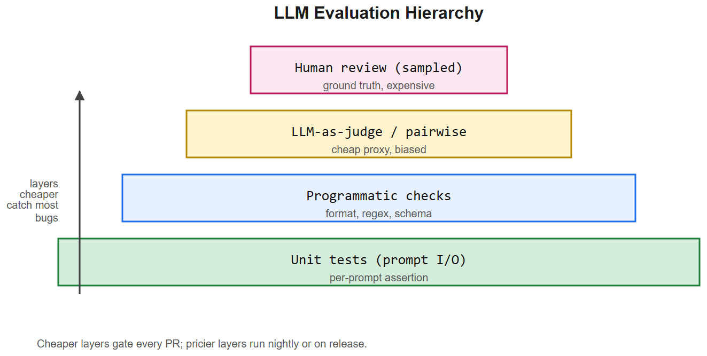
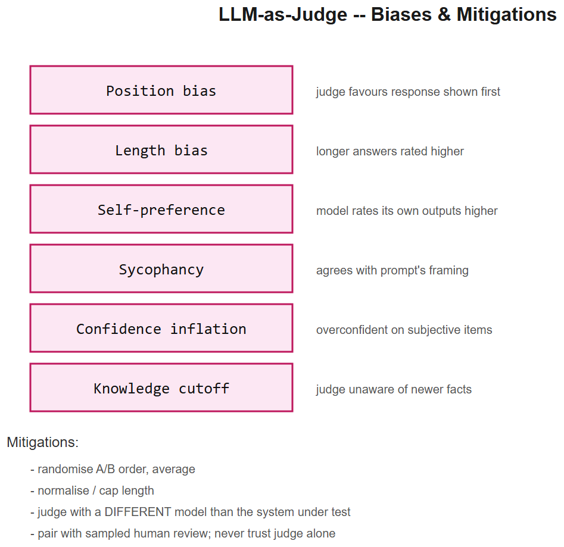

# LLM Evaluation -- Interview Cheatsheet





> How do you know your LLM app actually works? You measure it. This file covers the eval stack from unit-level prompt tests to production human review.

## TL;DR

| Question | Method | Cost |
|----------|--------|------|
| Does the model follow the format? | JSON-schema validate + assert | free |
| Does it answer correctly? | Golden-set exact / fuzzy match | low |
| Does it answer faithfully (RAG)? | Faithfulness check vs. context | medium |
| Does a human prefer A or B? | Pairwise human eval | high |
| Did anything regress? | Diff against the last release on the golden set | medium |
| Are users happy in prod? | Thumbs up/down + open feedback + sampled review | medium |

---

## 1. The hierarchy of LLM evaluation

```
                        +-------------------------+
                        |  Human review (sampled) |   <-- ground truth
                        +-------------------------+
                                    ^
                        +-------------------------+
                        |  LLM-as-judge / pairwise|   <-- cheap proxy
                        +-------------------------+
                                    ^
                        +-------------------------+
                        |  Programmatic checks    |   <-- format, regex, schema
                        +-------------------------+
                                    ^
                        +-------------------------+
                        |  Unit tests (prompt I/O)|   <-- per-prompt assertion
                        +-------------------------+
```

Cheaper layers catch most bugs; pricier layers exist because cheaper layers are not enough.

## 2. Categories of failure to test for

| Category | What it looks like | How to test |
|----------|--------------------|-------------|
| **Hallucination** | confident wrong facts not in context | faithfulness check; ragas; manual review |
| **Refusal / over-refusal** | refuses safe content | safe-prompt regression set |
| **Style drift** | tone, length, formatting changes after a model swap | format checks + diff vs. baseline |
| **Reasoning failure** | wrong conclusion from correct premises | math / chain-of-thought eval sets |
| **Toxicity / bias** | unsafe output | safety classifiers, red-team set |
| **Prompt injection** | model follows instructions in retrieved data | injection benchmarks |
| **Latency / cost regression** | same output, slower / more tokens | track p50/p95 latency + tokens / request |
| **Numerical / format** | wrong JSON, broken markdown | parser-based assertion |

## 3. Faithfulness, precision, recall (RAG context)

Three orthogonal metrics:

| Metric | What it measures | Failure mode |
|--------|------------------|--------------|
| **Faithfulness** | every claim in the answer is supported by the retrieved context | hallucination |
| **Answer relevance** | the answer addresses the question | off-topic |
| **Context precision** | retrieved chunks are relevant to the question | noisy retrieval |
| **Context recall** | the necessary chunks for the answer are present | missed retrieval |

Compute via Ragas-style LLM-as-judge or programmatic NLI when scale matters.

## 4. Golden datasets

A small (50-500 item) curated set of (input, expected) pairs that defines "correct" for your application. Used for:
- Regression tests on every release
- Fitness function during prompt tuning
- Benchmark when swapping the underlying model

**Composition rules of thumb**
- 60% happy path
- 30% edge cases (ambiguity, empty input, very long, multilingual)
- 10% adversarial / known historical failures

Version the dataset alongside the code; never edit golden answers without explicit review.

## 5. LLM-as-judge -- limits and failure modes

| Bias | Effect | Mitigation |
|------|--------|------------|
| **Position bias** | judge favours the response shown first | randomise A/B order, average |
| **Length bias** | longer answers rated higher | trim, normalise by length |
| **Self-preference** | model rates its own outputs higher | judge with a different model |
| **Sycophancy** | judge agrees with prompt's framing | neutral judge prompt |
| **Confidence inflation** | judge is overconfident on subjective items | calibration; require justification |
| **Knowledge cutoff** | judge does not know newer facts | inject ground truth into judge prompt |

Use LLM-as-judge for triage and ranking, **not** as your final number. Pair with sampled human review.

## 6. Pairwise vs. rubric scoring

| Method | When | Pros | Cons |
|--------|------|------|------|
| **Likert (1-5)** | absolute quality | one judge, fast | scale drift, inter-rater variance |
| **Pairwise A/B** | comparing two systems / prompts | strong statistical power | doesn't give absolute score |
| **Rubric (multi-axis)** | regulated / nuanced cases | interpretable | slow, expensive |
| **Win-rate vs. baseline** | tracking progress over time | intuitive | sensitive to baseline drift |

## 7. Human review workflow

1. **Sample**: ~5% of production traffic stratified by user segment / failure signal.
2. **Annotate**: rubric with 3-5 axes (correctness, helpfulness, safety, format, tone).
3. **Adjudicate disagreements**: 2 reviewers per item; tiebreak by senior.
4. **Feed back**: failed items become new golden cases or red-team examples.
5. **Calibrate**: every quarter recompute inter-rater agreement (Cohen's kappa).

## 8. CI pipeline for an LLM app

```
PR -> programmatic checks (format / schema / regex)
   -> golden-set eval (LLM-as-judge)
   -> RAG eval (faithfulness, ctx precision / recall)
   -> latency + token-cost benchmark
   -> diff vs. main: any regression > threshold blocks merge
   -> on merge: run extended eval nightly; alert on regression
   -> sample real traffic into human review
```

## 9. Common pitfalls

| Pitfall | Fix |
|---------|-----|
| Eval set leaks into prompts | strict train / eval split; check string overlap |
| Only happy-path eval | actively maintain failure-mode subsets |
| Single judge model | rotate or ensemble judges |
| Metric games (Goodhart) | track a portfolio of metrics; periodic human audit |
| Mixing eval pass-rate with production-quality | they measure different things; report both |
| No baseline | always compare against the previous release |
| Snapshot tests overfit | use rubrics; avoid full-text equality for free-form text |

## 10. Interview questions

1. **How would you eval a chatbot?** Tiered: format checks first; golden-set exact / fuzzy; LLM-as-judge for free-form; sampled human review weekly; track latency / cost / refusal-rate as guardrails.
2. **Why is LLM-as-judge biased?** Position, length, self-preference, sycophancy. Always randomise pair order and never let the judge see which system produced which answer.
3. **Faithfulness vs. relevance vs. groundedness?** Faithfulness = supported by context. Relevance = on-topic for the question. Groundedness is often used interchangeably with faithfulness.
4. **How do you detect hallucinations?** Compare claims in the answer to the retrieved context using NLI or LLM-as-judge; require citations in the answer; spot-check with humans.
5. **What's a regression eval set?** A frozen set of (input, expected) pairs run on every release; failures block deploy or trigger investigation.
6. **How do you handle subjectivity?** Multiple reviewers + rubric + tiebreak rule; report inter-rater agreement; favour pairwise over absolute scales for subjective dimensions.
7. **What metric matters most in production?** A weighted combination of: task success, safety incident rate, p95 latency, cost / request, user satisfaction. The mix depends on the product.

## References

- "Evaluating Language Models" -- HELM, MT-Bench, AlpacaEval papers
- Ragas (github.com/explodinggradients/ragas) -- RAG-specific metrics
- TruLens -- LLM application eval framework
- Anthropic / OpenAI eval cookbooks
- "Judging LLM-as-a-Judge with MT-Bench and Chatbot Arena" (Zheng et al., 2023)
