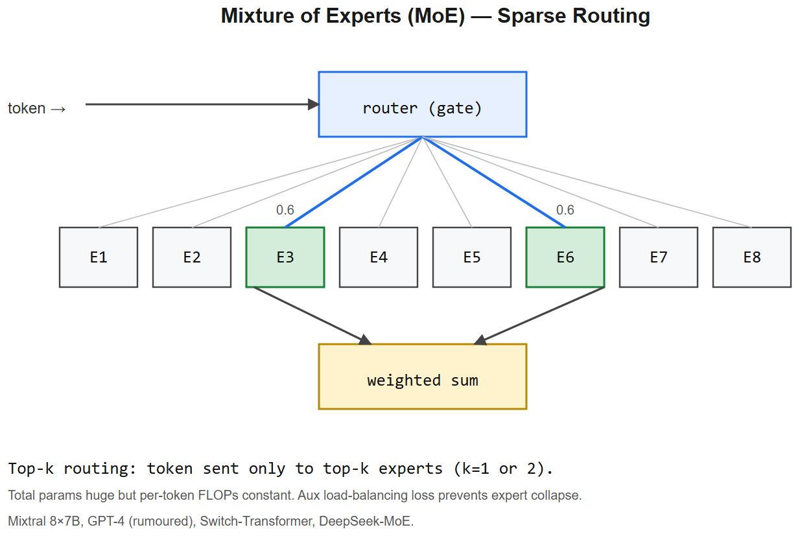

# Mixture of Experts (MoE) -- Interview Cheatsheet



## One-liner
Replace the dense FFN inside transformer blocks with **N expert FFNs + a router** that picks `top-k` experts per token. You get the **parameter count of a huge dense model** at the **compute cost of a small dense model**.

## Why MoE
- Dense scaling: every token activates every parameter -> compute scales with size.
- MoE: per token, only `k` of `N` experts are active -> **sparse activation**.
- Mixtral 8x7B has ~47B total params but ~13B active per token -> quality of a 30-40B dense model at 13B inference cost.

## Architecture
```
       ┌──── Expert 1 (FFN) ────┐
input ─┼──── Expert 2 (FFN) ────┼── weighted sum ── output
       ├──── ...                  │
       └──── Expert N (FFN) ────┘
            ^
        Router (Linear -> softmax -> top-k)
```
- Router is a tiny linear layer: `gate_logits = x * W_g`
- Pick top-k experts (typically `k=2` of `N=8`)
- Combine: `out = Sigma softmax(gate_logits)[i] * expert_i(x)` over chosen `i`

## Famous MoE models
| Model | N experts | top-k | Total params | Active params |
|-------|-----------|-------|--------------|---------------|
| Switch Transformer | up to 2048 | 1 | up to 1.6T | small |
| GLaM | 64 | 2 | 1.2T | 97B |
| **Mixtral 8x7B** | 8 | 2 | 47B | 13B |
| Mixtral 8x22B | 8 | 2 | 141B | 39B |
| DeepSeek-V2/V3 | 160+ + 2 shared | 6+2 | 236B / 671B | 21B / 37B |
| Qwen3-MoE | 60-128 | 4-8 | 35B-230B | 3B-22B |

## Core challenges
- **Load balancing**: if router always picks the same experts, others get no gradient. Use **load-balancing loss** to encourage uniform token-to-expert distribution.
- **Capacity factor**: each expert has a fixed token budget per batch. Overflow tokens get dropped (early designs) or routed to next-best expert (modern).
- **All-to-all communication**: experts may live on different GPUs -> tokens must be shuffled across devices. Bandwidth-heavy.
- **Inference batching**: different requests activate different experts -> harder to batch efficiently. Solved by smart routing-aware batching.

## Fine-grained / shared experts (DeepSeek-MoE pattern)
- **Fine-grained**: many small experts instead of few big ones -> better specialization
- **Shared experts**: always-active experts that all tokens go through, plus routed experts. Captures common knowledge.

## When MoE wins / loses
| | Wins | Loses |
|--|------|-------|
| Training | Same FLOPs as small dense -> faster wall-clock for a given quality | Communication overhead, harder infra |
| Inference | Active param count is low -> faster than equivalent dense | VRAM holds *all* params -> big memory footprint |
| Quality | Better at fixed FLOPs budget | Marginal at fixed memory budget |

-> MoE is great when **memory is cheap, compute is expensive**. Cloud serving -> yes. Phone / laptop -> no.

## Interview one-liners
- *What's MoE?* Sparse-activation: route each token to k of N experts, sum their outputs. Parameter count of a huge model, compute of a small one.
- *What does the router learn?* A gating function that picks the most useful experts per token. Trained jointly with everything else.
- *Why load-balancing loss?* Without it, the router collapses onto a few favorite experts; others starve. Penalize variance of expert load.
- *Why does Mixtral feel like a 30B dense model?* Total knowledge ~30-40B equivalent, but only 13B activated per token -> speed of 13B.
- *Tradeoff vs dense?* MoE costs more memory (all experts loaded) but less compute. Choose based on cloud GPU memory vs serving cost.
- *What's the "capacity factor"?* Number of tokens each expert can process per batch before dropping/rerouting overflow. ~1.25 is typical.

## Diagram
```
Token -> Router -> top-2 of 8 experts -> weighted sum -> next layer
              \                    /
               ────── load-bal loss
```


---

## Deep dive -- sparse experts

MoE replaces the dense MLP in some/all transformer layers with **N experts** (smaller MLPs) and a **router** that selects top-k experts per token. Total parameters scale, but per-token compute does not.

Trade-off:
- **Pros**: dramatic capacity-per-FLOP improvement; bigger model, same compute.
- **Cons**: load balancing (some experts get all the work), all-to-all communication overhead, memory still proportional to total params, harder to deploy.

## Top-k routing

```
gates_logits = W_router * x          # x: token, gates: N experts
weights = softmax(top_k(gates_logits, k))
y = Sigma_{j in top_k}  weights[j] * expert_j(x)
```

With k=2 and N=8: each token uses 2 of 8 experts -> ~25% of MoE params active per token.

**Aux load-balancing loss** (Switch Transformer):
```
L_aux = alpha * N * Sigma_i  (fraction of tokens to expert_i) * (avg gate prob for expert_i)
```
Encourages uniform expert utilisation.

##  Pitfalls

| Pitfall | Fix |
|---------|-----|
| Expert collapse (one expert gets all) | Aux loss + capacity factor |
| Router instability early training | Z-loss to keep logits small |
| Inference latency from all-to-all | Co-locate experts; expert parallelism |
| Memory still dominated by total params | Can't shrink -- use cheaper experts (smaller hidden) |

## Interview questions

1. **Why is MoE compute-efficient but memory-hungry?** FLOPs scale with active params; memory scales with total params.
2. **What's "capacity factor"?** Buffer that lets each expert handle up to `capacity_factor * tokens/N` tokens. >1 avoids dropping tokens at the cost of compute.
3. **Switch Transformer vs MoE (Shazeer)?** Switch = k=1 (single expert per token), Shazeer = k=2. k=1 simpler, k=2 slightly better quality.
4. **Why does Mixtral 8x7B fit in 24 GB at 4-bit?** Total ~47B params; active ~13B; at 4-bit ~= 23 GB total memory.
5. **Load-balance loss intuition?** Discourages routing all traffic to a few experts; pushes the routing distribution toward uniform.

## References
- "Outrageously Large Neural Networks: The Sparsely-Gated MoE Layer" (Shazeer et al., 2017)
- "Switch Transformer" (Fedus et al., 2021)
- "Mixtral of Experts" (Jiang et al., 2024)
