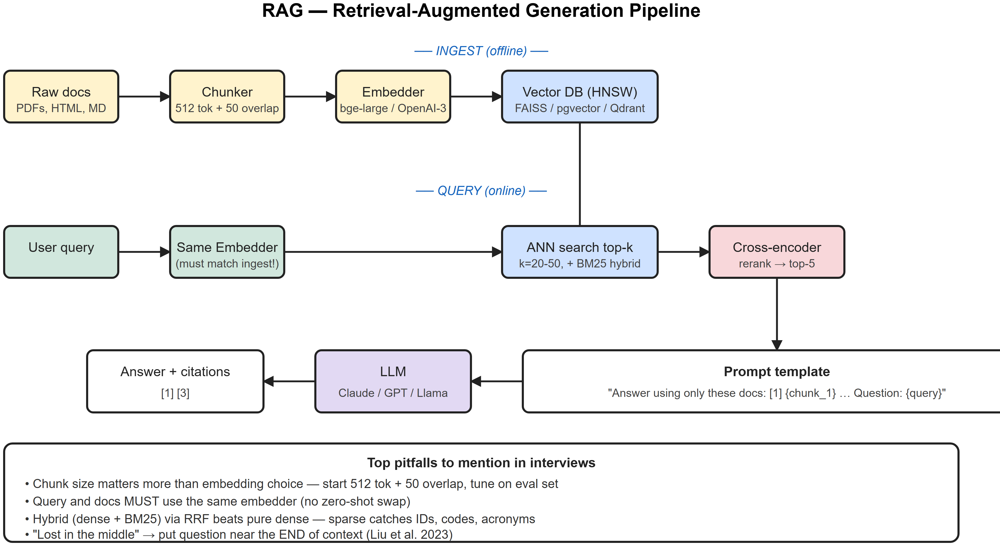
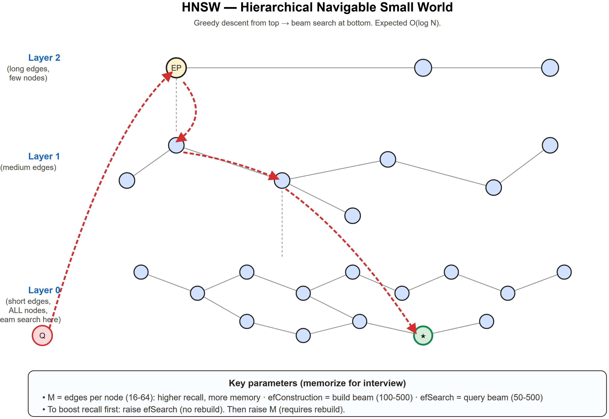
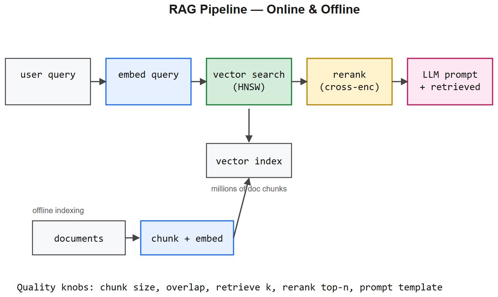

# RAG + HNSW -- Cheatsheet







## RAG one-liner
**Retrieval-Augmented Generation**: instead of stuffing the world into model weights, retrieve relevant chunks from an external index at query time and feed them into the LLM's context. Cheaper than fine-tuning, updates instantly when data changes, reduces hallucinations on factual tasks.

## Pipeline
```
[Docs] -> chunker -> embedder -> [Vector DB]
                                   ^
[User query] -> embedder -> top-k search -> re-rank -> context -> LLM -> answer
```

## Chunking
- Typical chunk size: **256-1024 tokens** with 10-20% overlap
- Strategies: fixed-size, sentence-based, semantic (LLM-driven), structure-aware (markdown headings, code AST)
- **Smaller chunks** = more precise retrieval, more chunks per query -> higher cost
- **Larger chunks** = more context per chunk, fewer retrieval misses but more noise

## Embedding models (2026 commonly used)
- **Open**: `BAAI/bge-large-en-v1.5`, `nomic-embed-text-v2`, `mxbai-embed-large`, `Qwen3-Embedding`
- **Closed**: OpenAI `text-embedding-3-large` (3072 dim), Voyage `voyage-3`, Cohere `embed-v3`, Google `gemini-embedding`
- Pick by **MTEB leaderboard** + your latency / cost budget

## Vector databases
| DB | Strengths | Typical use |
|----|-----------|-------------|
| **FAISS** | Library, fast, in-memory | Small data, single machine |
| **pgvector** | Postgres extension | Already on Postgres, <100M vectors |
| **Pinecone** | Managed, serverless | Production SaaS |
| **Weaviate** | Hybrid + filters, OSS or managed | Hybrid search |
| **Qdrant** | Rust, filters, OSS | Self-host, growing fast |
| **Milvus** | Distributed, billions of vectors | Massive scale |
| **Chroma** | Dev-friendly | Prototyping |

## ANN index types
| Index | Speed | Recall | Memory | Notes |
|-------|-------|--------|--------|-------|
| **Flat (brute force)** | Slow O(N) | 100% | Lowest | Baseline / ground truth |
| **IVF** (inverted file) | Fast | Tunable | Medium | Cluster vectors, search nearest clusters |
| **HNSW** (graph) | Very fast | High | High | Default for <100M vectors |
| **IVF-PQ** | Fastest | Lower | Lowest | Compressed, billions of vectors |

## HNSW essentials (Hierarchical Navigable Small World)
- **Graph-based ANN**: multi-layer graph where higher layers have long-range edges, lower layers have local edges
- **Search**: start at top layer entry point -> greedy descend -> switch to lower layer -> repeat -> bottom layer = full neighborhood graph
- **Key params**:
  - `M`: edges per node (typical 16-64). Higher = better recall, more memory.
  - `efConstruction`: build-time search depth (typical 100-500). Higher = better graph, slower build.
  - `efSearch`: query-time depth (typical 50-500). Higher = better recall, slower queries.
- **Complexity**: O(log N) average search.
- **Tradeoff**: HNSW is the default but uses **~150-300 bytes per vector + the vectors themselves**. For billions, use IVF-PQ.

## Distance metrics
- **Cosine** -- direction only, magnitude-invariant. Standard for normalized embeddings.
- **Dot product** -- fast, works if vectors are L2-normalized (equivalent to cosine).
- **Euclidean (L2)** -- magnitude matters. Less common for text.

## Re-ranking
First-stage retrieval is cheap & broad (top-50). Re-rank with a heavier model:
- **Cross-encoder** (e.g. `bge-reranker-v2-m3`, Cohere `rerank-v3`) -- encodes (query, doc) together -> better but ~10-100x slower.
- **LLM-as-judge** -- give the LLM the doc + query and ask for a relevance score.

## Hybrid search
Combine **dense (embeddings)** + **sparse (BM25 / SPLADE)** with reciprocal rank fusion (RRF). Sparse catches exact tokens (acronyms, IDs); dense catches semantics. Production RAG usually uses hybrid.

## Common pitfalls
- **Bad chunking** > bad embedding model. Spend time here first.
- **Embedding mismatch**: query and doc must use the *same* model.
- **Not normalizing**: cosine + un-normalized vectors gives wrong rankings.
- **No metadata filters**: dump-everything-into-prompt RAG performs worse than filtered RAG (date, user, topic).
- **Ignoring re-rank**: dense top-5 is often noisy; top-50 -> rerank -> top-5 is much better.
- **Stale index**: design ingest with delete + upsert from day 1.

## Evaluation metrics
- **Retrieval**: Recall@k, MRR, nDCG@k, Hit@k
- **End-to-end**: faithfulness (does answer come from retrieved docs?), answer correctness, context precision, context recall -- see **RAGAS** library
- Build a **golden test set** of 50-200 (question, expected docs, expected answer) pairs

## When NOT to use RAG
- Knowledge is *static* and small -> fine-tune or just put in system prompt
- You need *reasoning over the entire corpus* -> RAG misses; use long-context or agent loops
- You need *fresh* answers but doc count is tiny -> just refetch & prompt

## Code skeleton (Python)
```python
from sentence_transformers import SentenceTransformer
import faiss, numpy as np

# 1. Embed corpus
embedder = SentenceTransformer("BAAI/bge-large-en-v1.5")
docs = [...]                          # list of chunk strings
vecs = embedder.encode(docs, normalize_embeddings=True)

# 2. Build HNSW
d = vecs.shape[1]
index = faiss.IndexHNSWFlat(d, M=32)  # M = edges/node
index.hnsw.efConstruction = 200
index.add(vecs.astype("float32"))

# 3. Query
q = embedder.encode([user_query], normalize_embeddings=True)
index.hnsw.efSearch = 100
D, I = index.search(q.astype("float32"), k=20)
retrieved = [docs[i] for i in I[0]]

# 4. (Optional) Re-rank with cross-encoder
# 5. Prompt LLM with retrieved context
```


---

## Deep dive -- what makes a RAG system good

Four orthogonal quality axes; tune each:
1. **Recall** -- does the retriever find relevant chunks? Measured by Recall@k.
2. **Precision** -- are top-k mostly relevant? Reranker fixes this.
3. **Faithfulness** -- does the LLM stay within retrieved context? Prompt engineering + lower temperature.
4. **Latency** -- vector search, rerank, LLM all add ms. Budget per stage.

## HNSW (Hierarchical Navigable Small World)

Approximate nearest-neighbour graph with **logarithmic search**.

Construction:
- Each point inserted at a random max-level L ~ exponential.
- At each level, connect to M nearest existing points.
- Higher levels are sparse highways; lower levels are dense local connections.

Search:
- Start at top level entry point; greedy walk toward query.
- Descend a level; repeat with wider search beam.
- Bottom level: collect k candidates.

Recall vs speed tuned by `ef` parameter (search beam width).

##  Pitfalls

| Pitfall | Fix |
|---------|-----|
| Wrong chunk size | Tune per data: 200-800 tokens typical; smaller for QA, larger for narrative |
| No overlap -> information at chunk boundary lost | Add 10-15% overlap |
| Using a symmetric embedding model when the task is asymmetric retrieval | The same MODEL must encode both query and doc (else the spaces don't compare), but pick a model trained with an asymmetric query / passage objective (e.g. `e5`, `BGE`, `nomic-embed`) -- they use different prefixes for queries vs. documents and beat symmetric models on retrieval |
| Forgetting to normalise vectors | Cosine ≡ dot only when ||v||=1 |
| Indexing PDFs as one chunk | Parse tables, headings, images separately |
| Ignoring metadata filters | Hybrid: BM25 + vector + filter clauses |
| Using vector search alone for keyword queries | Hybrid (BM25 + vector) wins |

## Production patterns

1. **Hybrid retrieval**: BM25 union dense vector -> reciprocal-rank fusion -> rerank.
2. **Reranker**: cross-encoder (e.g. bge-reranker-large) scores (query, doc) pairs jointly.
3. **Query rewriting**: LLM expands / rewrites the user query before retrieval.
4. **Multi-query**: generate N rewrites; union results.
5. **HyDE**: generate a hypothetical answer, embed *that*, retrieve documents similar to it.
6. **Multi-vector / ColBERT**: store multiple embeddings per chunk (one per token-cluster) for finer-grained matching.

## Interview questions

1. **Vector DB choices and trade-offs?** FAISS (lib, CPU/GPU), pgvector (Postgres extension), Pinecone (managed), Weaviate, Qdrant, Milvus, Chroma. Pick by infra, scale, filter needs.
2. **HNSW vs IVF-PQ?** HNSW: higher recall, more RAM. IVF-PQ: smaller memory via product quantisation, slightly lower recall.
3. **How do you evaluate RAG?** Ragas / TruLens style: faithfulness, answer relevance, context relevance + traditional Recall@k.
4. **When NOT to use RAG?** Tasks needing reasoning over the whole corpus (e.g. "summarise everything"); use fine-tuning or long-context instead.
5. **Chunk boundary problem?** Important info split across chunks -> retrieval misses. Mitigations: overlap, sliding window, parent-doc retrieval.
6. **HyDE intuition?** Search for the *answer* shape, not the query -- bridges the query/document distribution gap.

## References
- "Efficient and robust approximate nearest neighbor search using HNSW graphs" (Malkov & Yashunin, 2018)
- "Dense Passage Retrieval" (Karpukhin et al., 2020)
- Ragas docs; LlamaIndex / LangChain RAG patterns
