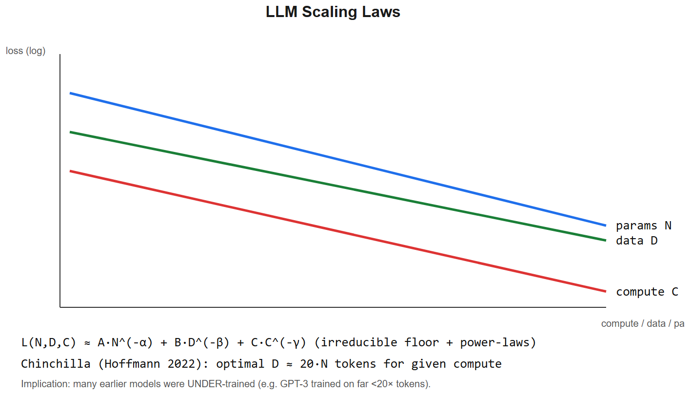

# Scaling Laws -- Interview Cheatsheet



## One-liner
LLM loss is a smooth **power law** in **model size N**, **dataset size D**, and **compute C** -- and there's an **optimal ratio** between them.

## Two landmark papers
| Paper | Year | Claim |
|-------|------|-------|
| **Kaplan et al. (OpenAI)** | 2020 | Loss ∝ N^(-alpha), D^(-beta), C^(-gamma). Bigger model >> more data per FLOP. |
| **Chinchilla (Hoffmann et al., DeepMind)** | 2022 | Kaplan over-prioritized size. **Optimal ratio: ~20 tokens per parameter.** GPT-3 was undertrained; Gopher and Megatron-Turing too. |

## Chinchilla rule of thumb
**Compute-optimal**: `D ~= 20 x N` (training tokens ~= 20 x params).
- 7B model -> ~140B tokens (Llama-1 used 1.4T -> "overtrained" deliberately)
- 70B model -> ~1.4T tokens (Chinchilla-optimal)
- Llama-3 8B trained on **15T tokens** -> ~1875 tokens/param, *vastly* overtrained. Why? Inference cost dominates lifetime cost -> spend more compute training a smaller model that's cheaper to serve.

## Compute formula
```
C ~= 6 * N * D       (FLOPs for training)
```
- `6` = 2 (forward) + 4 (backward, ~2x forward) per param per token
- Lets you back out training compute from any (N, D)

## Implications for AI engineers
- **Bigger isn't always better**: a 7B model trained on 15T tokens beats a 70B model trained on 200B tokens at *inference cost*.
- **Quality plateaus need data, not just size** -- if eval is stuck, more pretraining data > scaling up.
- **Open-source race is now about data quality + quantity**, not just parameter count.
- **Test-time compute is the new axis**: OpenAI o1 / DeepSeek-R1 / Claude with extended thinking -> reasoning models trade inference FLOPs for quality. Scaling laws now extend to inference compute.

## Other scaling phenomena
- **Emergent abilities** (Wei 2022): some capabilities appear sharply at scale (arithmetic, multi-step reasoning) -- though some are artifacts of metric choice (Schaeffer 2023).
- **Inverse scaling** (rare): a few tasks get worse with scale, e.g. literal-instruction-following hurt by RLHF.
- **Mixture-of-experts scaling**: effective scaling exponent shifts because of sparsity.

## Interview one-liners
- *What's Chinchilla?* For a fixed compute budget, optimal token-to-param ratio is ~20. Earlier "scaling" papers over-emphasized model size.
- *Why is Llama-3 8B so good?* Trained on 15T tokens -- way past Chinchilla optimum, but it makes inference cheap.
- *Why did emergent abilities seem to appear suddenly?* Often because the eval metric was discrete (exact match) and the model crossed a threshold. With continuous metrics they emerge more gradually.
- *Formula?* `C ~= 6 * N * D` for training compute.
- *What's a "data wall"?* High-quality human-written text is finite (~100T tokens of decent web text). Future scaling needs synthetic data or new modalities.

## Why this matters for your career
- Bigger labs are constrained -- they ran out of cheap data and pure-size returns. **Quality of data, post-training (RLHF/DPO), and reasoning compute** are now where progress comes from. Frame your projects in those terms.


---

## Deep dive -- Kaplan vs Chinchilla

**Kaplan (2020)** found loss decreases as a power law in compute, with parameters more important than data -> led to scaling up model size aggressively (GPT-3 175B).

**Chinchilla (Hoffmann et al., 2022)** rerun the experiments more carefully and showed the optimal trade-off is `tokens ~= 20 x params`. Most prior models (GPT-3, PaLM) were undertrained.

Implication: at fixed compute, smaller-but-trained-longer >= larger-but-undertrained.

## The empirical law

```
L(N, D, C) ~= A * N^(-alpha) + B * D^(-beta) + L_inf
```
- N = parameters, D = tokens, C = compute (FLOPs ~= 6*N*D for transformer training)
- alpha ~= 0.34, beta ~= 0.28 (Chinchilla fits)
- L_inf = irreducible loss (data entropy)

Optimal under compute budget C: `N* ∝ C^0.5`, `D* ∝ C^0.5` -> keep them balanced.

##  Pitfalls

| Pitfall | Fix |
|---------|-----|
| Optimising only on a tiny scan | Need >= 6 orders of magnitude to fit reliably |
| Forgetting data quality matters | Better data shifts the curve, doesn't just slide along it |
| Assuming laws extrapolate forever | Plateaus emerge as you exhaust data / hit emergent thresholds |
| Comparing models with different architectures | Architecture changes A, alpha |

## Interview questions

1. **Chinchilla's main finding in one sentence?** Most LLMs are undertrained -- for a given compute, fewer params + more tokens gives lower loss.
2. **How is compute computed (FLOPs)?** ~6 * N * D for transformer training (forward 2NF + backward 4NF).
3. **What is "emergent ability"?** Capability that appears only above some scale threshold (e.g. chain-of-thought arithmetic). Some researchers argue it's a metric artefact.
4. **Inference scaling vs train scaling?** Recent work (o1, OpenAI Sept 2024) shows test-time compute scales differently -- longer thinking traces improve hard reasoning.
5. **Why are scaling laws useful?** Predict how much compute / data to budget; choose between scaling axes; estimate whether a new technique helps beyond scale.

## References
- "Scaling Laws for Neural Language Models" (Kaplan et al., 2020)
- "Training Compute-Optimal Large Language Models" (Hoffmann et al., 2022)
- "Are Emergent Abilities of Large Language Models a Mirage?" (Schaeffer et al., 2023)
