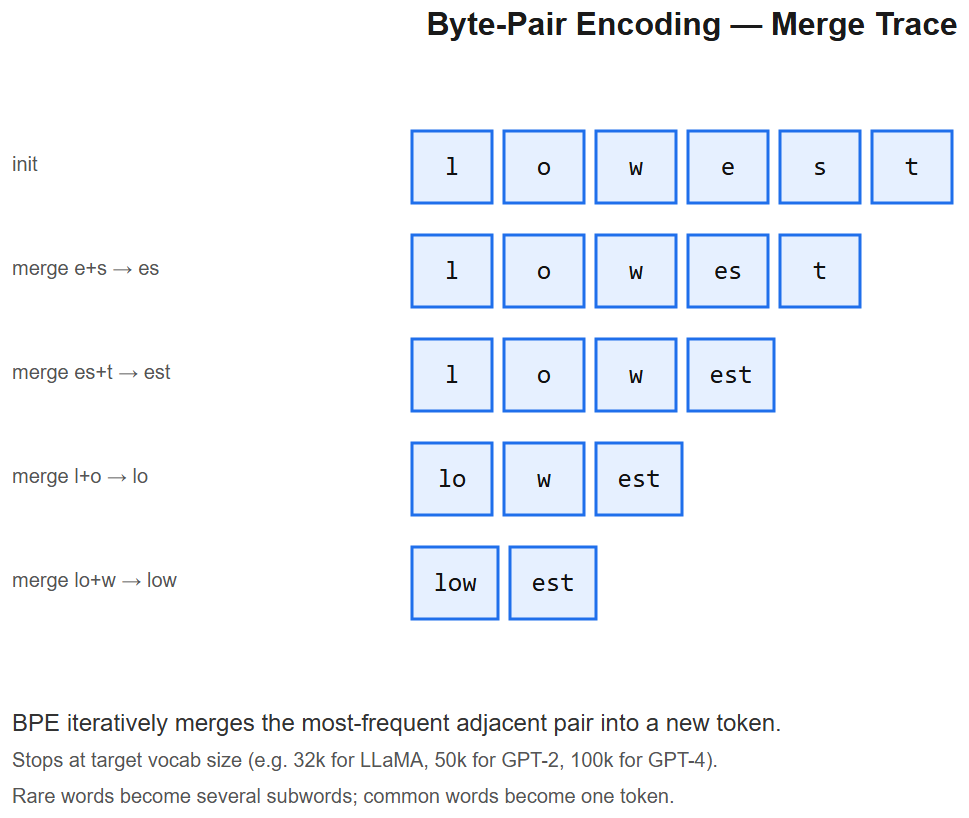

# Tokenizers -- Interview Cheatsheet



## One-liner
A tokenizer maps raw text ↔ integer IDs the model can consume. **Subword tokenization** (BPE / WordPiece / Unigram) is the standard -- small enough vocab to be tractable, large enough to avoid hitting `[UNK]` on rare words.

## Why subword (and not words or chars)?
| Granularity | Vocab size | OOV problem? | Sequence length |
|-------------|-----------|--------------|------------------|
| Word | 100k-1M+ | Yes (OOV on new/rare words) | Short |
| Character | ~256 | None | Very long (slow) |
| **Subword** | 30k-200k | None | Medium |

Subword strikes the balance: common words are one token (`the`), rare words split into morphemes (`token`, `ization`).

## Three big families

### 1. BPE (Byte-Pair Encoding) -- GPT, Llama, Mistral
- Start with byte-level vocab (256 tokens)
- Repeatedly merge the most-frequent pair of adjacent tokens in training data, until vocab size reached
- **Byte-level BPE** (GPT-2+): operates on UTF-8 bytes -- handles any Unicode, no `[UNK]`
- **Encoding**: greedy, longest-match per position

### 2. WordPiece -- BERT, DistilBERT
- Similar to BPE but merges chosen by *likelihood* (which merge maximizes corpus probability under unigram LM), not raw frequency
- Subwords prefixed with `##` (e.g. `play`, `##ing`)

### 3. Unigram / SentencePiece -- T5, ALBERT, multilingual models
- Start with a big vocab, prune to maximize likelihood
- SentencePiece treats text as raw stream (no whitespace pre-tokenization) -> great for Chinese/Japanese, code, multilingual

## Important details
- **Special tokens**: `[CLS] [SEP] [MASK] [PAD]` (BERT), `<|im_start|> <|im_end|>` (ChatML), `<|endoftext|>` (GPT)
- **Tokens != words**: typical 1 token ~= 0.75 English words; non-English languages 2-4x more tokens per char
- **Pre-tokenization**: most tokenizers split on whitespace/punctuation first, then BPE on each piece. SentencePiece skips this.
- **Vocab size**: GPT-2: 50k, GPT-4: 100k, Llama-3: 128k, Qwen: 152k

## Common gotchas (real interview material)
- **Leading space matters**: `" hello"` tokenizes differently from `"hello"`. GPT uses `Ġ` prefix to denote it.
- **Numbers**: BPE tokenizers split `12345` inconsistently (`12`, `3`, `45` vs `123`, `45`). Hurts arithmetic. **Llama-3 fixed this** by always splitting digits.
- **Adversarial inputs**: glitch tokens (`SolidGoldMagikarp` story) -- rare tokens with degenerate embeddings can crash models
- **Tokenizer != chat template**: ChatML / Llama-3 chat format is *applied on top* of the tokenizer to mark turns

## Cost / context math
- API pricing is per-token. **You pay for both input and output tokens.**
- 1 token ~= 4 chars English ~= 0.75 words
- Hindi/Tamil/Arabic input ~= 2-4x more tokens than English for the same meaning
- Code ~= 1 token per 2-3 chars

## Code (Hugging Face)
```python
from transformers import AutoTokenizer
tok = AutoTokenizer.from_pretrained("meta-llama/Llama-3-8B")
ids = tok.encode("Hello, world!")          # [128000, 9906, 11, 1917, 0]
text = tok.decode(ids)
# token-by-token:
for tid in ids:
    print(tid, repr(tok.decode([tid])))
```

## Interview one-liners
- *Why BPE?* Greedy merge of most-frequent pairs; tractable vocab + no OOV.
- *BPE vs WordPiece?* BPE picks merges by frequency; WordPiece by likelihood. Practically very similar.
- *Why byte-level BPE?* Falls back to UTF-8 bytes, so any string is encodable -- no `[UNK]`.
- *Why SentencePiece for multilingual?* Whitespace-agnostic, language-agnostic; just operates on raw bytes/chars.
- *Why does Llama-3 split digits?* So `12345` is always `1 2 3 4 5`, not arbitrary chunks -> consistent arithmetic.
- *What's a glitch token?* A rare BPE token with poorly-trained embedding; the model produces garbage when it sees one.

## AIAAS / NGU interview anchor
> "For NGU Spices, queries like 'kashmiri lal mirch' are 5-6 BPE tokens in OpenAI's tokenizer but only 2-3 in a tokenizer like Llama-3 that supports Indic scripts better -- affects both cost and embedding quality if I went open-source for the search embedder."


---

## Deep dive -- why subword tokenisation

Three reasons subwords beat character-level and word-level:
1. **No OOV** -- every word decomposes into known subwords (and ultimately bytes).
2. **Reasonable sequence length** -- characters are too granular; sequences become huge.
3. **Captures morphology** -- "run-ning" and "play-ing" share suffixes.

Algorithms:
- **BPE (Byte-Pair Encoding)** -- iteratively merge most frequent pair. Used by GPT-2, LLaMA, Mistral.
- **WordPiece** -- variant of BPE; chooses merges by likelihood gain. Used by BERT.
- **Unigram (SentencePiece)** -- top-down: start with big vocab, remove low-likelihood tokens. Used by T5, LLaMA-3.
- **Tiktoken (OpenAI)** -- BPE with byte-level fallback; handles any Unicode.

## BPE algorithm sketch

```
1. Initialise vocab with all individual bytes (or characters).
2. Repeat until |vocab| = target_size:
     a. Count all adjacent token pairs in corpus.
     b. Merge most frequent pair -> new token.
     c. Replace occurrences in corpus.
3. Save vocab + merge rules.
```

Encoding a new sentence: apply merges greedily in order.

##  Pitfalls

| Pitfall | Fix |
|---------|-----|
| Different tokenisers across train/inference | Always pair the model with its exact tokenizer |
| Counting words vs tokens | English: ~1 token ~= 0.75 words; code: ~1 token ~= 1 char |
| Leading-space sensitivity | " hello" and "hello" tokenise differently in BPE |
| Tokenising code with a text tokenizer | Bad compression; use code-specialised tokenisers (Codex, StarCoder) |
| Cross-lingual mismatch | English-heavy vocab -> many tokens for Hindi/Chinese; multilingual tokenisers help |

## Interview questions

1. **Why byte-level BPE?** Guarantees lossless round-trip for any Unicode; no special UNK token needed.
2. **BPE vs WordPiece -- practical diff?** BPE picks merges by frequency, WordPiece by likelihood. Quality near-identical.
3. **What determines vocab size choice?** Bigger vocab = shorter sequences but bigger embedding matrix (50k for GPT-2, 32k for LLaMA, 100k+ for GPT-4o).
4. **Why subword > character LM?** Compute is proportional to seq length; characters explode it.
5. **What's "tokenisation tax" for non-English?** Many languages get 2-5x more tokens per word than English, raising costs.

## References
- "Neural Machine Translation of Rare Words with Subword Units" (Sennrich et al., 2016) -- BPE for NMT
- "SentencePiece" library / paper (Kudo & Richardson, 2018)
- tiktoken -- OpenAI's tokeniser library
