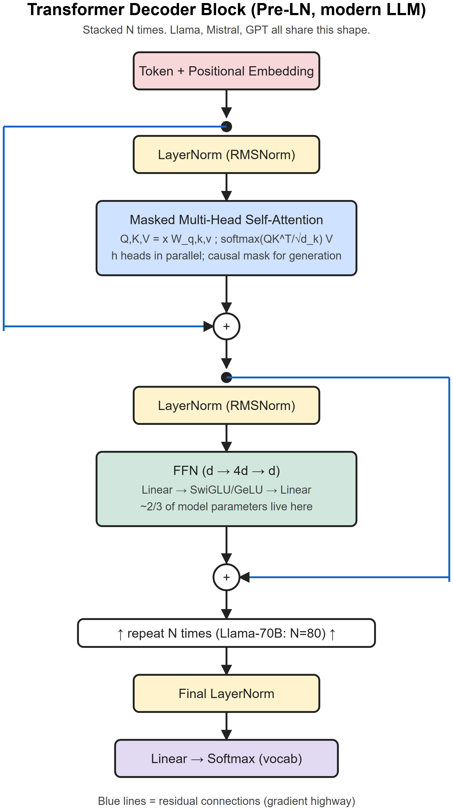
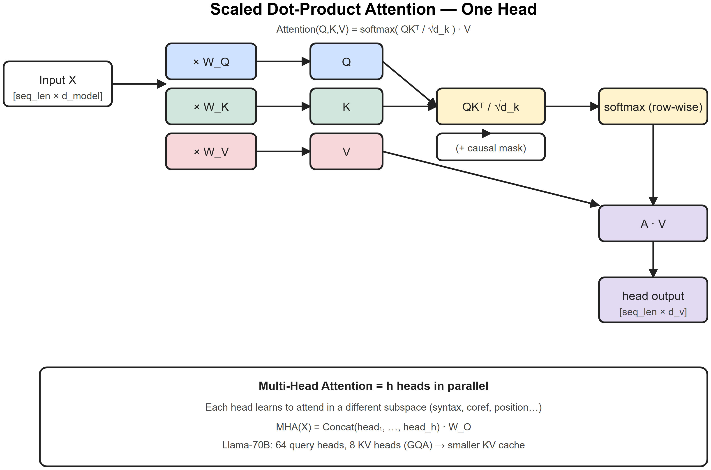
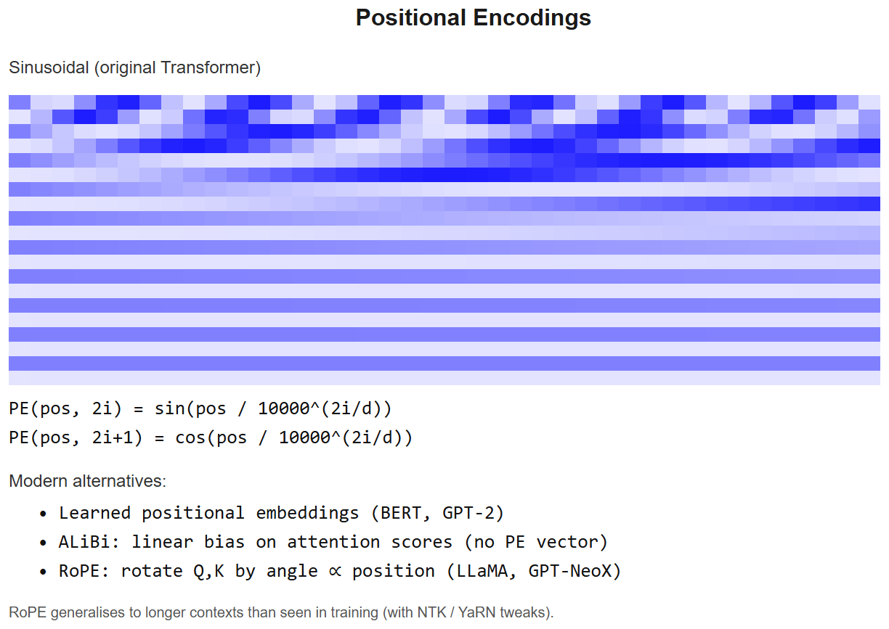

# Transformers & Attention -- Cheatsheet







## One-liner
A transformer is a sequence model that replaces recurrence with **self-attention**, allowing every token to look at every other token in **O(n^2*d)** time, fully parallelizable across the sequence axis.

## Attention formula
```
Attention(Q, K, V) = softmax( QKᵀ / sqrtd_k ) * V
```
- **Q, K, V** are linear projections of input embeddings (each `[seq_len, d_k]` per head)
- `sqrtd_k` scaling stops softmax from saturating into one-hot when `d_k` is large
- Output shape: `[seq_len, d_v]`

## Multi-head attention
Run `h` attention heads in parallel, each with its own `W_Q, W_K, W_V` (`d_model -> d_model/h`); concat outputs then project back through `W_O`. Lets the model attend to different subspaces.

## Block layout
**Per encoder block:** `LN -> MHA -> residual -> LN -> FFN -> residual`
**Per decoder block:** `LN -> masked MHA -> residual -> LN -> cross-attn (over encoder) -> residual -> LN -> FFN -> residual`
*(Modern decoder-only LLMs drop cross-attn and use pre-LN: `LN -> sublayer -> residual`.)*

## FFN
Two linear layers with non-linearity: `Linear(d, 4d) -> GeLU/SwiGLU -> Linear(4d, d)`. Holds ~2/3 of the parameters.

## Positional encoding (3 flavors you must know)
| Type | Where used | Idea |
|------|-----------|------|
| **Sinusoidal** | Original "Attention Is All You Need" | Fixed `sin/cos` of position at each freq |
| **Learned absolute** | BERT, GPT-2 | Trainable embedding per position |
| **RoPE (Rotary)** | Llama, Mistral, modern LLMs | Rotate Q/K vectors by angle ∝ position; relative info baked in |
| **ALiBi** | Some long-context models | Linear bias on attention scores by distance |

## Encoder vs Decoder vs Encoder-Decoder
| Family | Attention mask | Examples | Use |
|--------|---------------|----------|-----|
| Encoder-only | Bidirectional | BERT, RoBERTa | Classification, embeddings |
| Decoder-only | Causal (lower-triangular) | GPT, Llama, Claude, Mistral | Generation |
| Enc-Dec | Enc bi + Dec causal + cross-attn | T5, BART, original Transformer | Translation, seq2seq |

## Complexity & memory
- Attention: **O(n^2*d)** compute, **O(n^2)** memory for the score matrix
- KV cache during generation: **O(n*d*layers)** per sequence -- see [kv-cache-cheatsheet](kv-cache-cheatsheet.md)

## Key training details
- **Dropout** on attention weights and FFN
- **Label smoothing** ~= 0.1 in original paper
- **Adam(W)** with warmup -> cosine decay
- **Pre-LN vs Post-LN:** Pre-LN trains more stably at depth; standard in modern LLMs
- **RMSNorm** > LayerNorm in Llama-style models (no mean subtraction, faster)

## Common interview one-liners
- *Why divide by sqrtd_k?* Variance of QKᵀ scales with `d_k`; without scaling, softmax saturates -> near-zero gradients.
- *Why multi-head, not just bigger single head?* Different heads attend to different relations (syntax, coref, position) in different subspaces.
- *Why is attention O(n^2)?* Every token computes a score against every other token.
- *Why decoder-only for LLMs?* Generation only needs one direction; weight-tying input/output embeddings + simpler training; encoder-decoder was needed for translation but not for next-token prediction.
- *Why RoPE over learned absolute?* Generalizes to longer sequences than seen in training, encodes *relative* positions.

## Diagram (text)
```
Tokens -> Embed -> +Pos -> ┐
                        │
       ┌────────────────┴────────────────┐
       │   N x { MHA -> +Res -> LN          │
       │         FFN -> +Res -> LN }        │
       └────────────────┬────────────────┘
                        │
                  Linear -> Softmax -> Next token
```

## Must-read
- *Attention Is All You Need* (Vaswani et al., 2017) -- arxiv.org/abs/1706.03762
- Jay Alammar -- *The Illustrated Transformer* -- jalammar.github.io/illustrated-transformer/
- Karpathy -- *Let's build GPT* (YouTube) -- youtube.com/watch?v=kCc8FmEb1nY


---

## Deep dive -- why transformers dominate

Three structural wins over RNNs:
1. **Parallel training** -- every position computed simultaneously (no sequential dependency), GPUs love this.
2. **Constant path length** -- every token can attend to every other in one step -> no vanishing gradient over long context.
3. **Inductive bias = flexibility** -- attention learns relationships from data instead of hard-coding locality (CNN) or recurrence (RNN).

The cost is **quadratic in sequence length** for vanilla attention (O(N^2*d) compute, O(N^2) memory). Workarounds: sparse, linear, low-rank, sliding-window, FlashAttention (still O(N^2) but memory-efficient and fused).

## The attention equation

```
Attention(Q, K, V) = softmax(Q * Kᵀ / sqrtd_k) * V
```

- `Q in R^(Nxd_k)`, `K in R^(Nxd_k)`, `V in R^(Nxd_v)`
- Scale by `sqrtd_k` to keep dot-products from saturating softmax.
- Multi-head: split d_model into h heads, run attention in each, concat -> linear.

Encoder block:
```
x <- x + MHA(LN(x))      # pre-norm (modern style)
x <- x + MLP(LN(x))      # MLP = Linear(d, 4d) -> GeLU -> Linear(4d, d)
```

Decoder adds **causal mask** in self-attention (no peeking ahead) and an additional cross-attention block over the encoder output (in enc-dec models).

##  Pitfalls

| Pitfall | Fix |
|---------|-----|
| Forgetting causal mask in decoder | Add upper-triangular -inf mask before softmax |
| Pad tokens contribute to softmax | Mask pad positions with -inf |
| Numerical overflow in softmax | Subtract max before exp (already in stable softmax) |
| Position info lost after attention | Add positional encoding (sin, learned, RoPE, ALiBi) |
| Loss not converging on long sequences | Try gradient clipping, lower LR, more warmup |
| OOM on long context | FlashAttention; gradient checkpointing; sequence parallelism |

## Interview questions

1. **Why divide by sqrtd_k?** Variance of `Q*Kᵀ` grows with d_k; without scaling softmax saturates and gradients vanish.
2. **What's multi-head attention buying us?** Each head can attend to different subspaces (e.g., syntactic, semantic). Empirically: a single big head != many small ones.
3. **Why pre-norm beats post-norm?** Better gradient flow -> easier to train deep stacks; original paper used post-norm.
4. **Encoder vs decoder block diff?** Decoder has masked self-attention + (optionally) cross-attention.
5. **How does the 4x MLP expansion help?** Adds non-linear expressivity per token; attention is essentially linear in V.
6. **Why GeLU and not ReLU?** Smoother gradient, slightly better empirically; ~no extra cost.

## References
- "Attention Is All You Need" (Vaswani et al., 2017)
- *The Illustrated Transformer* -- Jay Alammar
- Andrej Karpathy: "Let's build GPT" YouTube series
