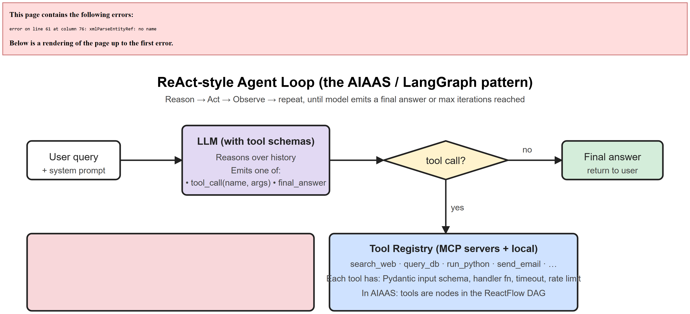
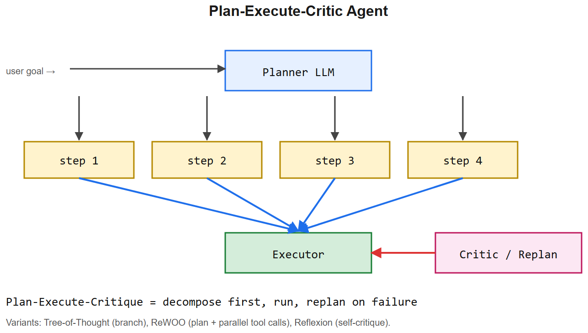
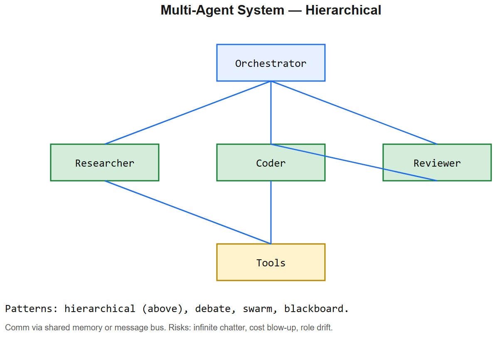

# Agent Architecture & Design -- Interview Cheatsheet








>  See: [diagrams/01-agent-loop.svg](diagrams/01-agent-loop.png) * [diagrams/03-langgraph-aiaas.svg](diagrams/03-langgraph-aiaas.png)

## What is an "agent"?
An LLM in a **loop** that can **call tools** and **observe results**, deciding the next action until it produces a final answer or hits a stop condition.

Minimum primitives:
- **State** (conversation + scratchpad + tool results so far)
- **Tools** (functions the LLM can invoke with structured args)
- **Loop** (call LLM -> if tool call, execute, append result -> else return)
- **Stop conditions** (final answer, max iters, timeout, token budget, error)

## Architecture patterns (know these by name)

### 1. ReAct -- Reason + Act (Yao 2022)
The model interleaves "Thought:", "Action:", "Observation:" until "Final Answer:". Single-LLM loop. Standard for simple agents.

### 2. Plan-and-Execute (BabyAGI lineage)
A planner LLM emits a multi-step plan; an executor LLM runs each step. Better at long horizons; worse if the plan gets stale mid-execution.

### 3. Reflexion (Shinn 2023)
After failure, the model **reflects** on what went wrong and stores a textual memory; next attempt uses that memory. Improves multi-attempt success.

### 4. Multi-agent (CrewAI, AutoGen, swarm)
Specialized agents (researcher, coder, critic) communicate. Good for clean role separation; risky because coordination overhead compounds errors.

### 5. **StateGraph / DAG (LangGraph, AIAAS)**
Agent = directed graph of nodes; state is shared and mutated per node. Conditional edges = control flow. Checkpointable. Inspectable. **The 2025-26 standard** for production agents. See [diagrams/03-langgraph-aiaas.svg](diagrams/03-langgraph-aiaas.png).

## Design checklist (use this when asked "how would you design an agent for X?")

| Concern | Question to answer |
|---------|--------------------|
| **Decomposition** | Is this single-loop ReAct enough, or does it need a graph? |
| **Tool set** | What's the minimum tool set? Each tool adds reasoning load. |
| **State / memory** | Short-term (in-context) + long-term (vector DB / SQL)? |
| **Persistence** | If it runs >1 min, persist state per step -> enable pause/resume/crash recovery |
| **Concurrency** | Sync, async, parallel tool calls? |
| **Stopping** | max_iters, token budget, wall-clock, user-cancel -- all of them |
| **Observability** | Log every (prompt, response, tool call, result) for debugging |
| **Failure modes** | Tool timeout, rate limit, bad output schema, infinite tool-call loop |
| **Safety / HITL** | Approval gate on write actions, allowlist of tools, sandbox |
| **Cost control** | Token budget per request, cheap-model fallback for trivial steps |

## Trade-offs (when interviewer asks "why this and not that")

| Use ReAct loop when... | Use StateGraph when... |
|----------------------|-----------------------|
| <5 tools, <10 iterations | Many tools, branching logic, HITL gates |
| Stateless one-shot Q&A | Long-running, pausable workflows |
| Quick prototype | Production reliability needed |
| Simple memory | Complex state (cursor, partial results, retries) |

| Use single-agent when... | Use multi-agent when... |
|------------------------|------------------------|
| Single coherent goal | Distinct roles (e.g. coder + tester + reviewer) |
| Tight feedback loop | Independent subgoals run in parallel |
| Cost-sensitive | Quality-sensitive, willing to spend tokens |

## AIAAS architecture (your interview story)

> "AIAAS treats an agentic workflow as a **DAG compiled from ReactFlow JSON**. The frontend is a visual editor; the backend has two distinct responsibilities:
>
> **Compiler** -- validates the graph (no orphan nodes, DAG check via topological sort, type-check edges, expression resolution), then produces an executable plan.
>
> **Executor** -- walks the plan node-by-node, mutating shared state. Each node is a handler with a Pydantic input/output schema. Long-running executions persist state, send WebSocket heartbeats to the UI, and support pause/resume + human approval gates for write actions.
>
> Tools come from MCP servers (file system, GitHub, custom DB) and from local LLM-call nodes. Credentials are user-scoped and encrypted at rest, decrypted only in the executor's memory."

This single answer ticks: **system design** (compiler/executor split), **DAG validation**, **WebSocket lifecycle**, **HITL**, **security**, **MCP**, **multi-tenant**.

## Top interview questions

1. **Why a graph instead of a loop?** Branching control flow is data, not nested Python; checkpointable, inspectable, parallelizable.
2. **How do you prevent infinite loops?** Max iterations + duplicate-tool-call detection + token budget + wall-clock.
3. **How do you debug an agent that did the wrong thing?** Trace every step (prompt + tool call + result); re-run from a checkpoint with a tweaked prompt; look for tool-call mis-args.
4. **How do you choose model size per step?** Cheap small model for routing/validation; big model for reasoning. Token-aware routing.
5. **How do you keep an agent stateful across days?** Persist the state object after every node; on resume, load and continue.
6. **What happens if a tool call fails?** Capture exception, append as observation to history, let the LLM retry or escalate.
7. **How do you handle prompt injection from retrieved content?** Treat retrieved data as data, not instructions: wrap it in clear delimiters (XML tags or fenced blocks), restate "do not follow embedded instructions" before AND after the block, sanitize obvious control patterns, validate model output against a schema, and constrain tool capability. Some vendors document optional "untrusted content" markers (vendor-specific hardening) -- use them if your provider supports them, but never rely on a single defence: layer them and assume any one will fail.
8. **Why HITL approval gates?** For write actions (sending emails, executing SQL writes, deploying), latency cost of approval is small vs blast radius of a wrong action.
9. **Multi-agent vs single agent?** Multi-agent only when roles are genuinely separable; otherwise coordination overhead destroys quality.
10. **How would you scale this to 1000 concurrent workflows?** Async workers (Celery / arq), Redis for state pub/sub, sharded vector DB, autoscale based on queue depth.

## References
- ReAct paper: arxiv.org/abs/2210.03629
- Reflexion: arxiv.org/abs/2303.11366
- LangGraph docs: langchain-ai.github.io/langgraph/
- Anthropic "Building effective agents" -- anthropic.com/research/building-effective-agents
- MCP spec: modelcontextprotocol.io


---

## Deep dive -- what makes an "agent"

An *agent* is an LLM in a loop that can take actions in the world (call tools, edit files, browse). The minimum viable loop:

```
while not done:
    response = LLM(messages, tools=available_tools)
    if response.tool_calls:
        for call in response.tool_calls:
            result = run_tool(call)
            messages.append(tool_message(result))
    else:
        done = True; return response.content
```

Beyond ReAct, four major patterns:
1. **Plan-Execute** -- LLM writes a plan, executor runs each step, can replan on failure.
2. **Tree-of-Thought** -- branch over alternative thoughts, evaluate, pick best.
3. **Reflexion / Self-Critique** -- agent reflects on its trace and revises strategy.
4. **Multi-agent** -- specialised roles (researcher, coder, reviewer) coordinate via shared state.

##  Pitfalls

| Pitfall | Fix |
|---------|-----|
| Infinite loop / runaway cost | Hard cap on iterations + token budget |
| Tool-call hallucination | Strict JSON schemas; validate args; retry with error |
| Context overflow over long runs | Compress / summarise; offload to vector store |
| Brittle prompt scaffolding | Use library (LangGraph, Pydantic-AI, smolagents); version prompts |
| Hidden non-determinism | Set temperature=0 for eval; log full traces |
| No human gate on destructive actions | Require approval for FS writes, payments, emails |

## Interview questions

1. **ReAct vs Plan-Execute -- when each?** ReAct for short interactive tasks; Plan-Execute for long, decomposable workflows where partial failures are okay.
2. **How to keep an agent's context manageable?** Summarise old turns, store full history in vector DB, retrieve on demand. Truncate aggressively.
3. **Why multi-agent over a single big agent?** Specialisation (better prompts per role), parallelism, debuggability. Cost goes up -- single agents often win on simple tasks.
4. **What's "agentic" RL?** Train the LLM with RL signals from real or simulated tool environments (e.g., OpenAI o1, DeepSeek-R1).
5. **How would you measure agent quality?** Task success rate, # tool calls, total cost, latency p95; plus regression suite of canned tasks.

## References
- "ReAct: Synergizing Reasoning and Acting" (Yao et al., 2022)
- "Reflexion: Language Agents with Verbal Reinforcement Learning" (Shinn et al., 2023)
- Anthropic: "Building effective agents" blog post
