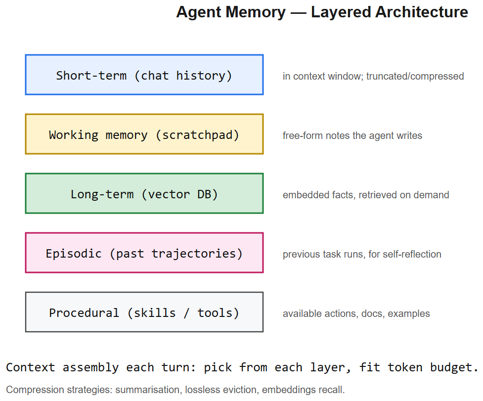

# Agent Memory & Context Window -- Interview Cheatsheet



## Two kinds of memory

| Type | Scope | Implementation |
|------|-------|----------------|
| **Short-term (working)** | Within a conversation | The current LLM context window -- messages, tool results, scratchpad |
| **Long-term (persistent)** | Across conversations / users / days | External store: vector DB, SQL, key-value |

## Long-term memory sub-types
- **Episodic** -- "what happened last Tuesday with user X" -- events with timestamps, stored as JSON or embeddings
- **Semantic** -- "facts the agent has learned" -- knowledge entries, often as embeddings + filterable metadata
- **Procedural** -- "how to do X" -- learned skills, prompt templates, code snippets stored by task type

## Patterns

### 1. Sliding window
Keep only last N tokens / N messages. Cheap, lossy. Default for chat UIs.

### 2. Summarization buffer
When context exceeds threshold, LLM summarizes the oldest half; replace with the summary. Information density per token improves. Loses fidelity over many compactions.

### 3. RAG over conversation history
Embed every turn, retrieve relevant past turns when current query is asked. Scales infinitely; risks fetching irrelevant turns.

### 4. Structured scratchpad
Maintain a typed object (`{user_preferences, current_task, completed_steps}`) updated by an LLM call after each turn. Compact, queryable, but adds LLM calls.

### 5. Hierarchical memory (MemGPT pattern)
OS-inspired: small in-context "main memory" + large out-of-context "disk"; the LLM gets tools to swap pages in/out.

## Context window math
- Tokens cost both money and latency (`O(n^2)` attention compute, `O(n)` KV-cache memory)
- Modern frontier models: 200k-2M tokens. Most apps don't need that.
- **Lost-in-the-middle** (Liu 2023): models recall start + end much better than middle -> put critical info at the end (closest to question).
- **Effective context << advertised context**: a 200k model often loses precision past ~80k. Benchmark on your eval set.

## Context engineering checklist
- [ ] System prompt + few-shot examples kept stable -> **prefix cached** by provider
- [ ] User data + retrieved context placed *after* the stable prefix
- [ ] Question placed at the very end (lost-in-the-middle)
- [ ] No redundant tool definitions repeated mid-conversation
- [ ] Summarization triggered when >70% of window full

## Long-term memory schema (typical)
```sql
CREATE TABLE agent_memory (
  id UUID PRIMARY KEY,
  user_id UUID,            -- scoped per user
  kind TEXT,               -- 'episodic' | 'semantic' | 'procedural'
  content TEXT,            -- raw text
  embedding VECTOR(1024),  -- pgvector
  metadata JSONB,          -- {topic, source, confidence, ...}
  created_at TIMESTAMPTZ,
  last_accessed TIMESTAMPTZ,
  importance FLOAT         -- decay / pruning signal
);
```
Pruning: forget low-importance + old + unaccessed entries.

## Interview one-liners
- *Short-term vs long-term?* Short = in-context window of current chat. Long = external store (vector DB / SQL) queried per turn.
- *How do you handle a 5-hour conversation?* Summarize old turns into a running summary + RAG over the raw transcript embeddings for specific lookups.
- *What does "lost in the middle" mean?* LLMs recall start + end of context much more reliably than the middle. Put critical info near the question.
- *Why care about prefix caching?* Identical leading tokens are cached by the provider -> cheaper, lower latency. Keep system prompt + tools stable.
- *Per-user memory isolation?* Scope by `user_id` in metadata; filter before ANN search to prevent cross-user leakage.
- *Memory drift?* Conflicting memories accumulate; add a deduplication / consolidation pass or LLM-driven update vs append decision.

## AIAAS interview anchor
> "In AIAAS, each workflow run has its own state object (short-term), but the platform also supports cross-run memory -- user-scoped, MCP-accessible via a memory server. The LLM can query past runs as resources. This was deliberate: agents that don't remember prior approvals or user preferences feel broken on day two."


---

## Deep dive -- memory architectures

Five memory layers worth distinguishing:
1. **Short-term**: messages in the current context window.
2. **Working memory**: scratchpad notes the model writes (e.g., a TODO list).
3. **Long-term semantic**: vector DB of facts about the user, world, organisation.
4. **Episodic**: previous full task trajectories for retrospective learning.
5. **Procedural**: catalogue of skills / tools / examples the agent can invoke.

The agent assembles a fresh context each turn by **pulling** from each layer; layers persist across turns.

## Context window budget

Typical budget for a 200k-token model in a real agent run:
```
system prompt           ~ 2k
tool definitions        ~ 4k
retrieved docs          ~ 16k
chat history            ~ 8k
scratchpad / state      ~ 2k
response budget         ~ 8k
                        ────
                          40k  (leaves headroom)
```

Compression strategies as runs grow:
- Summarise oldest N turns into a paragraph.
- Replace verbose tool outputs with file refs ("see /tmp/output.json").
- Hierarchical summaries (chunk -> section -> run).

##  Pitfalls

| Pitfall | Fix |
|---------|-----|
| Stuffing the whole DB into context | Retrieve, don't dump |
| Lossy summarisation removes critical detail | Keep verbatim items flagged "important" |
| Memory leaks (sensitive data persists) | TTL on stores; redact on write |
| Stale facts in long-term memory | Versioned writes; "as of" timestamps |
| User asks about past session; agent has no memory | Persist by thread_id / user_id |

## Interview questions

1. **What's the lost-in-the-middle problem?** Models attend better to the start and end of context; middle facts are missed. Mitigations: chunking + retrieval; restate critical facts late in the prompt.
2. **Vector DB for memory -- collisions?** Use namespaces / metadata filters per user; encrypt at rest.
3. **How do you decide what to remember?** Explicit "save this" tool the agent calls; or scheduled summariser at session end.
4. **Episodic memory use case?** Reflexion: agent reads its own past failures and adjusts strategy.
5. **Cost of memory at scale?** Per-user vector index storage + retrieval; cache embeddings; consider in-process LRU.

## References
- "Lost in the Middle: How Language Models Use Long Contexts" (Liu et al., 2023)
- MemGPT / Letta -- operating-system-style memory paging for LLMs
