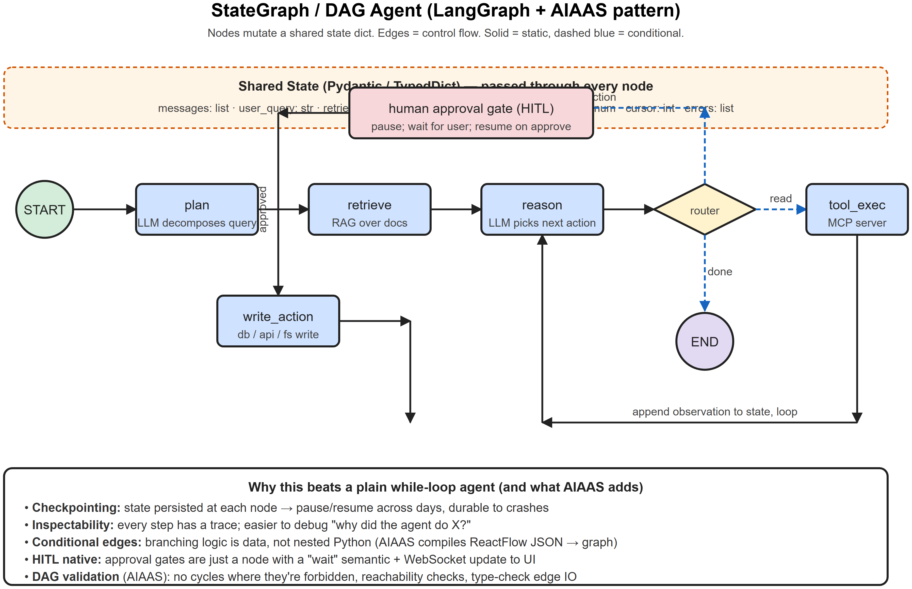

# StateGraph / DAG (LangGraph) -- Interview Cheatsheet




>  See: [diagrams/03-langgraph-aiaas.svg](diagrams/03-langgraph-aiaas.png)

## One-liner
A **StateGraph** is an agent expressed as a directed graph of nodes that **mutate a shared typed state**, with edges (static or conditional) defining control flow. It's the production standard because it's checkpointable, inspectable, and the branching logic is data rather than nested code.

## Anatomy
- **State**: a Pydantic model / TypedDict / dict. Single source of truth.
- **Nodes**: pure functions `state -> partial_state_update`. Examples: `plan`, `retrieve`, `reason`, `tool_exec`, `approve`.
- **Edges**:
  - **Static**: A -> B always
  - **Conditional**: A -> router -> {B, C, D} based on `state`
- **Entry / Exit**: START -> ... -> END
- **Checkpointer**: persistence layer (Redis, Postgres, SQLite) that saves state after every node

## Why it beats a while-loop agent

| Capability | While-loop | StateGraph |
|------------|-----------|------------|
| Pause / resume across days | Hard | Native via checkpoint |
| Inspect why it did X | grep logs | View graph trace |
| Branch on tool result | nested if/else | conditional edge |
| Run two paths in parallel | manual async | fan-out / fan-in nodes |
| HITL approval mid-run | clunky | just a node that waits |
| Test individual steps | rerun whole loop | unit-test one node |

## LangGraph code sketch
```python
from langgraph.graph import StateGraph, START, END
from typing import TypedDict

class AgentState(TypedDict):
    messages: list
    retrieved_docs: list
    needs_approval: bool

def plan(state): return {"messages": state["messages"] + [...] }
def retrieve(state): return {"retrieved_docs": rag.search(state["messages"][-1])}
def reason(state): return {"messages": state["messages"] + [llm.invoke(...)]}
def router(state):
    last = state["messages"][-1]
    if last.tool_calls and last.tool_calls[0].name == "write":
        return "approve"
    return "tool_exec" if last.tool_calls else "end"

g = StateGraph(AgentState)
g.add_node("plan", plan)
g.add_node("retrieve", retrieve)
g.add_node("reason", reason)
g.add_node("approve", approve)
g.add_node("tool_exec", tool_exec)
g.add_edge(START, "plan")
g.add_edge("plan", "retrieve")
g.add_edge("retrieve", "reason")
g.add_conditional_edges("reason", router, {"approve":"approve","tool_exec":"tool_exec","end":END})
g.add_edge("approve", "tool_exec")
g.add_edge("tool_exec", "reason")
app = g.compile(checkpointer=PostgresSaver(...))
```

## Patterns

### Fan-out -> fan-in (parallel)
```
            ┌─ summarize_doc_1 ─┐
state ─-> split ─├─ summarize_doc_2 ─┼─-> merge ─-> next
            └─ summarize_doc_3 ─┘
```
Use when sub-tasks are independent (e.g. summarize 10 chunks in parallel).

### Self-correcting loop
```
generate -> critique -> if_bad -> revise -> critique -> ... (max N iters) -> emit
```

### HITL gate
```
plan -> propose -> ── (pause, store state, notify user) ── -> approved? -> execute
                                                      └─-> rejected -> revise
```

## DAG validation -- the AIAAS angle
When users build agents in a visual editor (ReactFlow), you must validate before compiling:

| Check | Why |
|-------|-----|
| **Cycle detection** (topological sort fails if cycle) | Prevent infinite branches in a DAG context |
| **Reachability** | Every node must be reachable from START |
| **Sink** | Every node must reach END (no orphans) |
| **Schema compatibility** | Edge `A -> B` requires `A.output_schema` ⊇ `B.input_schema` |
| **Required configs** | Every node has needed parameters / credentials |
| **Expression resolution** | Templated args like `{{ prev.result }}` must reference earlier nodes |

This is what your AIAAS "compiler-style backend" does -- exactly the interview talking point.

## Interview one-liners
- *Why graph not loop?* Branching as data, checkpointing, inspection, parallelism -- all hard in a while loop.
- *What goes in state?* Everything mutable that nodes share: messages, tool results, cursor, errors, partial outputs.
- *Why typed state (Pydantic)?* Compile-time-ish guarantees about what each node reads/writes; safer than dicts.
- *How do you persist across restarts?* Checkpointer writes state after every node (Postgres / Redis / SQLite).
- *Cycles allowed?* In LangGraph yes -- the looping pattern (reason -> tool -> reason) is a cycle. In a *strict DAG* context (AIAAS workflows), cycles are validated against unless explicitly marked as loop nodes.

## AIAAS interview anchor
> "AIAAS workflows are essentially LangGraph-style StateGraphs but defined visually. The frontend produces ReactFlow JSON; the backend's compiler converts that JSON into an executable graph -- node index, DAG validation, reachability, expression resolution, subworkflow composition. Then the executor walks that graph with persisted state, sending heartbeats over WebSocket so the UI shows live progress. The split lets the compiler catch errors before any LLM call, which saves money and gives users immediate validation feedback."


---

## Deep dive -- why graphs beat free-form loops

A free-form ReAct loop is hard to debug, hard to test, and silently expensive. A **state graph** makes the workflow explicit:
- Each **node** is a pure function over the shared state (`(state) -> partial_state`).
- Each **edge** is either a fixed transition or a conditional router (often itself an LLM).
- The **state** is a typed dict -- concrete contract between steps.

Benefits:
- Visual diagram of the pipeline.
- Snapshot / resume at any point.
- Per-node retries / timeouts.
- Easier eval: compare states at boundaries.

## LangGraph anatomy (sketch)

```python
from langgraph.graph import StateGraph, END

class State(TypedDict):
    query: str
    plan: list[str]
    results: list[dict]
    answer: str | None

g = StateGraph(State)
g.add_node("plan",   plan_node)
g.add_node("search", search_node)
g.add_node("answer", answer_node)
g.add_edge("plan", "search")
g.add_conditional_edges("search", router, {"more": "search", "done": "answer"})
g.add_edge("answer", END)
g.set_entry_point("plan")
app = g.compile(checkpointer=memory)
```

##  Pitfalls

| Pitfall | Fix |
|---------|-----|
| State dict bloat | Keep only needed fields; offload large blobs |
| Long chains of nodes that all call the LLM | Cache; batch when possible |
| Cycles without exit condition | Always include a max-iteration counter in state |
| Conditional router unreliable | Use Pydantic schema for router output |
| Snapshots leak secrets | Redact before persisting |

## Interview questions

1. **Why use LangGraph vs writing your own loop?** Checkpointing, conditional edges, retry/timeout, observability come free.
2. **How do you debug a stuck agent?** Inspect state at each node boundary; rerun failed node with cached upstream.
3. **Persisting state across requests?** `Checkpointer` (sqlite, redis, postgres) per thread_id.
4. **Streaming through a graph?** LangGraph supports event streaming per node -- emit tokens / state diffs to the client.
5. **Branching workflows?** Multiple outgoing conditional edges; nodes can be marked parallel.

## References
- LangGraph docs (langchain-ai)
- "Compound AI Systems" -- BAIR blog (Zaharia et al., 2024)
