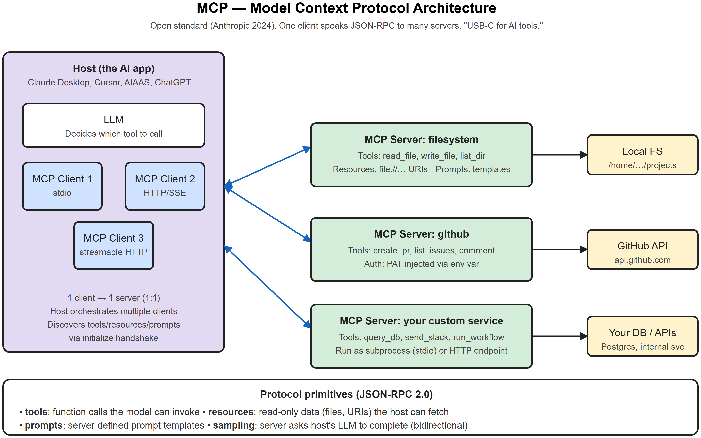
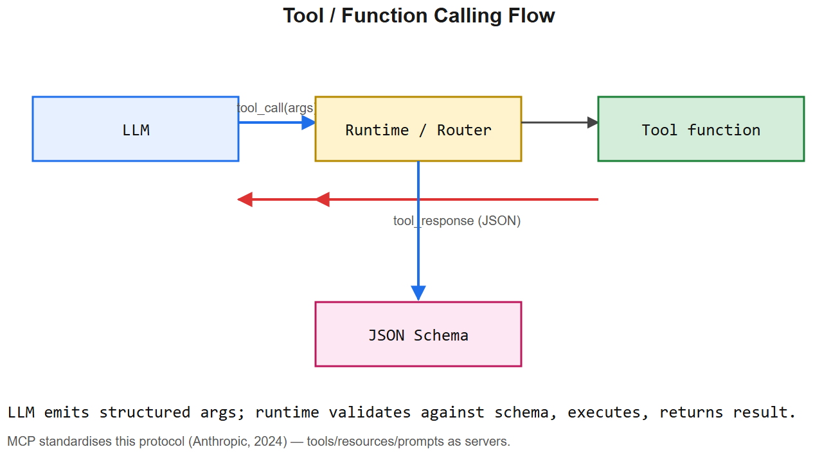

# Tools & MCP -- Interview Cheatsheet





>  See: [diagrams/02-mcp-architecture.svg](diagrams/02-mcp-architecture.png)

## Tool calling -- the basics
**Tool calling** = the LLM emits a structured JSON saying "call this function with these args" instead of a text answer. The harness executes the function, returns the result, and lets the LLM continue.

### Anatomy
- **Tool schema**: JSON Schema (or Pydantic) describing the function name, args, types, descriptions
- **Tool registry**: dict of `{name: handler_fn}`
- **Harness**: takes LLM output -> if `tool_calls`, executes them, appends results to the message list, calls LLM again

### Schema example
```python
class SearchTool(BaseModel):
    query: str = Field(..., description="Search query")
    top_k: int = Field(5, ge=1, le=20)

tools = [
    {
      "name": "search_docs",
      "description": "Search internal documentation",
      "input_schema": SearchTool.model_json_schema()
    },
    ...
]
```

### Best practices
- **Few, clear tools** beat many overlapping ones. Each tool adds reasoning load.
- **Descriptive names** matter -- `query_db` is worse than `query_orders_by_date`.
- **Error messages** are part of the API -- design them so the LLM can recover.
- **Idempotent** where possible -- agents retry.
- **Output schemas too** -- constrain what the tool returns so the model can rely on it.

## MCP -- Model Context Protocol

### What it is
Open standard (Anthropic, late 2024) for connecting LLM apps to external tools and data. **JSON-RPC 2.0** based. Think "USB-C for AI tools": one client speaks the same protocol to any server.

### Three core actors
- **Host** -- the AI application (Claude Desktop, Cursor, **AIAAS**, ChatGPT MCP integration)
- **Client** -- lives inside the host, one per server, manages the connection
- **Server** -- exposes tools, resources, prompts via the protocol (filesystem, GitHub, Postgres, your custom backend)

### Three primitives
| Primitive | What it is | Example |
|-----------|------------|---------|
| **Tools** | Functions LLM can invoke | `read_file(path)`, `query_db(sql)` |
| **Resources** | Read-only data the host can fetch | `file://.../notes.md`, `db://orders/123` |
| **Prompts** | Server-provided prompt templates | "review_pr", "summarize_thread" |
| (bonus) **Sampling** | Server asks host's LLM to complete | server-side reasoning that uses host credentials |

### Transports
- **stdio** -- server is a subprocess of the host; stdin/stdout JSON-RPC. Local tools.
- **HTTP / SSE / streamable HTTP** -- server is a remote endpoint. Cloud tools.

### Why MCP matters
- Before MCP, every LLM app re-implemented tool integrations for every tool -> N x M problem
- After MCP, one MCP server works with any MCP-aware client -> N + M
- Standardized auth, discovery, schemas, error handling

### When NOT to use MCP
- Trivial inline tools that only your app uses -> just register them directly with the LLM
- Tight performance loops where the protocol overhead is unacceptable

## Tool design pitfalls (interview material)
1. **Too many tools** -- LLM confuses semantically similar tools. Aim <=15 for reliable selection.
2. **Underspecified schemas** -- Optional args without defaults -> model invents.
3. **Side effects in "read" tools** -- model expects idempotence.
4. **Returning raw stack traces** -- better to summarize the error and suggest a recovery.
5. **No timeout** -- one slow tool blocks the loop.
6. **No allowlist** -- model can be tricked into calling dangerous tools.
7. **Returning huge results** -- explodes the context window. Paginate or summarize.

## Security checklist (the AIAAS conversation)
- **Allowlist** -- only registered tools can be invoked, names validated against registry
- **Sandbox** -- code-exec tools run in E2B / Modal / Docker, not host process
- **Credential isolation** -- encrypted at rest, decrypted only in executor, never logged
- **HITL approval gate** -- write actions require human OK
- **Per-user scoping** -- agent A can't see user B's credentials/data
- **Rate limit + token budget** -- bound blast radius of a misbehaving agent
- **Prompt-injection defense** -- treat retrieved/tool-returned content as data, not instructions

## Interview one-liners
- *What's MCP?* JSON-RPC standard for LLM ↔ tool/resource servers. One client speaks to any server.
- *Difference from OpenAI function calling?* OpenAI/Anthropic function-calling is the in-prompt protocol; MCP standardizes the *external* connection between the LLM host and tool providers.
- *Tools or resources?* Tools = functions with side effects; resources = read-only data references.
- *How do you stop infinite tool loops?* Max iterations + dedup detection (same tool+args) + token budget + wall-clock.
- *How do you secure tool calls?* Allowlist, sandbox, encrypted credentials, approval gate, per-user scoping, rate limit.
- *Why is MCP a big deal?* Network effect -- once enough servers exist (filesystem, GitHub, Slack, Postgres), every new client gets them for free.

## AIAAS interview anchor
> "AIAAS treats MCP servers as first-class workflow nodes. The compiler validates that each node's MCP tool exists, that the connection config decrypts, and that input/output schemas match adjacent nodes. The executor maintains an MCP client per server, with health checks and reconnection. The visual editor surfaces tool catalogs from connected MCP servers -- so adding a new integration is server-side only, no UI change."


---

## Deep dive -- tool calling, function calling, MCP

**Function calling** = LLM outputs structured JSON conforming to a tool's schema; client runtime executes it. Pattern formalised by OpenAI (2023).

**MCP (Model Context Protocol)** = Anthropic's open standard (2024) for *connecting* LLM apps to external systems. Replaces ad-hoc tool integration with a uniform client/server protocol:
- **Tools** -- actions the model can call.
- **Resources** -- read-only data the model can request.
- **Prompts** -- reusable templates servers can offer.

An MCP server is a small process that speaks the protocol; clients (Claude Desktop, Cursor, agents) discover and use it.

## Anatomy

```jsonc
// tool definition (JSON Schema)
{
  "name": "search_web",
  "description": "Search the web for a query",
  "input_schema": {
    "type": "object",
    "properties": { "query": {"type": "string"} },
    "required": ["query"]
  }
}

// LLM emits
{ "type": "tool_use", "name": "search_web", "input": {"query": "Anthropic"} }

// runtime returns
{ "type": "tool_result", "tool_use_id": "...", "content": "..." }
```

##  Pitfalls

| Pitfall | Fix |
|---------|-----|
| Too many tools -> low accuracy | Curate; prefer 5-15 tools per agent |
| Vague tool descriptions | Write like API docs; include examples |
| No schema validation | Validate input before run; return structured error |
| Side effects without idempotency | Make tools safe to retry; use idempotency keys |
| Sensitive tools exposed by default | Allowlist + per-tool human approval |
| Long results blow context | Truncate; offer pagination tool |

## Interview questions

1. **Why MCP and not just function calling?** Function calling is a wire format; MCP standardises the *discovery, lifecycle, and capabilities* across vendors. Build once, run on Claude Desktop / Cursor / custom agents.
2. **What goes in a tool description?** What it does, when to use it, when NOT to, expected inputs, common pitfalls. Treat as in-context documentation.
3. **How to handle errors in tool execution?** Return structured error; let the model retry with corrected args; cap retries.
4. **Authentication for MCP servers?** Bearer tokens, OAuth flows, env vars; treat as you would any API.
5. **Tool selection at scale?** Hybrid: route by intent classifier first, then narrow tool list; or retrieve tools by embedding similarity.

## References
- modelcontextprotocol.io
- OpenAI function calling docs
- "Tool Use with Claude" -- Anthropic docs
