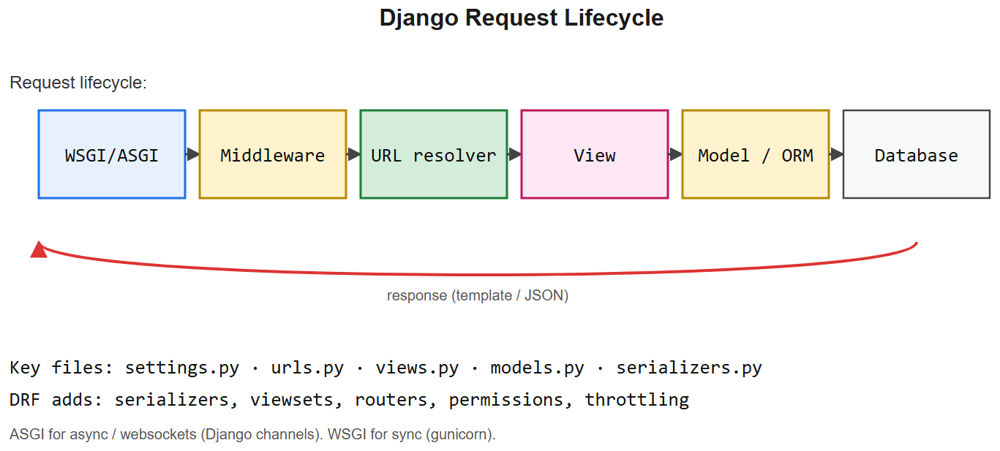
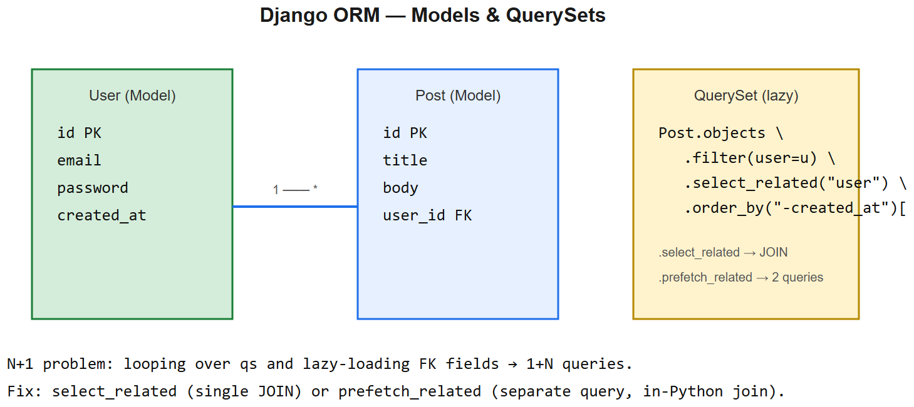
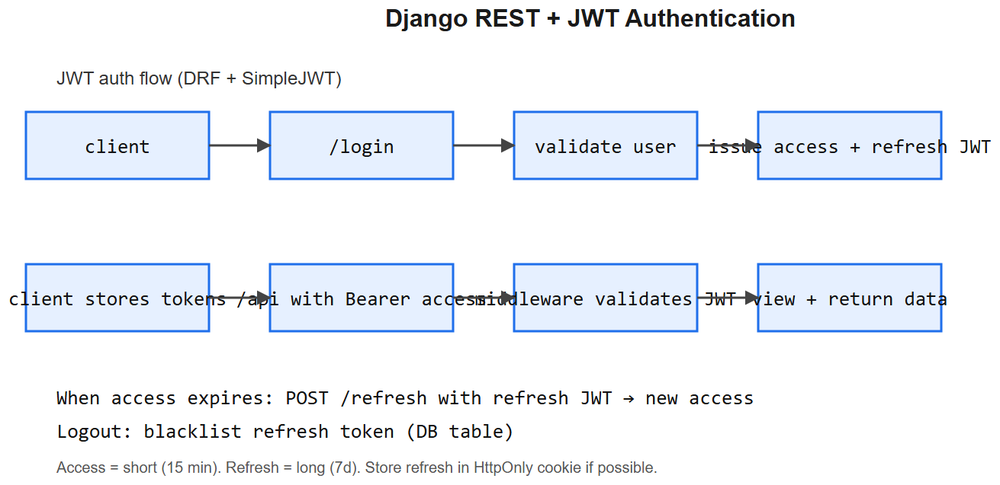

# Django (Full) -- Interview Cheatsheet







> Covers: basics, HTTP, models, views, DRF, JWT, middleware, signals, async, admin, rate limiting, WebSockets. Anchored to your NGU + AIAAS work.

## MVT pattern
- **M**odel -- ORM class, DB schema
- **V**iew -- function/class returning HttpResponse (Django's "controller")
- **T**emplate -- HTML rendering (less used in API-only Django REST setups)

## Models
```python
class Product(models.Model):
    name      = models.CharField(max_length=200, db_index=True)
    slug      = models.SlugField(unique=True)
    price     = models.DecimalField(max_digits=10, decimal_places=2)
    category  = models.ForeignKey(Category, on_delete=models.PROTECT, related_name="products")
    active    = models.BooleanField(default=True)
    created   = models.DateTimeField(auto_now_add=True)

    class Meta:
        indexes = [models.Index(fields=["category", "active"])]
        ordering = ["-created"]

    def __str__(self): return self.name
```

### Relations
- `ForeignKey` (many-to-one)
- `ManyToManyField` (with optional `through=` table)
- `OneToOneField`
- Reverse access via `related_name`

### on_delete options
| Option | Effect |
|--------|--------|
| `CASCADE` | delete dependent rows |
| `PROTECT` | block delete; raise IntegrityError |
| `SET_NULL` | null the FK (column must be nullable) |
| `SET_DEFAULT` | set to default value |
| `DO_NOTHING` | leave it (you'll get an IntegrityError in DB) |

## Querysets -- the big ones
```python
Product.objects.filter(active=True).count()
Product.objects.filter(price__gte=100, category__slug="masala")
Product.objects.exclude(...)
Product.objects.annotate(num_orders=Count("orderitem"))
Product.objects.aggregate(total_value=Sum(F("price") * F("stock")))
Product.objects.values("category").annotate(n=Count("id"))   # GROUP BY
Product.objects.select_related("category")                   # JOIN (FK)
Product.objects.prefetch_related("tags")                     # 2nd query for M2M / reverse
```

### N+1 problem
```python
# N+1
for p in Product.objects.all():
    print(p.category.name)        # 1 query per product

# JOIN once
for p in Product.objects.select_related("category"):
    print(p.category.name)
```

## Views

### Function-based view (FBV)
```python
@api_view(["GET", "POST"])
def products(request):
    if request.method == "GET":
        return Response(ProductSerializer(Product.objects.all(), many=True).data)
    ser = ProductSerializer(data=request.data)
    ser.is_valid(raise_exception=True)
    ser.save()
    return Response(ser.data, status=201)
```

### Class-based view + DRF
```python
class ProductViewSet(viewsets.ModelViewSet):
    queryset = Product.objects.all()
    serializer_class = ProductSerializer
    permission_classes = [IsAuthenticatedOrReadOnly]
    filter_backends = [filters.SearchFilter]
    search_fields = ["name", "slug"]
```
Use `routers.DefaultRouter()` for CRUD URL wiring.

## Serializers (DRF)
```python
class ProductSerializer(serializers.ModelSerializer):
    category_name = serializers.CharField(source="category.name", read_only=True)

    class Meta:
        model = Product
        fields = ["id", "name", "slug", "price", "category", "category_name"]

    def validate_price(self, v):
        if v < 0: raise serializers.ValidationError("price must be >= 0")
        return v
```

## JWT auth (SimpleJWT)
```python
# views
from rest_framework_simplejwt.views import TokenObtainPairView, TokenRefreshView

# settings
SIMPLE_JWT = {
    "ACCESS_TOKEN_LIFETIME": timedelta(minutes=15),
    "REFRESH_TOKEN_LIFETIME": timedelta(days=7),
    "ROTATE_REFRESH_TOKENS": True,
    "BLACKLIST_AFTER_ROTATION": True,
}
```
- Access token: short-lived, sent on every request
- Refresh token: long-lived, used to mint new access tokens
- **Blacklist** on logout / password change

## Permissions
```python
from rest_framework.permissions import IsAuthenticated, IsAdminUser, BasePermission

class IsOwnerOrReadOnly(BasePermission):
    def has_object_permission(self, request, view, obj):
        if request.method in SAFE_METHODS: return True
        return obj.user == request.user
```

## Middleware
Request flow: `client -> middleware (top->bottom) -> view -> middleware (bottom->top) -> response`

```python
class TimingMiddleware:
    def __init__(self, get_response): self.get_response = get_response
    def __call__(self, request):
        t = time.time()
        resp = self.get_response(request)
        resp["X-Took-ms"] = int((time.time()-t)*1000)
        return resp
```

Built-in critical ones:
- `SecurityMiddleware`
- `SessionMiddleware`
- `CommonMiddleware`
- `CsrfViewMiddleware`
- `AuthenticationMiddleware`
- `MessageMiddleware`
- `CorsMiddleware` (django-cors-headers)

## Signals
```python
from django.db.models.signals import post_save
from django.dispatch import receiver

@receiver(post_save, sender=Product)
def invalidate_cache(sender, instance, **kwargs):
    cache.delete(f"product:{instance.slug}")
```
- Use for cache invalidation, audit logs, denormalization
- **Don't** use for primary business logic -- hard to test, breaks request flow

## Async views & ASGI
```python
async def feed(request):
    items = await sync_to_async(list)(Item.objects.all())
    return JsonResponse({"items": items})
```
- Django 4.1+ has async ORM (`aget`, `afilter().alist()`, etc.)
- Server: Daphne or Uvicorn (ASGI), not WSGI's gunicorn
- **Don't mix sync ORM in async views** without `sync_to_async`

## WebSockets (Django Channels)
```python
class ChatConsumer(AsyncJsonWebsocketConsumer):
    async def connect(self):
        await self.channel_layer.group_add("room1", self.channel_name)
        await self.accept()
    async def receive_json(self, content):
        await self.channel_layer.group_send("room1", {"type":"chat.msg","msg":content})
    async def chat_msg(self, event):
        await self.send_json({"msg": event["msg"]})
```
- Channels uses Redis as channel layer (pub/sub)
- Routing in `routing.py`, ASGI app in `asgi.py`

## Rate limiting (DRF)
```python
# settings
REST_FRAMEWORK = {
    "DEFAULT_THROTTLE_CLASSES": [
        "rest_framework.throttling.AnonRateThrottle",
        "rest_framework.throttling.UserRateThrottle",
    ],
    "DEFAULT_THROTTLE_RATES": {"anon": "60/min", "user": "1000/hour"},
}
```
For finer control: `django-ratelimit` (decorator-based, Redis-backed).

## django-admin tweaks
```python
@admin.register(Product)
class ProductAdmin(admin.ModelAdmin):
    list_display = ["name", "category", "price", "active"]
    list_filter = ["category", "active"]
    search_fields = ["name", "slug"]
    list_editable = ["active", "price"]
    autocomplete_fields = ["category"]
    inlines = [ImageInline]
    readonly_fields = ["created", "slug"]
```

## Migrations
- `makemigrations` -- generate migration files
- `migrate` -- apply
- `showmigrations` -- status
- **Squash** old migrations periodically
- **Data migrations**: `migrations.RunPython(forward_fn)`
- **Zero-downtime schema changes**: add column -> backfill -> switch reads -> drop old (multi-step)

## Caching
```python
# settings
CACHES = {"default": {"BACKEND": "django_redis.cache.RedisCache", "LOCATION": "redis://..."}}

# view-level
from django.views.decorators.cache import cache_page
@cache_page(60 * 15)
def listing(request): ...

# fine-grained
val = cache.get(key) or compute_and_cache(key)
```

## Interview one-liners
- *MVT vs MVC?* Django calls it MVT; Template plays the role of View, View is the Controller. Just naming.
- *select_related vs prefetch_related?* `select_related` = JOIN for FK/O2O (one query). `prefetch_related` = second query + Python join for M2M / reverse FK.
- *Why custom middleware?* Cross-cutting concerns (logging, timing, auth headers, request ID).
- *Signal vs explicit call?* Use signals for non-business-critical hooks (invalidate cache, send analytics). Keep business logic explicit in views/services.
- *N+1 in DRF serializer?* Nested serializer that re-queries per row. Fix with `select_related` / `prefetch_related` on the queryset.
- *JWT vs session?* JWT = stateless, scales horizontally, harder to revoke. Sessions = stateful (DB/Redis), easy to revoke, doesn't scale across services without shared store.
- *DRF FBV vs CBV vs ViewSet?* FBV for one-offs, CBV for typed CRUD, ViewSet + Router for standard REST resources.
- *Async Django gotcha?* Don't call sync ORM from async views without `sync_to_async`; mixed sync/async breaks.

## NGU + AIAAS interview anchors

### NGU (full-stack Django)
> "NGU is a Django REST + React app. Product listings hit DRF ViewSets with cached querysets in Redis, invalidated via post_save signals on Product / Category / Combo. JWT (SimpleJWT) with rotating refresh tokens for auth. Admin panel was a separate SPA hitting admin-only DRF endpoints behind `IsAdminUser`. AI search is a custom action on the viewset that calls our precomputed synonyms cache and falls back to fuzzy matching."

### AIAAS (Django at scale)
> "AIAAS uses Django REST for the compiler/executor APIs, Django Channels for WebSocket updates to the visual editor, async views for LLM/MCP calls, and Celery + Redis for long-running workflow execution. Custom middleware adds per-request workflow IDs to every log line. Permissions use a per-workspace RBAC model with object-level checks."


---

## Deep dive -- Django request lifecycle (in detail)

1. **WSGI/ASGI server** (gunicorn/uvicorn) accepts the HTTP request.
2. **Middleware** runs top-to-bottom on the way in: SecurityMiddleware -> SessionMiddleware -> AuthenticationMiddleware -> CSRF -> custom.
3. **URL resolver** matches against `urlpatterns`; calls the view.
4. **View** does work, possibly hits **models / ORM** which translate to SQL.
5. **Template or DRF serializer** renders the response object.
6. **Middleware** runs bottom-to-top on the way out (process_response).
7. WSGI server returns the bytes.

## ORM essentials (memorise)

```python
# select_related: SQL JOIN (FK / O2O)
Post.objects.select_related("author")  # 1 query

# prefetch_related: separate query + Python join (M2M / reverse FK)
User.objects.prefetch_related("posts")  # 2 queries

# annotate / aggregate
from django.db.models import Count, Avg
User.objects.annotate(post_count=Count("posts"))

# F expressions (SQL-side arithmetic, no race)
from django.db.models import F
Product.objects.filter(stock__gt=0).update(stock=F("stock") - 1)

# only / defer
Post.objects.only("title", "id")    # narrow column projection

# raw SQL escape hatch
User.objects.raw("SELECT * FROM auth_user WHERE ...")
```

##  Common pitfalls

| Pitfall | Fix |
|---------|-----|
| N+1 queries | `select_related` / `prefetch_related`; django-debug-toolbar |
| `get()` raising on missing | `filter().first()` or catch `DoesNotExist` |
| Race conditions on counters | `F` expressions or `select_for_update` |
| Migrations conflict on team branches | One person merges; squash periodically |
| `__contains` on huge tables | Add GIN index (Postgres) or full-text search |
| Forgetting `@transaction.atomic` | Multi-write views must be atomic |
| Secret leak via `DEBUG=True` in prod | Always `DEBUG=False`; configure ALLOWED_HOSTS |

## Interview questions

1. **Sync vs async views in Django 5?** Async views can `await` IO without blocking; useful for slow upstreams. ORM is partly async via `async for` in Django 4.2+.
2. **Class-based vs function-based views?** CBV reuses logic via mixins (ListView, DetailView). FBV is explicit; pick CBV when patterns repeat.
3. **DRF ViewSet vs APIView?** ViewSet bundles list/retrieve/create/update/delete + auto-routing; APIView is a single endpoint.
4. **Pagination strategies?** Page-number (simple), cursor (consistent under inserts), limit-offset (slow on deep pages).
5. **Caching layers in Django?** Per-view (`@cache_page`), template fragment, low-level (`cache.get/set`), DB-level via `QuerySet` cache.
6. **Background tasks in Django?** Celery (Redis/RabbitMQ broker), Django-Q, or RQ. For light scheduling, `django-cron` / management commands + system cron.

## References
- Django docs (read these end-to-end once): topics/db, topics/http, topics/auth
- "Two Scoops of Django" -- production patterns
- Andrew Pinkham's *Django Unleashed*

---

## Backend observability

Production debugging without observability is guessing. Three pillars: **logs, metrics, traces**.

### Structured logging

```python
# settings.py
LOGGING = {
    "version": 1,
    "formatters": {
        "json": {"()": "pythonjsonlogger.jsonlogger.JsonFormatter",
                 "format": "%(asctime)s %(levelname)s %(name)s %(message)s %(request_id)s"},
    },
    "handlers": {
        "console": {"class": "logging.StreamHandler", "formatter": "json"},
    },
    "root": {"handlers": ["console"], "level": "INFO"},
}
```

Always attach a **request id** so log lines from one request collate:

```python
# middleware.py
import logging, uuid
from contextvars import ContextVar

request_id_var: ContextVar[str] = ContextVar("request_id", default="")

class RequestIDMiddleware:
    def __init__(self, get_response): self.get_response = get_response
    def __call__(self, request):
        rid = request.headers.get("X-Request-ID") or uuid.uuid4().hex
        token = request_id_var.set(rid)
        try:
            response = self.get_response(request)
        finally:
            request_id_var.reset(token)
        response["X-Request-ID"] = rid
        return response

class RequestIDFilter(logging.Filter):
    def filter(self, record):
        record.request_id = request_id_var.get()
        return True
```

Wire the filter into the handler in `LOGGING`. Every log line now carries the request id.

### Metrics (Prometheus / OpenMetrics)

```python
from prometheus_client import Counter, Histogram
REQS  = Counter("http_requests_total", "requests", ["view", "status"])
LATEN = Histogram("http_request_seconds", "latency", ["view"])

def my_view(request):
    with LATEN.labels(view="my_view").time():
        ...
        REQS.labels(view="my_view", status="200").inc()
        return JsonResponse({...})
```

Track p50 / p95 / p99 latency separately. p99 catches tail latency that p50 hides.

### Distributed tracing (OpenTelemetry)

```python
# settings.py
from opentelemetry.instrumentation.django import DjangoInstrumentor
from opentelemetry.instrumentation.requests import RequestsInstrumentor
from opentelemetry.instrumentation.psycopg2 import Psycopg2Instrumentor
DjangoInstrumentor().instrument()
RequestsInstrumentor().instrument()   # outbound HTTP as child spans
Psycopg2Instrumentor().instrument()   # DB queries as child spans
```

Trace context propagates via `traceparent` header. One user click can be traced across web -> task queue -> downstream services.

### Error tracking (Sentry)

```python
import sentry_sdk
from sentry_sdk.integrations.django import DjangoIntegration
sentry_sdk.init(
    dsn=os.environ["SENTRY_DSN"],
    integrations=[DjangoIntegration()],
    traces_sample_rate=0.05,
    send_default_pii=False,
)
```

Tag events with request id, user tier, deploy SHA. Sentry release tracking lets you regress a single deploy.

### Slow-query logging

Postgres global:
```sql
ALTER DATABASE app SET log_min_duration_statement = '500ms';
```
Dev tools: `django-silk`, `django-debug-toolbar`. Prod: `pg_stat_statements` + APM.

### Health endpoints

```python
def health(_): return JsonResponse({"ok": True})

def ready(_):
    try:
        with connection.cursor() as c: c.execute("SELECT 1")
        cache.set("healthcheck", 1, 5)
        return JsonResponse({"ok": True})
    except Exception as e:
        return JsonResponse({"ok": False, "err": str(e)}, status=503)
```

Liveness (`/health`) = cheap. Readiness (`/ready`) = validates real dependencies. Kubernetes uses both.

### SLIs, SLOs, error budgets

| Term | Meaning |
|------|---------|
| **SLI** | a measured number (e.g. fraction of requests < 300 ms) |
| **SLO** | target for that SLI (e.g. 99.5% over 30 days) |
| **Error budget** | 100% - SLO; how much failure you can afford |
| **Burn rate** | how fast you are consuming the budget |

Alert on **fast burn** (consuming a large chunk of the budget quickly) -- not on raw error count.

### Production debugging checklist

1. Reproduce: capture the request id from the user or Sentry.
2. Pull all log lines for that request id.
3. Open the trace -- which span is slow or errored?
4. Inspect inputs (redacted) and the last few deploys.
5. DB issue? Check `pg_stat_statements` and the slow-query log.
6. External API? The trace shows the failed outbound call + status.
7. Rollback if a recent deploy correlates; otherwise patch forward.

### Interview questions -- observability slice

1. **Logs vs metrics vs traces?** Logs for events, metrics for aggregates, traces for causality across services. You need all three.
2. **Why p99 latency matters more than p50.** p99 is the worst user experience. Long tails reveal GC, contention, slow queries -- exactly the bugs to fix.
3. **What is an error budget?** `100% - SLO`. Lets the team trade reliability work against shipping speed in a measurable way.
4. **How do you correlate a slow user click to a slow DB query?** Distributed trace with one trace id; the span tree shows the DB call as a child of the HTTP request.
5. **What can go wrong if you log PII?** Compliance violation, credential leak, larger incident scope. Redact at log time, not search time.
