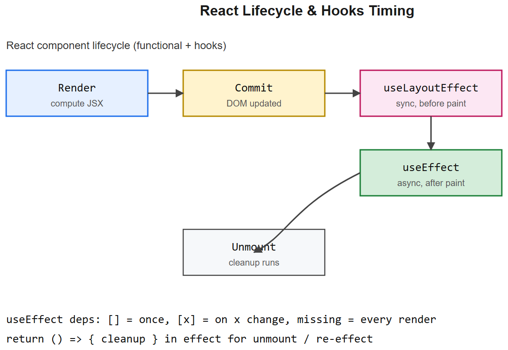
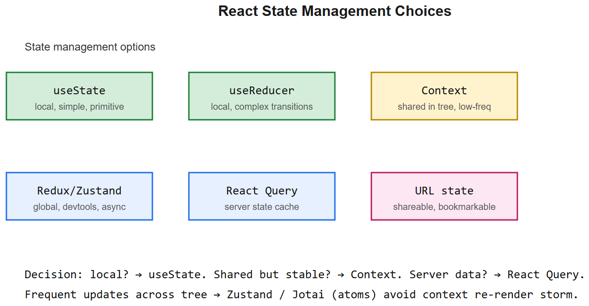
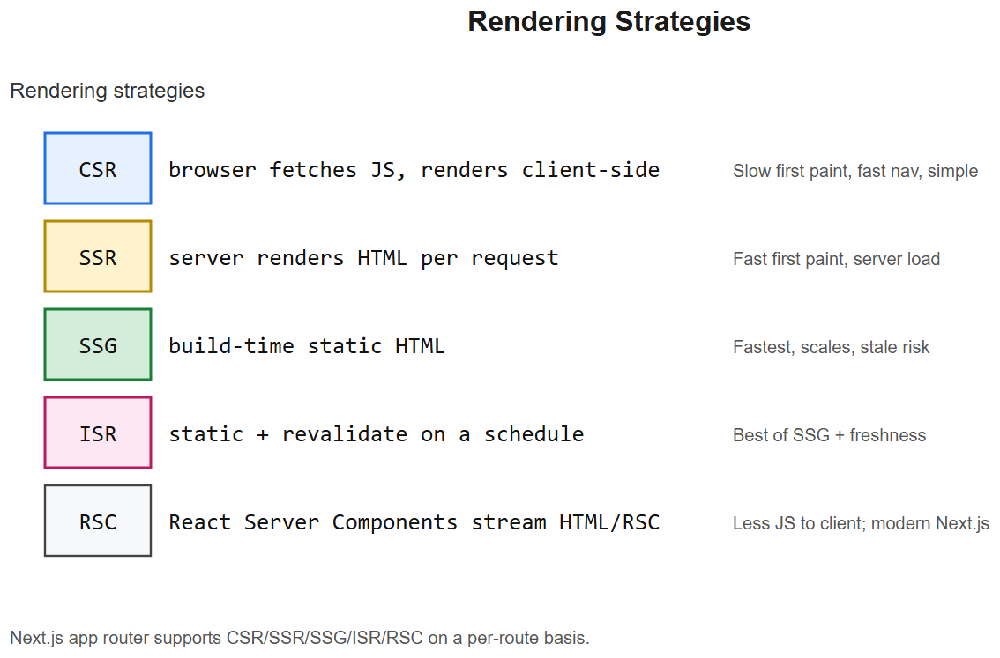

# Frontend (HTML * CSS * JS * React) -- Interview Cheatsheet







## Web basics

### HTML
- Semantic tags: `header, nav, main, section, article, aside, footer`
- Forms: `<input>` types (text, email, password, number, file, date), `<form action method>`
- Accessibility: `alt=`, `<label for>`, ARIA roles, keyboard navigation, focus-visible

### CSS / Tailwind
- **Box model**: content -> padding -> border -> margin
- **Display**: `block | inline | inline-block | flex | grid | none`
- **Flexbox**: 1D layout (row OR column). `justify-content` (main axis), `align-items` (cross axis)
- **Grid**: 2D layout. `grid-template-columns`, `gap`
- **Positioning**: static (default), relative, absolute, fixed, sticky
- **Z-index** only works on positioned elements
- **Tailwind**: utility-first -- `flex justify-between items-center gap-4 p-6 rounded-lg bg-white shadow`

### JavaScript ES6+ essentials
```js
// Arrow fns, destructuring, spread
const sum = (a, b) => a + b;
const { name, age = 18 } = user;
const arr2 = [...arr1, 4, 5];
const obj2 = { ...obj1, name: "new" };

// Promises + async/await
async function fetchUser(id) {
  try {
    const r = await fetch(`/api/users/${id}`);
    if (!r.ok) throw new Error(r.statusText);
    return await r.json();
  } catch (e) { console.error(e); }
}

// Array methods
arr.map(f) * arr.filter(f) * arr.reduce(f, init) * arr.find(f) * arr.some(f) * arr.every(f)

// Closures
function counter() {
  let n = 0;
  return () => ++n;
}
```

### DOM essentials
```js
document.querySelector("#root")
el.addEventListener("click", e => e.preventDefault())
el.classList.add("active")
fetch(url, { method: "POST", headers, body: JSON.stringify(data) })
```
- Event delegation: attach one listener to parent, check `event.target` -- efficient for many children
- Bubbling: child -> parent. Capturing (rare): parent -> child first. `addEventListener(..., { capture: true })`

## React essentials

### JSX
```jsx
const Hello = ({ name }) => <h1>Hello, {name}!</h1>;
```
- JSX compiles to `React.createElement(tag, props, children)`
- Class names: `className=`, not `class=`
- Inline styles: `style={{ color: "red" }}` (camelCase keys)
- Lists need a stable `key={item.id}` prop

### Component types
- **Functional + hooks** (modern default)
- **Class components** (legacy; you should recognize them)

### useState
```jsx
const [count, setCount] = useState(0);
setCount(count + 1);
setCount(c => c + 1);   // functional update -- safe in concurrent renders
```

### useEffect
```jsx
useEffect(() => {
  const controller = new AbortController();
  fetch("/api/x", { signal: controller.signal }).then(...);
  return () => controller.abort();         // cleanup
}, [dep1, dep2]);                          // deps
```
- Runs after render. Empty deps `[]` = once. No deps = every render.
- Always cleanup subscriptions, timers, abort fetches.

### Other hooks
| Hook | Use |
|------|-----|
| `useState` | local state |
| `useEffect` | side effects |
| `useMemo` | memoize expensive computation |
| `useCallback` | memoize function reference (stable for children) |
| `useRef` | mutable value that doesn't trigger re-render; or DOM ref |
| `useContext` | consume Context |
| `useReducer` | complex state transitions (Redux-style) |
| `useId` | stable unique ID for accessibility |
| Custom hook | extract reusable stateful logic |

### Why `useCallback` / `useMemo`?
Children memoized with `React.memo` only skip re-render if props are referentially stable. Pass `useCallback`-wrapped handlers and `useMemo`-wrapped objects.

```jsx
const handleClick = useCallback(() => doIt(id), [id]);
const data = useMemo(() => expensiveCompute(rows), [rows]);
```

### Context (avoid prop drilling)
```jsx
const ThemeContext = createContext("light");

// provide
<ThemeContext.Provider value="dark">
  <App />
</ThemeContext.Provider>

// consume
const theme = useContext(ThemeContext);
```
**Caveat**: every consumer re-renders when value changes. Split contexts (theme separate from user) and memoize the value.

### Custom hook
```jsx
function useDebounce(value, ms = 300) {
  const [v, setV] = useState(value);
  useEffect(() => {
    const t = setTimeout(() => setV(value), ms);
    return () => clearTimeout(t);
  }, [value, ms]);
  return v;
}
```

### React Router (v6+)
```jsx
<BrowserRouter>
  <Routes>
    <Route path="/" element={<Home />} />
    <Route path="/products" element={<ProductLayout />}>
      <Route index element={<List />} />
      <Route path=":slug" element={<Detail />} />
    </Route>
  </Routes>
</BrowserRouter>

// inside component:
const { slug } = useParams();
const navigate = useNavigate();
navigate("/cart");
```

### React Query / TanStack Query
```jsx
const { data, isLoading, error } = useQuery({
  queryKey: ["product", slug],
  queryFn: () => fetch(`/api/products/${slug}`).then(r => r.json()),
  staleTime: 60_000,
});

const mutation = useMutation({
  mutationFn: addToCart,
  onSuccess: () => queryClient.invalidateQueries({ queryKey: ["cart"] }),
});
```
**Why React Query**: replaces a lot of `useEffect + useState` for fetching. Built-in cache, refetch, dedup, retries, optimistic updates.

### Local / session storage
```jsx
localStorage.setItem("token", t);          // persists forever (per origin)
localStorage.getItem("token");
sessionStorage.setItem("k", v);            // cleared on tab close
```
- Synchronous; avoid in hot paths
- ~5MB limit per origin
- **JWT in localStorage** = XSS-vulnerable. Prefer httpOnly cookies for tokens in production.

### Lazy loading / code splitting
```jsx
const Heavy = lazy(() => import("./Heavy"));

<Suspense fallback={<Spinner />}>
  <Heavy />
</Suspense>
```
Vite / Webpack splits the dynamic `import()` into its own chunk -> smaller initial bundle.

## Performance tips
- Stable `key` in lists (not array index when items reorder/delete)
- `React.memo` to skip pure children
- Virtualize long lists (`react-window`, `react-virtuoso`)
- Bundle analyzer to find heavy deps
- Image: lazy `loading="lazy"`, modern formats (AVIF/WebP), responsive `srcSet`

## Interview one-liners
- *Virtual DOM?* React keeps an in-memory tree of elements; on render, diffs new vs old and applies minimal real DOM updates.
- *Keys in lists?* Stable IDs let React's diff algorithm reuse elements across renders instead of recreating them.
- *useEffect cleanup?* Return a function from the effect -- runs before next effect or unmount. Critical for subscriptions, timers, fetches.
- *useMemo vs useCallback?* `useMemo` memoizes a *value*; `useCallback` memoizes a *function reference*. Both depend on dep arrays.
- *Why not just put everything in Context?* Every consumer re-renders on value change. For frequently-changing state, prefer dedicated state (Zustand, Redux) or split contexts.
- *Class vs functional?* Functional + hooks is the modern style. Class still works; understand both to read legacy code.
- *JWT in localStorage vs cookie?* localStorage = XSS risk (any JS can read). httpOnly cookie + SameSite = safer for auth tokens.
- *React Query benefit?* Cache + refetch + dedup + retry + optimistic update -- out of the box. Replaces a ton of `useEffect` boilerplate.
- *SPA vs MPA?* SPA loads once, navigates client-side, smoother UX, harder SEO. MPA is server-rendered per page. Next.js bridges them.

## NGU / AIAAS interview anchor
> "NGU storefront is a Vite + React + Tailwind SPA. React Query handles all product/cart fetching with stale-while-revalidate, optimistic updates on cart mutations, and automatic invalidation on order placement. React Router v6 with nested routes for the product layout. Lazy-loaded admin panel as a separate bundle.
>
> AIAAS visual editor uses ReactFlow for the node graph, Zustand for editor state, React Query for workflow + run data, and a WebSocket subscription pushes live execution status into the same Zustand store -- so the UI reflects executor heartbeats with sub-second latency."


---

## Deep dive -- render -> reconcile -> commit

React doesn't update the DOM directly. Each render produces a **virtual tree**; React **reconciles** (diffs against previous tree) and **commits** the minimal DOM mutations.

- Same component + same key -> element is updated, state preserved.
- Different type/key -> element is unmounted + remounted, state lost.
- React 18 introduces **concurrent rendering** -- work can be interrupted; renders may be discarded; effects only fire on committed renders.

## Hook rules (memorise)

1. Only call hooks at the top level of a component / custom hook.
2. Don't call hooks in loops / conditionals.
3. Custom hooks start with `use`.

Why: React identifies hooks by call order each render.

##  Common pitfalls

| Pitfall | Fix |
|---------|-----|
| Re-renders blowing perf | `React.memo` for components, `useMemo`/`useCallback` for values/fns passed to memoised children |
| Stale closure in `useEffect` | Include all deps; lint with eslint-plugin-react-hooks |
| Setting state from previous state without updater fn | Use `setX(prev => prev + 1)` |
| Heavy work in render path | Move to `useMemo`; offload to web worker |
| Effect runs twice in dev (strict mode) | Expected -- your effect must be idempotent |
| Forms with controlled + uncontrolled mix | Pick one per field; controlled is the norm |
| Key collisions in lists | Use stable unique IDs, not array indices |

## Interview questions

1. **Why keys in lists?** Identity across renders -> reconciler reuses DOM nodes + state.
2. **What does `React.memo` do, and when does it NOT help?** Skips re-render if props shallow-equal. Doesn't help if you pass new object/array/function literals every render (use `useMemo`/`useCallback`).
3. **useEffect vs useLayoutEffect?** Layout is synchronous before paint (use for DOM measurement); Effect is after paint (use for most subscriptions / fetches).
4. **Server Components vs Client Components (Next.js)?** Server components run on the server, send HTML/RSC payload, ship zero JS. Client components hydrate. Mix carefully -- "use client" boundary.
5. **Suspense?** Lets components declaratively wait for async data; fallback UI in the meantime. Pairs with React Query / Relay / Next.js `loading.tsx`.
6. **How does context cause re-renders?** Any consumer re-renders when the provider value changes; mitigate by splitting contexts or using selector libs (Zustand).

## References
- React docs (react.dev) -- the new official tutorial
- Kent C. Dodds blog on hooks patterns
- "Patterns.dev" -- Lydia Hallie

---

## Streaming AI UX

LLM responses arrive token-by-token; the UI must keep up without jank.

### Transport: SSE (default) vs WebSocket vs fetch streams

| Transport | When | Notes |
|-----------|------|-------|
| **Server-Sent Events** | one-way server -> client | simplest; works over standard HTTP; auto-reconnect |
| **WebSocket** | bidirectional, low latency | harder to operate; needed for live mic / video |
| **fetch + ReadableStream** | one-way, modern browsers | works in service workers; manual reconnect |

For LLM chat the answer is usually SSE.

### Minimal streaming consumer in React

```tsx
function useStream(url: string) {
  const [text, setText] = useState("");
  const [done, setDone] = useState(false);
  const abortRef = useRef<AbortController | null>(null);

  const start = useCallback(async (body: object) => {
    setText(""); setDone(false);
    const ctrl = new AbortController(); abortRef.current = ctrl;
    const resp = await fetch(url, {
      method: "POST",
      headers: { "Content-Type": "application/json", "Accept": "text/event-stream" },
      body: JSON.stringify(body),
      signal: ctrl.signal,
    });
    if (!resp.body) return;
    const reader = resp.body.getReader();
    const decoder = new TextDecoder();
    let buffer = "";
    while (true) {
      const { value, done } = await reader.read();
      if (done) break;
      buffer += decoder.decode(value, { stream: true });
      let idx;
      while ((idx = buffer.indexOf("\n\n")) !== -1) {
        const event = buffer.slice(0, idx); buffer = buffer.slice(idx + 2);
        if (!event.startsWith("data: ")) continue;
        const payload = event.slice(6).trim();
        if (payload === "[DONE]") { setDone(true); return; }
        try { setText(t => t + JSON.parse(payload).delta); } catch {}
      }
    }
    setDone(true);
  }, [url]);

  const cancel = () => abortRef.current?.abort();
  return { text, done, start, cancel };
}
```

Key choices:
- `AbortController` -- user must be able to stop generation.
- `TextDecoder({ stream: true })` -- handles multi-byte chars split across chunks.
- Buffer until you see `\n\n` (the SSE event boundary); partial events stay in the buffer for the next chunk.

### Rendering incremental markdown safely

Naive: re-render the whole markdown string on every token. Works for short answers; janks past a few KB.

Better:
- Buffer tokens; commit at render-friendly boundaries (whitespace, punctuation, code-fence open/close).
- Use a streaming-aware markdown lib (e.g. `react-markdown` with `remark-gfm`) and memoise stable blocks.
- Render text inside an unclosed code fence as plain text; switch to syntax highlighting once the closing ``` arrives.
- Sanitise on commit; never `dangerouslySetInnerHTML` from a live stream without sanitisation.

### Cancel, retry, error recovery

| Event | What you do |
|-------|-------------|
| User clicks Stop | `abort()` the fetch; mark message as cancelled |
| Network drops mid-stream | show partial answer + retry button |
| 429 / 5xx before stream starts | exponential backoff up to N times |
| 429 / 5xx mid-stream | save what arrived; ask user before restarting |
| Server emits an `error` event | show inline error, allow regenerate |
| No token for > 30 s | abort, treat as error |

Always preserve what arrived. Resuming generation from the middle is hard (model has no memory of partial); usually you regenerate the whole response.

### Scroll behaviour

- Default: auto-scroll to bottom as tokens arrive.
- If the user scrolled up to read earlier content, **stop auto-scrolling**. Resume only when they scroll back down.
- Show a "jump to latest" pill when new tokens are below the fold.

```tsx
const ref = useRef<HTMLDivElement>(null);
const atBottomRef = useRef(true);
useEffect(() => {
  if (atBottomRef.current && ref.current) {
    ref.current.scrollTop = ref.current.scrollHeight;
  }
});
function onScroll(e: React.UIEvent<HTMLDivElement>) {
  const el = e.currentTarget;
  atBottomRef.current = el.scrollHeight - el.scrollTop - el.clientHeight < 40;
}
```

### Partial state and optimistic UI

- Render the user message immediately (optimistic).
- Render an empty assistant bubble with a typing indicator.
- Append tokens to that bubble as they arrive.
- On completion, replace the typing indicator with finalised content + actions (copy, regenerate, share).

### Error UX patterns

- Inline error block at the end of the partial response, not a toast (toasts disappear).
- "Regenerate" and "Edit message" buttons; never silently dump the user's input.
- If the error is safety-related (refusal), show a calm explanation, not a stacktrace.

### Performance notes

- `setText(t => t + delta)` per token is fine up to ~50 tok/sec; throttle (e.g. `requestAnimationFrame`) at higher rates.
- For very long answers consider virtualised rendering (`react-virtuoso`).
- Move heavy markdown / syntax-highlight off the main thread via Web Worker.

### Interview questions -- streaming UX slice

1. **Why SSE for chat?** One-way server -> client, works over standard HTTP, has built-in reconnect semantics, exposed natively by most LLM providers.
2. **How do you cancel a generation?** `AbortController` on the client; the server should detect connection close and stop the model. Bill only for tokens emitted.
3. **How do you render markdown that is still streaming?** Buffer to safe boundaries; render plain inside open code fences; commit / sanitise on close; memoise stable blocks.
4. **What if the user scrolls up while a response is streaming?** Stop auto-scroll; show a jump-to-latest pill; resume only on manual scroll back to bottom.
5. **How do you handle a mid-stream error?** Keep what arrived; surface an inline error; offer regenerate (not silent retry, since the partial answer may be misleading).
