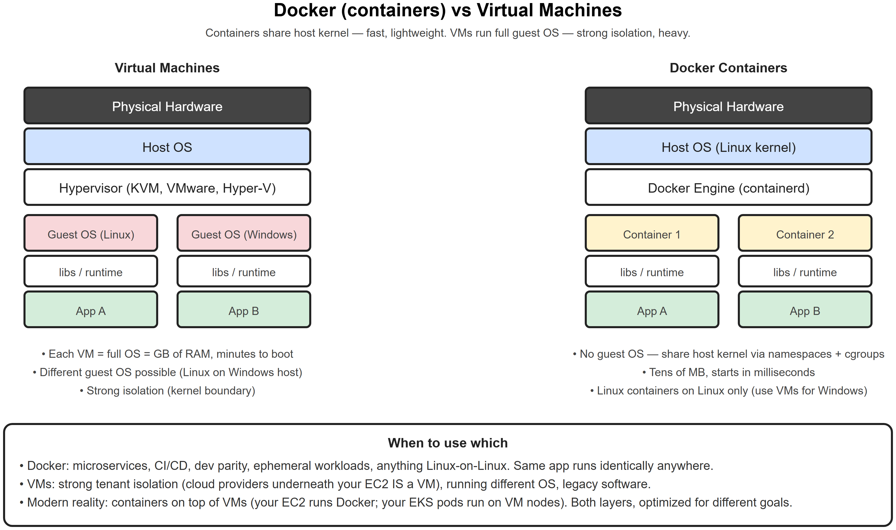
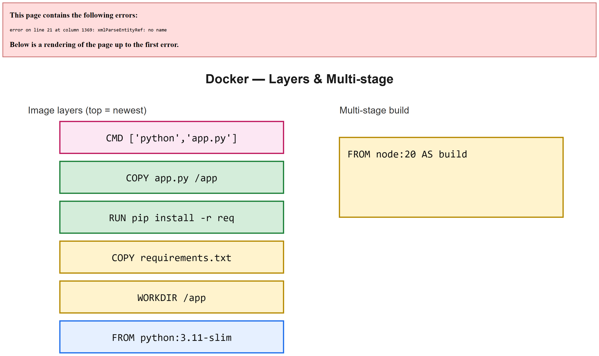
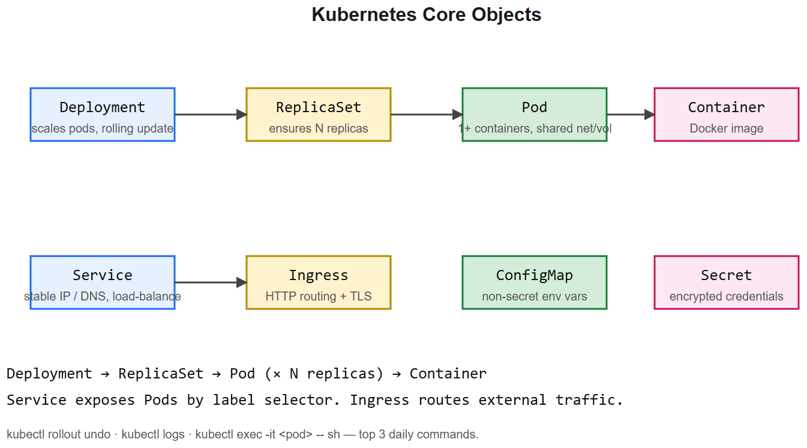
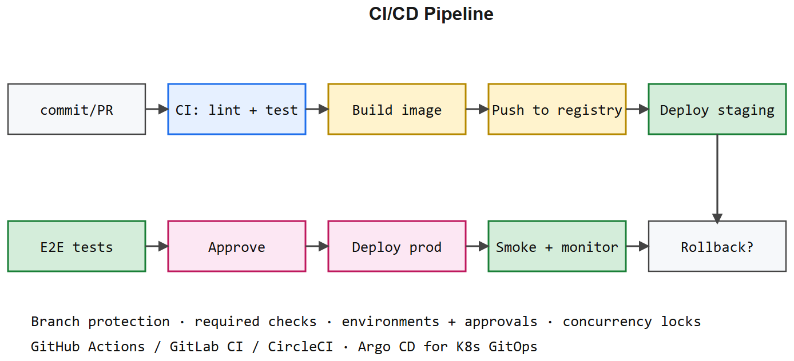

# Deployment -- AWS * Docker * Nginx * Linux * Networking -- Interview Cheatsheet









> Anchored to your NGU stack: Docker + Nginx + EC2 + RDS Postgres + S3 + CloudFront.

## The mental picture (your NGU answer)
```
User -> DNS (Route 53) -> CloudFront (CDN) -> ALB / Nginx (TLS termination)
                                                 v
                                           EC2 (Docker: Django + Gunicorn)
                                                 v
                       Redis (cache) * RDS Postgres (DB) * S3 (media)
```

## AWS core services

### EC2 (compute)
- VM in AWS. Choose instance type: `t3.micro` (burst), `m5.large` (general), `c5.large` (compute), `g4dn.xlarge` (GPU)
- **AMI**: machine image (Ubuntu 22.04 LTS is standard)
- **Security group**: stateful firewall -- inbound/outbound rules per port + CIDR
- **Key pair**: `.pem` file for SSH
- **EBS**: block storage attached to EC2 (root volume + extras)

### S3 (object storage)
- Buckets store objects (any blob). Globally unique bucket name.
- **Storage classes**: Standard, Standard-IA, Glacier (cold archive)
- **Versioning**: keep all versions of an object (recover deletes)
- **Lifecycle rules**: auto-transition old objects to cheap tier
- **Presigned URLs**: time-limited direct upload/download URLs -- no need to proxy via your app
- **Public vs private**: default private; enable static-website hosting carefully

### RDS (managed DB)
- Managed Postgres / MySQL / MariaDB / SQL Server / Oracle
- Multi-AZ for HA (synchronous standby in another AZ)
- Read replicas for read scaling (async)
- Automated backups, point-in-time restore
- **Aurora** = AWS-native rewrite of Postgres/MySQL; faster, autoscaling storage

### Lambda (serverless functions)
- Event-driven: triggered by HTTP (API Gateway), S3 events, SQS, Cron, etc.
- 15-min max execution, 10 GB memory, cold-start latency (~100ms for Node, ~1s for big Python)
- Pay per invocation + duration
- Good for: webhooks, image processing, low-traffic APIs
- Not great for: long-running, heavy ML, WebSockets (use Fargate / EC2)

### IAM
- **Users**: humans
- **Roles**: assumable by services (EC2 -> access S3 without keys in code)
- **Policies**: JSON documents granting/denying actions on resources
- **Principle of least privilege** -- start with nothing, add only what's needed
- **Never** embed AWS keys in code; use IAM roles or env vars from a secret manager

### CloudFront (CDN)
- Edge caches static + dynamic content at 400+ POPs worldwide
- TLS termination at edge
- WAF integration for DDoS / attack rules
- Cache-Control headers control TTLs
- Invalidations: explicit purge (slow, costs $)

## Docker

### Core concepts
- **Image** = template (immutable filesystem snapshot)
- **Container** = running instance of an image
- **Layer** = each Dockerfile instruction creates a layer; reused via cache
- **Registry** = image store (Docker Hub, ECR, GHCR)

### Dockerfile (Django example)
```dockerfile
FROM python:3.12-slim AS base

# install OS deps in one layer, clean apt cache
RUN apt-get update && apt-get install -y --no-install-recommends \
    libpq-dev gcc && rm -rf /var/lib/apt/lists/*

WORKDIR /app

# leverage layer caching: copy requirements first
COPY requirements.txt .
RUN pip install --no-cache-dir -r requirements.txt

# now copy source (changes invalidate only this layer)
COPY . .

RUN python manage.py collectstatic --noinput
EXPOSE 8000
CMD ["gunicorn", "myapp.wsgi", "-b", "0.0.0.0:8000", "-w", "4"]
```

### Layer caching rule
**Put rarely-changing instructions early.** Copying source last means code edits don't reinstall packages.

### Multi-stage builds
```dockerfile
FROM node:20 AS builder
COPY . .
RUN npm ci && npm run build

FROM nginx:alpine
COPY --from=builder /app/dist /usr/share/nginx/html
```
Tiny final image -- no node_modules baked in.

### docker-compose.yml
```yaml
services:
  web:
    build: .
    ports: ["8000:8000"]
    env_file: .env
    depends_on: [db, redis]
    volumes: ["./media:/app/media"]

  db:
    image: postgres:16
    environment:
      POSTGRES_PASSWORD: ${DB_PASS}
    volumes: ["pgdata:/var/lib/postgresql/data"]

  redis:
    image: redis:7-alpine

  nginx:
    image: nginx:alpine
    ports: ["80:80"]
    volumes: ["./nginx.conf:/etc/nginx/nginx.conf:ro"]
    depends_on: [web]

volumes:
  pgdata:
```

### `.dockerignore`
Mirror of `.gitignore` -- keep secrets, `node_modules`, `__pycache__`, `.git` out of build context.

## Nginx (reverse proxy)
```nginx
upstream django {
    server web:8000;
}

server {
    listen 443 ssl http2;
    server_name nidhimasala.kaushaljain.com;

    ssl_certificate /etc/letsencrypt/live/.../fullchain.pem;
    ssl_certificate_key /etc/letsencrypt/live/.../privkey.pem;

    client_max_body_size 20M;

    location /static/ { alias /app/static/; expires 30d; }
    location /media/  { alias /app/media/;  expires 7d; }

    location / {
        proxy_pass http://django;
        proxy_set_header Host $host;
        proxy_set_header X-Real-IP $remote_addr;
        proxy_set_header X-Forwarded-For $proxy_add_x_forwarded_for;
        proxy_set_header X-Forwarded-Proto $scheme;
    }

    location /ws/ {
        proxy_pass http://django;
        proxy_http_version 1.1;
        proxy_set_header Upgrade $http_upgrade;
        proxy_set_header Connection "upgrade";
        proxy_read_timeout 86400;
    }
}
```

## Linux essentials (Ubuntu/Debian)

### File / dir
- `ls -lah` * `cd` * `pwd` * `mkdir -p` * `rm -rf` (careful!) * `cp -r` * `mv`
- `find . -name "*.log" -mtime +7 -delete`
- `du -sh */` (size of subdirs) * `df -h` (disk free)

### Permissions
- `chmod 755 file` -> owner rwx, group rx, other rx
- `chmod u+x file` -> add execute for owner
- `chown user:group file` * `sudo` for root

### Process / network
- `ps aux | grep gunicorn` * `top` * `htop` * `kill -9 PID`
- `netstat -tlnp` / `ss -tlnp` -- listening sockets
- `lsof -i :8000` -- what's on port
- `journalctl -u myservice -f` -- systemd logs
- `tail -f /var/log/nginx/access.log`

### File transfer
- `scp file user@host:/path` (copy via SSH)
- `rsync -avz src/ user@host:/dest/` (sync, resumable)
- `ssh -i key.pem ubuntu@1.2.3.4`
- `ssh -L 5432:localhost:5432 user@host` (port forward -- access remote DB locally)

### Env vars
- `export FOO=bar` (current shell)
- `.env` files + `python-dotenv` / `docker-compose env_file`
- `printenv` to list

## Networking essentials

### DNS
- A record (IPv4), AAAA (IPv6), CNAME (alias), MX (mail), TXT (verification)
- TTL controls cache duration -- lower TTL before a migration so changes propagate fast
- Route 53 (AWS) / Cloudflare DNS

### TLS / SSL
- Handshake: ClientHello -> ServerHello + cert -> key exchange (ECDHE) -> symmetric session key -> encrypted traffic
- **Let's Encrypt** (certbot) -- free 90-day certs, auto-renew
- HSTS header forces HTTPS

### HTTP basics
- Methods: GET/POST/PUT/PATCH/DELETE/HEAD/OPTIONS
- Status codes: 2xx OK, 3xx redirect, 4xx client error, 5xx server error
- Common: 200, 201, 204, 301, 302, 304, 400, 401, 403, 404, 409, 422, 429, 500, 502, 503
- Headers: `Content-Type`, `Authorization`, `Cookie`, `CORS` set
- Idempotency: GET/PUT/DELETE idempotent; POST/PATCH not (use idempotency keys)

## Deployment checklist (use this on every project)
- [ ] All secrets in env vars / secret manager -- none in code
- [ ] HTTPS everywhere (Let's Encrypt or ACM)
- [ ] CloudFront / CDN in front of static + uploads
- [ ] Health-check endpoint (`/healthz` returning 200)
- [ ] Database backups + tested restore
- [ ] Log aggregation (CloudWatch / Datadog / Loki)
- [ ] Metrics + alerts on error rate, latency, queue depth
- [ ] Autoscaling on real signal (CPU, queue depth, latency)
- [ ] Zero-downtime deploys (rolling, with health checks)
- [ ] Disaster recovery plan: RPO/RTO defined

## Interview one-liners
- *Difference between Docker image and container?* Image = static template, container = running instance.
- *Why multi-stage builds?* Tiny final image -- build deps don't bloat runtime.
- *EC2 vs Lambda vs Fargate?* EC2 = full VM, Lambda = stateless functions <=15min, Fargate = container without managing the VM (ECS).
- *Reverse proxy vs forward proxy?* Reverse = in front of your servers (Nginx); Forward = in front of clients (corporate egress).
- *Stateless vs sticky session?* Stateless scales horizontally; sticky pins user to one server (simpler but doesn't scale).
- *S3 vs EBS?* S3 = object storage, durable, infinitely scalable, HTTP API. EBS = block storage attached to a single EC2 like a disk.
- *Why CDN?* Cuts latency (edge cache near user) + offloads origin + DDoS absorption.
- *Zero-downtime deploys?* Rolling deploys: start new instances, health-check, then drain old ones from the load balancer.
- *DNS TTL?* How long resolvers cache the record. Lower before changes; raise after.
- *Difference between TLS and SSL?* SSL is the historical name; TLS is the current protocol. People still say "SSL cert" out of habit.

## NGU interview anchor
> "NGU production stack: Docker containers on EC2 behind Nginx (reverse proxy + TLS termination), CloudFront in front of static assets and product images. RDS Postgres with read replicas planned for traffic growth. S3 for media with presigned uploads from React (no media touching the Django box). Redis (ElastiCache) for cache + session storage. Deploy via GitHub Actions -> SSH -> docker-compose pull && up. Let's Encrypt for certs, auto-renewed via certbot cron."


---

## Deep dive -- containers vs VMs

Containers share the host kernel; VMs virtualise hardware -> each has its own kernel. Containers boot in ms, share I/O, isolate via cgroups + namespaces. VMs offer stronger isolation (security boundary).

## Docker -- the cheat moves

```dockerfile
# Reproducible, cache-friendly, small
FROM python:3.11-slim AS base
WORKDIR /app
COPY requirements.txt ./
RUN pip install --no-cache-dir -r requirements.txt
COPY . .
USER 1000        # don't run as root
ENV PYTHONUNBUFFERED=1
HEALTHCHECK --interval=30s CMD curl -f http://localhost:8000/health || exit 1
CMD ["gunicorn","app:app","--bind","0.0.0.0:8000","--workers","4"]
```

##  Kubernetes -- minimum to know

| Object | Role |
|--------|------|
| Pod | smallest deploy unit (1+ containers) |
| Deployment | declarative rollout + history |
| Service | stable virtual IP/DNS for pods |
| Ingress | external HTTP routing + TLS |
| ConfigMap / Secret | runtime configuration |
| HPA | horizontal pod autoscaler (CPU / custom metrics) |
| Job / CronJob | one-shot / scheduled work |
| StatefulSet | stable identity for DBs / queues |

##  Common pitfalls

| Pitfall | Fix |
|---------|-----|
| `:latest` tag pinning | Always pin to SHA / version |
| Secrets in image | Use Secret manager + env injection |
| Image bloat (1GB+ Python image) | Multi-stage build, alpine/slim base |
| Single replica = SPOF | min 2 replicas + PDB |
| No resource requests/limits | OOMKilled pods; noisy neighbour |
| Healthcheck = TCP only | Use `/health` endpoint validating dependencies |
| Liveness probe too eager | Restarts loop; use Startup probe for slow boot |

## CI/CD pattern

```
PR -> lint + test -> build image + tag commit SHA -> push registry
   -> deploy staging -> E2E -> manual approve -> deploy prod
   -> smoke + monitor -> auto rollback on SLO breach
```

GitHub Actions example:
```yaml
on: [push, pull_request]
jobs:
  test:
    runs-on: ubuntu-latest
    steps:
      - uses: actions/checkout@v4
      - uses: actions/setup-python@v5
        with: { python-version: '3.11' }
      - run: pip install -r requirements.txt
      - run: pytest --cov
```

## Interview questions

1. **Blue-green vs canary deploy?** Blue-green: switch all traffic at once. Canary: send small % to new version, ramp.
2. **What's a sidecar?** Helper container in the same Pod (logging, mesh proxy, init).
3. **PVC vs ConfigMap?** PVC for persistent disk (DBs); ConfigMap for non-secret config.
4. **How do you handle stateful workloads on K8s?** StatefulSet + stable PVC; or external managed service (RDS / Spanner).
5. **Service mesh -- when do you need one?** Many services + need mTLS / retries / tracing / canarying at the network layer. Adds operational cost.
6. **Container vs Lambda for small APIs?** Lambda: zero-ops, scales to 0, cold starts. Containers: predictable latency, more control, idle cost.

## References
- *Docker Deep Dive* (Nigel Poulton)
- *Kubernetes in Action* (Marko Lukša)
- "12-factor app" -- Heroku's manifesto, still relevant
