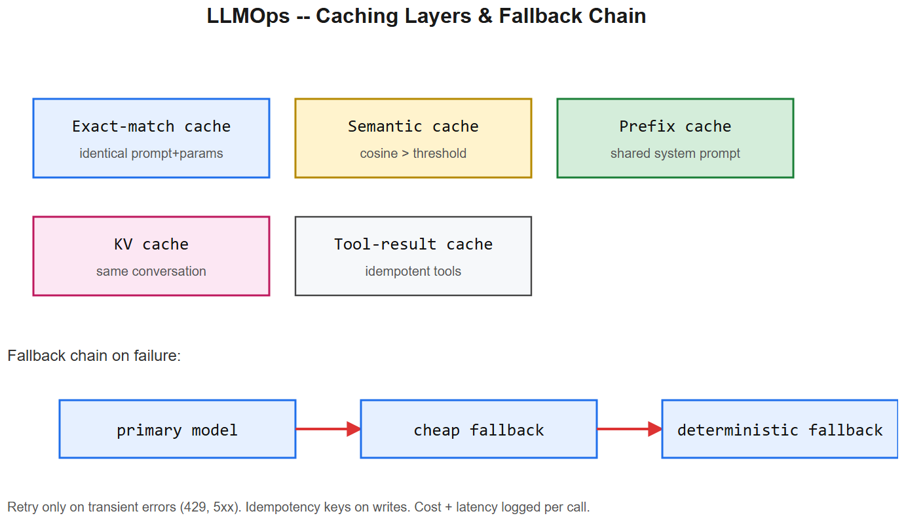
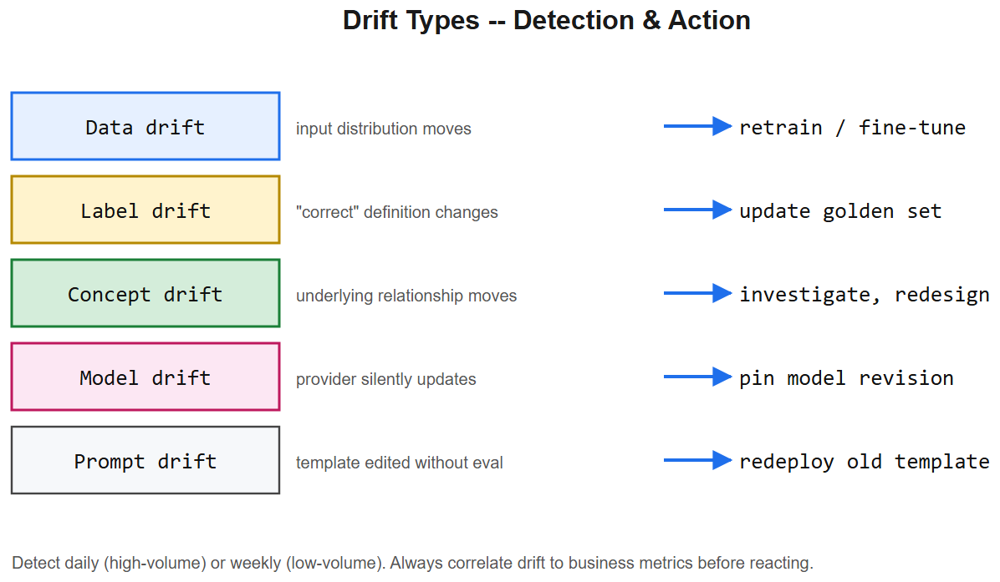

# MLOps + LLM Production Operations -- Interview Cheatsheet





> Once a model leaves a notebook, the hard problems start: reproducibility, monitoring, rollback, cost, drift. This file covers the stack from experiment tracking to GenAI-specific ops.

## TL;DR

| Stage | Classical ML | LLM additions |
|-------|--------------|---------------|
| Reproduce | code + data + params | + prompt version, model id, sampling params |
| Track | experiment runs, metrics | + token usage, cost, latency, refusals |
| Deploy | model artefact | + prompt artefact, fallback model |
| Monitor | data drift, perf drop | + hallucination rate, safety violations |
| Rollback | revert model | revert model OR prompt OR both |
| Test | unit + regression | + golden-set eval, RAG eval, red-team |

---

## 1. Experiment tracking

A "run" = (code commit, dataset version, hyperparams, metrics, artefacts). Tools: **MLflow**, **Weights & Biases**, **Neptune**, **Comet**, **Aim**.

Minimum to log:
- git SHA, branch, dirty?
- data hash / DVC tag
- hyperparams
- metrics (train / val / test) per epoch
- final artefact (model bin + tokenizer + preprocessing config)
- environment (Python version, package lock)

For LLM fine-tunes also log:
- base model id, exact revision
- prompt template version
- tokens seen, total compute (FLOPs), wall clock
- sample outputs (qualitative spot-check)

## 2. Model registry

A versioned, taggable store of model artefacts with promotion stages: `dev -> staging -> production -> archived`.

- Each version has metadata (training run, eval scores, signature, dependencies).
- Promotion gated by tests.
- Rollback is an atomic stage tag flip.
- Multi-model serving: A/B traffic split between `production` and `candidate`.

## 3. Model serving patterns

| Pattern | When | Notes |
|---------|------|-------|
| Real-time HTTP | low latency, low QPS | gunicorn + framework like FastAPI |
| Batch inference | high QPS / async | queue + worker pool |
| Streaming (SSE / WS) | LLM token-by-token | first-token latency matters more than total |
| Triton / TorchServe / Ray Serve / BentoML | high-perf inference | GPU batching, model concurrency |
| vLLM / TGI / TensorRT-LLM / SGLang | OSS LLM serving | paged-attention, continuous batching |
| Managed endpoints | speed-to-market | SageMaker / Vertex / Bedrock / Together |

Key knobs: max_batch_size, max_seq_len, dtype (fp16 / int8 / int4), concurrency.

## 4. Drift -- what changes, what you do

| Drift type | Symptom | Detection | Action |
|------------|---------|-----------|--------|
| Data (covariate) | input distribution moves | population stability index, KL divergence | retrain / fine-tune |
| Label | what counts as "correct" moves | rubric review, audit feedback | update golden set, retrain |
| Concept | the underlying relationship moves | metric decline despite stable inputs | investigate, possibly redesign |
| Model | upstream provider quietly updates | output diff vs. baseline | pin model id / version |
| Prompt | prompt template edited without eval | regression test fails | redeploy old template |

Detection cadence: daily for high-volume systems, weekly for low-volume. Always correlate drift signals with business metrics before acting.

## 5. LLM production ops -- the GenAI-specific stack

### 5.1 Prompt + version tracking

Store every prompt as a versioned artefact (see prompt-engineering cheatsheet). Log `(prompt_version, model_id, model_revision, sampling_params)` per request.

### 5.2 Caching layers

| Cache | Saves | Hit conditions |
|-------|-------|----------------|
| Exact-match response cache | full LLM call cost | identical prompt + params |
| Semantic / embedding cache | full LLM call cost | similar prompt (cosine > threshold) |
| Prompt-prefix cache (server-side) | prefill compute | shared system prompt across requests |
| KV cache (during decode) | re-encoding past tokens | same conversation thread |
| Tool-result cache | external API cost | same tool args, idempotent tool |

Semantic caches need an eviction strategy and a quality bar -- too loose and you serve wrong answers.

### 5.3 Retries, fallbacks, circuit breakers

```
def call_llm(messages):
    for attempt in range(3):
        try:
            return primary.complete(messages, timeout=10)
        except (RateLimitError, ServerError):
            sleep(2 ** attempt + random())
    # graceful fallback
    return fallback.complete(messages, timeout=5)
```

- Retry only on transient errors (429, 5xx, timeout). Never retry a 4xx other than 429.
- Fallbacks: same provider's smaller model -> a different provider -> a static canned response.
- Circuit breaker: after N failures, fail fast for a cooldown window.
- Always log the retry count and final outcome.

### 5.4 Token + cost monitoring

Per request, record:
- input tokens, output tokens
- model id, region
- $ cost (compute from provider price book; price book is data, not code)
- latency (queue, prefill, decode separately)

Per user / per tenant aggregations enable rate limiting, budget alerts, and unit-economics analysis.

### 5.5 Fallback models

Map each "logical task" to a list:
```
TASK -> [primary_model, cheap_fallback, deterministic_fallback]
```
Switch is automatic on failure or budget breach; record which tier handled the request.

### 5.6 Continuous evaluation in prod

- Sample N% of traffic, run through judge / classifier, alert on regression.
- Compare new model versions against the current production model on a fixed golden set + sampled real traffic.
- Track a portfolio of metrics (success rate, safety, latency, cost) -- never a single number.

## 6. Rollback -- what you can revert

Independent rollback knobs (any can be the culprit):
- prompt template version
- model id / revision
- retrieval index version (for RAG)
- tool implementation version
- guardrail thresholds
- traffic split percentages

Make each independently versioned + revertable. Practise rollback in staging -- it should take seconds, not hours.

## 7. Observability checklist (LLM apps)

| Signal | Why |
|--------|-----|
| Per-request trace (prompt, tools, latency, tokens, cost, model, outcome) | debug, post-mortem |
| First-token latency p50/p95/p99 | user-perceived latency for streaming |
| Total latency p50/p95/p99 | SLA |
| Throughput (RPS, tokens/sec) | capacity planning |
| Error rate by type | reliability |
| Token / cost per request, per user | unit economics |
| Refusal rate | over-refusal regression |
| Tool-call success rate | tool reliability |
| Cache hit rate | cost optimisation |
| Drift indicators | retraining trigger |
| Safety incidents | compliance |

Tools: OpenTelemetry traces + Prometheus metrics + structured JSON logs; LangSmith / Helicone / Phoenix / Langfuse for LLM-specific tracing.

## 8. Common pitfalls

| Pitfall | Fix |
|---------|-----|
| Pinning to `gpt-4`/`claude-3-sonnet` aliases | provider can silently update; pin to a specific revision |
| Same prompt across A/B but tracking under one name | tag prompt_version per request |
| Caching aggressive on prompts with user data | scope cache by user; consider privacy |
| Retries without idempotency | duplicate side effects; add idempotency keys |
| Cost tracking after the fact | tokens may already be lost; log at call time |
| No fallback path | a single API outage kills the product; multi-provider |
| Eval only at training time | drift goes undetected; eval in production |
| Treating prompt as configuration | it's a deployable artefact; version + review |

## 9. Interview questions

1. **What's different about MLOps for LLMs vs. classical ML?** You typically don't train; you compose prompts, models, tools, and retrieval. Reproducibility includes prompt + model revision; monitoring needs hallucination / safety / cost signals; rollback can be prompt-only.
2. **How do you control LLM cost in production?** Choose the smallest model that passes eval, cache aggressively, cap max_tokens, use tool calls for structured outputs, watch token-per-request dashboards, set per-tenant budgets.
3. **How do you detect a model regression after a provider update?** Pin model revisions where possible; if not, run a daily golden-set eval and diff outputs against a baseline; alert on score drop > threshold.
4. **Drift detection on text inputs?** Embedding-space drift (population stability), keyword frequency shifts, classifier-based topic drift; correlate with quality metrics.
5. **What does a production trace include for an LLM request?** Request id, user / tenant, prompt + version, model id + revision, retrieved doc ids, tool calls + results, latency by phase, tokens in / out, cost, final response, safety / guardrail decisions.
6. **Streaming responses -- which metric matters?** First-token latency dominates user perception; total latency matters for backend timeout. Track both.

## References

- "Hidden Technical Debt in Machine Learning Systems" (Sculley et al., 2015)
- Chip Huyen: *Designing Machine Learning Systems* + "ML Interviews Book"
- OpenAI / Anthropic / Google production guides
- vLLM, TGI, BentoML docs
- LangSmith / Langfuse / Helicone / Phoenix tracing tools
