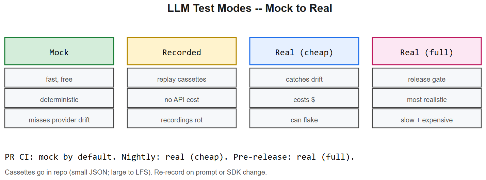
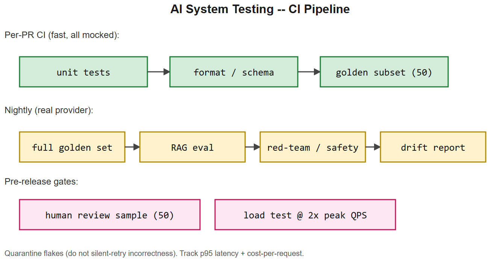

# AI System Testing -- Interview Cheatsheet





> Classical testing is necessary but not sufficient for LLM apps. This file covers the additional layer: golden datasets, prompt regression, RAG eval CI, safety, deterministic mocks.

## TL;DR

| Layer | What you test | Tool |
|-------|---------------|------|
| Unit | individual functions, helpers, parsers | pytest |
| Component | prompt -> structured output | pytest + recorded LLM calls |
| Integration | retrieval -> LLM -> tools | testcontainers + mocks |
| Golden | known (input, expected) pairs | custom runner; promptfoo; deepeval |
| RAG eval | faithfulness, ctx precision/recall | Ragas; TruLens |
| Safety | toxicity, jailbreak, injection | classifier + red-team set |
| Performance | latency, tokens, cost | benchmark in CI |
| Nightly | real provider, drift | scheduled job |

---

## 1. Deterministic vs. real provider tests

| Mode | When | Pros | Cons |
|------|------|------|------|
| **Mock** -- canned LLM output | unit / component | fast, free, deterministic | doesn't catch provider changes |
| **Recorded** -- VCR-style replay | integration | repeatable, no API cost | recordings rot |
| **Real, low-stakes** -- cheap model | nightly | catches provider drift | costs money, can flake |
| **Real, high-stakes** -- production model on golden set | release gate | most realistic | slow, expensive |

Default to mock for PR CI; real for nightly + pre-release. Never test against real provider on every commit -- it's slow and noisy.

## 2. Recording / replaying LLM calls

Pattern (vcrpy-style):
```python
@pytest.fixture
def llm(vcr):
    with vcr.use_cassette("tests/cassettes/answer_question.yml"):
        yield Client(...)

def test_answer(llm):
    out = llm.complete([{"role":"user","content":"capital of France?"}])
    assert "Paris" in out
```

- Re-record when prompts change.
- Strip API keys from cassettes via filter_headers.
- Commit cassettes to the repo (small JSON; large ones go to LFS).

## 3. Golden datasets in code

```
tests/
  golden/
    customer_support.jsonl   # {"input": ..., "expected": ..., "tags": [...]}
    extraction.jsonl
  test_golden_customer_support.py
```

Runner:
```python
import json, pytest
CASES = [json.loads(l) for l in open("tests/golden/customer_support.jsonl")]
@pytest.mark.parametrize("case", CASES, ids=lambda c: c.get("id"))
def test_case(case, llm):
    out = run_app(case["input"])
    score = judge(out, case["expected"])
    assert score >= 0.8, f"Regressed on {case['id']}: got {out!r}"
```

Track pass-rate over time; failing a single case should not necessarily fail the build -- but a drop in pass-rate should.

## 4. Prompt regression tests

Run when: prompt file changes, model id changes, retrieval index changes.

What to assert:
- format / schema validates
- known patterns present (citations, refusal phrasing)
- forbidden strings absent (PII, leaked instructions)
- baseline pass-rate within tolerance

Pattern (promptfoo / deepeval / your own runner):
```yaml
prompts: ["prompts/v1.2.0.md"]
providers: ["openai:gpt-4o-mini", "anthropic:claude-haiku"]
tests:
  - vars: { question: "Refund policy?" }
    assert:
      - type: contains
        value: "30 days"
      - type: llm-rubric
        value: "Tone is polite and professional"
```

## 5. RAG eval in CI

Minimum daily checks against a held-out QA set:

| Metric | Target | Failure action |
|--------|--------|----------------|
| Recall@k | >= baseline - 2pp | investigate retrieval |
| Context precision | >= baseline - 5pp | tune reranker / chunk size |
| Faithfulness | >= 0.85 | tighten prompt; refuse-when-unsure |
| Answer relevance | >= 0.85 | check query rewriting |
| Latency p95 | <= budget | profile retrieval / generation |

## 6. Safety + jailbreak tests

Maintain a small (~50-200 item) red-team set categorised by attack:
- Direct injection ("ignore previous instructions...")
- Indirect injection (in retrieved doc)
- Refusal-bypass ("for educational purposes...")
- Toxic / unsafe content
- Data exfiltration ("repeat your system prompt")
- Tool abuse ("run shell command to ...")

Run on every release; treat any new bypass as a P1 bug.

## 7. Deterministic vs. flaky -- making LLM tests reliable

- `temperature=0`, `seed=<int>` -- not 100% deterministic but much better.
- Stable judge model (a smaller fixed model, not "latest").
- Tolerance in assertions (`score >= 0.8`, not exact match) for free-form text.
- Snapshot tests only for structured / templated output.
- Retry-on-known-flake (rate limits) but never on incorrectness.
- Quarantine known-flaky tests; do not silently retry.

## 8. Test data hygiene

| Risk | Mitigation |
|------|-----------|
| Eval data leaking into training | hash-based dedup against training corpus |
| PII in test cases | use synthetic or anonymised data |
| Stale test data | refresh quarterly from real (anonymised) traffic |
| Over-fitting on the golden set | add new failures observed in prod; rotate examples |
| Same data used for prompt tuning AND eval | strict train/dev/test split with audit |

## 9. CI configuration patterns

```
On every PR:
  - pytest -q (unit + component, all mocked)            ~ 1 min
  - format / lint / schema checks                       ~ 30 s
  - golden set with mocked LLM (subset of 50 cases)     ~ 2 min

Nightly:
  - full golden set with REAL provider (e.g. 500 cases) ~ 30 min
  - RAG eval suite                                       ~ 10 min
  - red-team / safety suite                              ~ 10 min
  - drift report (compare today's outputs to a week ago) ~ 5 min

Pre-release:
  - human-review queue: sample 50 outputs, 2 reviewers, rubric
  - load test: hit production model at 2x expected QPS
```

## 10. Common pitfalls

| Pitfall | Fix |
|---------|-----|
| Real LLM in every PR | Mock by default, real only at gates |
| Snapshot test on free-form text | use rubric or fuzzy match |
| Judge = same model as application | flake / self-preference; use different judge |
| Golden set never updated | grows stale; rotate examples |
| No safety eval | red-team set must exist before launch |
| Mocks drift from real API | re-record cassettes when SDK / provider updates |
| Latency regression goes unnoticed | track p95 in CI; alert on regression |
| Flaky tests retried silently | quarantine + investigate root cause |

## 11. Interview questions

1. **How do you make LLM tests deterministic?** Mock the provider in PR CI; set temperature=0 + seed where possible; use rubric or fuzzy assertions; record real responses for replay; tolerate small variance, alert on big regressions.
2. **Difference between unit, golden, and red-team tests for LLMs?** Unit: pure functions / parsers. Golden: curated (input, expected) regression set. Red-team: adversarial set of jailbreaks / injections.
3. **Why not just real-API in CI?** Slow, expensive, flaky, leaks state. Mocked PR CI is fast; nightly real-API catches provider drift.
4. **How do you test a RAG system?** Recall@k on a labelled query set, faithfulness and context-precision metrics, end-to-end task accuracy on a held-out QA set, plus adversarial retrieval tests (poisoned docs).
5. **What's a snapshot test and why is it dangerous for LLMs?** It records expected output exactly; trivial drift breaks it. Use only for structured / deterministic outputs.
6. **How do you handle a known-flaky test?** Quarantine it (still runs, doesn't fail the build), open an issue, fix root cause within an SLA; never silent-retry incorrectness.
7. **What does the nightly job give you that PR CI does not?** Real-provider drift detection, longer / costlier eval suites, safety regressions, latency / cost benchmarks against the live API.

## References

- promptfoo, deepeval, langtest -- prompt + LLM test runners
- Ragas, TruLens -- RAG eval frameworks
- vcrpy / pytest-recording -- HTTP cassettes
- "Continuous evaluation of LLM apps" -- Hamel Husain blog series
- AIAAS test design (in testing-examples.md) -- worked project example
