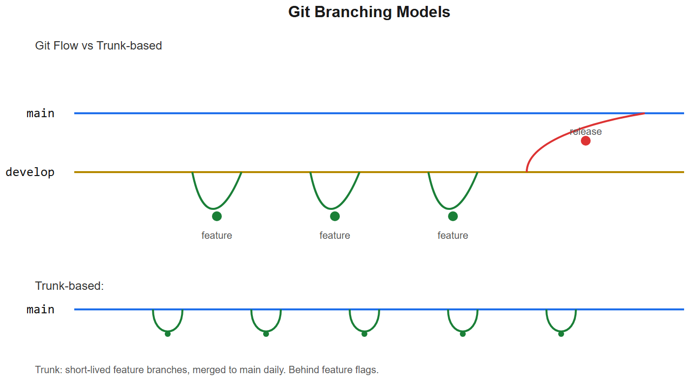
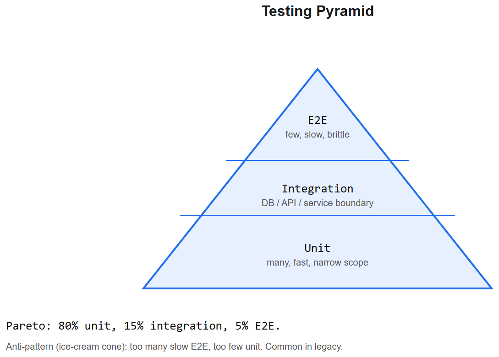

# Git + Testing -- Interview Cheatsheet





## Git -- daily commands
```bash
git status                          # what changed
git diff                            # unstaged changes
git diff --staged                   # staged changes
git add file                        # stage
git add -p                          # stage hunks interactively
git commit -m "msg"
git commit --amend                  # edit last commit (only before push!)
git log --oneline --graph --all     # visual history
git stash / git stash pop           # park unfinished work
```

## Branching workflow
```bash
git checkout -b feature/x           # create + switch
git push -u origin feature/x        # push & track
git pull --rebase                   # update without messy merge commit
git merge main                      # bring main into your branch
git rebase main                     # replay your commits on top of main
git cherry-pick <sha>               # apply one commit from elsewhere
```

### When to merge vs rebase
- **Merge**: preserves history, creates merge commit. Good for shared branches.
- **Rebase**: linear history. Use on your own branch before merging into main.
- **Never** rebase a branch others have pulled -- rewrites their history.

## Undoing things
```bash
git reset HEAD file                 # unstage (keep changes)
git restore file                    # discard unstaged changes (loses work!)
git reset --soft HEAD~1             # undo last commit, keep changes staged
git reset --hard HEAD~1             #  undo last commit + DELETE changes
git revert <sha>                    # safe: new commit that undoes another
git reflog                          # the "oh no" command -- recover lost commits
```

## Merge conflicts
```
<<<<<<< HEAD
your version
=======
their version
>>>>>>> branch
```
- Edit to resolve -> `git add file` -> `git commit` (or `git rebase --continue`)
- `git mergetool` for visual UI
- `git checkout --ours/--theirs file` to take one side wholesale

## .gitignore essentials
```
__pycache__/
*.pyc
.env
.venv/
node_modules/
dist/
.idea/
.vscode/
*.log
*.sqlite3
.DS_Store
```

## Tags + releases
```bash
git tag -a v1.0.0 -m "release"
git push --tags
```
Semantic versioning: MAJOR.MINOR.PATCH

## GitHub workflows (CI)
```yaml
# .github/workflows/test.yml
name: test
on: [push, pull_request]
jobs:
  test:
    runs-on: ubuntu-latest
    steps:
      - uses: actions/checkout@v4
      - uses: actions/setup-python@v5
        with: { python-version: '3.12' }
      - run: pip install -r requirements.txt
      - run: pytest -v
```

## Interview one-liners -- Git
- *Merge vs rebase?* Merge preserves history. Rebase linearizes. Rebase your branch before merging it in.
- *git pull vs git pull --rebase?* Plain pull = fetch + merge (extra merge commit). `--rebase` replays your commits on top of fetched.
- *Cherry-pick?* Copy one commit from one branch to another by SHA.
- *Undo a pushed commit?* `git revert <sha>` then push. Don't `reset --hard` shared history.
- *Where do "lost" commits go?* `git reflog` lists HEAD's recent positions. Almost everything is recoverable for 30 days.
- *Detached HEAD?* You checked out a commit/tag (not a branch). New commits become orphaned unless you branch from there.

---

# Testing

## The pyramid
```
       ┌─────────────┐
       │  E2E (few)  │     slow, brittle, broad
       ├─────────────┤
       │ Integration │     medium speed, real DB/services
       ├─────────────┤
       │   Unit (many)   │ fast, isolated, mock externals
       └───────────────┘
```

## Unit tests (pytest)
```python
def add(a, b): return a + b

def test_add():
    assert add(2, 3) == 5

@pytest.mark.parametrize("a,b,want", [(1,2,3), (-1,1,0), (0,0,0)])
def test_add_param(a, b, want):
    assert add(a, b) == want

def test_raises():
    with pytest.raises(ValueError):
        divide(1, 0)
```

### Fixtures
```python
@pytest.fixture
def user(db):
    return User.objects.create(email="t@t.com")

def test_user(user):
    assert user.id is not None
```
Scopes: `function` (default), `class`, `module`, `session`.

### Mocking
```python
from unittest.mock import patch

@patch("myapp.services.openai_call")
def test_with_mock(mock_call):
    mock_call.return_value = "fake response"
    assert run_workflow() == "expected output"
    mock_call.assert_called_once_with("expected prompt")
```

## Django testing
```python
from django.test import TestCase
from rest_framework.test import APIClient

class ProductAPITest(TestCase):
    def setUp(self):
        self.client = APIClient()
        self.user = User.objects.create_user(email="t@t.com", password="x")
        self.client.force_authenticate(self.user)

    def test_list_products(self):
        Product.objects.create(name="haldi", price=100)
        r = self.client.get("/api/products/")
        self.assertEqual(r.status_code, 200)
        self.assertEqual(len(r.data), 1)
```
- `TestCase` wraps each test in a transaction -> auto-rollback (fast, isolated)
- Use `pytest-django` for `pytest`-style with same DB rollback

## Integration testing -- Postman / httpx
```python
def test_signup_login_flow():
    # signup
    r = client.post("/api/signup/", json={"email":"a@a.com","password":"pw"})
    assert r.status_code == 201

    # login
    r = client.post("/api/login/", json={"email":"a@a.com","password":"pw"})
    token = r.json()["access"]

    # protected
    r = client.get("/api/me/", headers={"Authorization": f"Bearer {token}"})
    assert r.json()["email"] == "a@a.com"
```
Postman/Insomnia: store collections, environments (prod/staging/local), assertions in tests tab, run as a CI step via Newman.

## E2E -- browser automation

### Selenium
```python
from selenium import webdriver

driver = webdriver.Chrome()
driver.get("https://nidhimasala.kaushaljain.com")
driver.find_element("name", "search").send_keys("haldi")
driver.find_element("css", "button[type=submit]").click()
assert "Turmeric" in driver.page_source
driver.quit()
```

### Playwright (modern, better)
```python
from playwright.sync_api import sync_playwright

with sync_playwright() as p:
    browser = p.chromium.launch()
    page = browser.new_page()
    page.goto("https://nidhimasala.kaushaljain.com")
    page.fill("[name=search]", "haldi")
    page.click("button[type=submit]")
    page.wait_for_selector("text=Turmeric")
    browser.close()
```
- **Auto-wait** (no flaky `sleep()`)
- Better debugging (trace viewer, screenshots, video)
- Network mocking + parallel runs
- Standard pick in 2026

## Test concepts to mention

| Concept | What |
|---------|------|
| **Mock** | Fake object returning preset values |
| **Stub** | Fake providing specific responses |
| **Spy** | Real object recording how it was called |
| **Fixture** | Reusable setup |
| **Factory** (factory_boy) | Generate model instances programmatically |
| **Snapshot** | Compare output against stored reference |
| **Property-based** (Hypothesis) | Generates random inputs satisfying constraints |
| **Coverage** | % of code executed in tests; not a quality measure |
| **Flaky test** | Passes sometimes, fails others -- investigate timing/order dependencies |

## Test-first patterns
- **Happy path**: typical input, expected output
- **Sad path**: invalid input, error cases (assert exceptions, 4xx, validation msgs)
- **Edge cases**: empty, very large, boundary, unicode, concurrent

## CI checklist
- [ ] Lint (ruff/black)
- [ ] Type check (mypy/pyright)
- [ ] Unit tests
- [ ] Integration tests
- [ ] Coverage report
- [ ] Build Docker image
- [ ] Security scan (bandit, trivy)

## Interview one-liners -- Testing
- *Unit vs integration vs E2E?* Unit isolates a function (mocks deps). Integration tests multiple components together (real DB). E2E exercises the whole system (browser).
- *Mock vs stub?* Mock = also asserts how it was called. Stub = just returns canned data.
- *Why TestCase auto-rolls back?* Each test wraps in a transaction, rollback at teardown -> isolation + speed.
- *Why Playwright over Selenium?* Auto-wait removes flakiness; better debug tools; faster; native parallel; cleaner API.
- *Coverage = quality?* No. 100% covered code can still be buggy if assertions are weak. Coverage is a floor, not a ceiling.
- *Test pyramid?* Many fast unit tests at the base, fewer integration tests, few E2E at the top.
- *Flaky test?* Inconsistent passes/fails. Usually due to time, order, network, or shared state. Quarantine, then root-cause.

## AIAAS testing anchor
> "AIAAS tests are layered: unit tests for the compiler (graph validation, expression resolution) -- fully isolated. Integration tests for executor + Redis/Postgres + a mocked MCP server. E2E (Playwright) for the visual editor: drag a node, save, run, watch live status via WebSocket. The LLM/MCP calls are mocked in CI; we have a separate nightly suite hitting real providers to catch upstream regressions."


---

## Deep dive -- what git actually stores

Git is a **content-addressable filesystem**: every file is hashed (SHA-1/SHA-256) into the `.git/objects` store. Four object types:
- **blob** -- file contents
- **tree** -- directory listing (filename -> blob hash)
- **commit** -- snapshot pointer (tree + parent + author + msg)
- **tag** -- annotated tag with message + signature

A branch is just a movable pointer to a commit hash. Knowing this makes rebases, cherry-picks and reflog recovery intuitive.

## Commands to memorise

```bash
# Inspect
git log --oneline --graph --decorate --all
git reflog                          # safety net for "lost" commits
git diff --stat HEAD~3..HEAD        # what changed in last 3 commits

# Branch ops
git switch -c feature/x             # new branch
git rebase -i main                  # interactive: squash, edit, reorder
git cherry-pick <hash>              # bring one commit elsewhere
git revert <hash>                   # safe undo of a public commit

# Recovery
git checkout <hash> -- path/file    # restore one file
git reset --hard ORIG_HEAD          # undo last destructive op
git fsck --lost-found               # find dangling commits
```

##  Common pitfalls

| Pitfall | Fix |
|---------|-----|
| Force-push to main | Never. Use `--force-with-lease` on personal branches only |
| Committed secrets | `git filter-repo` / BFG; rotate secret immediately |
| Huge binary in history | Track via Git LFS from the start |
| Merge conflict mishandled | Re-do via `git checkout --ours/theirs path` |
| Mixed line endings on Windows | `core.autocrlf=input`; `.gitattributes` |

## Testing pyramid

- **Unit (>= 80%)**: pure functions, small, fast (<10ms each).
- **Integration (~15%)**: DB / external service mocked or testcontainers.
- **E2E (~5%)**: full app via real browser (Playwright / Cypress).

Plus property-based testing (Hypothesis) and contract tests for service boundaries.

##  Testing pitfalls

| Pitfall | Fix |
|---------|-----|
| Slow tests (>10s) | Profile fixtures; parallelise; cut DB I/O |
| Flaky E2E | Wait for elements explicitly, not `sleep`; isolate state |
| Snapshot tests overfit | Use only for stable serialisable output |
| Mocking too deep | Mock at boundary (DB, HTTP); not internals |
| Tests share state | Use fresh fixtures; `pytest --random-order` |
| Coverage as the only metric | Pair with mutation testing (mutmut) |

## Interview questions

1. **Merge vs rebase?** Merge preserves history with merge commit; rebase produces linear history but rewrites commits -- never rebase shared branches.
2. **TDD -- red/green/refactor -- does it work in practice?** Best for libraries & algorithmic code; less useful for exploratory UI work.
3. **What's a test double -- mock, stub, spy, fake?** Stub returns canned data; mock records calls + verifies; spy wraps real impl; fake is a working lightweight impl.
4. **How do you test concurrent code?** Property-based + race detector + deterministic schedulers (Loom/Stress).
5. **Mutation testing concept?** Introduce small bugs; check if tests catch them. Reveals weak assertions.

## References
- *Pro Git* (Chacon & Straub) -- free online
- Martin Fowler: "Test Pyramid"
- "Working Effectively with Legacy Code" -- Michael Feathers
