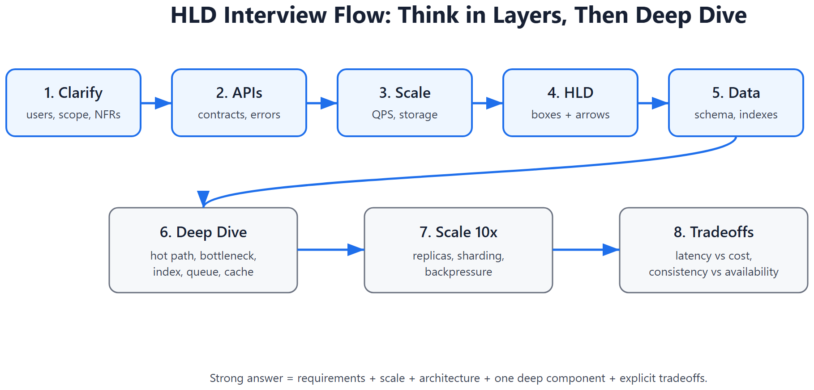
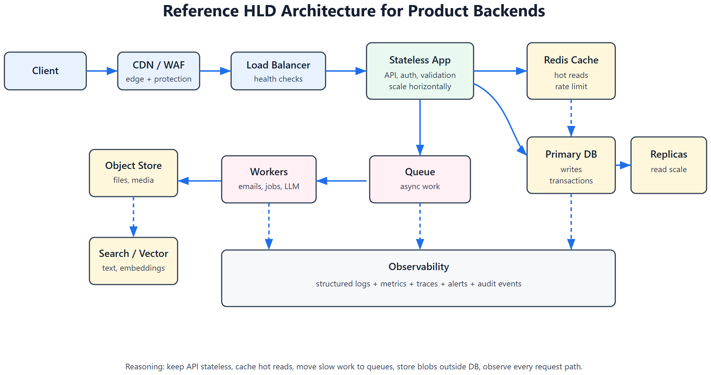
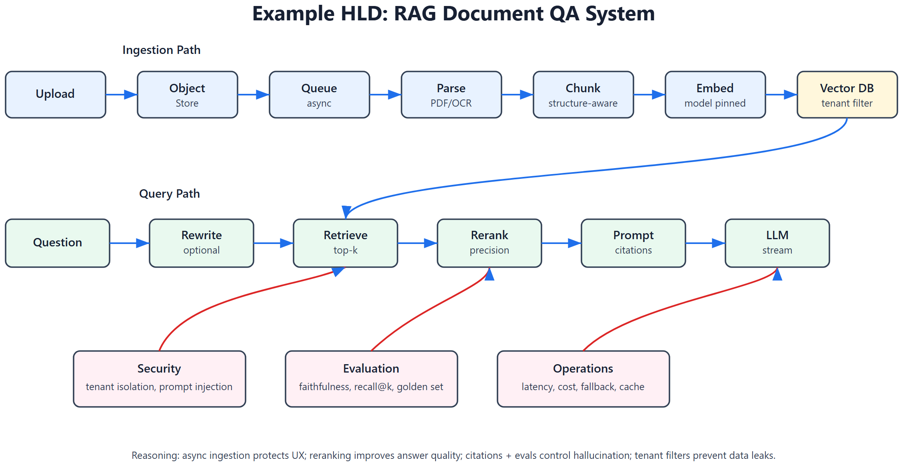

# HLD -- High-Level Design Interview Cheatsheet







> HLD is about designing the system boundary, traffic flow, data flow, scale strategy, reliability, and tradeoffs. The interviewer wants structured thinking, not a memorized diagram.

## 1. HLD interview framework

Use this order every time:

| Step | What to do | Why |
|------|------------|-----|
| 1. Clarify requirements | users, core actions, constraints | prevents overbuilding wrong system |
| 2. Define APIs | request/response, idempotency, pagination | turns vague product into contracts |
| 3. Estimate scale | QPS, storage, bandwidth, DAU | justifies cache, sharding, queues |
| 4. Draw high-level architecture | client, LB, service, DB, cache, queue | shows end-to-end path |
| 5. Design data model | tables, indexes, partition key | makes system concrete |
| 6. Deep dive hot path | most complex/high-QPS flow | proves engineering depth |
| 7. Discuss bottlenecks | 10x scale, hot keys, failure modes | shows senior thinking |
| 8. Cover tradeoffs | consistency, latency, cost, complexity | shows judgment |

## 2. Requirement clarification template

Ask questions in this order:

```text
Functional:
- What are the top 3 user actions?
- Is this read-heavy or write-heavy?
- Is real-time required?

Scale:
- DAU/MAU?
- Requests per second?
- Data size per user/item?
- Geographic distribution?

Non-functional:
- Latency target?
- Availability target?
- Consistency requirement?
- Security/privacy requirements?
- Cost constraints?
```

## 3. Decision principles

| Decision | Choose this when | Avoid when |
|----------|------------------|------------|
| SQL DB | transactions, relational data, joins | massive write scale with simple access |
| NoSQL KV/document | simple key access, horizontal scale | complex joins/transactions needed |
| Cache | repeated reads, expensive compute | low reuse or strict freshness |
| Queue | slow/async work, burst smoothing | user needs immediate result |
| CDN | static/media/global users | private per-user dynamic data |
| Sharding | one DB cannot handle data/QPS | system still fits one primary |
| Read replicas | read-heavy workload | read-after-write must be strict |
| Event-driven | decoupled side effects | strong ordering is critical |
| WebSocket/SSE | live updates/streaming | simple request/response enough |

## 4. Reference architecture

```text
Client -> CDN/WAF -> Load Balancer -> API Gateway
       -> Stateless App Services -> Cache
       -> Primary DB + Read Replicas
       -> Queue -> Workers -> Object Store/Search/Vector DB
       -> Observability: logs, metrics, traces, alerts
```

Key rule: make application services stateless so horizontal scaling is easy.

## 5. Capacity estimation quick math

| Estimate | Formula |
|----------|---------|
| Average QPS | daily requests / 86400 |
| Peak QPS | average QPS x 3 to 10 |
| Storage/day | writes/day x average object size |
| Bandwidth/sec | QPS x response size |
| Cache memory | hot keys x value size x replication factor |

Example:

```text
10M DAU
20 actions/user/day = 200M req/day
Average QPS = 200M / 86400 ~= 2300 QPS
Peak QPS ~= 10k-20k QPS
```

This justifies load balancer, stateless app replicas, cache, DB replicas, and async queues.

## 6. Data model thinking

Design tables from access patterns:

| Question | Design implication |
|----------|--------------------|
| Query by user? | index `user_id` |
| Query latest first? | composite index `(user_id, created_at DESC)` |
| Need uniqueness? | unique constraint |
| High write volume? | append-only events or partitioning |
| Multi-tenant? | tenant_id in every table/index |
| Soft delete? | `deleted_at`, partial indexes |

Do not start with a perfect ER diagram. Start from the read/write paths.

## 7. Example HLD: URL shortener

### Requirements

- Create short URL from long URL.
- Redirect short URL to original.
- Optional custom alias, expiry, analytics.
- Read-heavy: redirects dominate creates.

### API

```text
POST /api/v1/urls
{ "long_url": "...", "custom_alias": null, "expires_at": null }
-> { "short_url": "https://x.io/aB91k" }

GET /{code}
-> 302 Location: long_url
```

### Data model

```text
urls(id, code UNIQUE, long_url, user_id, created_at, expires_at)
click_events(id, code, ts, ip_hash, user_agent, referrer)
```

### Architecture

```text
Client -> LB -> URL Service -> Redis cache -> Postgres
                         |
                         -> Kafka/SQS -> Analytics worker -> OLAP store
```

### Design decisions

| Decision | Reasoning |
|----------|-----------|
| Base62 code | compact URL-safe alphabet |
| Redis cache for code->URL | redirects are read-heavy and latency-sensitive |
| Postgres primary store | uniqueness, simple relational model |
| Async analytics | redirect path must stay fast |
| 302 vs 301 | 302 allows changing destination/analytics behavior |

### Bottlenecks and fixes

| Problem | Fix |
|---------|-----|
| Hot celebrity link | cache + CDN edge redirect if possible |
| Code collision | unique constraint + retry |
| Analytics write overload | queue + batch writes |
| DB read load | Redis cache + read replica |

## 8. Example HLD: AI RAG document QA system

### Requirements

- Users upload documents.
- Ask questions over uploaded docs.
- Answers must cite sources.
- Multi-tenant isolation required.
- p95 latency target: 3-5 seconds.

### Architecture

```text
Upload -> API -> Object Store
             -> Queue -> Parser -> Chunker -> Embedder -> Vector DB

Question -> API -> Query rewrite -> Retriever -> Reranker
         -> Prompt builder -> LLM -> Answer + citations
         -> Trace/eval logs
```

### Data model

```text
documents(id, tenant_id, owner_id, status, object_url, created_at)
chunks(id, document_id, tenant_id, text, page_no, embedding_id)
qa_logs(id, tenant_id, question, answer, retrieved_chunk_ids, latency_ms, cost)
```

### Design decisions

| Decision | Reasoning |
|----------|-----------|
| Async ingestion | parsing/embedding can be slow; upload should return quickly |
| Object store for files | cheap durable storage |
| Vector DB with tenant filter | semantic search + isolation |
| Reranker after top-k retrieval | improves precision before LLM |
| Citations required | improves trust and faithfulness checking |
| Prompt/model version logging | reproducibility and rollback |

### Failure modes

| Failure | Mitigation |
|---------|------------|
| Bad chunking | structure-aware chunking, eval set |
| Hallucination | citation requirement, faithfulness eval |
| Tenant data leak | tenant_id filter, namespace, audit tests |
| LLM latency | streaming, smaller model fallback, cache |
| Cost spike | token budget, per-tenant quota, semantic cache |

## 9. Example HLD: Chat/messaging system

### Requirements

- 1:1 and group chat.
- Online delivery if user connected.
- Offline storage and sync.
- Read receipts optional.

### Architecture

```text
Client -> WebSocket Gateway -> Chat Service -> Message Store
                                  |
                                  -> Pub/Sub -> Online recipients
                                  -> Push Notification Service
```

### Design decisions

| Decision | Reasoning |
|----------|-----------|
| WebSocket for active users | low-latency bidirectional messaging |
| Durable message store | offline sync and history |
| Pub/sub | fanout to connected sessions |
| Push notification async | external provider latency should not block send |
| Sequence number per conversation | ordering and resume |

### Consistency tradeoff

Strict global ordering is expensive. Usually order messages per conversation using monotonically increasing sequence numbers or timestamp + tie-breaker.

## 10. Example HLD: Feed system

### Requirements

- Users follow others.
- Home feed shows recent posts.
- Low-latency reads.
- Celebrities may have millions of followers.

### Push vs pull

| Approach | Works for | Problem |
|----------|-----------|---------|
| Fanout on write | normal users | expensive for celebrities |
| Fanout on read | celebrities | slower reads |
| Hybrid | production systems | more complexity |

### Hybrid design

```text
Post service -> Fanout worker -> follower inbox cache
Celebrity posts -> stored separately
Read feed -> merge inbox + celebrity posts -> rank -> return
```

Decision: optimize for feed reads because users read far more than they post.

## 11. Common HLD tradeoffs

| Tradeoff | How to discuss |
|----------|----------------|
| Consistency vs availability | payments need consistency; feeds can be eventual |
| Latency vs cost | cache/CDN/replicas reduce latency but cost more |
| Simplicity vs scalability | single DB first; shard only when needed |
| Sync vs async | sync for user-visible result; async for side effects |
| SQL vs NoSQL | SQL for transactions; NoSQL for simple high-scale access |
| Build vs buy | managed services reduce ops but cost/lock-in increase |

## 12. HLD interview questions

1. Design URL shortener.
2. Design rate limiter.
3. Design notification system.
4. Design chat/messaging.
5. Design news feed.
6. Design file upload service.
7. Design ride matching.
8. Design RAG document QA.
9. Design agent execution platform.
10. Design analytics/event ingestion.

## 13. Final HLD checklist

- [ ] Requirements clarified.
- [ ] Scale estimated.
- [ ] APIs defined.
- [ ] Data model and indexes explained.
- [ ] Main architecture drawn.
- [ ] Read/write paths explained.
- [ ] Cache/queue decisions justified.
- [ ] Failure modes covered.
- [ ] Observability covered.
- [ ] Tradeoffs named explicitly.

